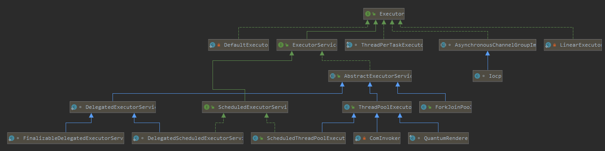
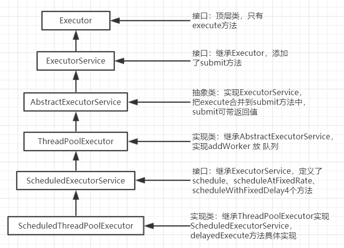
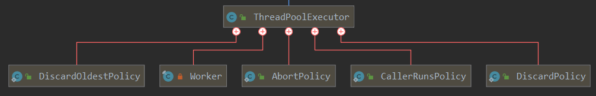
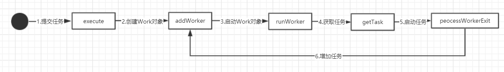
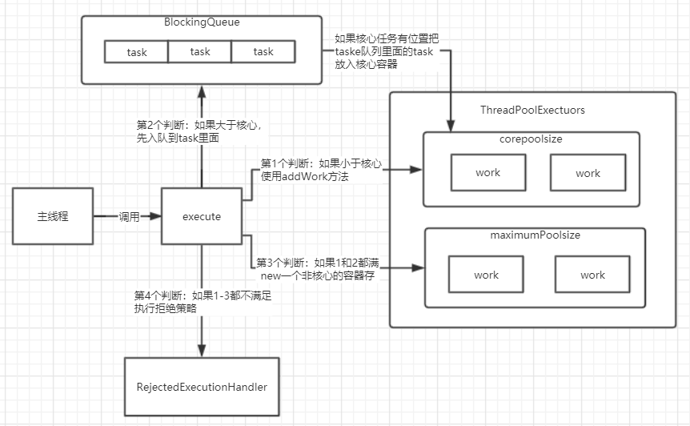

# 并发编程-高级

## 线程池

### 线程与线程池对比

现在有一个需求需要使用多线程已最快的速度先list容器插入1万个随机数

#### 普通线程插入数据

既然要最快那我直接一口气开1万个线程，每一个线程只负责插入一个数组那不是一下子就完成了吗，但是效果并不是想象中那么块

~~~java
public static void main(String[] args) throws InterruptedException {
    //记录开始时间
    Long start = System.currentTimeMillis();
    final List<Integer> list = new ArrayList<>();
    final Random random = new Random();
    //循环add随机数入容器
    for (int i=0;i<10000;i++){
        //每次插入开一个线程
        Thread thread = new Thread(){
            public void run(){list.add(random.nextInt());}
        };
        thread.start();
        //需要等待所有进程结束才能结束main进程不然会出现数据长度对不上
        thread.join();
    }
    System.out.println("耗时:"+(System.currentTimeMillis()-start));
    System.out.println(list.size());
}
~~~

#### 线程池插入数据

~~~java
public static void main(String[] args) throws InterruptedException {
    //记录开始时间
    Long start = System.currentTimeMillis();
    final List<Integer> list = new ArrayList<>();
    ExecutorService executorService = Executors.newSingleThreadExecutor();
    final Random random = new Random();
    //循环add随机数入容器
    for (int i=0;i<10000;i++){
        executorService.execute(new Runnable() {
            @Override
            public void run() {
                list.add(random.nextInt());
            }
        });
    }
    //停止接收新的任务，并且等待未完成任务完成后关闭线程池
    executorService.shutdown();
    //如果线程超时一天还没关闭，输出线程池没有关闭，直到关闭为止后执行后面代码
    while (!executorService.awaitTermination(1, TimeUnit.DAYS)) {
        System.out.println("线程池没有关闭");
    }
    System.out.println("线程池已经关闭");
    System.out.println("耗时:"+(System.currentTimeMillis()-start));
    System.out.println(list.size());
}
~~~

#### 总结

new Thread：线程不是越多越好，如我们普通线程执行创建了1万个线程去add，但是还是比线程池要慢很多，其中原因在于，我们那1万个线程开启后，创建1万个对象，并且还要等待CUP调度，栈满后 java 每一次CG都要暂停所有线程，而且我们需要等待每一个线程join()完成后才会结束，一个线程join()另外在跑的线程都要挂起等待这个线程join()完成才能继续导致new Thread性能低下

Executor：线程池他重用存在的线程，减少对象创建、消亡的开销，提升性能。

### 线程池类图

其中一个线程池依赖关系，其余类似

### 生命周期

在ThreadPoolExecutor中有5个内部类，可分为2大类policy（策略） worker（工作） 

~~~java
//线程池使用案例
public static void main(String[] args) {
    //初始化一个线程池
    ExecutorService executorService = Executors.newCachedThreadPool();
    //调用submit方法 底层调用的是execute方法
    executorService.submit(new Runnable() {
        @Override
        public void run() {
            System.out.println(Thread.currentThread().getName());
            System.out.println("CachedThreadPool 线程池");
        }
    });
    executorService.shutdown();
}
~~~

大概的流我们开始使用newCachedThreadPool初始化一个线程池，初始化后获取到一个ExecutorService并调用submit/execute方法，创建一个Work对象，使用addWorker入队，调用runWorker如何通过getTask从Worker队列中获取任务，调用run方法就是我们传入的业务代码启动任务，调用完成后会调用peocessWorkerExit方法判断看需不需要继续addWorker

execute在执行时其实会经过很多的判断，execute的大致流程如下

首先主函数会调用execute，会经过第一个判断判断一些核心容器还有没有位置，如果有位置就会去加入到核心容器使用addWork方法，核心容器会调用Work run=>runWork执行业务代码，如果核心容器满了就会offer（入队）到task中等到核心容器有空位和会从队列中出队到核心容器中，如果以上2个都满了会直接创建一个非核心的容器存着这些work，如果连非核心的容器也满了就会加入拒绝策略。

### 线程池运行思路

* 如果当前池大小 poolSize 小于 corePoolSize ，则创建新线程执行任务 
* 如果当前池大小 poolSize 大于 corePoolSize ，且等待队列未满，则进入等待队列 
* 如果当前池大小 poolSize 大于 corePoolSize 且小于 maximumPoolSize ，且等待队列已满，则创建新线程执行任务 
* 如果当前池大小 poolSize 大于 corePoolSize 且大于 maximumPoolSize ，且等待队列已满，则调用拒绝策 略来处理该务 
* 线程池里的每个线程执行完任务后不会立刻退出，而是会去检查下等待队列里是否还有线程任务需要执行，
  如果在 keepAliveTime 里等不到新的任务了，那么线程就会退出 

### 拒绝策略方案

1. AbortPolicy：抛出异常，默认 
2. CallerRunsPolicy：不使用线程池执行 
3. DiscardPolicy：直接丢弃任务 
4. DiscardOldestPolicy：丢弃队列中最旧的任务对于线程池选择的拒绝策略可以通RejectedExecutionHandler handler = new ThreadPoolExecutor.CallerRunsPolicy();来设置。 

### Executors工厂

> ThreadPoolExecutor构造方法参数多而复杂对于初学者使用可能会有很多疑惑，jdk提供了Executors工具类可以轻松的构建一些日常经常使用到的线程池

#### newFixedThreadPool

> 特点
>
> 1. 核心容量=最大容量，因此无需超时时间
> 2. 阻塞队列是无界队列，可以放任意数量的任务
>
> 场景：适用于任务量已知，相对耗时的任务

~~~java
public static ExecutorService newFixedThreadPool(int nThreads) {
    return new ThreadPoolExecutor(nThreads, nThreads,
                                  0L, TimeUnit.MILLISECONDS,
                                  new LinkedBlockingQueue<Runnable>());
}
~~~

#### newCachedThreadPool

> 特点
>
> 1. 核心线程是0，最大线程数是Integer.MAX_VALUE，最大线程生存时间是60s，意味着
>    * 全部都是临时线程(60s后会被回收)
>    * 临时线程可以无限创建
> 2. 队列采用SynchronousQueue特点是没有容量，当多个任务提交到队列时其它任务都会被阻塞直到队列中任务被线程取出时其它线程才能提交任务到队列

~~~java
public static ExecutorService newCachedThreadPool() {
    return new ThreadPoolExecutor(0, Integer.MAX_VALUE,
                                  60L, TimeUnit.SECONDS,
                                  new SynchronousQueue<Runnable>());
}
~~~

#### newSingleThreadExecutor

> 特点
>
> 1. 线程池的线程数固定1给，任务大于1时会放入一个无界队列，任务完毕后唯一的线程也不会被释放
>
> 场景：适用于多个任务需要排队执行

~~~java
public static ExecutorService newSingleThreadExecutor() {
    return new FinalizableDelegatedExecutorService
        (new ThreadPoolExecutor(1, 1,
                                0L, TimeUnit.MILLISECONDS,
                                new LinkedBlockingQueue<Runnable>()));
}
~~~

### 任务的提交

~~~java
//执行任务
void execute(Runnable command);
//提交任务，用返回值Future获取执行结果
<T> Future<T> submit(Callable<T> task);
//提交一组任务，返回一组Future，可遍历获取执行结果
<T> List<Future<T>> invokeAll(Collection<? extends Callable<T>> tasks)
    throws InterruptedException;
//提交一组任务，返回一组Future，可遍历获取执行结果，带超时时长在规定时间未执行完就会提前返回
<T> List<Future<T>> invokeAll(Collection<? extends Callable<T>> tasks,
                              long timeout, TimeUnit unit)
    throws InterruptedException;
//提交一组任务，只要其中一个任务已经完成了就返回并且放弃其它任务
<T> T invokeAny(Collection<? extends Callable<T>> tasks)
    throws InterruptedException, ExecutionException;
//提交一组任务，只要其中一个任务已经完成了就返回并且放弃其它任务，带超时时长
<T> T invokeAny(Collection<? extends Callable<T>> tasks,
                long timeout, TimeUnit unit)
    throws InterruptedException, ExecutionException, TimeoutException;
~~~

### 关闭线程池

#### shutdown

> 调用线程池的shutdown方法，会将线程池状态改未SHUTDOWN
>
> * 不会接收新任务
> * 但已提交的任务会执行完
> * 此方法不会阻塞调用线程的执行

~~~java
public void shutdown() {
    final ReentrantLock mainLock = this.mainLock;
    mainLock.lock();
    try {
        checkShutdownAccess();
        //修改线程池状态
        advanceRunState(SHUTDOWN);
        //仅会打断空闲线程
        interruptIdleWorkers();
        onShutdown(); // hook for ScheduledThreadPoolExecutor 回调给子类用的
    } finally {
        mainLock.unlock();
    }
    //尝试终结(没有运行的线程可以立刻终结，如果还有运行的线程也不会等)
    tryTerminate();
}
~~~

#### shutdownNow

> 调用线程池的shutdown方法，会将线程池状态改未STOP
>
> * 不会接收新任务
> * 会将队列中的任务返回
> * 并用interrupt的方式中断正在执行的任务

~~~java
public List<Runnable> shutdownNow() {
    List<Runnable> tasks;
    final ReentrantLock mainLock = this.mainLock;
    mainLock.lock();
    try {
        checkShutdownAccess();
        //修改线程池状态
        advanceRunState(STOP);
        //打断所有线程
        interruptWorkers();
        //获取队列剩余的任务数
        tasks = drainQueue();
    } finally {
        mainLock.unlock();
    }
    //尝试终结
    tryTerminate();
    return tasks;
}
~~~

#### 其它方法

~~~java
//不在RUNNING状态的线程池，此方法就返回true
boolean isShutdown();
//线程池状态是否是TERMINATED（终结）
boolean isTerminating();
//调用shutdown后，由于调用线程并不会等待所有任务运行结束，因此如果它想在线程池TERMINATED后做一些事情，可以利用此方法等待
boolean awaitTermination(long timeout, TimeUnit unit);
~~~

### 创建多少线程池合适

> 过小会导致程序不能充分的利用系统资源，容易导致饥饿
>
> 过大会导致更多的线程上下文切换，占用更多内存

#### CPU密集型运算

> 通常采用cpu核数+1就能够实现最优的CPU利用率，+1是为了保证当线程由于页缺失故障(操作系统bug)或其它原因导致暂停时，额外的这个线程就能顶上取，保证cpu的时钟周期不浪费

#### I/O密集型运算

> CPU不总是处于繁忙状态，例如当你执行业务计算时会利用cpu资源，但是当你执行I/O操作时如远程RPC调用时，包括进行数据库操作时，这时候CPU就会闲下来，你可以利用多线程提高它的利用率
>
> 公式经验
>
> `线程数 = 核心数 * 期望CPU利用率 * 总时间(CPU计算时间+等待时间) / CPU计算时间`
>
> 例：4核CPU计算时间50%，其它等待时间是50%，期望CPU被100%利用
>
> 套用公式 4 * 100% * 100% / 50% = 8

### 任务调度线程池

> 有时候我们期望一些任务不是立刻执行而是延迟到一定时间执行或周期性执行，这就需要使用到任务调度线程池
>
> `在早期的jdk中提供了一个Timer可以用于实现延迟任务，但是该实现有缺点是Timer只有一个线程执行任务这就意味着往Timer添加多个任务时，后面的任务会收到前面任务影响，如前面任务发送异常那么后面的任务无法执行，或前面任务执行时间超长后面任务迟迟不能执行`

#### newScheduledThreadPool

> 特点
>
> 1. 通过调用schedule()方法，可以执行延迟任务
> 2. 是Timer的替代方案，解决Timer中设计缺陷
>
> 场景：延迟任务，订单取消

~~~java
public static ScheduledExecutorService newScheduledThreadPool(int corePoolSize) {
    return new ScheduledThreadPoolExecutor(corePoolSize);
}
~~~

~~~java
//延迟指定时间后执行Runnable
ScheduledFuture<?> schedule(Runnable command,long delay,TimeUnit unit);
//延迟指定时间后，周期性的执行Runnable
//period是基于上一次任务开始时间隔，如果每个任务执行时间较长会影响到period间隔时间
ScheduledFuture<?> scheduleAtFixedRate(Runnable command,long initialDelay,long period,TimeUnit unit);
//延迟指定时间后，周期性的执行Runnable
//delay是基于上一次任务结束时间隔
ScheduledFuture<?> scheduleWithFixedDelay(Runnable command,long initialDelay,long delay,TimeUnit unit);
~~~

#### 定时任务示例

~~~java
//如何让每周四18:00:00执行定时任务
public static void main(String[] args) {
    //获取当前时间
    LocalDateTime now = LocalDateTime.now();
    System.out.println("当前时间："+now);
    //获取下周四
    LocalDateTime time = now.with(DayOfWeek.THURSDAY).withHour(18).withMinute(0).withSecond(0).withNano(0);
    //如果当前时间大于本周4，time需要
    
    
    向后移一周
    if (now.compareTo(time) > 0){
        time = time.plusWeeks(1);
    }
    System.out.println("下次执行时间："+time);
    //计算2个时间的差值
    long initialDelay = Duration.between(now, time).toMillis();
    //一周的时间间隔
    long period = 1000 * 60 * 60 * 24 * 7;
    ScheduledExecutorService pool = Executors.newScheduledThreadPool(1);
    pool.scheduleAtFixedRate(()-> { //周四18:00开始，间隔一周一次
        System.out.println("现在是星期四 18:00:00");
    },initialDelay,period, TimeUnit.MILLISECONDS);
}
~~~

### Fork-Join

> Fork-Join是JDK1.7新加入的线程池实现，它体现的是一种分治思想，适用于进行任务拆分cpu密集型运算
>
> 所谓的任务拆分，是将一个大任务拆分成多个相同的小任务，直到不能拆分可以直接求解，最后将得到的结果再次合并如并归排序、斐波那契数列都是使用分治思想
>
> Fork-Join在分治的基础上加入了多线程，可以把每个任务分解和合并交给不同的线程完成，进异步提高了运算的效率

#### 1-n整数求和

~~~java
public class TestForkJoin {
    public static void main(String[] args) {
        ForkJoinPool pool = new ForkJoinPool();
        System.out.println(pool.invoke(new MyTask(1,Short.MAX_VALUE)));
    }
}
//求1-n整数和
class MyTask extends RecursiveTask<Integer>{

    private int begin;
    private int end;

    public MyTask(int begin,int end) {
        this.begin = begin;
        this.end = end;
    }

    @Override
    protected Integer compute() {
        //如果begin和end是一样返回其中即可
        if (begin == end){
            return begin;
        }
        if (end - begin == 1){
            return end + begin;
        }
        //将任务从中间拆分
        int mid = (end + begin) / 2;
        //左边继续拆分
        MyTask left = new MyTask(begin,mid);
        left.fork();
        //右边继续拆分
        MyTask right = new MyTask(mid + 1,end);
        right.fork();
        //将左右的结果合并
        int res = left.join() + right.join(); //获取任务结果
        return res;
    }
}
~~~

