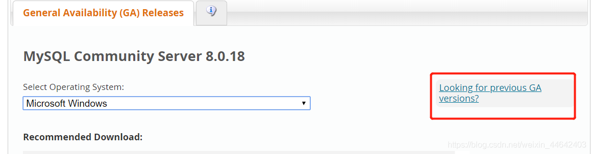
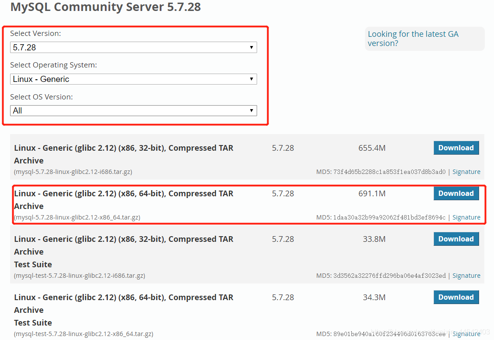

# Liunx安装mysql数据库
在安装mysql需要有一定的Liunx知识，小伙伴可以通过我以下博客学习到一下liunx的基础知识
[Lunx基础入门](https://blog.csdn.net/weixin_44642403/article/details/103437860)
## 卸载本来mysql服务
~~~shell
#查看mysql是否开启着
ps -ef | grep mysql
#暂停mysql服务
service mysql stop
#检查是否安装了mysql
rpm -qa | grep mysql
#如果有发现类似mysql-libs-xxx-1.el6_0.1.x86_64,删除
rpm -e --nodeps mysql-libs-xxx-1.el6_0.1.x86_64
#检查是否存在mariadb的数据库
rpm -qa | grep mariadb
#如果有发现类似mariadb-libs-xxx-2.el7.centos.x86_64,删除
rpm -e --nodeps mariadb-libs-xxx-2.el7.centos.x86_64
~~~
## 下载安装包
MySQL官网https://dev.mysql.com/downloads/mysql/
选择旧版

选择通用版本 下载64位压缩包

上传压缩包到/usr/local目录并解压
~~~shell
#进入/usr/local目录
cd /usr/local
#解压压缩包
tar -xvf mysql-5.7.28-linux-glibc2.12-x86_64.tar.gz 
#解压完成后重命名文件夹
mv mysql-5.7.28-linux-glibc2.12-x86_64 mysql-5.7.28
~~~
检查用户是否存在
~~~shell
cat /etc/group | grep mysql
#出现mysql:x:490:
cat /etc/passwd | grep mysql
#出现mysql:x:496:490::/home/mysql:/bin/bash
~~~
如果用户存在跳过一下创建用户步骤
~~~shell
groupadd mysql
#-r参数表示mysql用户是系统用户，不能用来登录
useradd -r -g mysql mysql
~~~
修改mysql文件下全部文件的所属组
~~~shell
#进入到mysql目录下
cd mysql-5.7.28/
#创建一个data目录（配置文件数据库存放位置要用到）
mkdir data
#修改文件所属组 所属用户
chown -R mysql.mysql /usr/local/mysql-5.7.28
~~~
创建mysql配置文件
~~~shell
#进入support-files目录下
cd /usr/local/mysql-5.7.28/support-files/
#创建默认配置文件
vim my-default.cnf
~~~
将来以下内容拷贝到my-default.cnf里面
~~~shell
[mysqld]
sql_mode=NO_ENGINE_SUBSTITUTION,STRICT_TRANS_TABLES 
#解压根目录
basedir = /usr/local/mysql-5.7.28
#解压根目录\data
datadir = /usr/local/mysql-5.7.28/data
#端口
port = 3306
socket = /tmp/mysql.sock
#服务器端字符类型，建议uf8
character-set-server=utf8
log-error = /usr/local/mysql-5.7.28/data/mysqld.log
pid-file = /usr/local/mysql-5.7.28/data/mysqld.pid
~~~
将配置文件拷贝到etc目录下 并且覆盖原来的文件
~~~shell
cp ./support-files/my-default.cnf /etc/my.cnf
~~~
安装mysl
~~~shell
#进入到mysql的bin目录下
cd /usr/local/mysql-5.7.28/bin
#执行一下命令安装  注意:文件夹路径
./mysqld --initialize --user=mysql --basedir=/usr/local/mysql-5.7.28/ --datadir=/usr/local/mysql-5.7.28/data/
#如没有任何保存则表示安装成功
#进入log日志查看登陆密码
cat /usr/local/mysql-5.7.28/data/mysqld.log
#[Note] A temporary password is generated for root@localhost: 这里就是你的登陆密码
#把启动脚本放到开机初始化目录
cp support-files/mysql.server /etc/init.d/mysql
#启动mysql服务
service mysql start
#配置环境变量
vim /etc/profile
#export PATH=$PATH:/usr/local/mysql-5.7.28/bin加入到后面
source /etc/profile
#使用root用户登陆
mysql -u root -p
~~~
登陆成功后需要修改密码
~~~sql
//修改密码
set password=password('root');
//把所有权限授权给任何ip下的root用户
grant all privileges on *.* to root@'%' identified by 'root';
//刷新权限
flush privileges;
~~~
添加远程访问权限
~~~sql
use mysql;
//任何ip都可以使用root访问数据
update user set host='%' where user = 'root';
//刷新权限
flush privileges;
~~~
最后重启mysql生效
~~~shell
#暂停mysql
service mysql stop
#启动mysql服务
service mysql start
#重启mysql服务
service mysql restart
~~~
