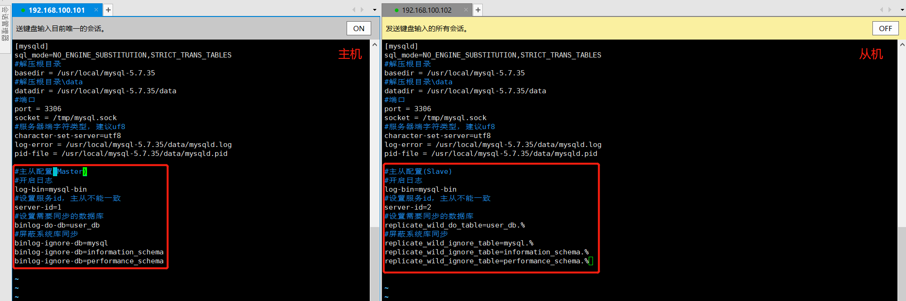
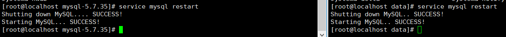

# Mysql主从配置与读写分离

> 互联网应用随着用户量增大后，随着而来的就是mysql压力增加性能下降，通过分析互联网业务可以发现通常在互联网业务中所有的数据库操作都是读多写少，那么可以通过Mysql主从配置实现读写分离，提升Mysql性能

## 什么是读写分离

> 为了确保数据库产品的稳定性，很多数据库拥有双热备功能，也就是一台服务器对外提高增删改业务的生产服务器，另外一台数据库服务器主要对外提高读写操作，需要实现读写分离首先要解决的问题就是主库与从库数据同步的问题

## Mysql主从复制原理

> 以下是Mysql主从复制的实现原理
>
> 1. Master开启Binarylog日志功能，Binarylog会记录到所有的增删改操作
> 2. 当用户向Master写入数据时，Mysql的Binarylog会被发送变化
> 3. Slave实时监控着Master的Binarylog变化
> 4. 若Binarylog日志发生了变化，Slave会将新增的内容同步到自己的Relaylog中
> 5. Relaylog改变后Slave会读取日志解析并执行，从而实现主从复制

## 主从配置

### 前期准备

> 这里主要将Linux上的Mysql主从配置，Win也是一样的套路
>
> 首先准备好2台Linux，并且都使用自定义的方式安装好Mysql，如果不知道如何自定义安装请阅读以下博客

[Linux-安装mysql数据库](../数据持久化专栏/Liunx-安装mysql数据库.md)

[Win10安装Mysql步骤及注意事项](../数据持久化专栏/Win10安装Mysql步骤及注意事项.md)

> 如果有2台Linux服务器的请跳过这个步骤，直接看修改配置文件
>
> 如果没用的小伙伴也不要灰心附上Win电脑VMware虚拟机的使用，Linux安装，VMware主机NAT网络搭建教程

[Win10-VMware Linux安装](../Liunx专栏/VMware-安装Liunx.md)

[Win10-VMware网络配置NAT模式](../Liunx专栏/Win10-VMware网络配置NAT模式.md)

### 修改配置文件

~~~shell
# 进入到etc下修改mysql配置
vim /etc/my.cnf
~~~

#### 修改主库my.cnf

> 在主库中增加如下配置

~~~shell
#主从配置(Master)
#开启日志
log-bin=mysql-bin
#设置服务id，主从不能一致
server-id=1
#设置需要同步的数据库
binlog-do-db=user_db
#屏蔽系统库同步
binlog-ignore-db=mysql
binlog-ignore-db=information_schema
binlog-ignore-db=performance_schema
~~~

#### 修改从库my.cnf

> 在主库中增加如下配置

~~~shell
#主从配置(Slave)
#开启日志
log-bin=mysql-bin
#设置服务id，主从不能一致
server-id=2
#设置需要同步的数据库
replicate_wild_do_table=user_db.%
#屏蔽系统库同步
replicate_wild_ignore_table=mysql.%
replicate_wild_ignore_table=information_schema.%
replicate_wild_ignore_table=performance_schema.%
~~~

#### 重启mysql

> 使用`service mysql restart`重启mysql

### 主库配置

#### 创建用于主从复制的账号

> 登录主库，创建一个专门用于主从复制访问的账号

~~~shell
#授权主备复制专用账号 
GRANT REPLICATION SLAVE ON *.* TO 'db_sync'@'%' IDENTIFIED BY 'db_sync'; 
#刷新权限 
FLUSH PRIVILEGES; 
#确认位点，记录下文件名以及位点 文件是mysql-bin.000001，位置592
show master status;
~~~

> 创建成功后在mysq库的user表可以看到该用户

### 从库配置

#### 数据同步配置

> 登录从库执行如下命令，完成从库配置

~~~shell
#注意 如果之前此从库已有主库指向 需要先执行以下命令清空
#如果没有跳过该命令执行分割线以下的命令
STOP SLAVE IO_THREAD FOR CHANNEL '';
reset slave all;

#分割线=================================================

#先停止同步 
STOP SLAVE;
#修改从库指向到主库，使用上一步记录的文件名以及位点
CHANGE MASTER TO
master_host = '192.168.100.101',
master_user = 'db_sync',
master_password = 'db_sync',
master_log_file = 'mysql-bin.000001',
master_log_pos = 592;
#启动同步 
START SLAVE;
#查看从库状态Slave_IO_Runing和Slave_SQL_Runing都为Yes说明同步成功，如果不为Yes，请检查 error_log，然后 排查相关异常。 
show slave status;
~~~

## 测试同步情况

### 创建数据库

> 在主库与从库中分别创建好需要同步的数据库

### 建表同步测试

> 在主库中创建一个表格，从库立马也跟着自动创建1个表格

### 修改数据同步测试

> 修改主库表中的数据，从库立马也跟着修改

