# Mysql执行计划与EXPLAIN详解

## EXPLAIN简介

在工作中我们常常会遇到一些慢SQL，但是又不知道mysql底层是怎么去执行SQL的，对SQL优化无从下手，这时就需要使用到explain命令，explain这个命令来查看一条SQL语句的执行计划，查看SQL语句索引有没有使用，这都可以通过explain命令来查看，explain里面的信息是我们优化SQL的依据

## 前期准备

首先我们需要准备张个表

student(学生表)：用于记录学生名称，和学生信息更新时间，id主键索引

course(课程表)：记录课程名称，id主键索引，name为普通索引

student_course(学生课程关联表)：用于关联学生需要上什么课程，id主键索引，课程id和学生id组成联合索引

~~~sql
DROP TABLE IF EXISTS `student`;
CREATE TABLE `student` (
  `id` int(11) NOT NULL,
  `name` varchar(45) DEFAULT NULL,
  `update_time` datetime DEFAULT NULL,
  PRIMARY KEY (`id`)
) ENGINE=InnoDB DEFAULT CHARSET=utf8;

INSERT INTO `student` (`id`, `name`, `update_time`) VALUES (1,'张三','2017-12-22 15:27:18'), (2,'李四','2017-12-22 15:27:18'), (3,'王五','2017-12-22 15:27:18');

DROP TABLE IF EXISTS `course`;
CREATE TABLE `course` (
  `id` int(11) NOT NULL AUTO_INCREMENT,
  `name` varchar(10) DEFAULT NULL,
  PRIMARY KEY (`id`),
  KEY `idx_name` (`name`)
) ENGINE=InnoDB DEFAULT CHARSET=utf8;

INSERT INTO `course` (`id`, `name`) VALUES (3,'语文'),(1,'数学'),(2,'英语');

DROP TABLE IF EXISTS `student_course`;
CREATE TABLE `student_course` (
  `id` int(11) NOT NULL,
  `student_id` int(11) NOT NULL,
  `course_id` int(11) NOT NULL,
  `remark` varchar(255) DEFAULT NULL,
  PRIMARY KEY (`id`),
  KEY `idx_student_course_id` (`course_id`,`student_id`)
) ENGINE=InnoDB DEFAULT CHARSET=utf8;

INSERT INTO `student_course` (`id`, `student_id`, `course_id`) VALUES (1,1,1),(2,1,2),(3,2,1); 
~~~

## EXPLAIN

### 基本用法

explain的使用很简单，只需要在你查询的sql前加上explain即可如下

~~~sql
explain select * from student;
~~~

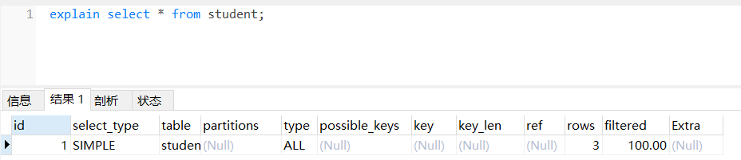

执行查询后我们会发现输出一行数据，如果有两个表通过 join 连接查询，那么会输出两行，分别有字段 id、select_type、table、partitions、type、possible_keys、key、key_len、ref、rows、filered、extra，这里描述了你这条sql语句执行计划，索引使用情况等信息，在后面会依次解释这些字段代表什么意思

### 扩展用法

**explain extended：**会在explain的基础上，提供一些mysql自己对这条语句的优化信息，需要配合**show warnings**使用才能查看到优化后的查询语句，可以看到sql优化器对这条sql做了什么优化，以及可以做为我们优化sql 的参考

~~~sql
explain extended select * from course where id = 1;
show warnings; 
~~~

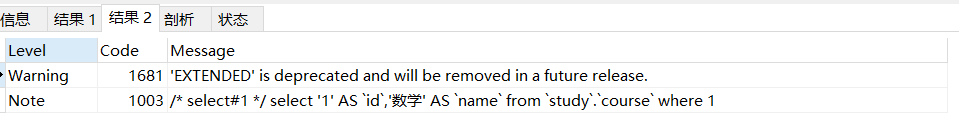

**explain partitions**：相比 explain 多了个 partitions 字段，如果查询是基于分区表的话，会显示查询将访问的分区。

## EXPLAIN中的列

explain中每一列都提供了这条sql的不同的信息，我们可以从这些信息中得到我们的sql是不是最优的写法

### id列

id列的编号代表的select语句的序号，有多少给select就会有多少给id，id越大表明这条select越先执行，id相同时由上往下执行

### select_type列

select_type表示的是这条sql的查询类型，分为简单查询(SIMPLE)和复杂查询(PRIMARY)，其中复杂查询分为三类：简单子查询、派生表（from语句中的子查询）、union 查询

**SIMPLE**：simple简单查询表示的是，不包含子查询和union

~~~sql
explain select * from course where id = 2;
~~~

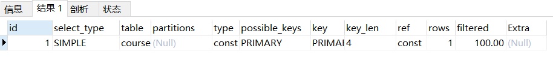

**PRIMARY**：primary还是是复杂查询的最外层查询，以下语句id为1是最后执行的最外层的查询**select (slect xxxx) from course**，我们可以看到select_type是primary

~~~sql
explain select (select 1 from student limit 1) from course;
~~~

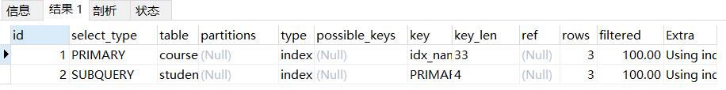

**SUBQUERY**：subquery包含在 select 中的子查询（不在 from 子句中），就是select是写在from前面的，还是上面那条语句，我们可以看到在id为2的是最先执行的在from前面的**select 1 from student limit 1**查询，select_type是subquery

~~~sql
explain select (select 1 from student limit 1) from course;
~~~

**DERIVED**：derived包含在 from 子句中的子查询。MySQL会将结果存放在一个临时表中，也称为派生表（derived的英文含义）

~~~sql
explain select id from (select id from course) as a; 
~~~

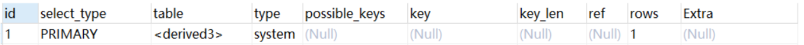

**UNION与UNION RESULT**：union 在 union 中的第二个和随后的 select ；union result 从 union 临时表检索结果的 select

~~~sql
explain select 1 union all select 1;
~~~

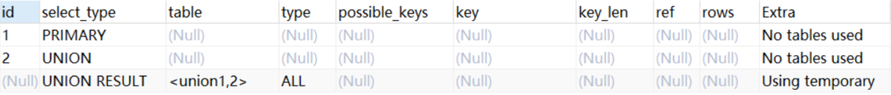

### table列

table列表示该条select访问了那个表

如果是from子句有查询时，table列是 <derivenN> 格式，表示当前查询查询是依赖着id是N的这条查询后才能查询

如果是union 查询时，会多出一个UNION RESULT 的table列的值为<union1,2>，表示1和2表示参与 union 的 select 行id

### type列

这一列表示关联类型或访问类型，即MySQL决定如何查找表中的行，查找数据行记录的大概范围，依次从最优到最差分别为：system > const > eq_ref > ref > range > index > ALL一般来说，得保证查询达到range级别，最好达到ref

**null**：mysql能够在优化阶段分解查询语句，在执行阶段用不着再访问表或索引。例如：在索引列中选取最小值，可以单独查找索引来完成，不需要在执行时访问表

~~~sql
explain select min(id) from course; 
~~~

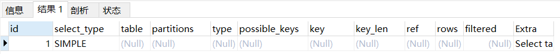

**const, system**：const意思表面只需要匹配一行数据，所以速度是最快的，system是const的特例，mysql执行器优化sql的时候若发现你匹的数据只有一条的时候根本就不用查询了，直接获取即可

~~~sql
explain select * from course where id = 1;
~~~

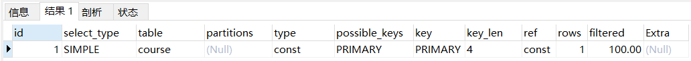

**eq_ref**：eq_ref通常在连接查询的时候才会出现，当primary key 或 unique key 索引的所有部分被连接使用，时最多返回为一条复合条件的记录，这是const 之外最后的连接类型了

~~~sql
explain select * from student_course left join course on student_course.course_id = course.id;
~~~

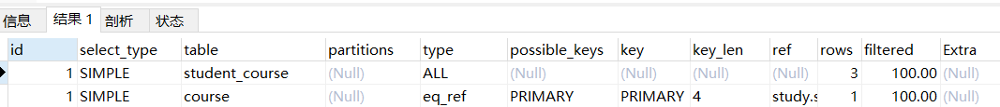

**ref**：相比 eq_ref，不使用唯一索引，而是使用普通索引或者唯一性索引的部分前缀，索引要和某个值相比较，可能会找到多个符合条件的行

~~~sql
explain select * from course where name = "语文"; 
~~~

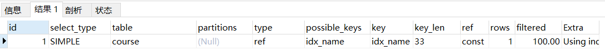

**range**：range一般出现在范围扫描通常出现在 **in(), between ,> ,<, >=** 等操作中

~~~sql
explain select * from student where id > 1;
~~~

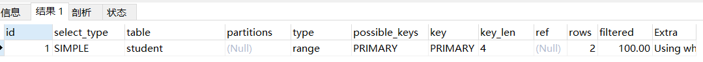

**index**：扫描全表索引，这通常比ALL快一些(index是从索引中读取的，而all是从硬盘中读取)

~~~sql
explain select * from course; 
~~~

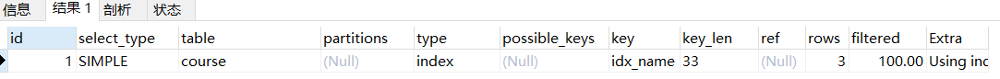

**ALL**：即全表扫描，意味着mysql需要从头到尾去查找所需要的行,通常情况下这需要增加索引来进行优化了

~~~sql
explain select * from student;
~~~

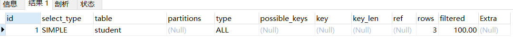

### possible_keys列

possible_keys表示了mysql预计会使用什么所以去查询，这可能并不是最终使用到的索引，如果该列是NULL，则没有相关的索引

### key列

这一列显示mysql实际采用哪个索引来优化对该表的访问，如果没有使用索引，则该列是 NULL，如果想强制mysql使用或忽视possible_keys列中的索引，在查询中使用 force index、ignore index

### key_len列

这列显示了mysql在索引中引用的字节数，通常我们可以通过这值来计数出联合索引中使用了多少个索引

key_len计算规则如下：

1. 字符串

   * char(n)：n字节长度

   * varchar(n)：2字节存储字符串长度，如果是utf-8，则长度 3n + 2

2. 数值类型
   * tinyint：1字节
   * smallint：2字节

3. int：4字节
   * bigint：8字节　　

4. 时间类型　
   * date：3字节
   * timestamp：4字节
   * datetime：8字节

5. 如果字段允许为 NULL，需要1字节记录是否为 NULL

索引最大长度是768字节，当字符串过长时，mysql会做一个类似左前缀索引的处理，将前半部分的字符提取出来做索引。

举例子：现在我的student_course表有一个联合索引(course_id和student_id)我执行查询但是我只使用了联合索引中的course_id进行查询，我们可以看到索引使用的是我的联合索引key_len是4表示只用了联合索引中的一个索引

~~~sql
explain select * from student_course where course_id = 2;
~~~

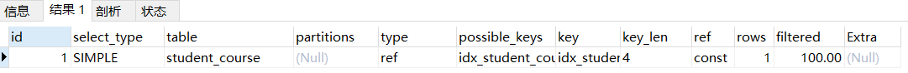

### ref列

这一列显示了在key列记录的索引中，表查找值所用到的列或常量，常见的有：const（常量），字段名（例：course.id）

### rows列

这一列是mysql估计要读取并检测的行数，注意这个不是结果集里的行数

### Extra列

这一列展示的是额外信息。常见的重要值如下：

**Using index**：查询的字段被索引覆盖，并且where筛选条件是索引的前导列，是性能高的表现，一般是使用了**覆盖索引**(索引包含了所有查询的字段)

~~~sql
explain select course_id from student_course where course_id = 1;
~~~

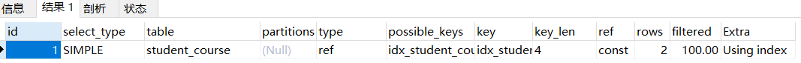

**Using where**：查询的字段未被索引覆盖，where筛选条件非索引的前导列

~~~sql
explain select * from student where name = '张三';
~~~

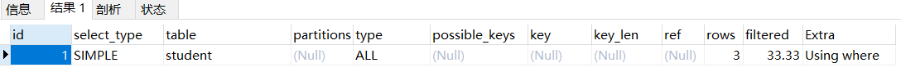

**Using where Using index**：查询的字段被索引覆盖，并且where筛选条件是索引列之一但是不是索引的前导列，意味着无法直接通过索引查找来查询到符合条件的数据

~~~sql
explain select course_id from student_course where student_id = 1;
~~~

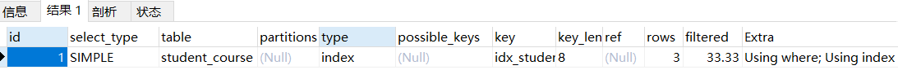

**NULL**：查询的列未被索引覆盖，并且where筛选条件是索引的前导列，意味着用到了索引，但是你查询的一些字段没有被索引覆盖

~~~sql
explain select * from student_course where course_id = 1;
~~~

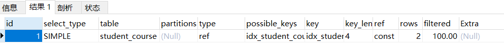

**Using index condition**：与Using where类似，查询的列不完全被索引覆盖，where条件中是一个前导列的范围

~~~sql
explain select * from student_course where course_id > 1;
~~~

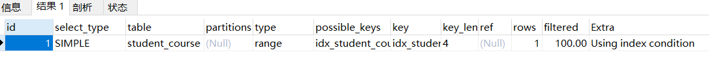

**Using temporary**：mysql需要创建一张临时表来处理查询，出现这种情况一般是要进行优化的，首先是想到用索引来优化

~~~sql
explain select distinct name from student;
~~~

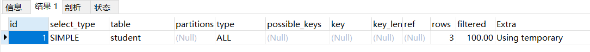

**Using filesort**：mysql 会对结果使用一个外部索引排序，而不是按索引次序从表里读取行。此时mysql会根据联接类型浏览所有符合条件的记录，并保存排序关键字和行指针，然后排序关键字并按顺序检索行信息。这种情况下一般也是要考虑使用索引来优化的

~~~sql
explain select * from student order by name;
~~~

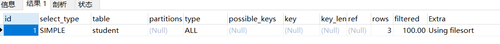

## 常见索引优化案例

### 关联字段类型不一致问题

> 这种情况大多数在创建表时不注意所导致，表与表之间的编码格式不一致导致走不了索引

**问题重现**

> 现有一段SQL，i表与e表都是有索引的，i表通过一个字段连接查询e表，并且e表也建立了索引但是在执行计划中并没有走索引，这种情况很可能是2表字段编码不一致导致的

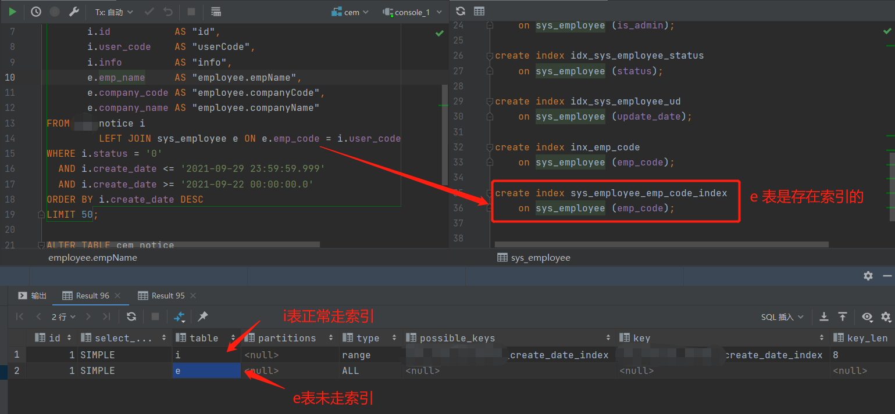

**发现与解决**

> 使用`SHOW FULL COLUMNS  FROM  表名;`对比2表字段编码格式，可以很明显的对比出2表关联字段出现了编码格式不一致的问题

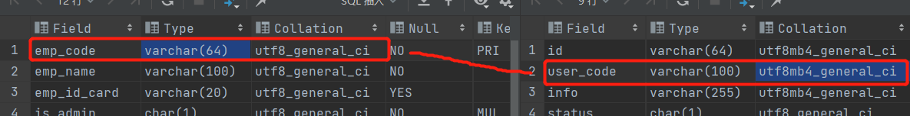

> 使用`ALTER TABLE notice(表名) CHANGE user_code(字段) user_code(字段) VARCHAR(100) CHARACTER SET utf8(编码) COLLATE utf8_general_ci(编码规则);`修改其中一表编码格式使其2边保存一致即可，修改后可发现查询走索引了

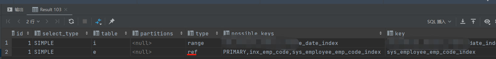