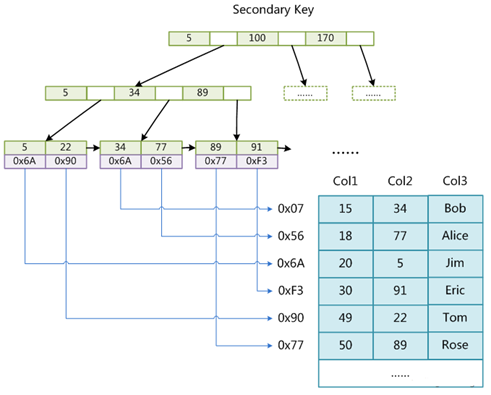

# Mysql索引底层数据结构详解

## 索引是什么

索引就好比我们教科书上的目录，我们如果需要阅读我们想要的内容时我们只需要先去目录，找到我们想阅读的内容所在的页码，然后就可以直接翻到指定位置找到我们想要的内容，索引就是帮助数据库对数据建立排好序的数据结构，从而达到高效的获取数据，索引的数据结构有二叉树、红黑树、HASH、BTREE等

## 磁盘IO是什么

索引就是为了减少磁盘IO次数的那么什么是磁盘IO，首先我们先我们数据的数据是存储于外部存储设备，如机械硬盘、固态硬盘，拿机械硬盘举例

机械硬盘最重要的部件那就是 读写磁头、和盘面了，如果我们需要读取数据的时候盘面就会旋转，首先读写磁头会进行寻道，我们的盘片上是有很多磁道的，磁头保持在一个位置上，盘片转动一圈表示一条磁道，如果这个磁道没有找到想要的数据那么就把磁头向外挪动一点继续找下一条，寻道是最耗时的，因为每次转一圈这条道没有磁头就要向下移动一点找下一条道，一次寻道+遍历这条磁道称为磁盘IO，试想一下如果我在找数据之前先告诉磁盘，我要找的数据在那条磁道上那么磁盘就不用一条一条的去找啦，这就是索引的关键点，就是用来存储数据对应在磁盘上的物理位置

## Mysql底层数据结构

mysql底层数据结构使用的是 B+Tree，为什么是B+Tree呢，在认识B+Tree之前我们先从浅到深二叉树=>红黑树=>B Tree=>B+Tree，最好了解B+Tree 你就会知道为什么Mysql工程师会选择此数据结构应用于数据库

在讲解数据结构之前向大家推荐一个网站https://www.cs.usfca.edu/~galles/visualization/Algorithms.html这是一个很厉害的网站，上面涵盖你学过的，你没学过的数据结构，它会以动画的形式展示出来，这些数据存储/读取的过程，生动形象值得推荐，我接下来的解说截图都是这网站上截取的

### 二叉树

特点：每个结点最多有两棵子树，左子树比右子树小的

说明：每一个分叉左边小右边大，如第一个分岔口25，左边分叉是10比25小，右边分叉是40比25大，我们继续看10的分叉，左边5比25小比10小，右边的24比25小比10大，从规律中我们可以看出一个数进来后他会每一个分叉点比较一次，如果我现在插入一个26那他会先和25比较26大于25走右边，和40比较26小于40走左边，和30比较26比30 小走左边

IO操作：二叉树的IO操作，我们这里有7条数据，那我们通过二叉树获取30，首先会和第一个节点25比较，30比25大走右边，和40比较，30比40小走左边，这样通过3次IO就可以搜索到我需要的数据了

缺点：我们上面看的是我们理想状态的二叉树，那么如果我们可以试试依次插入123456试试看

我们依次插入1-6后我们发现整颗树都向又倾斜了没有达到我们预期的分叉的结果，这样的数据结构和我们普通遍历没有什么区别，比如我要获取6那我需要IO操作6次才能获取到我的值，设想一下如果Mysql用二叉树做索引，那我的自增主键的字段的数据结构就是这样的，这个和没有索引没有什么区别

### 红黑树

特点：在二叉树的基础上继续改进，二叉平衡树

说明：为什么叫二叉平衡树，图中就是我依次插入1-7，这个图是不是和我们的二叉树有很大区别呀，红黑树特点就是平衡树的节点，如我依次插入 1、2、3，那么插入到3时红黑树就就会发现1比2小，3比2大，会对2左旋认树平衡，这样以此类就不会出现像二叉树这样的单边生长的问题了

缺点：红黑树虽然解决了二叉树的平衡问题，是因为二叉树都有一个共同点就是，每一个父节点下只能有2个子节点，虽然红黑树会对树平衡，但是因为节点太少所以数据量树的高度还是会很高，树越高查询用时越慢

### B Tree

特点：一个节点可以存多条数据

说明：这是一个3度的B Tree意思就是一个节点可以存放3个索引，如果满了会对树进行拆分，如果我依次插入1-6，按照这样的逻辑那我们的树高度那就可以很好的控制了，因为我们的每一个节点可以存放的树多了

缺点：那么为什么Mysql还是没有采用B Trees 其中原因是因为范围查询性能差，如果我要查询大于3的元素，那需要一个一个节点的查

### B+Tree

特点：在B Trees的基础上改造，叶子节点之间多了指针

说明：B+Trees 对B TRees进行了改造，图中我插入的是1-6 我们仔细看发现索引有重复出现的，如(2、3、4、5的都有2个节点)，我们看叶子节点 最后的的节点 发现1-6都在同一层中，可以看出B+Trees 让索引产生冗余，使得数据都集中在叶子节点上面了，而且每一个叶子节点都有一个向右的箭头，这个可以实现范围查询，如果我要查询大于3的所有数据，那我只需要IO 3次，找的最下一层如何 顺着3向后面找大于3的

### 总结

可能以上的数据结构讲的不是很清晰，但是大概的思路已经有了，因为数据结构展开讲要讲很久，所以大概的概念大家清楚就可以了，如果要详细了解最好另外自己找一些数据结构视频看，结果以上的简介，都知道为什么mysql会使用B+Tree作为数据库底层的数据结构了把

## Mysql索引存储引擎

Mysql索引存储引擎有多种，最常用的2种是MyISAM和InnoDB，他们底层都是基于B +Trees实现的那么为什么又要分为2种呢他们有什么区别呢

### Mysql表存储引擎设置

如何设置存储引擎，首先要说明的是Mysql存储引擎是表级别的，不是数据库级别的，意思就是说我不同的表可以使用不同的存储引擎，我可以一个表使用MyISAM，另外一个使用InnoDB，那么具体如何设置呢，我以下使用的是Nacicat数据库连接工具设置的

可以看到我们在表设计的选项种有一个引擎，我这里使用的是InnoDB存储引擎的引擎

### MyISAM存储引擎(非聚集)

#### 简介

MyISAM索引是非聚集，意思是文件和数据文件是分离的，如下有一个MyISAM的表我们查看他的data文件

我们可以看到myisamtest这个表是有3个文件的这3个文件分别是什么呢，frm文件是表结构，MYD文件是表数据，MYI文件是表索引，我们可以看出他的表索引于表数据是分离的

#### 主键索引

在MyISAM中的主键索引如下，我们可以看到数据的索引全部的存放在最下面的叶子节点什么了，而且每个叶子节点下面存放的是指针，即这条数据的物理位置，如果需要查询数据时，我们需要先搜索B+Trees获取我要的数据的指针，如果在通过指针去访问我们的data数据

#### 普通索引

在MyISAM引擎中，普通索引和主键索引没有太大的区别，但是接下来讲解的InnoDB普通和主键索引就不一样了，这也是MyISAM和InnoDB不同之处

### InnoDB存储引擎(聚集)

#### 简介

InnoDB索引是聚集，意思是文件和数据文件是一起的，如下有一个InnoDB的表我们查看他的data文件

我们可以看到InnoDB这个表是有2个文件的这2个文件分别是什么呢，frm文件是表结构，ibd文件是表索引和数据，我们可以看出他的表索引于表数据是在同一文件中的

#### 主键索引

在InnoDB中的主键索引如下，我们可以看到数据的索引全部的存放在最下面的叶子节点什么了，而且每个叶子节点下面存放的是当前索引的全部数据，如果需要查询数据时，我们需要直接搜索B+Trees获取那个叶子节点下的数据即可

#### 普通索引

在InnoDB中的普通索引如下我们可以发现，我们索引下的叶子节点存放的是每一条数据的主键，之所以这样做是减少空间，如果普通索引和主键索引一样每个叶子节点下存放的是全部数据那这样子，我每次建立一个索引不就有重复数据吗，所以如果普通索引工作流程是先获取到，我们的主键，在去主键索引搜索该主键下对应的数据

**要点：**怎么说那就是InnoDB是必须需要主键的，官方推荐InnoDB需要添加自增的主键，那如果我们没有设置主键呢，如果我们没有设置主键InnoDB默认会找表中的适合作为主键的列建立主键索引，那么如果没有适合的呢，InnoDB会自动帮你生成一列你看不到的指针的主键列来作为表的主键索引

### MyISAM与InnoDB总结

MyISAM：索引与表数据分离，获取数据需先查找索引文件，获取对应的指针通过指针去数据文件中获取，IO次数会比InnoDB引擎多

InnoDB：索引与表数据聚集一个文件，表结构必须有主键索引，推荐自增，若没有会自动创建隐藏主键索引，由于数据和索引是存放于一起，所以获取数据只需要找到对应的索引后即可直接获取数据，由于是聚集的缘故所以普通索引存放的是主键的索引，而不是数据，如果存放数据将会带来很大的数据冗余

