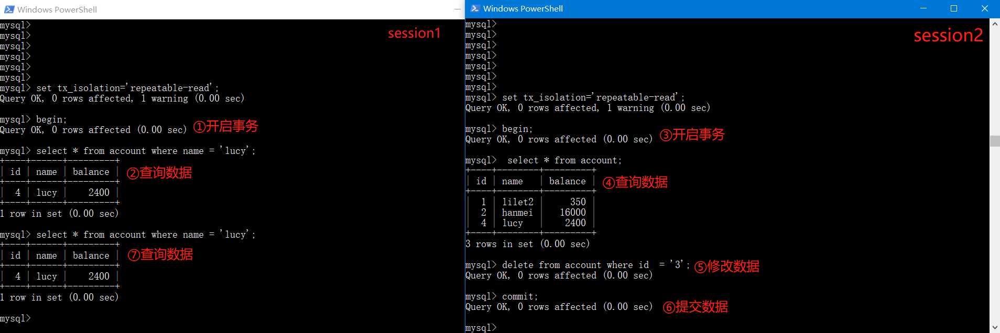

# Mysql锁与事务隔离级别

## 概述

### 锁的定义

锁是计算机协调多线程并发访问某一个资源的机制，在数据库中，数据是一种供需要用户共享的资源，如何保证数据并发访问的一致性、有效性是所有数据库必须解决的一个问题，锁冲突也是影响数据库并发访问性能的一个重要因素，从这个角度来说，锁对数据库而言显得尤其重要，也更加复杂

### 锁的分类

1. 从性能上分为乐观锁和悲观锁

   **乐观锁**

   乐观锁应用例子，为每一条数据添加一个version字段(版本号)，可多个线程同时修改数据，在每次修改后更新的时候需匹配数据的版本号是不是当前版本如果是执行更新，更新成功后version会被加1，如果不是不更新，因为乐观锁允许多线程同时执行所以性能会比较高，但是乐观锁多线程同时更新时会出现数据version不一致导致的更新失败的情况

   **悲观锁**

   悲观锁应用例子，java中的synchronized关键字，更新操作这个方法只能允许1给线程进入修改并更新数据，因为悲观锁处理数据操作更新时只允许单线程执行，效率会比较低，但是可以保证每一次操作都能被更新成功

2. 从数据库操作类型分为，读锁和写锁(都是悲观锁)

   读锁(共享锁)：表示对同一个数据，多个读取操作可以同时进行而不会相互影响

   写锁(排它锁)：当前写操作没有完成前，会阻止其它读或写操作

3. 从数据操作的颗粒度分为，表锁和行锁

   表锁：对整张表都加锁锁

   行锁：只对某一条数据加锁

## 锁

### 表锁

表锁偏向MyISAM存储引擎（MyISAM存储引擎只支持表锁不支持行锁），开销小，加锁快，无思索，锁定粒度大，发生锁冲突的概率最高，并发度最低。

**创建表和插入数据**

~~~sql
CREATE TABLE `mylock` (
`id` INT (11) NOT NULL AUTO_INCREMENT,
`NAME` VARCHAR (20) DEFAULT NULL,
PRIMARY KEY (`id`)
) ENGINE = MyISAM DEFAULT CHARSET = utf8;
INSERT INTO `mylock` (`id`, `NAME`) VALUES ('1', 'a');
INSERT INTO `mylock` (`id`, `NAME`) VALUES ('2', 'b');
INSERT INTO `mylock` (`id`, `NAME`) VALUES ('3', 'c');
INSERT INTO `mylock` (`id`, `NAME`) VALUES ('4', 'd');
~~~

**连接数据库**

~~~sql
mysql -uroot -p
~~~

首先我们需要2给 命令窗口连接数据库这样就可以模拟现在我有2个用户(往后我们会用session来表示用户)操作数据库让锁的效果重复体现出来

#### 读锁小案例

**用户1为表添加读锁**

~~~sql
lock table 表名 read;
~~~

添加读锁后，添加锁的那个session和其它连接数据库的session都可以读取该表的数

**用户2尝试更新**

我们可以看到加看读锁后，如果其它用户尝试修改表的数据会直接进入一个等待，等待session1把锁释放后session2才能改变数据

当session1把锁释放了session2才能执行更新语句

当session1对表进行更新时，将会报错提示该表不影响执行更新操作

#### 读锁总结

添加读锁后，**添加锁的那个session和其它连接数据库的session都可以读取该表的数**，**当前session修改数据时会报错，其它session修改数据时则进入等待**，为什么这样设计呢？这就要说到读锁的用途了，读锁大部分用途是做表的数据迁移，那在数据迁移的时候如果有用户要修改数据我们是不是应该要他等待，既然数据迁移那是不是也应该不能让加锁的那个用户修改数据。

#### 写锁小案例

**用户1添加写锁**

~~~sql
lock table 表名 write;
~~~

session1添加写锁后，session1可以对表进行增删改查，但是其它用户就别说修改了，连查询都要阻塞，等待session1释放锁后才能对表进行操作

#### 写锁总结

当前session对该表的增删改查都没有问题，其他session对该表的所有操作被阻塞，所以被称为排它锁，就是除了它自己，别人操作全部排除在外

### 表锁总结

MyISAM在执行查询语句(SELECT)前,会自动给涉及的所有表加读锁,在执行增删改操作前,会自动给涉及的表加写锁。

1、对MyISAM表的读操作(加读锁) ,不会阻寒其他进程对同一表的读请求,但会阻赛对同一表的写请求。只有当读锁释放后,才会执行其它进程的写操作。

2、对MylSAM表的写操作(加写锁) ,会阻塞其他进程对同一表的读和写操作,只有当写锁释放后,才会执行其它进程的读写操作

**总结：**

简而言之，就是**读锁会阻塞写，但是不会阻塞读。而写锁则会把读和写都阻塞**。

### 行锁

行锁偏向InnoDB存储引擎，开销大，加锁慢，会出现死锁，锁定粒度最小，发生锁冲突的概率最低，并发度也最高。InnoDB与MYISAM的最大不同有两点：一是支持事务（TRANSACTION）；二是采用了行级锁。

**创建表和插入数据**

~~~sql
CREATE TABLE `account` (
  `id` int(11) NOT NULL AUTO_INCREMENT,
  `name` varchar(255) DEFAULT NULL,
  `balance` int(11) DEFAULT NULL,
  PRIMARY KEY (`id`)
) ENGINE=InnoDB DEFAULT CHARSET=utf8;
INSERT INTO `account` (`name`, `balance`) VALUES ('lilei', '450');
INSERT INTO `account` (`name`, `balance`) VALUES ('hanmei', '16000');
INSERT INTO `account` (`name`, `balance`) VALUES ('lucy', '2400');
~~~

#### 行锁小案例

行锁的使用是离不开的事务的，在这里我先演示行锁是怎么样样子的，后续会重点讲事务，懂事务才能用好行锁

在当前session1中开启一个事务，在session1中对数据修改，不会立刻修改数据库的数据，而是只是存在事务中，这时其它用看到的数据还是旧的，因为session1事务还没提交，当session1执行提交事务后数据才会正在的被修改

当session1和session2同时开启事务，同时修改通一条数据时行锁就出来了，我们可以看到session1先开启事务，然后修改id=1的数据还没提交，这时session2又开启了一个事务也修改id=1的数据，当session2提交时就阻塞了，必须等session1提交事务后释放这条数据的锁，session2才能继续接下来的操作，可以看出这是悲观锁因为要等待

#### 行锁支持事务

**什么是事务（Transaction）及其ACID属性**

事务是由一组SQL语句组成的逻辑处理单元,事务具有以下4个属性,通常简称为事务的ACID属性。

原子性(Atomicity) ：事务是一个原子操作单元,其对数据的修改,要么全都执行,要么全都不执行。

一致性(Consistent) ：在事务开始和完成时,数据都必须保持一致状态。这意味着所有相关的数据规则都必须应用于事务的修改,以保持数据的完整性;事务结束时,所有的内部数据结构(如B树索引或双向链表)也都必须是正确的。

隔离性(Isolation) ：数据库系统提供一定的隔离机制,保证事务在不受外部并发操作影响的“独立”环境执行。这意味着事务处理过程中的中间状态对外部是不可见的,反之亦然。

持久性(Durable) ：事务完成之后,它对于数据的修改是永久性的,即使出现系统故障也能够保持

#### 并发处理事务带来的问题

**更新丢失（Lost Update）**

当两个或多个事务选择同一条数据，然后更新的时候会出现一种情况就是，由于每个事务都不知道其他事务的存在，就会发生丢失更新问题–最后的更新覆盖了由其他事务所做的更新。

 **脏读（Dirty Reads）**

事务A读取到了事务B已经修改但未提交的数据，还在这个数据基础上做了操作。此时，如果B事务突然回滚，A读取的数据为无效，不符合一致性要求。

**不可重读（Non-Repeatable Reads）** 

事务A读取某些数据后对数据继续操作，然后再次读取以前读过的数据，却发现其读出的数据已经被事务B已经改变、或某些记录已经被删除了，不符合隔离性

**幻读（Phantom Reads）**

一个事务按相同的查询条件重新读取以前检索过的数据，却发现其他事务插入了满足其查询条件的新数据，这种现象就称为“幻读”。

####  事务隔离级别

“脏读”、“不可重复读”和“幻读”,其实都是数据库读一致性问题,必须由数据库提供一定的事务隔离机制来解决。

| **隔离级别**                 | **脏读（Dirty Read）** | **不可重复读（NonRepeatable Read）** | **幻读（Phantom Read）** |
| ---------------------------- | ---------------------- | ------------------------------------ | ------------------------ |
| 读未提交（Read uncommitted） | 可能                   | 可能                                 | 可能                     |
| 读已提交（Read committed）   | 不可能                 | 可能                                 | 可能                     |
| 可重复读（Repeatable read）  | 不可能                 | 不可能                               | 可能                     |
| 可串行化（SERIALIZABLE）     | 不可能                 | 不可能                               | 不可能                   |

数据库的事务隔离越严格,并发副作用越小,但付出的代价也就越大,因为事务隔离实质上就是使事务在一定程度上“串行化”进行,这显然与“并发”是矛盾的。

同时,不同的应用对读一致性和事务隔离程度的要求也是不同的,比如许多应用对“不可重复读"和“幻读”并不敏感,可能更关心数据并发访问的能力。

~~~sql
-- 查看事务隔离级别
show variables like 'tx_isolation';
-- mysql 默认事务隔离级别REPEATABLE-READ
set tx_isolation='REPEATABLE-READ';
~~~

事务隔离级别如果在spring中设置了，以spring为准

#### 事务带来的问题和解决

首先我们先把事务隔离级别调为最低级别 read-uncommitted 就是说 脏读、不可重复读、幻读都会发生

~~~sql
set tx_isolation='read-uncommitted';
~~~

##### 脏读发生

未提交读无法解决脏读、不可重复、幻读的问题

session1获取的balance=450，并且对他继续了修改减50后，事务还没提交时这时候session2连接进入了读取了数据，它读取到了session1未提交的数据了，然后session1事务回滚了，但是session2浑然不知还以为现在的数据还是400，并且还对数据进行修改，提交事务，最后session2再次查询得到的数据和预计的结果不一致，因为数据已经乱了，这就是脏读的发生，即session2得到的是一个”脏“数据。

##### 脏读解决

如需解决这个问题我们只需把数据库隔离级别改为读已提交

~~~sql
set tx_isolation='read-committed';
~~~

当我们把数据库隔离级别调到读已提交后session2就不会发生脏读了，可以看到session2操作后的结果达到了预期的结果

##### 不可重复读发生

已提交读隔离级别无法解决不可重复、幻读的问题

session1去数据库获取名字为lucy后如何对该对象继续一顿操作修改时，这时session2也连接数据库了并且把lucy这条数据删除后提交了事务，然后这是session1前期准备完毕后打算再获取一次lucy进行别的操作，这时一查发现lucy这条数据查询返回null，拿session1接下来的代码不就报错了？就是因为第一和第二次结果不一致导致程序无法执行，因为他每次获取的结果都是不确定参数，好比你在编写代码时，我得到的一个int值是随时变动的，那是不可能写出一个复合你运算逻辑的程序，因为这个值一直变，你可能现在拿到的是符合条件的可能过一会拿到的又是另外的一个值，这就是不可重复读的发生

##### 不可重复读解决

如需解决这个问题我们只需把数据库隔离级别改为可重复读

~~~java
set tx_isolation='repeatable-read';
~~~

当我们把数据库隔离级别调到读已提交后session1就不会发生不可重复读了，虽然session2已经把数据删除了，但是我session1希望读取的还是我事务开启时读取到的那个版本的数据，因为这样复合我的预期，才能继续执行接下来的操作，如果你一直给session1不确定的因素那session1的逻辑代码根本无法编写

##### 幻读的发生

可重复读隔离级别无法解决幻读的问题

可重复读的隔离级别下使用了MVCC机制（多版本并发控制），select操作不会更新版本号，是快照读（历史版本）；insert、update和delete会更新版本号，是当前读（当前版本）

session2开启了事务，首先查询了当前数据库做了一段逻辑操作，这时session1也开启了一个事务，它查询了一下没有lucy这个用户然后进行了一个插入一条数据并提交了事务，session2再次查询后这次session2更新一条数据id=19它根本都查不出来的数据，最后居然更新成功了，然后再次查询时表中居然多出了一条数据

##### 幻读解决1（不推荐）

如需解决这个问题我们只需把数据库隔离级别改为串行化

~~~sql
set tx_isolation='serializable';
~~~

串行化数据库操作根本就不支持并发了，全部单线程操作，多个事务不能同时进行了，非常不推荐的做法并且非常影响程序的效率，我们可以看到串行化后，session2和session1都开启了事务，session1想对表进行插入数据时，插入操作被阻塞了必须等待session2结束或者提交事务session1才能进行下一步操作

##### 幻读解决2

使用mysql间隙锁在某些情况下可以解决幻读问题，什么是间隙锁呢，如何使用呢如下例子

session2开启了一个事务并且查询了一下数据后，他使用了一个范围更新更新id>=2的以后的数据，这里就使用了间隙锁，因为mysql会对要更新的行加锁，并且无论这条数据存不存在，session2使用了update id>=2的数据意思表示只现在id>=2往后的数据已经被上锁了，不管你这条数据存不存在，这时session1开启了一个事务它想插入一条id=3的数据，发现被阻塞了

##### 幻读解决3

方案3也是最常用的办法，也是最普遍的，就是在我们写的业务代码上进行限制，如加上lock锁，synchronized关键字等多种方法这我也不一一列举了

#### 行锁分析

通过检查InnoDB_row_lock状态变量来分析系统上的行锁的争夺情况

~~~sql
show status like'innodb_row_lock%';
~~~

| 字段                          | 说明                                       |
| ----------------------------- | ------------------------------------------ |
| Innodb_row_lock_current_waits | 当前正在等待锁定的数量                     |
| Innodb_row_lock_time          | 从系统启动到现在锁定总时间长度**（重要）** |
| Innodb_row_lock_time_avg      | 每次等待所花平均时间**（重要）**           |
| Innodb_row_lock_time_max      | 从系统启动到现在等待最长的一次所花时间     |
| Innodb_row_lock_waits         | 系统启动后到现在总共等待的次数**（重要）** |

**演示死锁**

加行锁方式除了update语句我们也可以在select后面加锁for update表示获得该行数据锁

~~~sql
select * from 表名 where 条件 for update;
~~~

session1开启事务，并且获取id=1这条数据的锁，session2也开启一个事务获取id=2这条数据锁后，session1去争夺id=2这条数据的锁，session2也同时尝试去争夺id=1这条数据的锁，这样就形成了死锁，我们会看到session2抛出死锁异常了

#### 行锁注意事项

1. 行锁原则使用**一锁二判三更新**
2. for update 只能在InnoDB引擎下使用，并且必须开启事务，在begin与commit之间才生效
3. InnoDB默认是行级别的锁，只有在明确指定的主键/索引时候，是行级锁，否则是表级别

**明确指定主键，并且有此记录，行级锁**

~~~sql
SELECT * FROM user WHERE id=1 FOR UPDATE;
SELECT * FROM user WHERE id=1 and name=’小明’ FOR UPDATE;
~~~

**明确指定主键/索引，若查无此记录，无锁**

~~~sql
SELECT * FROM user WHERE id=-1 FOR UPDATE;
~~~

**无主键/索引，表级锁**

~~~sql
SELECT * FROM user WHERE name=’小明’ FOR UPDATE;
~~~

