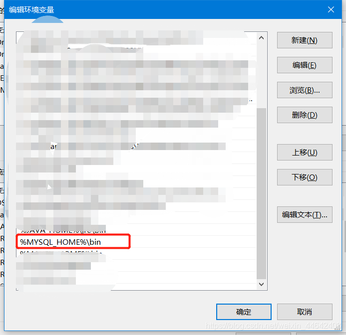

# Win安装Mysql步骤及注意事项
使用最优雅的方式安装mysql，数据库文件配置存放到我们自己指定的目录下，避免默认安装导致C盘越来越大
## 下载安装包
下载地址：https://dev.mysql.com/downloads/mysql/

选择64位 下载zip包

## 解压安装
解压下载好的 mysql-5.7.30-winx64.zip 后我们会得到以下文件，我拷贝到D盘的mysql目录下来了

## 创建my.ini
在安装mysql的时候，mysql会读取根目录下my.ini文件如果找不到那就用默认配置安装，修改my.ini文件就可以实现自定义安装mysql，mysql 5.7里面是没有my.ini 文件的我们只需要自己创建一个就行了

创建完成后编辑my.ini，这是一个最基础的mysql安装配置文件，我们只需要修改basedir(mysql根目录位置)和datadir(数据库数据存放的位置)

~~~shell
[mysql]
# 设置mysql客户端默认字符集
default-character-set=utf8

[mysqld]
# 设置3306端口
port = 3306

# 设置mysql安装目录
basedir=D:\Mysql-5.7.30

# 设置mysql数据库的数据存放目录
datadir=E:\Mysql-data\5.7.30

# 运行最大连接数
max_connections=200

# 服务端使用的字符集默认为8比特编码的latin1字符集
character-set-server=utf8

# 参加新表时将使用的默认存储引擎
default-storage-engine=INNODB

sql_mode=STRICT_TRANS_TABLES,NO_ENGINE_SUBSTITUTION

~~~
## 配置环境变量
编写好my.ini后我们需要配置mysql的环境变量，需要使用命令行安装mysql

## 安装mysql
**注意事项**
必须使用 Windows PowerShell(管理员)命令行进行安装，否则会因为权限不足等奇怪的问题导致无法安装
打开 Windows PowerShell(管理员)  “Win+X” 就可以打开了

**执行如下命令安装**
~~~shell
# 初始化 配置
mysqld --install
# 安装 mysql
mysqld --initialize
# 启动 mysql 服务
net start mysql
~~~
安装完成后我们可以查看一下我们指定的数据库目录多出了很多文件表示安装成功

**修改root密码**
root的初始密码，在mysql安装时会被输出到DESKTOP-QDQLNM7.err文件，该文件就在我们指定的数据库目录下面

打开后找到我们的初始密码

**登录root修改密码**
~~~shell
# root账户登录 密码就是上面截图哪里可以找到
mysql -uroot -p
# 设置密码是 123456
set password = password('123456');
# 永久使用该密码
alter user 'root'@'localhost' password expire never;
# 刷新用户权限
flush privileges;
~~~
到这已经完成了整个mysql 的安装流程的，以下是一些常用命令
~~~shell
# 启动 mysql 服务
net start mysql
# 停止 msql 服务
net stop mysql
# 删除mysql服务
mysqld -remove
~~~

