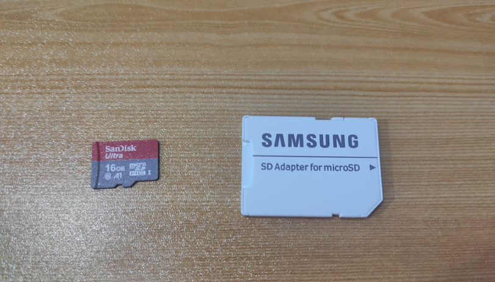
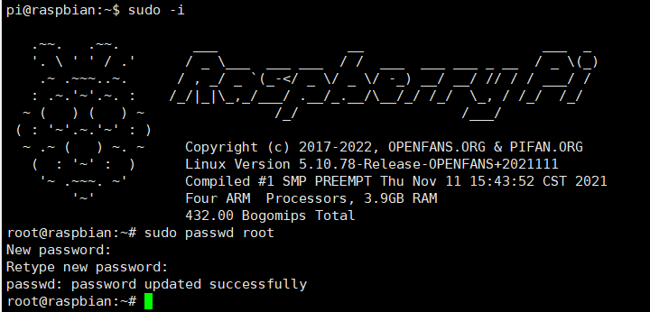

# 树莓派安装64位操作系统

> 我使用64位操作系统主要原因是需要使用树莓派搭建Web服务器，由于Web部分服务需要64位操作系统

## 镜像下载

> 树莓派官方并没有提供64位的镜像，所以本次安装的开源镜像，本人一直在使用感觉非常的不错，镜像中自带64位的Docker非常符合搭建Web服务器的需求
>
> gitee地址：https://gitee.com/openfans-community/Debian-Pi-Aarch64
>
> 我下载的是`OPENFANS-Debian-Buster-Aarch64-ext4-v2021-2.0-U6-Release-plus++.img`

## 镜像制作

### 准备工作

> 准备一张内存卡，以及一个转接器，将内存卡插入到你电脑中

### 格式化

> 格式化使用的是SD Card Formatter软件使用非常简单，打开后自动就可以找到你的内存卡，任何点击Format即可格式化
>
> [官方下载地址](https://www.sdcard.org/downloads/formatter/sd-memory-card-formatter-for-windows-download/)

### 镜像安装

> 格式化完毕后接下来就是往SD卡安装下载好的Liunx系统了，安装使用的是balenaEtcher软件，操作也是非常简单，选择镜像、选择SD卡、点击开始，等待结束
>
> [官方下载地址](https://www.balena.io/etcher/)

> 当弹出如下内容表示安装完毕，将SD卡取出插入到树莓派，启动树莓派即可

## Debian-Pi-Aarch64初始化

> 非安装Debian-Pi-Aarch64的系统可以跳过该内容

### 网络配置

> 安装完毕后需要使用树莓派的高清晰连接一个显示器，手动配置连接的wifi重启树莓派才能使用ssh远程连接
>
> 系统默认账户：**pi** ，默认密码：**raspberry**

**切换root用户**

> 使用**“sudo -i”** 来切换到root用户， **“sudo passwd root”** 设置root用户的密码

**连接WIFI**

> 执行该命令`vim /etc/wpa_supplicant/wpa_supplicant.conf`，设置好账号密码，保存后执行如下命令`systemctl disable network-manage`后重启电脑

### 服务Web控制台

> 重启后可以通过访问9090端口，连接到树莓派的Web控制界面表示树莓派配置成功

