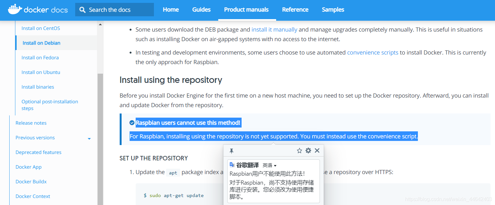
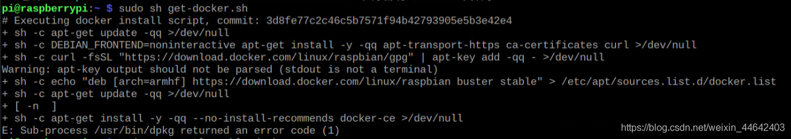
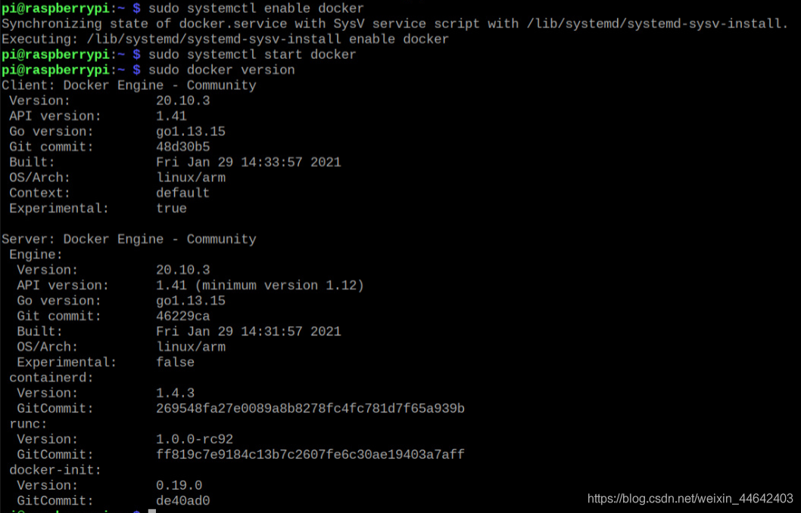
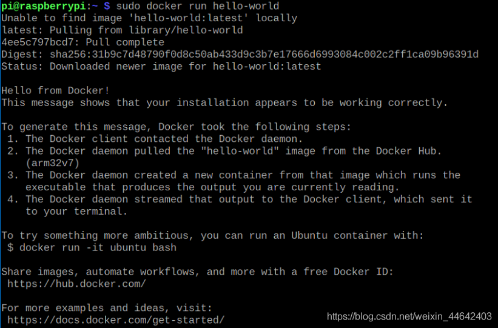

# 树莓派4B-安装Docker
在Docker官网[安装教程](https://docs.docker.com/engine/install/debian/)已经说明，树莓派安装Docker只能使用脚本安装方式，所以接下来介绍的是使用脚本的方式在树莓派中安装Docker

## Docker安装
### 获取安装脚本（社区版本）
~~~shell
curl -fsSL https://get.docker.com -o get-docker.sh
~~~
### 执行安装脚本
~~~shell
sudo sh get-docker.sh
~~~
>安装成功后如图，有时候安装不到重复几次`sudo sh get-docker.sh`

## 运行Docker
### 基本命令
~~~shell
# Docker开机自启
sudo systemctl enable docker
# 启动Docker
sudo systemctl start docker
# 查看当前Docker版本
sudo docker version
# 重启Docker
sudo systemctl restart docker
~~~

### 修改镜像源
>Docker镜像源是用于下载镜像，默认使用的是外国的下载镜像时会稍慢，切换成国内的会快一点

|镜像  |连接  |
|--|--|
|科大镜像  | https://docker.mirrors.ustc.edu.cn/ |
|网易  | https://hub-mirror.c.163.com/ |
~~~shell
#这里使用的是 科大镜像
sudo mkdir -p /etc/docker
sudo tee /etc/docker/daemon.json <<-'EOF'
{
  "registry-mirrors": ["https://docker.mirrors.ustc.edu.cn/"]
}
EOF
#重新加载配置文件
sudo systemctl daemon-reload
#重新启动docker
sudo systemctl restart docker
~~~
### 执行hello-world
~~~shell
sudo docker run hello-world
~~~
>看到如下内容表示Docker已经可以正常的使用了

## 卸载
~~~shell
#卸载Docker Engine，CLI和Containerd软件包
sudo apt-get purge docker-ce docker-ce-cli containerd.io
#主机上的映像，容器，卷或自定义配置文件不会自动删除，要手动删除所有图像，容器和卷执行如下
sudo rm -rf /var/lib/docker
sudo rm -rf /var/lib/containerd
~~~
