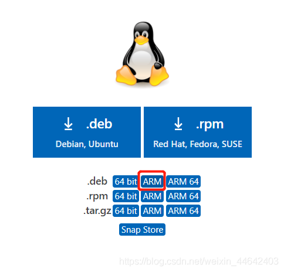
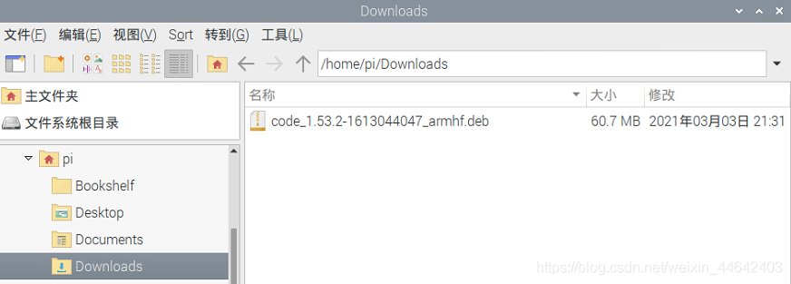
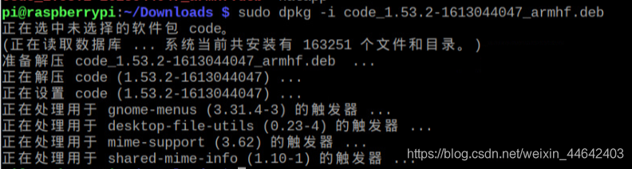
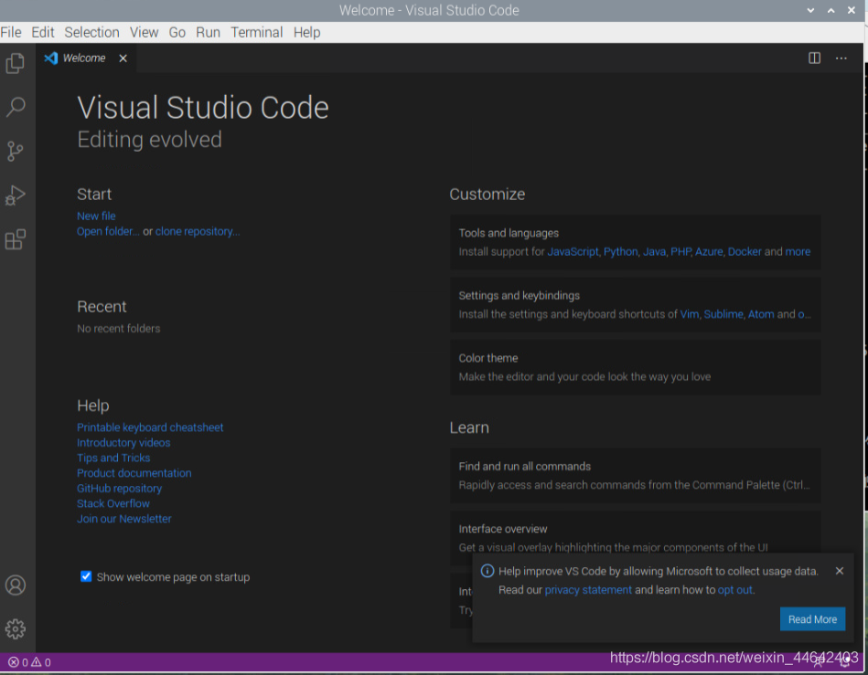

# 树莓派安装vscode
## 下载vscode
[vscode](https://code.visualstudio.com/#alt-downloads)下载地址，这里我的树莓派是arm架构32位的，我选择.deb文件

下载完毕后我们可以看到Downloads文件夹中有一个.deb结尾的文件

## 安装vscode
执行如下命令
~~~shell
sudo dpkg -i code_1.53.2-1613044047_armhf.deb 
~~~
安装完成

## 运行

