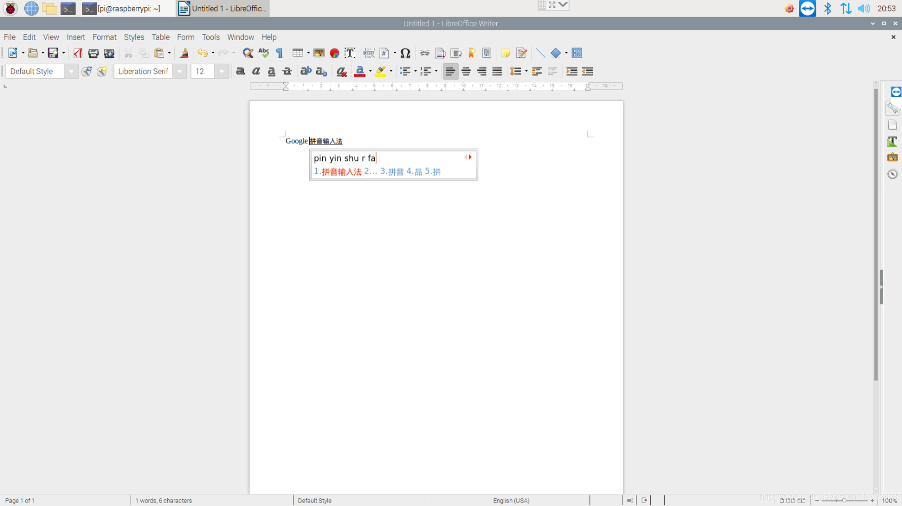

# 树莓派安装Google拼音输入法
在安装之前请确保你的软件源已经切换国内否则可能因为网络问题安装失败
更换软件源教程：[树莓派更换国内软件源](https://blog.csdn.net/weixin_44642403/article/details/113791667)
>安装中文输入法时，需要使用到Fcitx框架，Fcitx 内置的输入法支持中文 拼音 和基于字符表的输入(例如五笔). 根据语言的不同，有不同的输入法引擎可以选择，这里使用到的是`fcitx-googlepinyin Google 拼音输入法 for Android`

执行如下命令
~~~shell
sudo apt-get install fcitx fcitx-googlepinyin fcitx-module-cloudpinyin fcitx-sunpinyin
~~~
安装完毕后重启
~~~shell
sudo reboot
~~~
启动完毕后我们只需要按`Ctrl+空格`就可以切换为拼音输入法了

