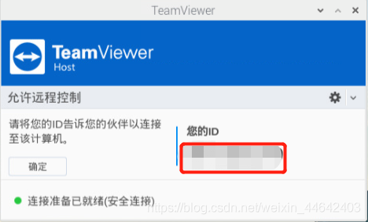

# 树莓派安装远程桌面TeamViewer
TeamViewer远程连接可以让你的树莓派不局限于你的局域网，只要有网络的地方都可以连接上，安装和使用也比较简单快捷，相比树莓派自带的VNC Viewer用起来比较方便
## 下载TeamViewer
[TeamViewer下载地址](https://www.teamviewer.cn/cn/download/raspberry-pi/)，这里我们选择树莓派点击下载

下载完毕后我们可以看到Downloads文件夹中有一个.deb结尾的文件

## 安装TeamViewer
执行如下命令
~~~shell
sudo dpkg -i teamviewer-host_15.15.2_armhf.deb
~~~
不出意外安装的时候会提示有大量依赖没有

输入这个指令，解决依赖未安装的问题，**这是一个超好用的命令记得要拿小本本记住**

~~~shell
sudo apt-get install -f
~~~
## 启动TeamViewer
安装完毕后我们可以在菜单中看到TeamViewer

桌面右上角也有

打开它，这里我就不多说了，按照指引该注册的注册，该登录的登录，搞定只会我们会看到这个界面，`您的ID记下来以后连接树莓派需要用到`

## Win使用TeamViewer连接树莓派
当然在Windows也要安装一个TeamViewer，Windows安装软件我就不多说了把下载[TeamViewer Win版](https://www.teamviewer.cn/cn/download/windows/)一股脑点下一步，然后该注册的注册，该登录的登录，最后打开它**在伙伴ID输入树莓派上TeamViewer的ID点击连接**

成功连接

## Win使用TeamViewer向树莓派传输文件

