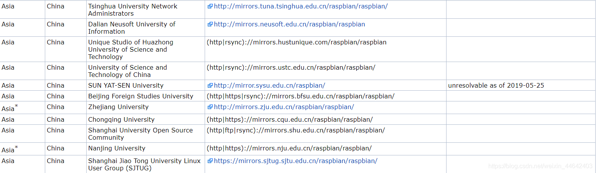
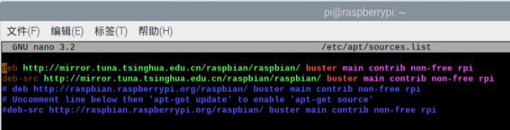
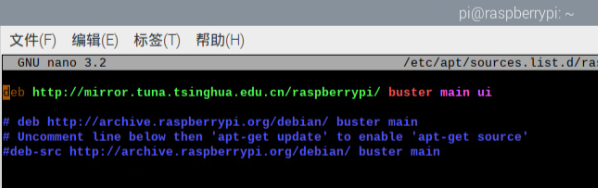

# 树莓派更换软件源
在使用树莓派之前有一件很重要的事情就是切换软件源，软件源是操作系统的应用程序安装包仓库，很多的软件都会这收录到这个仓库里面，树莓派大部分软件都通过软件源仓库中下载和安装
默认情况下，树莓派软件源地址是 http://archive.raspbian.org/，位于欧洲，在国内访问是非常慢的，经常只有几 k 每秒的下载速率，所以我们在玩转树莓派之前，强烈推荐替换成国内的软件源

## 软件源镜像网站
打开以下网站 `http://www.raspbian.org/RaspbianMirrors`，滑下去找到Asia-China的，我们可以看到有好多个
>我选择的是清华的源 http://mirrors.tuna.tsinghua.edu.cn/raspbian/raspbian/

## 更新软件镜像源
更新树莓派的软件源需要修改2个文件分别是
1. /etc/apt/sources.list
2. /etc/apt/sources.list.d/raspi.list

这里使用到了nano命令，nano命令的使用说明`https://man.linuxde.net/nano`

### 修改sources.list文件
~~~shell
sudo nano /etc/apt/sources.list

#将清华软源拷贝到文件中
deb http://mirror.tuna.tsinghua.edu.cn/raspbian/raspbian/ buster main contrib non-free rpi
deb-src http://mirror.tuna.tsinghua.edu.cn/raspbian/raspbian/ buster main contrib non-free rpi
~~~
sources.list修改后效果

### 修改raspi.list文件
~~~shell
sudo nano /etc/apt/sources.list.d/raspi.list

#将清华软源拷贝到文件中
deb http://mirror.tuna.tsinghua.edu.cn/raspberrypi/ buster main ui
~~~

raspi.list修改后效果

## 重启树莓派
以上步骤完成后执行如下命令重启树莓派
~~~shell
sudo reboot
~~~
## 更新软件与系统
重启完毕后可以就可以通过如下命令更新软件与系统了
~~~shell
sudo apt-get update

sudo apt-get upgrade
~~~
