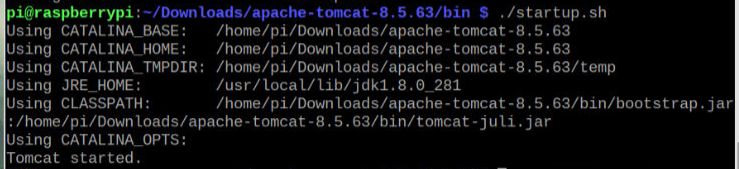

# 树莓派部署Tomcat
## 前言
>部署Tomcat之前，先在命令行中输入`java -version`，查看是否已经安装环境变量，如果有版本信息打印表示已有java环境，请跳到下载tomcat
>
如果没安装java请先看这篇文章 [树莓派4B-安装JAVA(OpenJDK与Oracle Java)](https://blog.csdn.net/weixin_44642403/article/details/113792130)

## 下载Tomcat
[Tomcat](https://tomcat.apache.org/download-80.cgi)下载地址，进入页面滑下去找到Cor下的tar.gz点击下载

## 解压压缩包
下载完成后可以看到一个`apache-tomcat-8.5.63.tar.gz`

执行如下命令解压

~~~shell
tar -zxvf apache-tomcat-8.5.63.tar.gz
~~~
## 运行Tomcat
进入到bin目录下
~~~shell
cd apache-tomcat-8.5.63/bin/
~~~
执行如下命令启动tomcat
~~~shell
./startup.sh
~~~
看到该内容表示启动成功

在浏览器中访问`http://localhost:8080/`测试服务是否启动成功

## Tomcat常用命令
需要启动或关闭tomcat时需要进入到tomcat的bin目录
~~~shell
cd apache-tomcat-8.5.63/bin/
#启动
./startup.sh
#关闭
./shutdown.sh
~~~
如果出于某种原因`shutdown.sh`无法关闭tomcat需要使用kill命令，直接关闭tomcat进程
~~~shell
#查看tomcat进程信息
ps -ef | grep tomcat
#强制关闭某个进程
kill -9 [进程ID]
~~~

