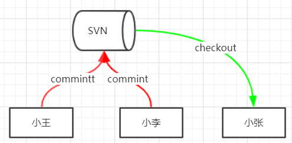
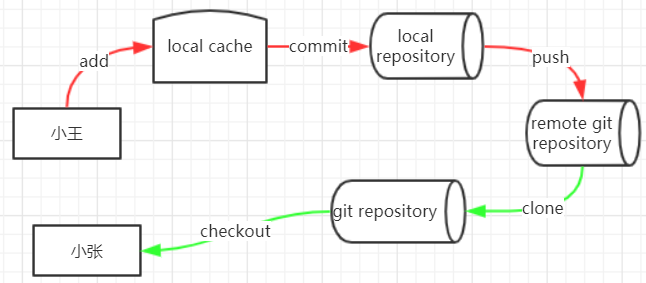
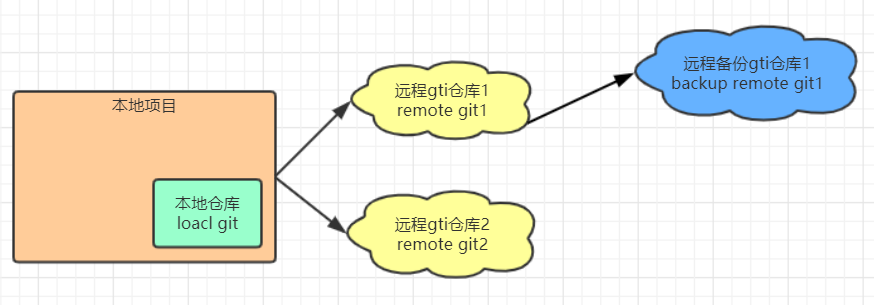

# Git基本概念和核心命令掌握

## 一、Git体系概述

### Git与svn的区别

1. 存储方式不同
2. 使用方式不同
3. 管理模式不同

### 1、存储方式的区别

Git把内容按元数据方式存储类似K/V的数据库（就是把文件里面的内容存到数据库里），可以比喻成java中的map容器，当我们的内容放入数据库里面Git会返回一个key给我们这个key是唯一的，所以如果插入重复的内容返回的key也是一样的，当需要进行回滚上一个版本你只需要告诉Git的你的上一个版本的key即可

svn是按文件存储（就是对每一个新版本都进行文件拷贝），他会将你的文件拷贝2份如 README.MF(当前版本) README.MF.version1(上一个版本)，如需要回滚上一个版本我需要告诉svn上一个版本的文件名

### 2、使用方式区别

用过svn的同学大家都知道我完成代码后只需要commint非常简单是吧

我们可以从下面的图中看出在开发过程中不管是小王还是小李写好了代码只需要commint就行了如果小张需要得到最新的代码只需要checkout即可

Git与svn就完全不一样了

我们可以从下面图中看出（后面会解释为什么需要这些步骤以及这些步骤的用处）

小王要提交他的代码他要进行如下步骤：add到local cache（暂存区）在commit到local repository（本地仓库）最后 push remote git repository（远程仓库） 完成提交

小张需要更新代码就需要通过clone或者checkout（其中一个操作即可）

### 3、版本管理模式区别

git是一个分布式的版本管理系统，而svn是一个远程集中式的管理系统

集中式：svn永远只有一个远程仓库，如果我们与远程仓库的连接中断了那么我们就不能对我们的代码进行提交

分布式：git在每一个本地项目中都会有自己的git仓库，每一个git本地仓库可以连接多个git远程仓库，也可以在远程仓库中在连接远程仓库

假设我们一个开发团队有1000人我们需要做版本控制使用svn是不现实的，因为人数太多了会很乱，我们会把这1000人切份为一个一个的部门，每一个部门有对应自己的git仓库，git可以连接多个远程仓库好处就在于这，当我A部门需要提交代码他可以同时提交到多个git仓库，在向A部门git仓库提交代码同时向B，C部门的git仓库也提交最新的代码，从而实现我每一个部门有自己的git仓库但是我也可以得到别的部门的最新的代码。

假设我有一个世界级的项目有几十万给提交是来自世界各地的我们怎么才能把世界各国的代码汇集到一起呢，那么我们是不是应该在中国、美国、日本、韩国等每一个国家开一个git服务器、然后在这个git服务器上在连接一个远程的总仓库，每一个国家都有一个负责人去审核人自己的项目是否有问题没问题后在提交到总仓库。（细心的同学有没有发现这个好像区块链技术）

## 二、Git核心命令使用

### 主要内容：

1. git客户端安装配置
2. 整体认识GIT的基本使用
3. 分支管理
4. 标签管理
5. 远程仓库配置

### 1、安装git客户端

官方客户端：  https://git-scm.com/downloads （全部下一步最好不要改变安装路径）

### 2、认识GIT的基本使用

#### 本地初始GIT仓库

~~~shell
## 从远程仓库克隆至当前目录
git clone <remote_url>
## 在当前目录创建一个git本地仓库
git init  <directory>

~~~

#### 本地仓库添加

~~~shell
## 添加指定文件至暂存区
git add <fileName>
## 添加指定目录至暂存区
git add <directory>
## 添加所有
git add -A
## 将指定目录及子目录移除出暂存区
git rm --cached target -r
~~~

#### 本地提交

~~~shell
## 提交单个文件至本地仓库
git commit file -m '提交评论'
## 提交全部至本地仓库
git commit -am '快添加与提交'
~~~

### 3、分支管理

~~~shell
#查看当前分支
git branch [-avv]
#基于当前分支新建分支
git branch <branch name>
#基于提交新建分支
git branch <branch name> <commit id>
$ git branch -d {dev}
#切换分支
git checkout <branch name>
#合并分支
git merge <merge target>
#解决冲突，如果因冲突导致自动合并失败，此时 status 为mergeing 状态.
#需要手动修改后重新提交（commit） 
~~~

### 4、远程仓库管理

~~~shell
#查看远程配置 
git remote [-v]
#添加远程地址
git remote add origin http:xxx.xxx
#删除远程地址
git remote remove origin 
#上传新分支至远程
git push --set-upstream origin master 
#将本地分支与远程建立关联
git branch --track --set-upstream-to=origin/test test
#把远程库中的更新合并到本地库中，–rebase的作用是取消掉本地库中刚刚的commit，并把他们接到更新后的版本库之中
git pull --rebase origin master
~~~

### 5、tag管理

~~~shell
#查看当前
git tag
#创建分支
git tag <tag name> <branch name>
#删除分支
git tag -d <tag name>
~~~

### 6、日志管理

~~~shell
#查看当前分支下所有提交日志
git log
#查看当前分支下所有提交日志
git log {branch}
# 单行显示日志
git log --oneline
# 比较两个版本的区别
git log master..experiment
#以图表的方式显示提交合并网络
git log --pretty=format:'%h %s' --graph
~~~

### 小案例

完成模拟从项目添加到push过程  创建项目-》初始git仓库-》提交文件-》远程关联-》push到远程仓库

~~~shell
## 在项目路径下右键运行git使用init即可创建项目
git init test
## 进入仓库
cd test/
## 在git仓库创建文件
echo '这是我的第一个git仓库' > README.MF
## 查看当前仓库文件状态，我们可以看到刚刚添加的README.MF为红色，表示未添加到暂存区内（对这里有疑惑的同学回到1-2看一下git提交代码流程）
git status
## 将文件提交到缓冲区
git add README.MF
## 我们可以使用rm删除 我们在缓冲区不想提交的文件
git rm --cached README.MF
## 当我们添加文件后再次查看状态大家会看到绿色的new file:README.MF（等待提交意思）
git status
## 提交文件到本地仓库 （-m后面跟着注解）
git commit README.MF -m 'frist commit';
## 添加远程仓库以地址（github创建的远程仓库）
git remote add origin https://xxx/xxx/test.git
~~~

项目的下载

~~~shell
## 小张需要下载我刚刚提交到git的文件 把下载的项目命名未xiaozhang
git clone https://xxx/xxx/test.git xiaozhang 
## 修改项目文件
echo '我是小张这是我提交的文件' > README.MF
## 到这里有同学会发现一个一个提交岂不是很麻烦 当然我们可以全部提交
## 提交全部到缓冲区 并且提交到远程服务器
git add -A;git commit -am '2 commit';git push
~~~

## 三、Git底层原理

* GTI储存对象
* GIT树对象
* GIT提交对象
* GIT引用

### 1.GTI存储对象（类似java容器hasMap）

Git是一个内容寻址文件系统，核心部分是一个简单的键值对数据库（key-value data store），你可以向数据库中插入任意内容，它会返回一个用于取回该值的hash键，由于是内容寻址文件系统所以当我们插入重复内容返回的key也是一样的，我们插入不同内容后才会生成新的key

~~~shell
# git键值库中插入数据
echo 'test 01' | git has-object -w --stdin
a88de8ed5860d69851740f6cd995a93d47842d23 #返回的key

#基于键获取指定内容
 git cat-file -p a88de8ed5860d69851740f6cd995a93d47842d23

~~~

Git基于该功能 把每一个文件的版本中内容都保存在数据库中，当要进行版本回滚的时候就通过其中一个键将其取回并替换

小案例

~~~shell
#模拟git版本写入与回滚过程
#获取当前项目下所有git对象
find .git/objects/ -type f

#写入版本1
echo 'version1' > README.MF ; git hash-object -w README.MF
#写入版本2
echo 'version2' > README.MF ; git hash-object -w README.MF
#写入版本3
echo 'version3' > README.MF ; git hash-object -w README.MF
#回滚指定版本
git cat-file -p 5bdcfc19f119febc749eef9a9551bc335cb965e2 > README.MF
#查看文件内容
cat README.MF
~~~

经过上面一轮小练习大家都指定 怎么回滚和写入版本了把，其实在我们平时做一次git add时相当于一次版本的写入，大家可以练习一下，修改一个文件然后git add，再使用find .git/objects/ -type f命令可以看到多出了一条key。

大家操作完案例后我有一个小问题，如果我从version3回退到了version1后我git add会再生成一个key吗

答案：不会，因为前面已经说过了git是内容寻址文件系统，version1这个内容已经有对应的key了 你使用git add他是不会重新生成key

版本回退问题我们解决了，但是细心的同学会发现存储内容并没有存储文件名，只提供了一个key，如果要进行回滚我怎么知道那个内容对应那个文件呢？接下来要讲的就是树对象，它解决了文件名存储的问题。

1. GIT树对象

   树对象解决了文件名的问题，它的目的将多个文件名连接在一起，我们日常的文件夹就可以比喻成树对象，一个文件夹就是一个树对象每一个文件夹都有自己的key，文件夹下有一个文件夹相当于树对象下还有一个树对象，文件夹中的文件也有key。

   ~~~shell
   #查看分支树
   git cat-file -p master^{tree}
   ~~~

### 2.git提交对象

一次提交即为当前版本的一个快照，该快照就是通过提交对像保存，其存储的内容为：一个顶级树对象、上一次提交的对像啥希、提交者用户名及邮箱、提交时间戳、提交评论  

小案例（commit一次查看当前对象树）

~~~shell
# 创建层次文件
mkdir /src/main/java/
# 写入内容并创建文件
echo 'Hellow java' > src/main/java/Hellow.java
# 添加到暂存区 并且提交
git add -A;git commit -am '生成git提交对象'
# 查看日志
git log
#commit d1dc2bd6cbdb5fe4902bdc8fb1f0a29f7f60f2f9 (HEAD -> master) 当前commit树对象的key
# 查看commit对象树
git cat-file -p d1dc2bd6cbdb5f
#tree f37caf1e86c5c65194b2ed7d552f11cd1033ef06 顶级树对象
# 查看顶级树对象
git cat-file -p  f37caf1e86c5c65194b
# 100644 blob 5bdcfc19f119febc749eef9a9551bc335cb965e2    README.MF 有一个文件
# 040000 tree 361e82b86576252af1a989e4a2ae28e138c4eb41    src src树对象
# 查看src树对象
git cat-file -p  361e82b86576252af1a
# 040000 tree 6a7c1253ff9a6d4ecb9f35708aa48dc0a415e712    main main树对象
~~~

经过上面小案例我们得知每一次提交都会有一个树对象生成，树对象下面会有一个顶级树，顶级树下面就是我们提交的文件夹以及文件，每一个文件夹都是一个树对象，每一个树对象和文件都有自己对应的key我们可以通过key去查看内容或是回滚内容。

小问题：如果我向main中的一个添加了一个文件大家想想我再次commit后里面的那些key会改变

答案：commit会改变，因为commit每一次都是不同的提交所以这个毫无疑问每一次都是唯一的；顶级树会改变、src树对象会改变、main树对象会改变、我们会发现这是一个至下而上的改变，main中多了一个文件main对象树的key那就要更新，main对象树被更新了src发现连接的main的key改变了所以src对象树要更新，顶级对象树发现连接的src的key改变了顶级对象树也要更新，在main之下的文件以及main之上无关联的文件key都没有变化；

由此我们可以得出，每一次commit的时候其实git就拿着我们这次提交和上一次提交进行一个比对，只对有变化那一部分进行更新，以及与变化有关联的文件进行更新

### 3.GIT引用

 当我们执行 git branch {branchName} 时创建了一个分支，其本质就是在git 基于指定提交创建了一个引用文件，保存在 .git\refs\heads\ 下

~~~shell
#演示创建分支
git branch dev 
cat.git\refs\heads\dev
~~~

