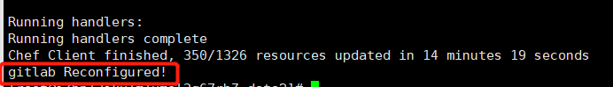
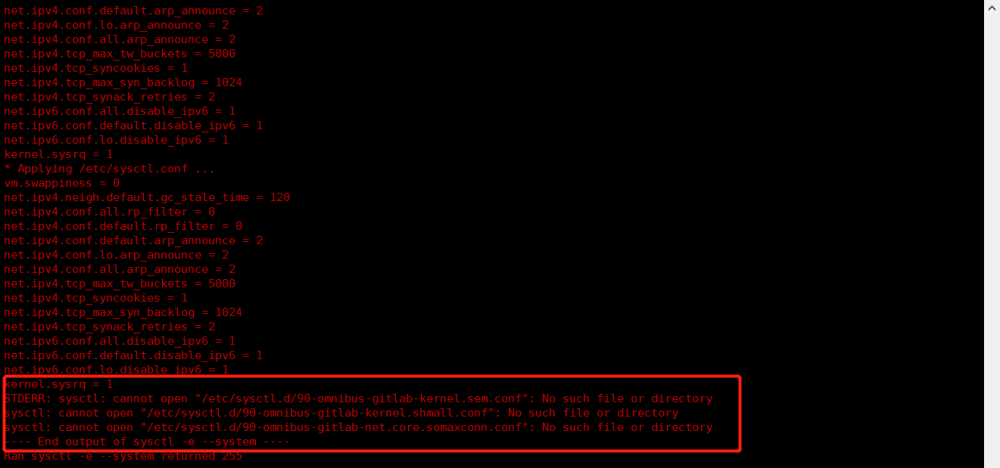
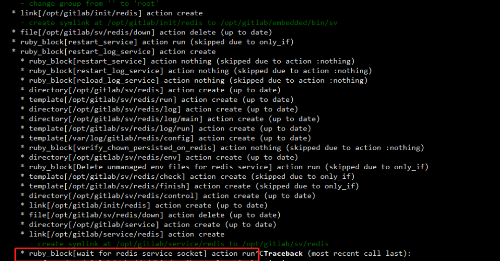

# 搭建企业私有Git服务

> GitLab是用于仓库管理系统的开源项目，使用GIT作为代码管理工具，并且在此基础上搭建起来的一个web服务
>
> GitLab和GitHub同样都是属于第三方基于Git开发的作品，区别是GitLab是由自己部署代码提交到自己部署的服务上一切数据都在自己的数据库中，适合团队内部协作开发，而GitHub代码是保存到GitHub官方数据库中

## GitLab安装

### 安装相关依赖

> 在安装GitLab之前需要安装相关依赖，以及配置相关参数

~~~shell
#安装相关依赖
sudo yum install -y curl policycoreutils-python openssh-server perl
#打开ssh服务&设置开机启动
sudo systemctl enable sshd
sudo systemctl start sshd
#设置postfix开启自启动，并启动
sudo yum install -y postfix
sudo systemctl enable postfix
sudo systemctl start postfix
#开放ssh以及http服务，如何重新加载防火墙列表(若防火墙关闭跳过)
firewall-cmd --add-service=ssh --permanent
firewall-cmd --add-service=http --permanent
firewall-cmd --reload
~~~

### 下载相关文件

> 离线安装方式(可指定版本)：
>
> 首先需要下载一个gitlab-ce安装包 ce版本rpm包镜像下载地址:`https://mirrors.tuna.tsinghua.edu.cn/gitlab-ce/yum/`

~~~shell
#下载安装包(如果该链接)
wget https://mirrors.tuna.tsinghua.edu.cn/gitlab-ce/yum/el6/gitlab-ce-12.4.2-ce.0.el6.x86_64.rpm
#离线安装gitlab
sudo rpm -ivh gitlab-ce-12.4.2-ce.0.el6.x86_64.rpm
~~~

> 在线安装方式(最新版)：

~~~shell
#配置gitlab仓库源
curl https://packages.gitlab.com/install/repositories/gitlab/gitlab-ce/script.rpm.sh | sudo bash
#在线安装gitlab
sudo EXTERNAL_URL="https://gitlab.example.com" yum install -y gitlab-ce
~~~

### 修改gitlab配置

> 修改gitlab访问地址和端口，默认为80，我们修改为82

~~~shell
#编辑gitlab.rb
vim /etc/gitlab/gitlab.rb
#修改内容如下
external_url 'http://主机IP:82'
nginx['listen_port'] = 82
~~~

### 重新加载配置

> 执行如下目录重新加载配置

~~~shell
#重新加载配置，时间比较久可能需要几分钟
gitlab-ctl reconfigure
#重启gitlab
gitlab-ctl restart
~~~

> 看到提示gitlab Reconfigured!表示成功

> 如果在reconfigure时卡住(查看常见问题-问题2)

### 添加端口到防火墙

> 如果关闭防火墙可跳过该步骤

~~~shell
#将设置好的82端口添加到防火墙中
firewall-cmd --zone=public --add-port=82/tcp -permanent
firewall-cmd --reload
~~~

## 常见问题

### 问题1

> 出现如下报错时需手动创建几个问题即可解决

~~~shell
touch /opt/gitlab/embedded/etc/90-omnibus-gitlab-kernel.sem.conf
touch /opt/gitlab/embedded/etc/90-omnibus-gitlab-kernel.shmall.conf
touch /opt/gitlab/embedded/etc/90-omnibus-gitlab-net.core.somaxconn.conf
~~~

### 问题2

> 打开一个新的终端执行如下命令

~~~shell
sudo systemctl restart gitlab-runsvdir
~~~

