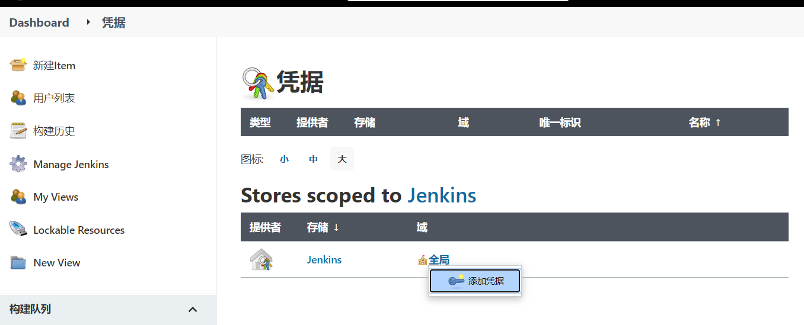
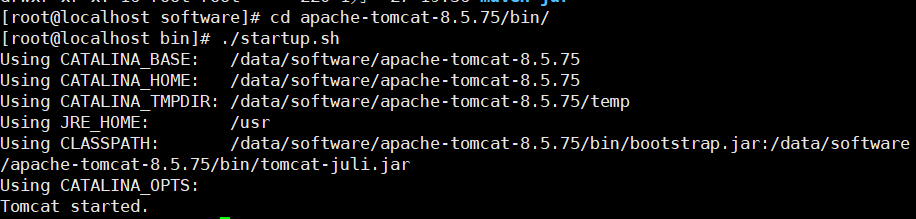
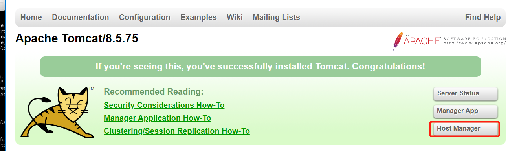
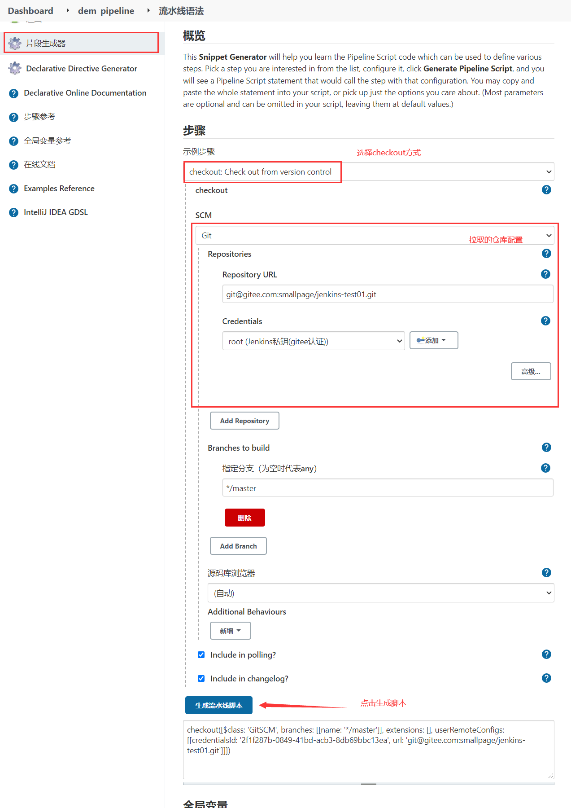
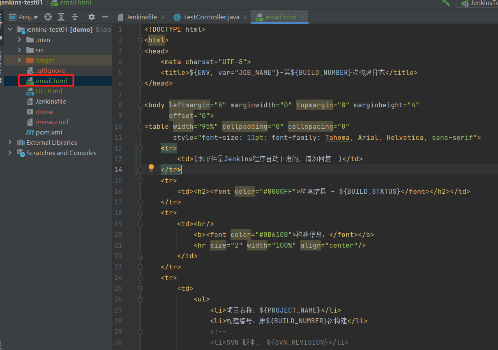

# jenkins-基础

## 关于可持续化集成

什么是可持续化集成？举一个例子

一个开发团队正着手开发一个项目，在需求评审之后由小组长拆成肉感个模块，分给不同的小伙伴去实现。2个星期后各自的模块功能都实现了，大家都很开心。这时是该合在一起提测了把，一提测小组长就傻眼了，写的功能没有一个可以用的，要么公共类冲突，要么配置冲突等，经过上一次教训，小组长变聪明了，在也不等功能开发之后再合并提测了，而是每天集成提测，如果发现冲突当天就要解决，这样子我们一天起码要抽出20%的时间去合并代码解决冲突，可持续化集成就是用来解决这个问题。

可持续集成即 Continuous integration（CI）是一种软件开发实战，即团队开发成员经常集成他们的工作，每次集成都通过自动化构建（包括编译，发布，自动化测试）来验证，从而尽快的发现集成错误，让团队能够更高效的开发软件

当我们提交代码到git后 CI就会自动 合并 编译 测试这样我们就用人工去检查 合并代码，大大提高了开发效率 

持续集成要点：

* 统一代码库（git）
* 统一依赖包管理（nexus）
* 测试自动化
* 构建全自动化（maven）
* 部署自动化
* 可追踪集成记录

## jenkins概述

jenkins就是为了满足上述持续集成的要点而设计的一款工具，其主体框架采用java开发，实质内部功能都是由各种插件实现的，由于功能都是插件实现所以极大的提高了系统的扩展性（我们之前学的maven的每一个阶段也是用插件实现的）。其不仅可以满足java系统的集成，也可以实现php等语言的集成发布。通过pipeline插件，用户可以随自己需要定制集成流程。

## jenkins安装

### 依赖安装

>  jenkins需要jdk环境，若已经按照了jdk可以忽略该步骤

~~~shell
yum install java-1.8.0-openjdk* -y
~~~

### 下载安装包

> jenkins支持Docker、yum、msi等安装，在这里推荐大家直接选择下载他对应的WAR包进行安装。 https://get.jenkins.io/war-stable/

### 启动Jenkins

>  下载完成之后直接可以通过jar -jar 命令启动

~~~shell
# 前台启动 指定端口8080
java -jar jenkins.war --httpPort=8888
# 后台启动 指定端口8080
nohup java -jar jenkins.war --httpPort=8888 & 
~~~

### 初始化配置

> 启动完毕后访问`http://localhost:8080/`可以看到一个登录页面，初始密码就在那个文件夹种

> 在插件安装这一步点击`选择插件来安装`直接跳过，因为Jenkins默认的插件镜像库是很慢的，先跳过后面换成国内镜像源就块

> 选择`无`插件后面再安装

> 点击下一步后jenkin会让你创建一个管理员账户，jenkin默认是有一个admin的账户的密码就是第一次进入页面的那个密码，当然这里可以自己在新建一个，填好后点击保存并完成

> 确认一下jenkins的地址与端口号，没问题点击完成，就进入到jenkins了

## 插件管理

### 修改插件下载地址

> jenkins默认的插件下载地址是连接官网的，所以下载速度非常慢而且有时会下载不了，进入到`jenkins -> Manage Jenkins -> Manage Plugins`点击`Advanced`
>
> 把：`http://updates.jenkins-ci.org/update-center.json `
>
> 换成：`http://mirror.esuni.jp/jenkins/updates/update-center.json `
>
> 镜像源查询：http://mirrors.jenkins-ci.org/status.html

> 进入到`/root/.jenkins/updates`执行如下命令修改default.json中的地址将国外的全部换成国内的

~~~shell
sed -i 's/http:\/\/updates.jenkins-ci.org\/download/https:\/\/mirrors.tuna.tsinghua.edu.cn\/jenkins/g' default.json && sed -i 's/http:\/\/www.google.com/https:\/\/www.baidu.com/g' default.json
~~~

> 浏览器执行`http://192.168.100.104:8080/restart`重启jenkins

### 下载汉化插件

> 进入到`jenkins -> Manage Jenkins -> Manage Plugins`点击`available`搜索chinese安装中文插件并且重启

> 重启完毕后可以看到jenkins都进行了汉化了

## 用户权限管理

### 插件下载

> 在日常的开发者，会有很多用户登录到Jenkins中，用户管理插件这样可以更好的控制用户的操作权限，安装`Role-based Authorization Strategy`插件

### 修改安全策略

> 进入到`jenkins -> Manage Jenkins -> Configure Global Security`将安全策略修改为`Role-Based Strategy`点击保存

### 管理角色

> 修改安全策略后，那么需要做角色创建、分配等工作
>
> 进入到`jenkins -> Manage Jenkins -> Manage and Assign Roles`，进入后看看到有管理角色、分配角色

#### 管理角色

> 进入到`jenkins -> Manage Jenkins -> Manage and Assign Roles -> Manage Roles`
>
> 管理角色，点击进入后可以看到有3中角色
>
> * Global roles：全局角色
> * Item roles：项目角色，控制某些用户可以访问那些项目
> * Node roles：节点角色，在jenkins主从时会用到

**全局角色创建**

**项目角色**

#### 创建用户

> 进入到`jenkins -> Manage Jenkins -> Manage Users`，创建一些用户由于分配角色

#### 分配角色

> 进入到`jenkins -> Manage Jenkins -> Manage and Assign Roles -> Assign Roles`

## 凭证管理

> jenkins在平时的使用中会经常与第三方进行交互，如mysql、docker、gitlab密码等，jenkins需要保存于第三方交互的凭证，为了让这些信息更加安全、更方便管理，那么需要安装凭证管理插件`Credentials Binding Plugin`
>
> 添加完毕后进入到`jenkins -> Manage Jenkins -> ManageCredentials`可以看到添加凭证

> 使用最多的是账户+密码或SSH方式的凭证

## 从Git拉代码(HTTP方式)

### 环境准备

> 要让Jenkins能从git仓库上拉取代码，那么首先需要具备2个条件
>
> 1. 安装jenkins的电脑上已安装git工具
> 2. jenkins中安装了git插件

**Jenkins安装git插件**

**Linux安装git**

~~~shell
yum install git -y
gi --version
~~~

**准备一个Gitee仓库**

### 添加凭证

### 配置项目

> 凭证添加完毕选择在创建项目时，配置项目的源码管理页时，选择git后输入路径并且输入选择相应的凭证即可

### 测试构建

> 点击构建，进入构建日志可以看到项目被成功的拉取下拉了

## 从Git拉代码(SSH方式)

> 要使用SSH方式获取git上的代码，那么首先需要准备公钥与私钥，git服务器上存放公钥，Jenkins服务器上存放私钥

### 密钥对生成

> 注意，密钥对生成是在Jenkins服务器上生成的

~~~shell
#生成密钥对，输入命令后，连续按3次回车
ssh-keygen -t rsa
#密钥对保存的位置，pub结尾的是公钥，例外的是私钥
cd /root/.ssh/
#查看公钥内容
cat id_rsa.pub
~~~

### 把公钥存在Gitee上

### 添加凭证

### 配置项目

> 凭证添加完毕选择在创建项目时，配置项目的源码管理页时，选择git后输入路径并且输入选择相应的凭证即可

### 测试构建

> 点击构建，进入构建日志可以看到项目被成功的拉取下拉了

## 集成Maven

> Jenkins使用Maven自动化构建首先需要Jenkins服务器上携带Maven

[Linux-安装Maven](../Liunx专栏/Linux-安装Maven.md)

### 全局工具配置

> 要将Maven和jdk添加到Jenkins全局工具配置中，进入到`jenkins -> Manage Jenkins -> Global Tool Configuration`

**jdk配置**

> 将`install automatically`勾去掉，新增jdk配置

**Maven配置**

### 系统全局变量

> 在全局工具配置中设置完毕后，需要在系统全局变量中添加几个参数，进入`jenkins -> Manage Jenkins -> Configure System`，在这里配置后可以让Jenkins 知道这写环境变量的命令的使用
>
> `注意：JAVA_HOME、MAVEN_HOME、PATH+EXTRA 是固定格式不要私自修改`

### 配置项目

> 配置项目构建触发器，添加一个shell脚本执行构建命令

### 测试构建

## 集成Tomcat

> 下载好Tomcat的，并且解压到Linux上

### 启动Tomcat

> 进入到tomcat的bin目录，执行`./startup.sh`

### 配置Tomcat用户信息

> Jenkins需要上传打包好的war包，那么就需要使用账号密码连接到tomcat上，才能完成发包
>
> 进入到tomcat的conf目录`/data/software/apache-tomcat-8.5.75`修改用户配置的xml`vim conf/tomcat-users.xml`添加如下内容

~~~xml
<!--创建角色-->
<role rolename="tomcat"/>
<role rolename="role1"/>
<role rolename="manager-script"/>
<role rolename="manager-gui"/>
<role rolename="manager-status"/>
<role rolename="admin-gui"/>
<role rolename="admin-script"/>
<!--创建用户，分配角色-->
<user username="tomcat" password="tomcat" roles="manager-gui,manager-script,tomcat,admin-gui,admin-script"/>
~~~

**允许远程登录**

> 默认tomcat是不允许远程访问的，需要开启
>
> 进入`/data/software/apache-tomcat-8.5.75`
>
> 修改`vim webapps/manager/META-INF/context.xml`
>
> 将如下内容注释掉

### 测试登录

> 连接上tomcat使用配置好的用户名与密码登录，能够登录成功表示ok

### 插件安装

> jenkins要实现远程发布需要安装一个`Deploy to container`插件

## jenkins项目构建

### 构建类型

>  jenkins项目构建类型常用的有三种
>
> * 自由风格软件项目(FreeStyle Project)
> * Maven项目(Maven Project)
> * 流水线项目(Pipeline Project)
>
> 每种类型的构建最终的构建结果都是一致的，只是构建的过程、操作方式、灵活度有所区别，推荐流水线类型灵活度最高

#### 自由风格构建

> 自由风格构建，就是可以提供给用户编写小部分脚本构建任意项目
>
> 例子：拉取代码->编译->打包->部署

##### 创建项目

> 新增一个项目，风格选择自由风格

##### 拉取代码方式

> 修改源码管理中，选择使用git拉取源码

##### 编译打包方式

> 自由风格构建的项目，在编译打包方式上用户可以自定义脚本，打包不同的项目，这里编写shell脚本使用maven构建项目

##### 远程发布

> 这个选项必须安装`Deploy to container`插件

##### 测试

> 构建完成后可以在tomcat上看到最新发布的包

#### Maven项目构建

> Maven项目构建，看名称就不多说了，该项目只能构建maven搭建的项目 

##### 插件安装

> 在jenkins中构建一个maven风格的项目，首先需要安装一个插件`Maven Integration`

##### 创建项目

> 在Jenkins中选择创建一个maven项目

##### 拉取代码方式

> 修改源码管理中，选择使用git拉取源码

##### 构建方式

> maven的构建方式，可以直接在build中选择pom文件，输入构建命令即可，不用写脚本

##### 远程发布

> 选择远程发布的tomcat地址

##### 测试

> 构建完成后可以在tomcat上看到最新发布的包

#### 流水线构建(重要)

> 流水线构建也叫Pipeline，是一套运行在jenkins上的工作流框架，可将多个独立的任务连接起来，实现一个复杂任务的编排和构建
>
> 在前面的自由风格/Maven风格构建的项目可以看到每一个步骤都是分开的并且自定义不高，在Pipeline中可利用一种代码的方式实现整个构建流程

##### 插件安装

> 在jenkins中构建一个Pipeline风格的项目，首先需要安装一个插件`Pipeline`

##### Pipeline语法

> Pipeline脚本是由Grovvy语言实现的，但是没必要单独去学习Grovvy
>
> Pipeline支持2种语法，Declarative(声明式)和Scripted Pipeline(脚本式)语法
>
> Pipeline也有2种创建方法，直接在Jenkins的Web UI界面种输入脚本；也可以通过创建一个JenkinsFile脚本文件放入项目源码库种，然后获取源码时直接载入JenkinsFile构建项目(推荐)

**简单认识**

> pipeline声明式语法，新版的Jenkins推荐使用声明式语法，大致分为如下几块
>
> pipelint{}：所有内容都写在这里面
>
> agent any：定义环境变量如Docker、Mavne、jdk等
>
> stages{}：一个大的构建阶段，里面包含着多个stage(''){}
>
> stage(''){}：每一个小阶段，里面包含着该阶段执行的脚本
>
> steps{}：每个任务中的步骤，具体的脚本编写在里面

~~~shell
pipeline {
    //这里定义环境/工具 Docker Maven Jdk
    agent any
    //一个大的构建阶段
    stages {
        //拉取代码阶段
        stage('pull code') {
        	//拉取代码的脚本
            steps {
                echo 'pull code'
            }
        }
        //构建项目阶段
        stage('build project') {
        	//构建项目的脚本
            steps {
                echo 'build project'
            }
        }
        //发布项目阶段
        stage('pulish project') {
        	//发布项目的脚本
            steps {
                echo 'pulish project'
            }
        }
    }
}
~~~

> pipeline脚本式语法，脚本式是一种比较旧的编写方式，大致分为如下几块
>
> node{}：节点，里面包含pipeline执行过程
>
> def：定义环境变量如Docker、Mavne、jdk等
>
> stage(''){}：每小阶段，里面包含着该阶段执行的脚本

~~~shell
node {
 	//这里定义环境/工具 Docker Maven Jdk 
    def mvnHome
    //拉取代码阶段
    stage('pull code') { 
        echo 'pull code'
    }
    //构建项目阶段
    stage('build project') {
        echo 'build project'
    }
    //发布项目阶段
    stage('pulish project') {
       echo 'pulish project'
    }
}
~~~

##### 创建项目

> 在Jenkins中选择创建一个Pipeline项目  

##### 编写脚本

> 编写一个测试脚本

##### 阶段视图

> 创建完毕后点击构建可以看到一个阶段视图，里面显示了每一个阶段的耗时，执行过程的日志

## Pipeline语法生成

> Jenkins提供了语法生成工具可以帮助我们生成流水线语法

### 拉取代码

> 选择checkou操作，配置好需要拉取的仓库地址，和认证信息

### 编译打包

### 远程发布

### 组合

> 将所有脚本组合到一起，形成拉取-构建-发布流水线

## jenkinsFile

> 在前面的流水线构建方式脚本都是保存在jenkins服务器的项目构建中的，这样显然不太方便有时我们的构建文件需要进行变更那么就需要登录到jenkins变更，利用JenkinsFile的方式将pipeline语法保存到项目源码下，这样可以跟着源码一起发布并且也有版本控制
>
> 添加后将该文件提交到git仓库上

### 执行Jenkinsfile

> 在Jenkins中流水线设置时，选择使用SCM方式，配置好从哪里获取这个脚本，Jenkins就会重你指定的地方获取该文件，然后执行里面的脚本内容

### 测试

> 可以看到在构建项目前多了一个步骤`checkout scm`就是从远程仓库获取`pipeline`文件

## jenkins构建触发器

> 在前面的使用过程中，所有的构建项目都是需要手动点击构建才能进行构建发布，在jenkins如果要实现自动构建，那么需要使用到触发器，触发器作用就是告诉Jenkins在何时构建项目

### 内置触发器

> jenkins内置4种构建触发器
>
> 1. 触发远程构建
> 2. 其他项目构建后触发(Build after other projects are build)
> 3. 定时构建(Build periodically)
> 4. 轮询SCM(poll SCM)

#### 触发远程构建

> 触发远程构建，即通过http方式远程触发项目构建，在构建触发器中选择`触发远程构建`需要填写一个令牌字符串(一般是由生成的加密字符串)，当用户需要构建时发生http请求地址`JENKINS_URL/job/dem_pipeline/build?token=TOKEN_NAME`
>
> 例：`http://192.168.100.104:8888/job/dem_pipeline/build?token=abc`

#### 其他项目构建后触发

> 其他项目构建后触发，即当某一个项目构建完毕后，触发构建这个项目

**准备前置工程**

**修改dem_pipeline**

> 当before执行构建完毕后，dem_pipeline就会被触发构建

#### 定时构建

> 定时构建，即设定规则让Jenkins定时构建该项目
>
> 定时表达式：\*\*\*\*\* => 分 时 日 月 周

| 表达式例子      | 说明                                 |
| --------------- | ------------------------------------ |
| H/30 * * * *    | 每30分钟构建一次                     |
| H H/2 * * *     | 每2小时构建一次                      |
| 0 8,12,22 * * * | 每天8点、12点、22点构建，一天构建3次 |
| H 12 * * *      | 每天中午12点定时构建一次             |
| H 18 * * 4      | 每个周四下午18点定时构建一次         |

#### 轮询SCM

> 轮询SCM，与定时构建差不多，即Jenkins每隔一段时间会去扫描代码仓库，如果代码仓库代码发生变更了就构建
>
> `不推荐使用轮询SCM，因为会定时扫描项目源码，如果项目较大会增加Jenkins的开销`

### Git hook自动触发构建

> Git hook，即当git收到有提交新代码后那么会触发一个钩子，通知jenkins需要拉取代码进行构建，这样发起方是git告诉Jenkins有新的项目可以构建，这样Jenkins就不用一直轮询代码仓库判断是否有新版

#### Gitee

##### 插件安装

> 如果远程仓库是Gitee，Jenkins需要安装如下插件`Gitee`

##### Jenkins项目设置

> 在构建触发器中选择gitee webhook触发

##### Gitee设置

> 在gitee仓库中的管理，添加webhook将Jenkins中的url`Jenkins的访问地址/gitee-project/dem_pipeline`和密码拷贝过来

##### 测试

> 每当向gitee推送更新时，Jenkins就会收到消息，然后去gitee上拉取最新代码构建

## jenkins参数化构建

> 在前面编写的Pipeline脚本内容都是写死的修改需要修改源文件，jenkins提供了参数化构建，Pipeline脚本可以接收有个用户提供的参数执行不一样的构建流程

### 添加参数

> 在项目构建时，选择`This project is parameterized`选项可以添加参数

> 添加完毕后发现原来的`Build`变为`Build with Parameters`，点击后可以看到显示可配置的参数

### 脚本中读取参数

> 参数添加完毕后，要读取该参数只需在脚本中写入`${参数名}`即可

## jenkins邮箱服务

> jenkins提供邮件服务，可以在项目构建完毕只会通过邮件方式通知

### 插件安装

> 要使用邮箱服务那么需要安装`Email Extension`插件

### 邮箱配置

> 这里演示QQ邮箱，其他邮箱也是差不多的操作步骤，登录到QQ邮箱找到设置，开启SMTP服务，然后生成授权码

### jenkins配置

> 进入到`jenkins -> Manage Jenkins -> Configure System`，找到`Extended E-mail Notification`配置

### 测试邮件发送

> 测试邮箱能够正常收到邮件表示成功

### 定制邮件模板

> 邮箱服务配置完毕后，就可以定制一个邮件发送的内容了因为前面勾选的是html页面所有我们就一个html内容模板(百度一下)，一般这个邮件模板都会方在项目的根目录上，在模板里面有很多的`${变量}`，这些都是Jenkins中的全局变量(在邮箱配置选项中的`Content Token Reference`旁边问号点开可以看到jenkins中的所有变量与介绍)
>
> 添加完毕后，把模板推送到远程仓库上

### 脚本编写

> 因为邮件发送不属于构建范围内容，是构建完毕后再根据情况执行的，所有这里就需要使用到一个post

**post说明**

**使用脚本生成工具生成邮箱发送脚本**

### 测试

