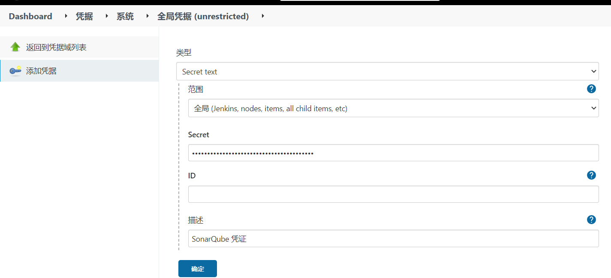

# Jenkins进阶

## jenkins代码审查

> SonarQuble是一个用于管理代码质量的开放平台，可以快速的定位代码中潜在或明显的错误，目前java、C、C++、javaScrip等二十几种编程语言的代码质量管理与检测
>
> 官网：https://www.sonarqube.org/

### 环境要求

> 使用SonarQuble需要准备如下环境
>
> JDK-1.8、Myslq-5.7、SonarQuble

### SonarQuble安装

[Liunx-安装SonarQuble](https://blog.csdn.net/weixin_44642403/article/details/122760681?spm=1001.2014.3001.5502)

### jenkins插件安装

> 在jenkins中需要安装`SonarQube Scanner`插件

### SonarQube Scanner安装

> 如果电脑未安装`SonarQube Scanner`那么在liunx安装上，如果已经按照了跳过该步骤，这里演示是使用Jenkins的自动安装，进入到`jenkins -> Manage Jenkins -> Global Tool Configuration`，找到SonarQube Scanner选项，选择一个版本让Jenkins自动安装

### Jenkins添加凭证

> Jenkins中需要添加上SonarQuble的凭证，这样往后使用时可以连接

**SonarQube凭证生成**

**jenkins添加凭证**

### jenkins环境配置

> 为jenkins需要配置上SonarQube 环境，这样Jenkins可以连接上SonarQube，进入到`jenkins -> Manage Jenkins -> Configure System`

### 非流水线项目的代码审查

> 非流水线项目，即自由风格和maven风格等项目，需要做代码生成时构建步骤

#### 添加构建

> 在原有的构建中添加`SonarQube Scanner`构建

#### 填写配置

> 填写完毕后保存即可

> 默认模板如下

~~~properties
#为当前检测的项目定义一个唯一标识
sonar.projectKey=freestyle_demo
# this is the name displayed in the SonarQube UI
sonar.projectName= freestyle_demo
sonar.projectVersion=1.0

#代码检查需要扫描什么目录"."表示扫描当前目录下所有的文件
sonar.sources=.
#排除扫描那些目录
sonar.exclusions=**/test/**,**/target/**

#jdk版本信息
sonar.java.source=1.8
sonar.java.target=1.8
sonar.java.binaries=./target/classes

#源码编码格式
sonar.sourceEncoding=UTF-8
~~~

#### 测试

> 项目构建完毕后，点击`SonarQube`可以查看代码审查情况

### 流水线项目的代码审查

#### 添加Sonar配置

> 流水线项目需要在项目目录下创建`sonar-project.properties`文件，文件名是固定的，该文件里面就代码审查的配置信息

#### Jenkinsfile编写

> 代码审查一般在代码检出后，或者构建完毕发布前进行审查

#### 测试

> 项目构建完毕后，点击`SonarQube`可以查看代码审查情况

## Docker集成

> 在更多的情况下，我们的Jenkins是需要使用docker完成部署的，以下集成docker中就演示了Jenkins是如何构建镜像，推送镜像，并且控制正式环境服务器拉取镜像和部署镜像

### 环境要求

> Docker、容器镜像仓库

### Docker安装

> Docker安装请阅读`Liunx-安装Docker`，如果需要学习如何使用docker那么请阅读`Docker专栏`

[Liunx-安装Docker](https://blog.csdn.net/weixin_44642403/article/details/114265278)

[Docker专栏](https://blog.csdn.net/weixin_44642403/category_11030715.html?spm=1001.2014.3001.5482)

### 容器镜像仓库

> 这里使用的是阿里云提供的镜像仓库服务，只需要注册一个阿里云账号，进入到控制台后搜索`容器镜像服务`，就可以免费申请镜像仓库仓库，可以将构建好的镜像上传到阿里云中在进行下载

> 创建命名空间

> 选择好相应的命名空间创建仓库

> 仓库完毕后，进入到仓库中可在操作指南中看到如何将镜像上传到阿里云中，以及如何下载

### Dockerfile编写

> 为了让项目更加方便的调用dockerfile文件，需要在项目的pom文件下引入`dockerfile-maven-plugin`插件，能够帮助读取项目的dockerfile文件并且构建出docker镜像

~~~xml
<plugin>
    <groupId>com.spotify</groupId>
    <artifactId>dockerfile-maven-plugin</artifactId>
    <configuration>
        <repository>${project.artifactId}</repository>
        <buildArgs>
            <JAR_FILE>target/${project.build.finalName}.jar</JAR_FILE>
        </buildArgs>
    </configuration>
</plugin>
~~~

> Dockerfile文件编写

~~~shell
FROM java:8
#参数来源dockerfile-maven-plugin插件中定义的
ARG JAR_FILE
COPY ${JAR_FILE} web.jar
#时区设置
RUN cp /usr/share/zoneinfo/Asia/Shanghai /etc/localtime && echo 'Asia/Shanghai' >/etc/timezone
#定义java启动参数
ENV JAVA_OPTS="Duser.timezone=Asia/Shanghai"
#暴露端口
EXPOSE 8001
ENTRYPOINT java ${JAVA_OPTS} -jar web.jar
~~~

### Jenkinsfile编写

> 由于编写的Jenkinsfile较长，中间的每一个流程都做了详细的说明，完整的Jenkinsfile在最后可以拷贝

#### 镜像构建

> 在编译构建步骤上最近一个参数`dockerfile:build`就会执行dockerfile文件构建镜像

#### 凭证信息创建

> 在前面容器镜像仓库中，已经创建了容器仓库了，那么需要`docker login`命令才能连接上阿里云的镜像仓库，所有需要往Jenkins添加凭证

> 添加一个账号+密码凭证

#### 登录远程镜像仓库

> 让docker连接远程仓库，那么需要使用`docker login --username=xx --passwrod=xx 远程仓库地址`命令，那么就需要将前面创建好的凭证中的用户名与密码作为参数的方式获取出来

#### 推送镜像到远程仓库

> 为了方便使用在执行的最前面添加一些变量，`eenvironment`保存的正是变量

> 使用`docker tag`对镜像打上标签，`docker push`将打了标签的镜像推送到远程镜像仓库，最后删除掉本地的标签与构建好的镜像

#### 远程发布

> 远程发布需要利用Jenkinsfile，控制一台远程服务器进行镜像的拉取并且发布，那么需要控制例外一台服务器就需要利用到ssh连接，Jenkins需要使用ssh连接上远程服务器编写操作它拉取镜像，发布

**密钥配置**

> 要想Jenkins使用ssh连接到远程服务器那么首先需要进行凭证的添加，这里演示的是使用密钥方式，首先需要将Jenkins的公钥发送到远程服务器上

**脚本编写**

> 配置密钥完毕后，Jenkins就可以使用`ssh -t -p 22 root@192.168.100.103`服务到远程服务器了，使用ssh命令发送远程shell指令给部署服务器完成，镜像拉取、docker部署

#### 完整脚本

~~~shell
pipeline {
    agent any
    environment {
        IMAGE     = 'demo'
        IMAGE_VERSION     = '1.4'
        SSH_HOST ='ssh -t -p 22 root@192.168.100.103'
    }
    stages {
        stage('拉取源代码') {
            steps {
                checkout([$class: 'GitSCM', branches: [[name: '*/${branch}']], extensions: [], userRemoteConfigs: [[credentialsId: '2f1f287b-0849-41bd-acb3-8db69bbc13ea', url: 'git@gitee.com:smallpage/jenkins-test01.git']]])
            }
        }
        stage('编译构建项目') {
            steps {
                sh 'echo ‘编译项目...’'
                sh 'mvn clean package dockerfile:build'
            }
        }
        stage('登录远程镜像仓库') {
            steps {
                sh 'echo ‘登录...’'
                withCredentials([usernamePassword(credentialsId: '0aa9b17f-1b9e-430c-bfd8-2ba95273f1ad', passwordVariable: 'password', usernameVariable: 'username')]) {
                    sh 'docker login --username=${username} --password=${password} registry.cn-beijing.aliyuncs.com'
                }
            }
        }
        stage('推送到镜像仓库') {
            steps {
                sh 'echo ‘添加镜像...’'
                sh 'docker tag $(docker images | grep ${IMAGE} | awk \'{print $3}\') registry.cn-beijing.aliyuncs.com/jolyoulu-public-repository/jenkins_test:${IMAGE_VERSION}'
                sh 'echo ‘推送镜像...’'
                sh 'docker push registry.cn-beijing.aliyuncs.com/jolyoulu-public-repository/jenkins_test:${IMAGE_VERSION}'
                sh 'echo ‘删除镜像...’'
                sh 'docker rmi registry.cn-beijing.aliyuncs.com/jolyoulu-public-repository/jenkins_test:${IMAGE_VERSION}'
                sh 'docker rmi ${IMAGE}'
            }
        }
        stage('控制远程服务器完成发布') {
            steps {
                sh 'echo ‘登录...’'
                withCredentials([usernamePassword(credentialsId: '0aa9b17f-1b9e-430c-bfd8-2ba95273f1ad', passwordVariable: 'password', usernameVariable: 'username')]) {
                    sh '${SSH_HOST} docker login --username=${username} --password=${password} registry.cn-beijing.aliyuncs.com'
                }
                sh 'echo ‘拉取镜像...’'
                sh '${SSH_HOST} docker pull registry.cn-beijing.aliyuncs.com/jolyoulu-public-repository/jenkins_test:${IMAGE_VERSION}'
                sh 'echo ‘删除旧容器...’'
                catchError(message: '') {
                    sh '${SSH_HOST} docker rm -f ${IMAGE}'
                }
                sh 'echo ‘启动容器...’'
                sh '${SSH_HOST} docker run -d -p 8001:8001  --name ${IMAGE} registry.cn-beijing.aliyuncs.com/jolyoulu-public-repository/jenkins_test:${IMAGE_VERSION}'
            }
        }
    }
    //构建以后的行为
    post {
        always {
            emailext body: '${FILE,path="email.html"}',subject: '构建通知：${ENV, var="JOB_NAME"}-第${BUILD_NUMBER}次构建日志',to: 'luzhoujin@fenzhidao.com,1139219074@qq.com'
        }
    }

}
~~~

