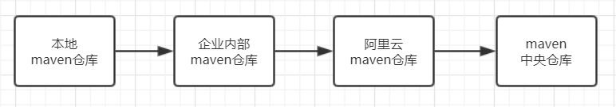
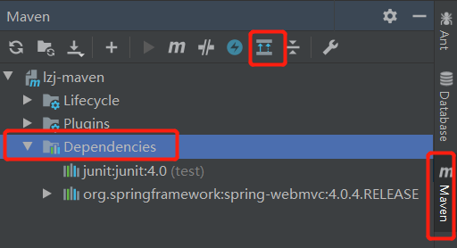
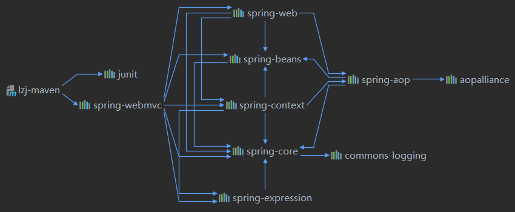
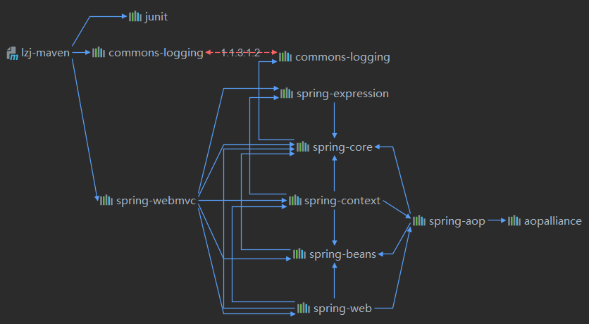
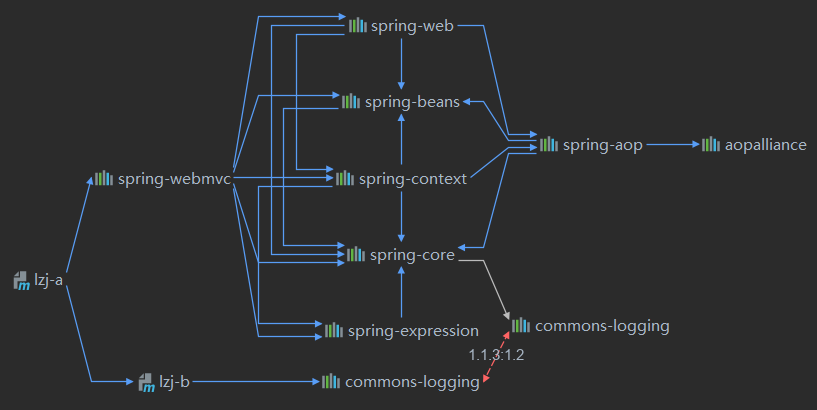
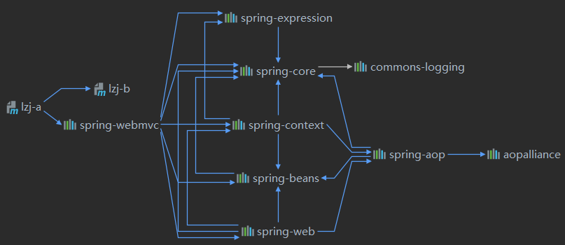

# Maven基本概念与核心配置

1. maven基本概念
2. maven核心配置

## 一、maven 安装与核心概念

概要：

1. mave安装
2. maven编译（compile）
3. 执行测试用例（test）
4. maven打包
5. maven依赖管理

### 1、安装

1. 官网下载Maven（ https://maven.apache.org/download.cgi ）
2. 解压指定目录
3. 配置环境变量
4. 检查安装是否成功（mvn -version）

maven是什么？它的基本功能是什么？编译、打包、测试、依赖管理直观感受一下maven编译打包的过程。

### 2、maven编译

maven编译过程演示

* 创建maven项目
* 创建src文件
* 编写pom文件
* 执行编译命令

编写pom文件基础配置

~~~xml
<project xmlns="http://maven.apache.org/POM/4.0.0"
  xmlns:xsi="http://www.w3.org/2001/XMLSchema-instance"
  xsi:schemaLocation="http://maven.apache.org/POM/4.0.0
                      http://maven.apache.org/xsd/maven-4.0.0.xsd">
  <modelVersion>4.0.0</modelVersion>
 
  <groupId>org.codehaus.mojo</groupId>
  <artifactId>my-project</artifactId>
  <version>1.0.SNAPSHOT</version>
</project>
~~~

~~~shell
#mvn 编译命令
mvn compile
~~~

当我们运行了编译命令后，请注意，在上述配置和命令当中，我们并没有指定源码文件在哪里？最后编译到哪里去？在这里

maven 采用了约定的方式从指项目结构中获取源码与资源文件进行编译打包。

1. 主源码文件：${project}/src/main/java
2. 主资源文件：${project}/src/main/resources
3. 测试源码文件：${project}/src/test/java
4. 测试资源文件：${project}/src/test/resources

### 3、Maven打包

~~~shell
#mvn 打包命令
mvn package
~~~

当我们执行打包命令，前不需要执行编译命令，只要执行打包命令后maven就会自动编译并且打包

### 4、maven单元测试

小案例

~~~shell
编译测试类
# 创建测试目录
mkdir -p /src/test/java
# 编写 测试类
vim TestHello.java
#测试类代码------------------------
package com.test.tuling;
public class TestHello{
        public void sayHelloTest(){
                System.out.println("run test .....");
        }
}
执行测试指令:
#执行测试
mvn test

~~~

执行完指令发现没有执行我们的测试方法，这是为何？原因在于maven 当中的测试类又做了约定，约定必须是Test开头的类名与test 开头的方法才会执行。

~~~shell
#重新修改方法名后 在执行mvn test 即可正常执行。
package com.test.tuling;
public class TestHello{
        public void testsayHelloTest(){
                System.out.println("run test .....");
        }
}

~~~

 通常测试我们是通过junit 来编译测试用例，这时就就需添加junit 的依赖。  

### 5、maven 依赖管理

* 在pom 文件中添加junit 依赖

* 修改测试类，加入junit 代码

* 执行测试命令

加入依赖

~~~xml
<dependencies>
<dependency>
  <groupId>junit</groupId>
  <artifactId>junit</artifactId>
  <version>4.0</version>
  <scope>test</scope>
</dependency>
</dependencies>
~~~

~~~java
//修改测试类引入junit 类.
//引入junit 类
import org.junit.Assert;
import org.junit.Test;
Assert.assertEquals("","hi");
注意：当我们在classPath 当中加入 junit ，原来以test 开头的方法不会被执行，必须加入 @Test注解才能被执行。

~~~

大家可以发现为什么我加一个依赖，包可以直接imp了呢，junit jar包在哪里？是怎么加入到classPath 当中去的？maven 是在执行test 命令的时间 动态从本地仓库中去引入junit jar 包，如果找不到就会去远程仓库下载，一层一层的找然后在引入。

默认远程仓库：

由于maven远程仓库默认的中央仓库是Maven central在美国所以下载jar包会很慢，我们可以通过修改配置文件修改maven仓库，配置文件位置

~~~xml
<!--\apache-maven-3.6.1-bin\apache-maven-3.6.1\conf下有一个settings.xml文件-->
<!--修改jar保存位置默认在c盘的 .m2/respository下-->
<localRepository>D:\maven-jar</localRepository>
<!--修改远程仓库为阿里云远程仓库-->
<mirror>  
    <id>alimaven</id>  
    <name>aliyun maven</name>  
    <url>http://maven.aliyun.com/nexus/content/groups/public</url>  
    <mirrorOf>central</mirrorOf>          
</mirror>
~~~

## 二、maven核心配置

摘要：

1. 项目依赖（内部，外部）
2. 项目聚合与继承
3. 项目构建配置

### 项目依赖

项目依赖是指maven通过依赖传播、依赖优先原则、可选依赖、排除依赖、依赖范围等待性来管理项目ClassPath

#### 1、依赖传播特性：

我们的项目常常会依赖很多第三方的组件，比如spring springmvc等这些组件他们又会依赖其它主键，maven会将依赖网络中所有的节点加入ClassPath中，这就是maven的依赖传播特性。

小案例

~~~xml
<!--引入springmvc依赖-->
<dependency>
    <groupId>org.springframework</groupId>
    <artifactId>spring-webmvc</artifactId>
    <version>4.0.4.RELEASE</version>
</dependency>
~~~

idea查看依赖树

我们可以从依赖图中看出，当我们引入spring-webmvc包后我们还引入了spring-web，spring-beans等组件，这里类似java继承，这就是依赖的传播性

#### 2、依赖优先原则

基于依赖传播性，会导致整个依赖网络很复杂，比如我引入了一个spring-webmvc包，他会引用commons-logging的包，那我自己手动引用一个commons-logging会怎么样呢，maven会怎么选择呢

第一原则：最短路径优先。

第二原则：相同路径下配置在前的优先。

小案例 演示第一原则（最短路径优先）

~~~xml
<!--引入commons-logging包-->
<dependency>
    <groupId>commons-logging</groupId>
    <artifactId>commons-logging</artifactId>
    <version>1.2</version>
</dependency>
~~~

大家可以看到当我引入了commons-logging包后在看网络图会发现我们的项目直接指向了我刚刚导入的commons-logging包。

小案例 演示第二原则（相同路径下配置在前的优先）

我们创建一个父工程，其中有2个子工程一个A工程，一个B工程，A工程依赖B工程，A工程中依赖spring-webmvc，B工程依赖了commons-logging，maven最后会选择spring-webmvc的commons-logging还是B工程的commons-logging呢

~~~xml
<!--A工程 依赖B工程 依赖spring-webmvc-->
<dependencies>
    <dependency>
        <groupId>lzj</groupId>
        <artifactId>lzj-b</artifactId>
        <version>1.0.SNAPSHOT</version>
    </dependency>
    <dependency>
        <groupId>org.springframework</groupId>
        <artifactId>spring-webmvc</artifactId>
        <version>4.0.4.RELEASE</version>
    </dependency>
</dependencies>
~~~

~~~xml
<!--B工程依赖commons-logging-->
<dependencies>
    <dependency>
        <groupId>commons-logging</groupId>
        <artifactId>commons-logging</artifactId>
        <version>1.2</version>
    </dependency>
</dependencies>
~~~

我们可以发现maven选择了B工程是commons-logging包没有选择spring-webmvc的包

#### 3、可选依赖

可选依赖表示这个依赖不是必须的。通过在 <dependency> 添  <optional>true</optional> 表示，默认是不可选的。可选依赖不会被传递。

小案例

~~~xml
<!--把B工程的commons-logging包 加上<optional>true</optional> -->
<dependencies>
    <dependency>
        <groupId>commons-logging</groupId>
        <artifactId>commons-logging</artifactId>
        <version>1.2</version>
        <optional>true</optional>
    </dependency>
</dependencies>
~~~

我们在查看网络图可以发现maven没有选择B工程的commons-logging依赖，因为我们标注他不是必须依赖

#### 4、排除依赖

即排除指定的间接依赖。通过配置 <exclusions> 配置排除指定组件。

小案例

~~~xml
<dependency>
    <groupId>lzj</groupId>
    <artifactId>lzj-b</artifactId>
    <version>1.0.SNAPSHOT</version>
    <!--排除B工程中的commons-logging依赖-->
    <exclusions>
        <exclusion>
            <groupId>commons-logging</groupId>
            <artifactId>commons-logging</artifactId>
        </exclusion>
    </exclusions>
</dependency>
~~~

在看网络图我们可以发现没有引用B工程下的commons-logging依赖了

#### 5、依赖范围

像junit 这个组件 我们只有在运行测试用例的时候去要用到，这就没有必要在打包的时候把junit.jar 包过构建进去，可以通过Mave 的依赖范围配置<scope>来达到这种目的。maven 总共支持以下四种依赖范围：

~~~xml
<!--compile（默认）编译范围，编译和打包都会依赖-->
<scope>compile</scope>
<!--提供范围，编译时依赖，但不会打包进去。如：servlet-api.jar在tomcat中已经有了所以不需要编译-->
<scope>provided</scope>
<!--运行时范围，打包时依赖，编译不会。如：mysql-connector-java.jar-->
<scope>runtime</scope>
<!--测试范围，编译运行测试用例依赖，不会打包进去。如：junit.jar-->
<scope>test</scope>
~~~

小案例

~~~xml
<!-- system 的通常使用方式-->
<dependency>
    <groupId>com.sun</groupId>
    <artifactId>tools</artifactId>
    <version>${java.version}</version>
    <scope>system</scope>
    <optional>true</optional>
    <systemPath>${java.home}/../lib/tools.jar</systemPath>
</dependency>

<!-- system 另外使用方式 ,将工程内的jar直接引入 -->
<dependency>
    <groupId>jsr</groupId>
    <artifactId>jsr</artifactId>
    <version>3.5</version>
    <scope>system</scope>
    <optional>true</optional>
    <systemPath>${basedir}/lib/jsr305.jar</systemPath>
</dependency>
<!-- 通过插件 将system 的jar 打包进去。 -->
<plugin>
    <groupId>org.apache.maven.plugins</groupId>
    <artifactId>maven-dependency-plugin</artifactId>
    <version>2.10</version>
    <executions>
        <execution>
            <id>copy-dependencies</id>
            <phase>compile</phase>
            <goals>
                <goal>copy-dependencies</goal>
            </goals>
            <configuration>
<outputDirectory>${project.build.directory}/${project.build.finalName}/WEB-INF/lib</outputDirectory>
                <includeScope>system</includeScope>
                <excludeGroupIds>com.sun</excludeGroupIds>
            </configuration>
        </execution>
    </executions>
</plugin>

~~~

### 项目聚合与继承

#### 1、聚合

是指将多个模块整合在一起，统一构建，避免一个一个的构建。聚合需要个父工程，然后使用 <modules> 进行配置其中对应的是子工程的相对路径  

~~~xml
<!--lzj-maven父工程聚合了lzj-a和lzj-b子工程-->
<groupId>lzj</groupId>
  <artifactId>lzj-maven</artifactId>
  <packaging>pom</packaging>
  <version>1.0.SNAPSHOT</version>
  <modules>
    <module>lzj-a</module>
    <module>lzj-b</module>
  </modules>
~~~

#### 2、继承

1. 属性继承

   ~~~xml
   <!--子工程可以使用lzj-maven父工程的lzj.name的属性值-->
   <properties>
       <lzj.name>LZJ</lzj.name>
   </properties>
   ~~~

2. 依赖继承

   ~~~xml
   <!--lzj-maven父工程依赖的jar包只有子工程声明了才可以使用子-->
   <dependency>
           <groupId>org.springframework</groupId>
           <artifactId>spring-webmvc</artifactId>
           <version>4.0.4.RELEASE</version>
   </dependency>
   ~~~

#### 3、依赖管理

通过继承的特性，子工程是可以间接依赖父工程的依赖，但多个子工程依赖有时并不一至，这时就可以在父工程中加入 <dependencyManagement> 声明该功程需要的JAR包，然后在子工程中引入。

~~~xml
<!--lzj-maven父工程依赖的jar包只有子工程声明了才可以使用子-->
<dependencyManagement>
    <dependency>
        <groupId>org.springframework</groupId>
        <artifactId>spring-webmvc</artifactId>
        <version>4.0.4.RELEASE</version>
    </dependency>
</dependencyManagement>
~~~

### 项目构建配置

~~~xml
<resources>
   <resource>
      <directory>src/main/java</directory>
      <includes>
         <include>**/*.MF</include>
         <include>**/*.XML</include>
      </includes>
      <filtering>true</filtering>
   </resource>
   <resource>
      <directory>src/main/resources</directory>
      <includes>
         <include>**/*</include>
         <include>*</include>
      </includes>
      <filtering>true</filtering>
   </resource>
  </resources>
~~~

resources，build过程中涉及的资源文件

 **targetPath**，资源文件的目标路径

**directory**，资源文件的路径，默认位于${basedir}/src/main/resources/目录下

**includes**，一组文件名的匹配模式，被匹配的资源文件将被构建过程处理

**excludes**，一组文件名的匹配模式，被匹配的资源文件将被构建过程忽略。同时被includes和excludes匹配的资源文件，将被忽略。

**filtering**： 默认false ，true 表示 通过参数 对 资源文件中 的${key} 在编译时进行动态变更。替换源可 紧 -Dkey 和pom 中的<properties> 值 或 <filters> 中指定的properties 文件。