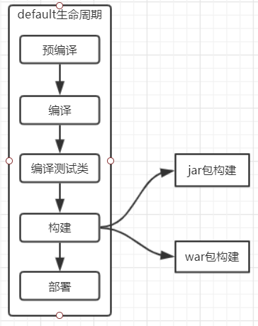
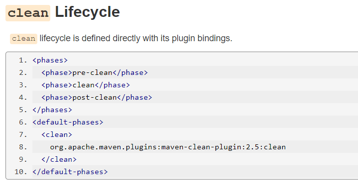
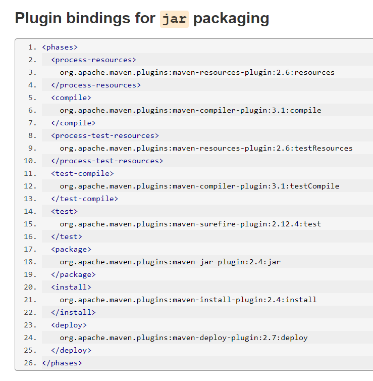
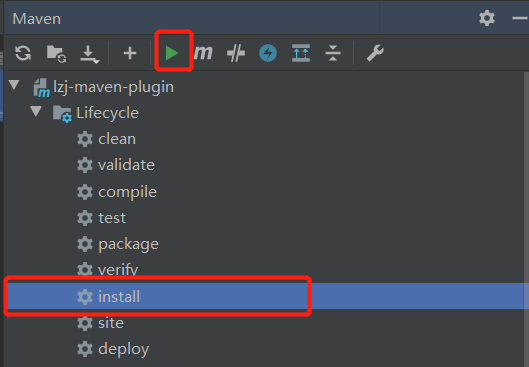

# Maven私服构建与插件开发

## 一、maven生命周期

知识点概要：

1. 生命周期的概念与意义
2. maven三大生命周期与其对应的phase（阶段）
3. 生命周期与插件的关系
4. 生命周期与默认插件的绑定

### 1、生命周期的概念与意义

在项目构建时通常会包含清理、编译、测试、打包、验证、部署、文档生成等步骤，maven统一对其进行了整理抽象成三个生命周期（ilfecycle）及各自对应的多个阶段（phase）。这么做的意义是：

1. 每一个阶段都成为一个扩展点，可以采用不同的方式来实现，提高了扩展性与灵活性。
2. 规范统一了maven的执行路径。

在执行项目构建阶段是可以采用jar方式构建也可以采用war包方式构建提高了灵活性。我们可以通过mvn$(phase name)直接触发指定阶段的执行如：

演示phase的执行

~~~shell
#执行清理phase
mvn clean
#执行compile phase
mvn compile
#也可以同时执行 清理加编译
mvn clean comile
~~~

### 2、maven三大生命周期与对应的phase（阶段）

maven 总共包含三大生生命周期

1. clean Lifecycle ：清理生命周期，用于于清理项目

2. default Lifecycle：默认生命周期，用于编译、打包、测试、部署等

3. site Lifecycle 站点文档生成，用于构建站点文档

   

clean Lifecycle

~~~shell
#阶段(phase)
pre-clean		#预清理
clean			#清理
post-clean		#清理之后
~~~

default Lifecycle

~~~shell
#阶段(phase)
validate				#验证
initialize				#初始化
generate-sources	
process-sources	
generate-resources	
process-resources	
compile					#编译
process-classes	
generate-test-sources	
process-test-sources	
generate-test-resources	
process-test-resources	
test-compile			#编译测试类
process-test-classes	
test					#执行测试
prepare-package			#构建前准备
package					#打包构建
pre-integration-test	
integration-test	
post-integration-test	
verify					#验证
install					#上传到本地仓库
deploy					#上传到远程仓库
~~~

site Lifecycle

~~~shell
#阶段(phase)
pre-site		#准备构建站点
site			#构建站点
post-site		#构建站点之后
site-deploy	 	#站点部署

~~~

在生命周期里，是有严格执行的顺序的，比如你要执行pakcage阶段前必须是先执行完compile先，当你没有compile直接pakcage，在pakcage前面的阶段会自动执行

小案例

~~~shell
# 执行编译
mvn compile
# 执行打包
mvn package
# 清理项目
mvn clean
# 直接执行打包就包含了编译指令的执行
mvn package
~~~

通过上面案例会发现我不执行compile阶段直接执行package阶段我的项目仍然可以进行打包，因为在我们执行package阶段前maven自动执行了在package阶段前需要执行的全部阶段

### 3、生命周期与插件的关系

什么是插件？当我们执行mvn compile或者mvn package这些阶段时是如何实现的呢？这些阶段谁来实现呢？这就是插件，maven的核心代码其实很少，大部分实现都是由插件来完成的。

 https://maven.apache.org/ref/3.6.2/maven-core/lifecycles.html 我们可以去maven官网看看每一个阶段的插件

这是我们用的clean命令其实他是由 org.apache.maven.plugins:maven-clean-plugin:2.5:clean 插件实现的

这是我们用的打包jar命令我们可以发现这里面用到了不止一个插件，从中我们可以得出一个阶段可以使用多个插件，当我们执行packege时插件会从上往下依次执行到packege

总结：

​	生命周期的阶段可以绑定具体的插件及目标

​	同一个阶段可以对应多个插件和目标

​	phase（阶段）==》plugin（插件）==》goal（实现）

### 4、生命周期与插件的默认绑定

既然执行每一个阶段需要插件，为什么我们不用配置任何插件就可以执行了呢，其实maven都有一些默认的绑定插件我们

就拿clean来举例子，clean中有3个命令 pre-clean clean post-clean我们可以看到这3个命令只有clean绑定了插件所以只有clean是有用的 pre-clean命令其实是没反应的，但是没有任何插件绑定的post-clean执行之后会有反应呢，因为每一个阶段是生命周期都是严格按照顺序执行的在执行post-clean之前许先执行pre-clean和clean所以执行post-clean就会把项目clean

那么这些插件配置在哪里呢？

apache-maven-3.6.1\maven-core-3.6.1.jar\lib\META-INF\plexus\default-bindings.xml

## 二、maven自定义插件开发

知识点：

1. 插件的相关概念
2. 常用插件的使用
3. 开发一个自定义插件

### 1、maven插件相关概念

插件坐标定位：

插件和普通jar包一样包含 一组坐标定位属性

groupId、artifactId、version，当使用该插件时会从本地仓库中搜索，如果没有即从远程仓库下载

~~~xml
<!-- 唯一定位到dependency 插件 -->
<groupId>org.apache.maven.plugins</groupId>
<artifactId>maven-dependency-plugin</artifactId>
<version>2.10</version>
~~~

**插件执行 execution：**

execution 配置包含一组指示插件如何执行的属性：

**id** ： 执行器命名

**phase**：在什么阶段执行？

**goals**：执行一组什么目标或功能？

**configuration**：执行目标所需的配置文件？

小案例

~~~xml
<!--将插件依赖拷贝到指定目录-->
<plugin>
    <groupId>org.apache.maven.plugins</groupId>
    <artifactId>maven-dependency-plugin</artifactId>
    <version>3.1.1</version>
    <executions>
        <execution><!--配置执行-->
            <id>copy-dep</id>
            <phase>package</phase><!--当执行到package阶段触发goals-->
            <goals><!--触发的内容-->
                <goal>copy-dependencies</goal>
            </goals>
            <configuration><!--配置拷贝的目录-->        					<outputDirectory>${project.build.directory}/alternateLocation</outputDirectory>
                <overWriteReleases>false</overWriteReleases>
                <overWriteSnapshots>true</overWriteSnapshots>
                <excludeTransitive>true</excludeTransitive>
            </configuration>
        </execution>
    </executions>
</plugin>
~~~

### 2、常用插件的使用

除了通过配置的方式使用插件以外，Maven也提供了通过命令直接调用插件目标其命令格式如下：

~~~shell
mvn groupId:artifactId:version:goal -D{参数名}
~~~

如果使用maven原生的插件则可以简化书写

~~~shell
# 展示pom的依赖关系树
mvn org.apache.maven.plugins:maven-dependency-plugin:2.10:tree
# 也可以直接简化版的命令，但前提必须是maven 官方插件
mvn dependency:tree
~~~

其它常用插件

~~~shell
# 查看pom 文件的最终配置 
mvn help:effective-pom
# 原型项目生成
archetype:generate
#快速创建一个WEB程序
mvn archetype:generate -DgroupId=xxx -DartifactId=xxx -DarchetypeArtifactId=maven-archetype-webapp -DinteractiveMode=false
#快速创建一个java 项目
mvn archetype:generate -DgroupId=xxx -DartifactId=xxx -DarchetypeArtifactId=maven-archetype-quickstart -DinteractiveMode=false
~~~

### 3、开发自定义插件

实现步骤：

* 创建maven 插件项目

* 设定packaging 为maven-plugin

* 添加插件依赖

* 编写插件实现逻辑

* 打包构建插件

~~~xml
<!--新建一个项目-->
<?xml version="1.0" encoding="UTF-8"?>
<project xmlns="http://maven.apache.org/POM/4.0.0"
         xmlns:xsi="http://www.w3.org/2001/XMLSchema-instance"
         xsi:schemaLocation="http://maven.apache.org/POM/4.0.0 http://maven.apache.org/xsd/maven-4.0.0.xsd">
    <modelVersion>4.0.0</modelVersion>
    
    <groupId>lzj</groupId>
    <artifactId>lzj-maven-plugin</artifactId>
    <version>1.0-SNAPSHOT</version>
    <packaging>maven-plugin</packaging><!--设为插件项目-->

    <dependencies>
        <dependency>
            <groupId>org.apache.maven</groupId>
            <artifactId>maven-plugin-api</artifactId>
            <version>3.0.3</version>
        </dependency>
        <dependency>
            <groupId>org.apache.maven.plugin-tools</groupId>
            <artifactId>maven-plugin-annotations</artifactId>
            <version>3.1</version>
        </dependency>
    </dependencies>

</project>
~~~

~~~java
/**
 * @Author: LZJ
 * @Date: 2019/11/20 22:49
 * @Version 1.0
 */
@Mojo(name = "lzj") //goal名称
public class LuzjPlugin extends AbstractMojo { //继承AbstractMojo
    @Parameter //需要传入参数
    String sex;
    @Parameter //需要传入参数
    String describe;
    public void execute() throws MojoExecutionException, MojoFailureException {
        getLog().info(String.format("lzj sex=%s,describe=%s",sex,describe)); //打印
    }
}
~~~

运行install把插件 装入maven本地仓库

~~~xml
<!--在项目里使用插件-->
<build>
    <plugins>
        <plugin>
            <!--插件版本-->
            <groupId>lzj</groupId>
            <artifactId>lzj-maven-plugin</artifactId>
            <version>1.0-SNAPSHOT</version>
            <executions>
                <execution>
                    <id>print-info</id>
                    <phase>compile</phase><!--在那个阶段触发-->
                    <goals>
                        <goal>lzj</goal><!--goal名称-->
                    </goals>
                    <configuration><!--传入参数-->
                        <sex>man</sex>
                        <describe>good</describe>
                    </configuration>
                </execution>
            </executions>
        </plugin>
    </plugins>
</build>
~~~

## 三、nexus 私服搭建与核心功能

知识点概要:

1. 私服的使用场景

2. nexus 下载安装

3. nexus 仓库介绍

4. 本地远程仓库配置

5. 发布项目至nexus 远程仓库

6. 关于SNAPSHOT(快照)与RELEASE(释放) 版本说明

### 1、私服使用场景

​	私服使用场景如下：

1. 公司不能连接公网，可以用一个私服务来统一连接

2. 公司内部jar 组件的共享

### nexus 下载安装

nexus 下载地址：

https://sonatype-download.global.ssl.fastly.net/nexus/oss/nexus-2.14.5-02-bundle.tar.gz

解压并配置环境变量

~~~shell
#解压
tar -zxvf nexus-2.14.5-02-bundle.tar.gz
#在环境变量当中设置启动用户
vim /etc/profile
#添加profile文件。安全起见不建议使用root用户，如果使用其它用户需要加相应权限
export RUN_AS_USER=root
#读取并执行
source /etc/profile
~~~

配置启动参数

~~~shell
 vi ${nexusBase}/conf/nexus.properties
 #端口号
 application-port=9999
启动与停止nexus
#启动
 ${nexusBase}/bin/nexus start
#停止
  ${nexusBase}/bin/nexus stop
登录nexus 界面
地址：http://{ip}:9999/nexus/
用户名:admin
密码：admin123
~~~

### 3、仓库介绍

3rd party：第三方仓库

Apache Snapshots：apache 快照仓库

Central: maven 中央仓库

Releases：私有发布版本仓库

Snapshots：私有 快照版本仓库

### 4、本地远程仓库配置

~~~xml
<!--在pom 中配置远程仓库-->
<repositories>
    <repository>
        <id>nexus-public</id>
        <name>my nexus repository</name>
		<url>http://192.168.0.147:9999/nexus/content/groups/public/</url>
    </repository>
</repositories>
<!--或者在settings.xml 文件中配置远程仓库镜像 效果一样，但作用范围广了-->
<mirror>        
  <id>nexus-aliyun</id>
        <mirrorOf>*</mirrorOf>
        <name>Nexus aliyun</name>
  		<url>http://192.168.0.147:9999/nexus/content/groups/public/</url>
</mirror> 

~~~

### 5、发布项目至nexus 远程仓库  

~~~xml
<!--配置仓库地址-->
<distributionManagement>
    <repository>
        <id>nexus-release</id>
        <name>nexus release</name>
        <url>http://192.168.0.147:9999/nexus/content/repositories/releases/</url>
    </repository>
    <snapshotRepository>
        <id>nexus-snapshot</id>
        <name>nexus snapshot</name>
        <url>http://192.168.0.147:9999/nexus/content/repositories/snapshots/</url>
    </snapshotRepository>
</distributionManagement>
<!--设置 setting.xml 中设置server-->
<server>
      <id>nexus-snapshot</id> <!--id要和你项目中的pom中id一致-->
      <username>deployment</username>
      <password>deployment123</password>
    </server>
<server>
      <id>nexus-release</id> <!--id要和你项目中的pom中id一致-->
      <username>deployment</username>
      <password>deployment123</password>
    </server>

~~~

执行deploy 命令

mvn deploy