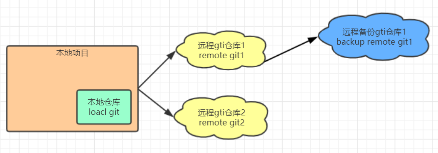
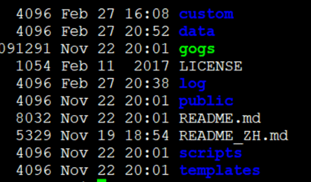
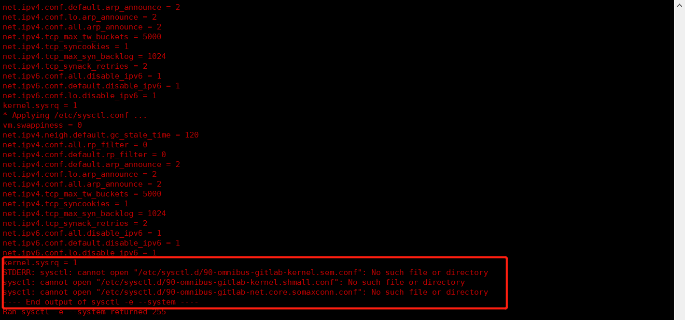
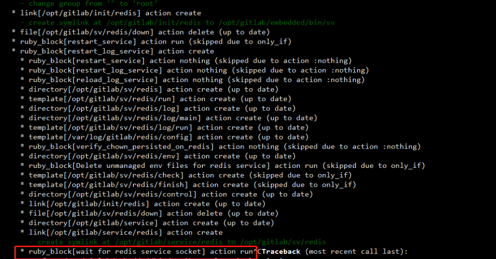

# 搭建企业私有Git服务

## GIT服务器搭建方式

在成长之路1文章中我们讲过GIT是一个分布式版本的管理系统，既然是分布式那么必定会涉及到远程通信，那么GIT是采用什么协议进行远程通信呢？

git支持的四种通信协议：

1. Local（本地协议）
2. ssh
3. http（Dumb、Smart）
4. git

### Local（本地协议）

> 基于本地文件系统或共享（NFS）文件系统进行访问，
>
> **优点：**简单，直接使用了现有文件权限和网络访问权限，小团队小项目建立一个这样的版本管理系统是非常轻松的一件事。
>
> **缺点：**这种协议缺陷就是本身共享文件系统的局限，只能在局域网，而且速度也慢。
>
> **场景：**小团队，小项目临时搭建版本服务。

**小案例**

~~~shell
# 在同一个局域网下 搭建一个git私服
git init --bare test01
# 从本地 项目路径克隆项目
git clone /ip地址/项目路径/  test02 #命名test02
# 基于file 协议克隆本地项目
git clone file:///ip地址/项目路径/ test03
~~~

> 以上练习大家会发现在创建仓库中多了一个 --bare 这个命令加上这个命令创建的仓库直接创建.git目录下的文件，大家可以试试创建2个项目一个用git init一个用git init --bare就知道其中的区别了。
>
> 以上练习中克隆有2种方式他们的区别是什么呢，如果在url开头明确指定了file://,会和直接使用url访问有略微不同，如果直加使用url访问git会直接复制所以需要的文件（理解为这个文件夹区别拷贝下来），如果指定file://，git会触发平时用于网络传输资料的进程，传输过来的是打包好的文件，更节约空间。

### ssh协议

> git支持利用ssh协议进行通信，这是绝大部分的linux、uninx系统都支持的，所以使用该协议搭建的git服务是很方便的
>
> **优点：**SSH架设相对简单、通过SSH访问是安全的、而且SSH协议很高效，在传输前会尽量压缩数据。
>
> **缺点：**权限体系不灵活，必须提供操作系统的账户密码，哪怕只是读取版本
>
> **场景：**小团队，小项目临时搭建版本服务。

**Linux 安装git服务**

~~~shell
# 1.安装依赖环境
yum -y install curl-devel expat-devel gettext-devel openssl-devel zlib-devel gcc perl-ExtUtils-MakeMaker

# 2.下载并解压源码
$ wget https://github.com/git/git/archive/v2.3.0.zip
# 备用下载链接: https://pan.baidu.com/s/1czwEz8 密码: y3hn
$ unzip v2.3.0.zip
$ cd git-2.3.0

#3 编译 安装（如果没有权限就加上sudo）
make prefix=/usr/local/git all
make prefix=/usr/local/git install

#4、添加环境变量
vim /etc/profile
export PATH=/usr/local/git/bin:$PATH
source /etc/profile

#如果成功显示版本号表示添加成功
git --version
git version 2.3.0

#创建一个祼项目
git --bare init luban.git
~~~

本地电脑克隆Linux种的git项目

~~~shell
#本地基于远程克隆仓库
git clone root@ip地址:/项目目录
~~~

### http（Dumb、Smart）

> Git http 协议实现是依懒 WEB容器(apache、nginx)及cgi 组件进行通信交互，并利用WEB容器本身权限体系进行授权验证。在 Git 1.6.6 前只支持http Dumb（哑）协议，该协议只能下载不能提交，通常会配合ssh 协议一起使用，ssh 分配提交帐号，http dumb提供只读帐号。1.6.6 之后git 提供了git-http-backend 的 CGI 用于实现接收远程推送等功能。
>
> **优点：**解决了local 与ssh 权限验证单一的问题、可基于http url 提供匿名服务，从而可以放到公网上去。而local 与ssh 是很难做到这一点,必如实现一个类似github 这样的网站。
>
> **缺点：**架设复杂一些需要部署 WEB服务器，和https 证书之类的配置
>
> **场景：**大型团队、需要对权限精准控制、需要把服务部署到公网上去

**小案例**

~~~shell
#创建服务端版本仓库
git init --bare test01
# 版本更新钩子，当有版本提交的时候会执行更新
cd test01/hooks/mv 
# 启动钩子
mv post-update.sample post-update
# 打包项目索引 打包了才能访问
git update-server-info
~~~

nginx静态访问配置

~~~shell
server {
        listen       80;
        server_name  git.test01.com;
        location / {
            root  /data/test01;
        }
}
~~~

本地克隆远程服务

~~~shell
git clone http://git.test01.com/test01
~~~

### GIT协议

> Git 协议是包含在 Git 里的一个特殊的守护进程相当于svn一直开着一个进程；它监听在一个特定的端口（9418），类似于 SSH 服务，但是访问无需任何授权。
>
> **优点：**目前，Git 协议是 Git 使用的网络传输协议里最快的。 如果你的项目有很大的访问量，或者你的项目很庞大并且不需要为写进行用户授权，架设 Git 守护进程来提供服务是不错的选择。 它使用与 SSH 相同的数据传输机制，但是省去了加密和授权的开销。
>
> **缺点：**Git 协议缺点是缺乏授权机制。 而且9418是一个非标准端口，一般防火墙不会开放。

**小案例**

~~~shell
# 进入git项目
cd test01/
# 创建一个空文件，表示开放该项目
touch git-daemon-export-ok
# 在后台 启动守护进程
$nohub git daemon --reuseaddr --base-path=/data/test01/ /data/test01/ &
#本地克隆远程项目
git clone git://ip:9418/test01

~~~

## Gogs

Gogs 是一款开源的轻量级Git web服务，其特点是简单易用完档齐全、国际化做的相当不错。其主要功能如下:

1. 提供Http 与ssh 两种协议访问源码服务

2. 提供可WEB界面可查看修改源码代码

3. 提供较完善的权限管理功能、其中包括组织、团队、个人等仓库权限

4. 提供简单的项目viki功能

5. 提供工单管理与里程碑管理。

### Gogs安装

#### 下载相关文件

> 官网：https://gogs.io
>
> 下载：https://gogs.io/docs/installation 选择 linx amd64 下载安装
>
> 文档：https://gogs.io/docs/installation/install_from_binary

#### 创建用户

> 执行如下命令安装git依赖并且创建一个git用户用于启动gogs

~~~shell
#安装git
yum install -y git
#创建并且使用git用户
useradd git
passwd git
#将git用户添加到mysql组中
usermod -a -G mysql git
~~~

#### 创建配置文件夹

> 需要创建如下文件否则安装时可能会报错找不到相关文件

~~~shell
#切换到git用户
su - git
#创建文件
mkdir /usr/local/gogs/log
mkdir /usr/local/gogs/custom
mkdir /usr/local/gogs/custom/conf
~~~

#### 安装

> 将下载好的二进制文件，解压可看到如下内容

> 启动gogs服务，后访问http://<host>:3000 会进到初始化页,进行引导配置
>
> *注：mysql 索引长度的问题没有安装成功,需要用mysql5.7 以上版本*

~~~shell
#切换到git用户
su - git
#前台运行
./gogs web
#后台运行
$nohup ./gogs web &
~~~

> 根据引导，填写你数据库的地址以及连接数据库的账户密码，需要在你的mysql中创建一个叫gogs的库

> 应用URL需要将默认的localhost修改成对应的ip地址

#### 基础配置

**邮件配置说明：**

邮件配置是用于注册时邮件确认，和找回密码时候的验证邮件发送。其配置分为两步：

第一：创建一个开通了smtp 服务的邮箱帐号，一般用公司管理员邮箱。我这里用的是QQ邮箱。

第二：在gogs_home/custom/conf/app.ini 文件中配置。

**QQ邮箱开通smtp服务**

打开qq邮箱点设置，开启smtp 

**邮件设置**

设置文件：{gogs_home/custom/conf/app.ini

~~~shell
ENABLED =true #表示启用邮件服务
host= #为smtp 服务器地址，（需要对应邮箱开通smtp服务 且必须为ssl 的形式访问）
from= #发送人名称地址
user= #发送帐号
passwd= #开通smtp 帐户时会有对应的授权码
~~~

**重启后可直接测试**

管理员登录==》控制面版==》应用配置管理==》邮件配置==》发送测试邮件

### Gogs定时备份与恢复

~~~shell
#查看备份相关参数
./gogs backup -h
#默认备份,备份在当前目录
./gogs backup 
#参数化备份  --target 输出目录 --database-only 只备份 db 
./gogs backup --target=./backupes --database-only --exclude-repos
#恢复。执行该命令前要先删除 custom.bak
./gogs restore --from=gogs-backup-20180411062712.zip

#自动备份脚本
vim backup.sh
#!/bin/sh -e
gogs_home="/home/apps/svr/gogs/"
backup_dir="$gogs_home/backups"
cd `dirname $0`
# 执行备份命令
./gogs backup --target=$backup_dir
echo 'backup sucess'
day=7
#查找并删除 7天前的备份  
find $backup_dir -name '*.zip' -mtime +7 -type f |xargs rm -f;
echo 'delete expire back data!'

#添加定时任务 每天4：00执行备份
# 打开任务编辑器
crontab -e
# 输入如下命令 00 04 * * * 每天凌晨4点执行 do-backup.sh 并输出日志至 #backup.log
00 04 * * * /home/apps/svr/gogs/do-backup.sh >> /home/apps/svr/gogs/backup.log 2>&1
~~~

### 客户端公钥配置与添加

Git配置

~~~sh
#Git安装完之后，需做最后一步配置。打开git bash，分别执行以下两句命令
git config --global user.name “用户名”
git config --global user.email “邮箱”
#git 自动记住用户和密码操作
git config --global credential.helper store
~~~

SSH公钥创建

1. 打开git bash

2. 执行生成公钥和私钥的命令：ssh-keygen -t rsa 并按回车3下

3. 执行查看公钥的命令：cat ~/.ssh/id_rsa.pub 

4. 拷贝id_rsa.pub 内容至至服务~~/.ssh/authorized_keys 中

## GitLab

> GitLab是用于仓库管理系统的开源项目，使用GIT作为代码管理工具，并且在此基础上搭建起来的一个web服务
>
> GitLab和GitHub同样都是属于第三方基于Git开发的作品，区别是GitLab是由自己部署代码提交到自己部署的服务上一切数据都在自己的数据库中，适合团队内部协作开发，而GitHub代码是保存到GitHub官方数据库中

### GitLab安装

#### 安装相关依赖

> 在安装GitLab之前需要安装相关依赖，以及配置相关参数

~~~shell
#安装相关依赖
sudo yum install -y curl policycoreutils-python openssh-server perl
#打开ssh服务&设置开机启动
sudo systemctl enable sshd
sudo systemctl start sshd
#设置postfix开启自启动，并启动
sudo yum install -y postfix
sudo systemctl enable postfix
sudo systemctl start postfix
#开放ssh以及http服务，如何重新加载防火墙列表(若防火墙关闭跳过)
firewall-cmd --add-service=ssh --permanent
firewall-cmd --add-service=http --permanent
firewall-cmd --reload
~~~

#### 下载与安装

> 离线安装方式(可指定版本)：
>
> 首先需要下载一个gitlab-ce安装包ce版本rpm包镜像下载地址`https://mirrors.tuna.tsinghua.edu.cn/gitlab-ce/yum/`

~~~shell
#下载安装包(如果该链接)
wget https://mirrors.tuna.tsinghua.edu.cn/gitlab-ce/yum/el6/gitlab-ce-12.4.2-ce.0.el6.x86_64.rpm
#离线安装gitlab
sudo rpm -ivh gitlab-ce-12.4.2-ce.0.el6.x86_64.rpm
~~~

> 在线安装方式(最新版)：

~~~shell
#配置gitlab仓库源
curl https://packages.gitlab.com/install/repositories/gitlab/gitlab-ce/script.rpm.sh | sudo bash
#在线安装gitlab
sudo EXTERNAL_URL="https://gitlab.example.com" yum install -y gitlab-ce
~~~

#### 修改gitlab配置

> 修改gitlab访问地址和端口，默认为80，我们修改为82

~~~shell
#编辑gitlab.rb
vim /etc/gitlab/gitlab.rb
#修改内容如下
external_url 'http://主机IP:82'
nginx['listen_port'] = 82
~~~

#### 重新加载配置

> 执行如下目录重新加载配置

~~~shell
#重新加载配置，时间比较久可能需要几分钟
gitlab-ctl reconfigure
#重启gitlab
gitlab-ctl restart
~~~

> 看到提示gitlab Reconfigured!表示成功

> 如果在reconfigure时卡住(查看常见问题-问题2)

#### 添加端口到防火墙

> 如果关闭防火墙可跳过该步骤

~~~shell
#将设置好的82端口添加到防火墙中
firewall-cmd --zone=public --add-port=82/tcp -permanent
firewall-cmd --reload
~~~

### 常见问题

#### 问题1

> 出现如下报错时需手动创建几个问题即可解决

~~~shell
touch /opt/gitlab/embedded/etc/90-omnibus-gitlab-kernel.sem.conf
touch /opt/gitlab/embedded/etc/90-omnibus-gitlab-kernel.shmall.conf
touch /opt/gitlab/embedded/etc/90-omnibus-gitlab-net.core.somaxconn.conf
~~~

#### 问题2

> 打开一个新的终端执行如下命令

~~~shell
sudo systemctl restart gitlab-runsvdir
~~~

