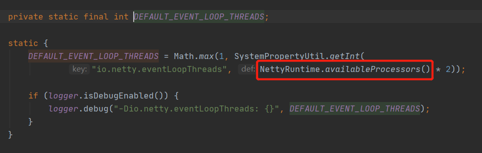
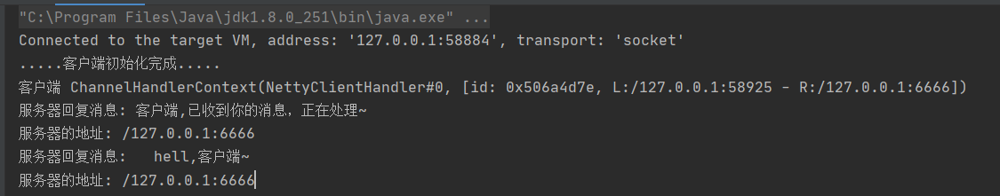
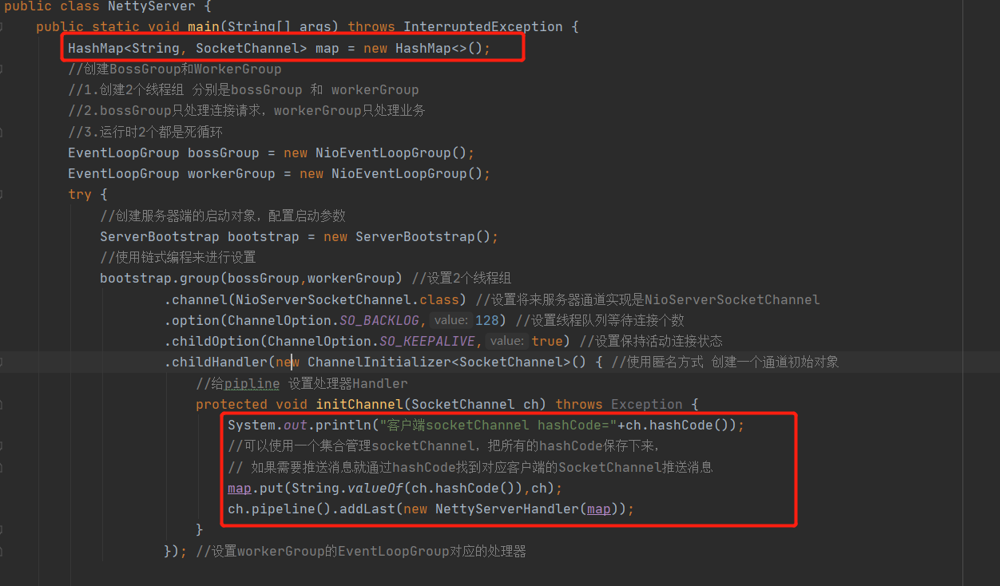

# Netty进阶

## Bootstrap、ServerBootstrap

1. Bootstrap意思是引导，一个Netty应用通常由一个Bootstrap开始，主要作用是配置整个Netty程序，串联各个组件，Netty中ServerBootstrap是服务端的启动引导类，Bootstrap是客户端引导类

### 常用方法

| 方法                                                         | 说明                                      |
| ------------------------------------------------------------ | ----------------------------------------- |
| public ServerBootstrap group(EventLoopGroup parentGroup, EventLoopGroup childGroup) | 服务器端：设置两个EventLoopGroup          |
| public B channel(Class<? extends C> channelClass)            | 服务器端：设置通道的实现                  |
| public <T> B option(ChannelOption<T> option, T value)        | 服务器端：为Server Channel添加配置        |
| public <T> ServerBootstrap childOption(ChannelOption<T> childOption, T value) | 服务器端：给接收的通道添加配置            |
| public ServerBootstrap childHandler(ChannelHandler childHandler) | 服务器端：设置业务处理类型(自定义handler) |
| public ChannelFuture bind(int inetPort)                      | 服务器端：设置服务端口号                  |
| public B group(EventLoopGroup group)                         | 客户端：设置一个EventLoopGroup            |
| public ChannelFuture connect(String inetHost, int inetPort)  | 客户端：连接服务端                        |

## NioEventLoopGroup

NioEventLoopGroupd 线程的个数默认是系统 线程数 * 2

**电脑的线程数**

**EventLoopGroup不传入参数初始化的线程数**

### 源代码

如果nThreads传入是空默认会采用**DEFAULT_EVENT_LOOP_THREADS**

**DEFAULT_EVENT_LOOP_THREADS**属性是静态代码块，NettyRuntime.availableProcessors()方法就可以获取当前机器处理器的核数

### 指定NioEventLoop数量

## Channel

1. 在Netty网络通讯组件，能够用于执行网络I/O操作
2. 通过Channel可获得当前网络连接的通道的状态
3. 通过Channel可以获得网络连接的配置参数(例如接收缓冲区大小)
4. Channel提供异步I/O操作(如建立连接，读写，端口绑定)，异步调用意味着任何I/O操作都将会立刻返回，并且不保证调用结束时所请求的I/O操作已完成
5. 调用立即返回一个ChannelFuture实例，通过注册监听器到ChannelFuture上，可以I/O操作成功，失败或者取消时回调通知调用方
6. 不同协议，不同阻塞类型都有不同的Channel类型对应

### 常用Channel类型

| Channel类型            | 协议                       |
| ---------------------- | -------------------------- |
| NioSocketChannel       | 异步的客户端TCP Socket连接 |
| NioServerSocketChannel | 异步的服务端TCP Socket连接 |
| NioDatagramChannel     | 异步的UDP连接              |
| NioSctpChannel         | 异步的客户端Sctp连接       |
| NioSctpServerChannel   | 异步的服务端Sctp连接       |

### channel与pipeline关系

从服务端cxt中分别获取channel和pipeline

查看channel属性

查看pipeline属性

**结论**：通过断点我们发现channel与pipeline是相互对应的，channel可以获取到pipeline，pipeline也可以获取到channel

## Pipeline、ChannelPipeline

1. ChannelPipeline是一个Handler的集合，它负责处理和拦截inbound或者outbound的事件和操作，相当于一个贯穿Netty的链条(ChannelPipeline保存ChannelHandler的List，用于处理或者拦截Channel的入站事件和出站事件操作)
2. ChannelPipeline实例了一种高级形式的拦截过滤器模式，使用户可以完全控制事件的处理方式，以及Channel中各个的ChannelHandler如何相互交互

**Netty中每一个CHannel都有且仅有一个ChannelPipeline对应**

ChannelPipeline其实是一个双向列表，可以通过head中的next找到下一个需要执行的ChannelHandler，相反我我们可以通过tail的prev得到上一个执行过的ChannelHandler，ChannelHandler真实的类型是ChannelHandlerContext

**入/出站说明**

入站事件和出站事件在一个双向链表中，入站事件会从链表的head往后传递到最后一个入站的handler，出站事件会从链表的tail往前传递到最前一个出站的handler，两种类型的handler相互不干扰

**打断点查看**

### 常用方法

| 方法                                                         | 说明                                            |
| ------------------------------------------------------------ | ----------------------------------------------- |
| ChannelPipeline addFirst(String name, ChannelHandler handler) | 把业务处理类（handler）添加到链中的第一个位置   |
| ChannelPipeline addLast(String name, ChannelHandler handler) | 把业务处理类（handler）添加到链中的最后一个位置 |

## ChannelHandler

1. ChannelHandler是一个接口，处理I/O事件或拦截I/O操作，在ChannelPipeline(业务处理链)会存在很多个Handler，处理完成一个Handler后会交给下一个Handler处理
2. ChannelHandler本身没有提供很多方法，因为这个接口有许多的方法需要实现，便使用期间，可以继承他的子类

### ChannelHandler关键实现类

1. ChannelInboundHandler用于处理入站I/O事件
2. ChannelOutboundHandler用于处理出站I/O事件

**适配器**

1. ChannelInboundHandlerAdapter用于处理入站I/O事件
2. ChannelOutboundHandlerAdapter用于处理出站I/O事件

### 常用方法

| 方法                                                         | 说明               |
| ------------------------------------------------------------ | ------------------ |
| public void channelRegistered(ChannelHandlerContext ctx)        | 通道注册触发       |
| public void channelUnregistered(ChannelHandlerContext ctx)       | 通道注销触发       |
| public void channelActive(ChannelHandlerContext ctx)         | 通道就绪触发       |
| public void channelInactive(ChannelHandlerContext ctx)       | 通道非活动状态触发 |
| public void channelRead(ChannelHandlerContext ctx, Object msg) | 通道有可读事件触发 |
| public void channelReadComplete(ChannelHandlerContext ctx)   | 通道读取完毕后触发 |
| public void exceptionCaught(ChannelHandlerContext ctx, Throwable cause) | 通道发生异常触发   |

## ChannelHandlerContext

1. 保存Channel相关的所有上下文信息，相同关联一个ChannelHandler对象
2. 即ChannelHandlerContext中包含一个具体的事件处理器ChannelHandler，同时也包含了对应的pipeline和Channel的信息，方便对ChannelHandler进行调用

### 常用方法

| 方法                                    | 说明                                                         |
| --------------------------------------- | ------------------------------------------------------------ |
| ChannelFuture close()                   | 关闭通道                                                     |
| ChannelHandlerContext flush()           | 刷新                                                         |
| ChannelFuture writeAndFlush(Object msg) | 将数据写到ChannelPipeline中当前ChannelHandler，下一个ChannelHandler开始处理 |

## ChannelOption

1. Netty在创建Channel实例后，一般需要设置ChannelOption参数

### 常用参数

| 参数                       | 说明                                                         |
| -------------------------- | ------------------------------------------------------------ |
| ChannelOption.SO_BACKLOG   | 对应TCP/IP协议listen函数的backlog参数，用来初始化服务器可连接队列大小，服务端处理客户端连接请求是顺序处理的，所以同一时间只能处理一个客户端连接，多个客户端来的时候，客户端不能处理客户端连接请求放在队列中等待处理，backlog参数指定队列的大小 |
| ChannelOption.SO_KEEPALIVE | 一直保存连接活动状态                                         |

## EventLoopGroup、NioEventLoopGroup

1. EventLoopGroup是一组EventLoop的抽象，Netty为了更好的利用多核CPU资源，一般会有多个EventLoop同时工作，每个EventLoop维护着一个Selector实例
2. EventLoopGroup提供next接口，可以从组里面按照一定规则获取其中一个EventLoop来处理任务，在Netty服务器编程中，我们一般需要提供两个EventLoopGroup，一个用于处理Accept事件一个处理其它事件，如：BossEventLoopGroup和WorkerEventLoopGroup

## Unpooled

Netty提供一个专门用来操作缓冲区(即Netty的数据日期)的工具类，ByteBuf比NIO的buyeBuffer使用起来更加方便，性能也比较高

**使用例子1**

**使用例子2**

## TaskQueue

在前面的案例中一直没有使用到TaskQueue，TaskQueue有什么用呢？

TaskQueue是任务队列，在Netty模型中事件处理都是由Handler处理，但如果我们在Handler中有一些业务逻辑复杂的事情要处理，最终还是会导致当前处理的线程发生阻塞，这时就需要使用到TaskQueue，进入Handler，直接将这些复杂的业务逻辑提交到TaskQueue队列中，就会有对应的线程异步处理，这样子可以做到立刻对客户端请求响应，无需等待业务执行完毕响应，等业务处理成功后再次回应客户端

**TaskQueue使用场景**

1. 用户程序自定义的普通任务
2. 用户自定义定时任务
3. 非当前Reactor线程调用Channel的各种用法

### 用户程序自定义的普通任务

**结论**：我们可以看到服务器端不阻塞了，提交请求后业务代码被提交到了，当前channel().eventLoop()的TaskQueue中后，就直接执行channelReadComplete返回了，然后等待10秒后服务端把业务逻辑处理完成后就会再次返回

**如果不相信已经提交到TaskQueue，可以打一个断点看一下，可以发现ctx.channel().eventLoop().execute执行了后，TaskQueue的Size是1**

### 用户自定义定时任务

**结论**：业务逻辑代码先会被提交到一个scheduleTaskQueue的队列中，在等待5秒后才会被执行里面的代码

**如果不相信已经提交到scheduleTaskQueue，可以打一个断点看一下，可以发现ctx.channel().eventLoop().schedule执行了后，scheduleTaskQueue的Size是1**

### 非当前Reactor线程调用Channel的各种用法

在消息推送的时候就需要使用到该方法，因为每一个用户他们绑定的eventLoop不一定都一样，这样需要维护一个channel的引用，根据用户标识获取到对应的channel这样子我们就可以取到对应的eventLoop然后使用Write方法就可以给相应的用户进行一个消息推送

**服务端需要保存对应用户的channel**

## 异步模型

1. 异步和同步的概念是相对的，当一个异步过程调用发出后，调用者不会立刻得到结果，等实际处理这个调用的组件完成后，通过状态、通知、回调等来通知调用者(JS中回调函数)
2. Netty中的I/O操作都是异步的，包括Bind、Write、Connect等操作会简单的返回一个ChannelFuture
3. 调用者并不能立刻获得结果，而是通过Future-Listener机制，用户可以方便的主动获取或者通过通知机制获取IO操作结果
4. Netty的异步模型是建立在future和callback的上面的，callback就是回调(前端Ajax就是典型例子通过回调来获取对应的值)，终点来说future，核心思想：假如一个方法，计算过程非常耗时，等待方法返回显然不合适，那么可以这样子，你调用该方法时我不管有没有执行完成，我先给你返回一个Future，后续如果你想知道方法执行的怎么样了，可以通过Future去监听该方法执行(即Future-Listener机制)

### Future总结

1. Future是异步执行结果，可以通过它提供的方法检测执行是否完成
2. ChannelFuture是我们使用最多的，ChannelFuture是一个接口，我们可以给ChannelFuture添加监听器，当监听的事件被触发时，就会通知监听器

### Future-Listener机制

1. 当Future对象刚刚创建时，处于一个非完成状态，调用者可以通过返回的ChannelFuture获取操作执行的状态，监听函数来执行完成后的操作

**常见方法**

| 方法名      | 说明                             |
| ----------- | -------------------------------- |
| isDone      | 获取当前操作是否完成             |
| isSuccess   | 获取已完成操作是否成功           |
| getCause    | 获取已完成操作失败的原因         |
| isCancelled | 获取已完成的当前操作是否被取消   |
| addListener | 注册监听器后，才能调用上面的方法 |

**使用案例**

