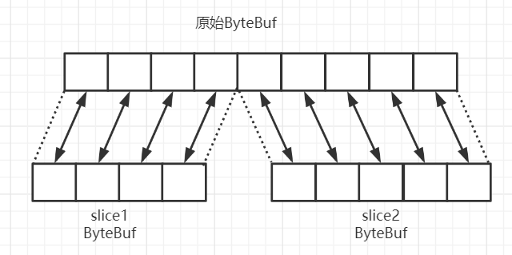

# Netty-ByteBuf

>  ByteBuf是Netty对原有NIO中的ByteBuffer进行一个增强，ByteBuf的使用相较于NIO的ByteBuffer使用起来方便很多，ByteBuf优点
>
> 1. 池化，可以重用ByteBuf实例，节约内存的使用，减少内存溢出的可能
> 2. 读写双指针，不用像ByteBuffer那样需要切换读写模式
> 3. 可以自动扩容
> 4. 链式调用
> 5. 很多地方使用了零拷贝

## 创建ByteBuf

> ByteBuf的创建有2种方式，可以从堆内存创建，直接内存创建

### 直接内存

> 直接内存创建，顾名思义就是直接在内存中开辟一个ByteBuf，直接内存创建和销毁代价比较昂贵，但是读写性能搞，适合配合池化功能一起使用，`ByteBufAllocator.DEFAULT.buffer()默认使用直接内存创建的ByteBuf`
>
> 直接内存堆GC压力小，因为这部分不受JVM垃圾回收机制的管理，但是要注意`及时主动释放内存`

~~~java
//使用ByteBufAllocator对象获取一个ByteBuf，默认长度256字节
ByteBuf buffer = ByteBufAllocator.DEFAULT.heapBuffer();
//使用ByteBufAllocator对象获取一个ByteBuf，指定长度1024字节
ByteBuf buffer = ByteBufAllocator.DEFAULT.heapBuffer();
~~~

### 堆内存

> 堆内存创建，就是基于堆创建的ByteBuf，它相较于直接内存分配的性能要低，但是`无需主动释放内存`，垃圾回收机制会管理

~~~java
//使用ByteBufAllocator对象获取一个ByteBuf，默认长度256字节
ByteBuf buffer = ByteBufAllocator.DEFAULT.directBuffer();
//使用ByteBufAllocator对象获取一个ByteBuf，指定长度1024字节
ByteBuf buffer = ByteBufAllocator.DEFAULT.directBuffer();
~~~

### 池化与非池化

> ByteBuf也运用了池化技术，池化的优点`4.1后的netty默认开启池化实现`
>
> 1. 没有池化，则每次都创建新的ByteBuf实例，这个操作对直接内存代价昂贵，就是堆内存也会增加GC的压力
> 2. 有了池化，则可以重用池种的ByteBuf实例，并且采用了与jemalloc类似的内存分配算法提升分配效率
> 3. 并发时，池化功能更节约内存，减少内存溢出的可能

~~~java
-Dio.netty.allocator.type={unpooled|pooled}
~~~

## ByteBuf组成

> ByteBuf由4个属性，将来整块ByteBuf拆成4部分
>
> 1. 废弃部分：再每一次读取时读指针会向后移动，已经被读取过的部分被称为废弃部分
> 2. 可读部分：在每一次写操作时，写指针会向后移动，读指针至写指针位置为可读部分
> 3. 可写部分：在创建ByteBuf时给定的最初容量，写指针至容量部分为可写部分
> 4. 最大容量：当写指针超过容量后，会申请跟多的容量进行写入，但是最后不会超过最大容量，容量至最大容量为可扩容部分
>
> `读指针/写指针最初位置是0`

### 写入

> 一下列举的都是write开头的写入方法，改方法在每次写入后都会修改writerIndex参数
>
> `使用set开头方法可不改变writerIndex情况下为指定下标写入指定内容`

| 方法名                                                    | 解释                                         | 备注                                      |
| --------------------------------------------------------- | -------------------------------------------- | ----------------------------------------- |
| writeBoolean(boolean value)                               | 写入boolean值(writerIndex+1)                 | 用一个字节01\|00表示true\|false           |
| writeByte(int value)                                      | 写入byte值(writerIndex+1)                    |                                           |
| writeShort(int value)                                     | 写入short值(writerIndex+1)                   |                                           |
| writeInt(int value)                                       | 写入int值(writerIndex+1)                     | Big Endian，即0x250，写入后00 00 02 50    |
| writeIntLE(int value)                                     | 写入int值(writerIndex+1)                     | Little Endian，即0x250，写入后50 02 00 00 |
| writeLong(long value)                                     | 写入long值(writerIndex+1)                    |                                           |
| writeChar(int value)                                      | 写入char值(writerIndex+1)                    |                                           |
| writeFloat(float value)                                   | 写入float值(writerIndex+1)                   |                                           |
| writeDouble(double value)                                 | 写入double值(writerIndex+1)                  |                                           |
| writeBytes(ByteBuf src)                                   | 写入ByteBuf值(writerIndex+src.readableBytes) |                                           |
| writeBytes(byte[] src)                                    | 写入(byte[]值(writerIndex+src.length)        |                                           |
| writeCharSequence(CharSequence sequence, Charset charset) | 写入字符串                                   |                                           |

**写入测试**

### 扩容

> 扩容规则：
>
> 1. 如果写入后数据大小未超过512，则选择下一个16的整数倍，例如写入后大小为12，则扩容后到16
> 2. 如果写入后大小超过512，则选择下一个2^n，例如写入后大小513，则扩容到2^10=1024(2^9=512不够了)
> 3. 扩容不能超过最大容量max capacity

### 读取

> buf.readByte()读取一个字节，可以看到读取之后readIndex读指针后移了一位
>
> `使用get开头方法可不改变readIndex情况下为指定下标写入指定内容`

### 重复读取

> 利用markReaderIndex()方法可以标记当前读取位置，后面利用resetReaderIndex()可以让读指针回到你之前标记好的位置，达到重复读取

## ByteBuf内存回收

> 1. 堆缓存(UnpooledHeapByteBuf)使用的是JVM内存回收，只需要等GC回收即可
> 2. 直接内存(UnpooledDirectByteBuf)使用的是直接内存，需要调用特殊方法回收内存
> 3. PooledByteBuf和他的子类使用了池化机制，需要负载的规则回收内容

### ReferenceCounted

> Netty使用了引用计数法来控制回收内存，每一个ByteBuf都会实现ReferenceCounted接口
>
> 1. 每个ByteBuf对象初始计数1
> 2. 调用release方法计数减1，如果计数为0，ByteBuf内存被回收
> 3. 调用retain方法计数加1，表示调用者没有用完之前，其它handler调用了release也不会造成回收
> 4. 计数为0时，底层内存会被回收，这时即使ByteBuf对象还在，但各方法已无法正常使用

### TailContext

> TailContext是处理入站的最后的一个Handler，会使用release方法将ByteBuf释放掉

### HeadContext

> HeadContext是处理出站的最后的一个Handler，会使用release方法将ByteBuf释放掉

### 手动释放

> 以上说的都是Netty中入站的msg最后会被释放掉，平时我们自己new出来的ByteBuf释放写法如下

~~~java
ByteBuf buf = ...
try{
    ...
}finally{
    buf.release();
}
~~~

## 零拷贝

### slice

> slice可堆一个原始ByteBuf进行切片成多个ByteBuf，`切片后的ByteBuf并不是原始ByteBuf的副本`，切片后的ByteBuf维护着独立的读写指针，你所进行的所有修改最终都会修改到原始ByteBuf
>
> `使用该方法后为了保证切片原始Buf不会意外回收需调用retain()增加引用计数，处理完毕后调用release()减少引用计数`

**使用slice切片**

**修改切片中的内容后查看原始ByteBuf跟着改变**

### duplicate

> duplicate也是零拷贝，与slice区别是duplicate是切片整个一ByteBuf，并且在切片后最大容量没有限制，而slice一般用于切片部分，并且切片后的容量不能增加
>
> `使用该方法后为了保证切片原始Buf不会意外回收需调用retain()增加引用计数，处理完毕后调用release()减少引用计数`

### CompositeByteBuf

> CompositeByteBuf，可以让2个buf直接组合到一次，不用发生任何拷贝
>
> `使用该方法后为了保证切片原始Buf不会意外回收需调用retain()增加引用计数，处理完毕后调用release()减少引用计数`

## 非零拷贝

### copy

> 与零拷贝相反则是copy方法，直接将原有ByteBuf拷贝到一个新的ByteBuf中，新的ByteBuf中任何修改与原始ByteBuf无关

## 小技巧

### 打印ByteBuf内容(16进制)

~~~java
private static void log(ByteBuf buf){
    int length = buf.readableBytes();
    int rows = length / 16 + (length % 15 == 0 ? 0 : 1) + 4;
    StringBuilder builder = new StringBuilder(rows * 80 * 2)
        .append("read index:").append(buf.readerIndex())
        .append(" write index:").append(buf.writerIndex())
        .append(" capacity:").append(buf.capacity())
        .append(NEWLINE);
    appendPrettyHexDump(builder,buf);
    System.out.println(builder.toString());
}
~~~

