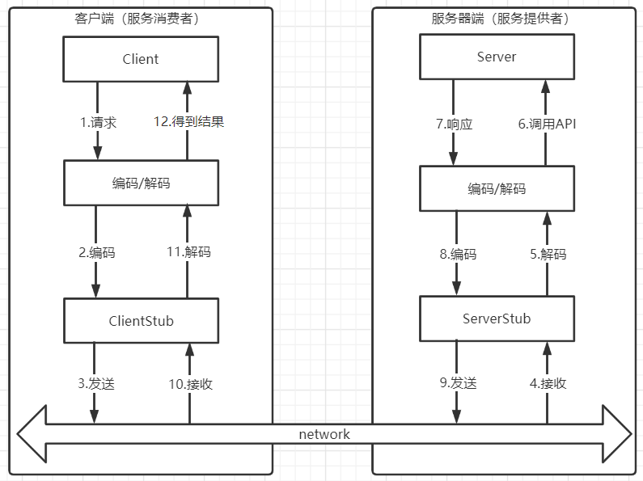
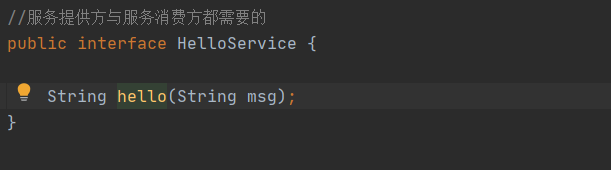
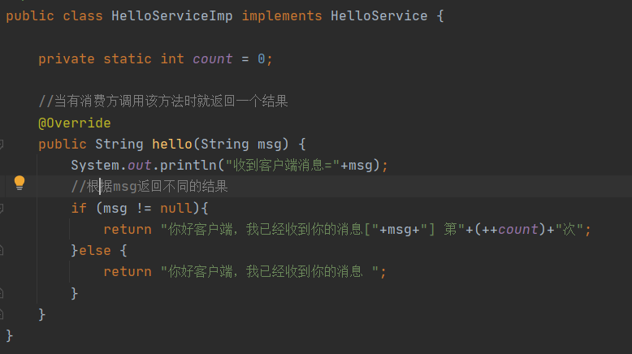
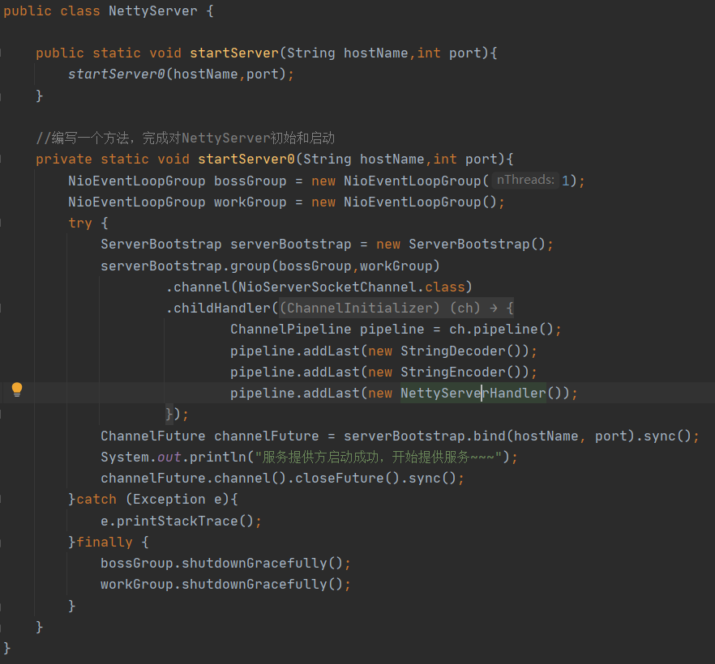
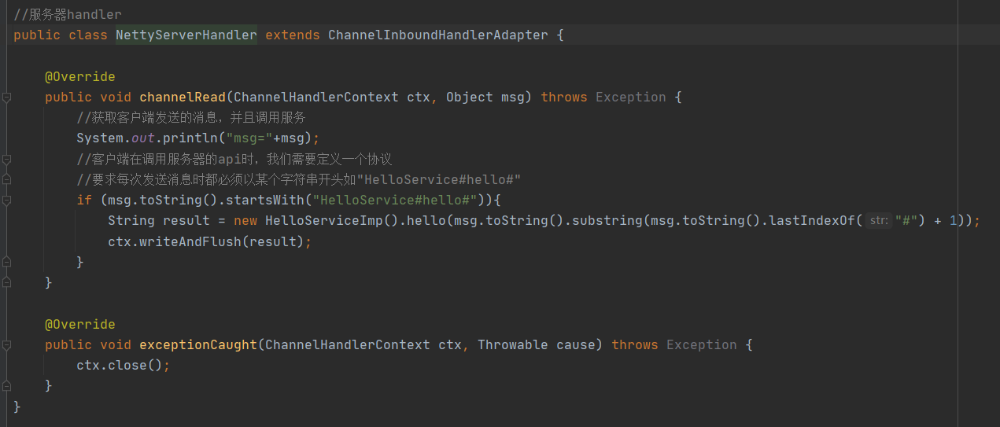
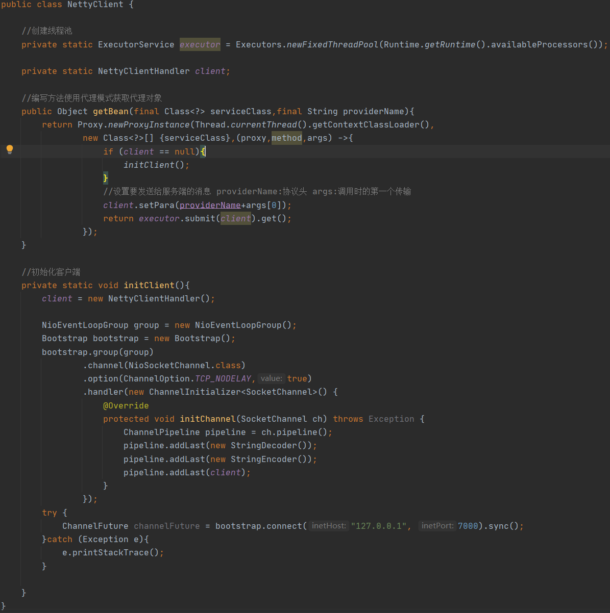
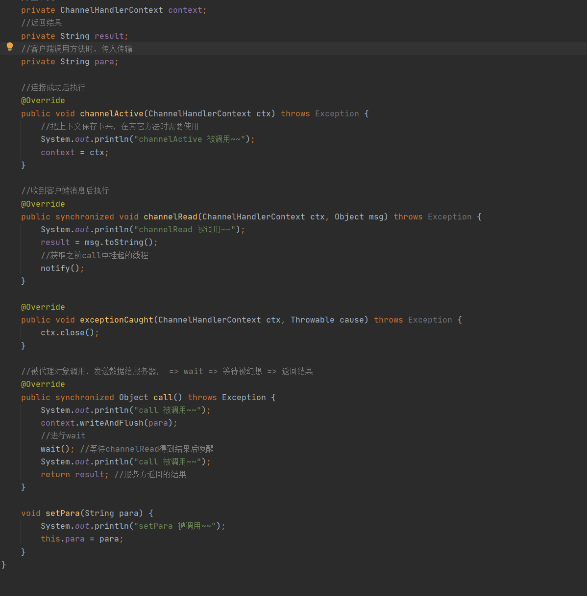
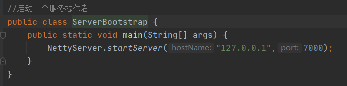
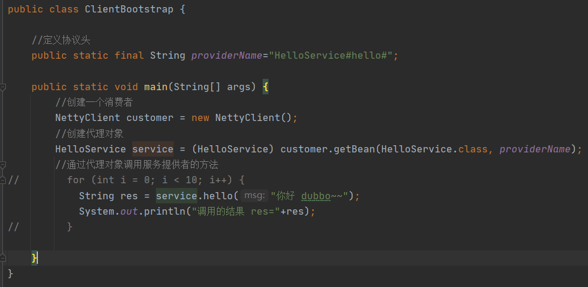

# Netty实现RPC

## RPC基本介绍

1. RPC（Remote Procedure Call）远程过程调用，就是一个计算机A上有一个程序，一个计算机B上也有一个程序，A应用程序可以调用B应用程序的方法，调用方式很简单就好像调用自己的本地方法那样
2. 常用的RPC框架有：阿里的Dubbo、Google的gRPC、Spring的SpringCloud等

## RPC调用流程

1. 服务消费者（Client）以本地调用方式调用服务
2. ClientStub接收到调用后负责将方法、参数等封装成能够进行网络传输的消息体
3. ClientStub将消息进行编码并且发送到服务端
4. ServerStub接收到消息进行解码
5. ServerStub根据解码结果调用本地的服务
6. 本地服务执行并将结果返回给ServerStub
7. ServerStub将返回导入结果进行编码并发送给消费方
8. ClientStub接收到消息并进行解码
9. 服务消费方（Client）得到结果

## 自己实现dubbo RPC（基于Netty）

1. dubbo底层使用了netty作为网络通讯框架，要求用Netty实现一个简单的EPC框架
2. 模板dubbo，消费者和提供者约定接口和协议，消费者远程调用提供者的服务，提供者返回一个字符串，消费者打印提供者返回的数据。底层网络通讯协议使用Netty 4.x

### 共同接口

需定义一个服务提供方与服务消费方都需要的共同接口

### 服务提供者

#### 实现HelloService接口

#### 编写netty核心类

#### 编写处理业务的Handler

### 服务消费者

#### 编写netty核心类

#### 编写处理业务的Handler

### 测试

