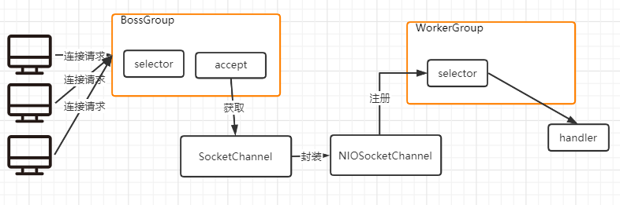
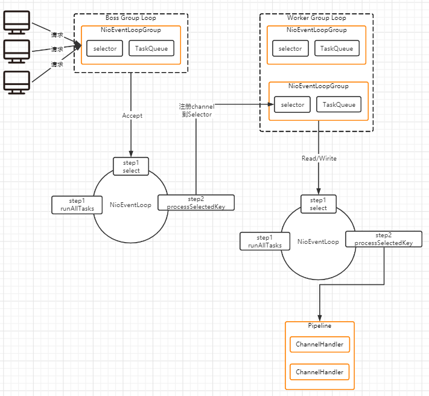

# Netty概述

## 原生NIO存在的问题

1. NIO的类库和API繁杂，使用麻烦：需要熟练掌握Selector、ServerSocketChannel、SocketChannel、ByteBuffer等
2. 需要具备其它的额外技能：要熟悉java多线程，因为NIO编程涉及到Rector模式，你必须对多线程和网络编程非常熟悉，才能编写出高质量的NIO程序
3. 开发工作量和难度非常大：例如客户端面临断连重连接，网络闪断，半包读写，失败缓存，网络拥堵和异常流的处理等等
4. JDK NIO的bug：例如臭名昭著的Epoll Bug，它会导致Selector空轮询，最终导致CPU100%，直到JDK1.7版本问题仍旧存在，没有被根本解决

## Netty说明

1. Betty是由JBOSS提供的一个java开源框架。Netty提供异步的、基于事件驱动的网络应用框架，用以快速开发高性能、高可靠的网络IO程序
2. Netty可以帮助你快速、简单的开发出一个网络应用，相当于简化了和流程化了NIO的开发过程
3. Netty是目前最流行的NIO框架，Netty在互联网领域、大数据分布式计算领域、游戏行业、通讯行业等获得了广泛的应用、知名的Elasticsearch、Dubbo框架内部都采用了Netty

## Netty优点

1. 设计优雅：适用于各种传输类型的统一API阻塞和非阻塞Socket；基于灵活且可扩展的事件模型，可以清晰的分离关注点；高度可定制的线程模型，一个或多个线程池
2. 使用方便：详细记录javadoc，用户指南和示例，没有其它依赖项，JDK5（Netty 3.x）或6（Netty 4.x）就足够了
3. 高性能、吞吐量最高、延迟低、减少资源消耗、最小化不必要的内存复制
4. 安全：完整的SSL/TLS和StartTLS支持
5. 社区活跃，不断更新：社区活跃，版本迭代周期短，发现的Bug可以被及时修复，同时更多的新功能会被加入

## 线程模型

1. 不同线程模式，对线程的性能有很大影响，为了搞清Netty线程模式，我们先了解一些现在有什么线程模式，Netty线程模型的优越性
2. 目前存在线程模型有：
   1. 传统阻塞I/O模型
   2. Reactor模式
      1. 单Reactor单线程
      2. 单Reactor多线程
      3. 主从Reactor多线程
3. Netty线程模式是基于主从Reactor多线程做了一定的改进

### 传统阻塞I/O模型

**特点**：

1. 采用阻塞IO模式获取输入的数据
2. 每个连接都需要独立的线程完成数据的输入，业务处理，数据返回

**问题分析**：

1. 当并发很大的时候，就需要创建大量的线程，占用很大的系统资源
2. 连接创建后，如果当前线程暂时没有数据可读，该线程会阻塞在read操作

### 简单Reactor模式

**特点**：

1. Reactor模式，通过一个或者多个输入同时传递给服务处理器的模式(基于事件驱动)
2. 服务器程序处理传入的多个请求并将他们同步分配到相应的处理线程，因此叫做Reactor模式也叫Dispatch模式
3. Reactor模式使用IO复用监听事件，收到事件后，分发给某个线程(进程)，这点就是我们网络服务高并发处理的关键

**核心组成部分**：

1. Reactor：Reactor在一个单独的线程中运行，负责监听和分发事件，图中的ServiceHandler就是一个Reactor，它只负责接收请求，并且把请求方法到对应的业务处理线程处理
2. Handlers：实际处理实际的线程，Reactor通过适当的处理程序来响应I/O事件，处理程序执行非阻塞操作，图中的EventHandler

#### 单Reactor单线程

这其实就是我们NIO经典使用案例（前面我们编写的群聊系统），首先客户端连接加入Reactor，如果是连接请求就使用accept为请求建立连接，如果是事件请求就会分发给Handler处理，单Reactor单线程因为是单线程所以在处理高并发还是存在瓶颈，接下来另外一个方法对当前问题改进

**优点**：模型简单，没有多线程，进程通信，竞争的问题，全部都在一个线程中完成

**缺点**：性能问题，只有一个线程，无法完成发挥多核CPU的性能，Handler在处理某个连接上的业务时，整个进程无法处理其它连接事件，容易到达性能瓶颈

**缺点**：可靠性问题，线程意外终止，或进入死循环，会导致整个系统通信模块不可用，不能接收和处理外部消息

**使用场景**：客户端数量有限，业务处理非常快速，比如Redis在业务处理的时间复杂O(1)的情况

#### 单Reactor多线程

Reactor对象通过select监控客户端请求事件，收到事件后，通过dispatch进行分发，如果是建立连接的请求，由Accept处理连接请求创建响应的连接，如果不是连接请求，则分发到对应的handler来处理，handler只负责响应事件不做业务处理，handler通过read读取数据后，会分发给后面的worker线程池的其中一个线程处理业务，处理完成后会把结果返回给handler，handler通过send返回给客户端

**优点**：可以充分的利用多核cpu的处理能力

**缺点**：多线程数据共享和访问比较复杂，reactor只有单线程需处理所有事件的监听和响应，在单线程运行，在高并发场景容易处理瓶颈

#### 主从Reactor多线程

在单Reactor多线程基础上将Reactor拆出来拆成主从线程，主线程只有一个主要是处理连接事件，如果接受到连接事件后，MainReactor会创建连接，并且分配给一个SubReactor，加入到SubReactor连接队列中进行监听，并创建handler进行事件处理，当有新的事件发生，SubReactor会调用对应的handler处理，handler通过read读取数据，分发到Worker线程池，Worker分配独立的worker线程进行业务处理然后返回结果

**优点**：父线程与子线程的数据交互简单职责明确，父线程只需要接收新连接，子线程完成后续的业务处理

**优点**：父线程与子线程的数据交互简单，Reactor主线程只需要把新连接传给子线程，子线程无需返回数据

**缺点**：编程复杂度高

## Netty模型

### 工作原理-简版

BossGroup线程维护着一个Selector，只关注Accecpt事件，当接收到Accept事件，获取对应的SocketChannel，封装成NIOSocketChannel并注册到Worker线程中的selector中，Worker线程会对Selector进行监听，如果监听到Selector发生事件后就会对事件进行处理，分配到handler来进行主要的业务处理

### 工作原理-详细版

Netty抽象出两组线程池Boss Group Loop 和 Worker Group Loop，Boss Group Loop负责接收客户端的连接，Worker Group Loop负责网络的读写操作，Boss Group与Worker Group里面都是由多个NioEcentLoopGroup组成的，每一个NioEcentLoopGroup都有一个Selector，用于监听绑定在其上的socket的网络通讯，一但接收到事件后就往队列中对，队列不断的轮询轮询到有事件时就做相应的处理

**Boss Group Loop工作**

1. Boss Group Loop下的NioEcentLoopGroup只接受Accept事件
2. 当Selector发现有Accept事件时，生成NioSocketChannel然后注册到其中一个Worker Group Loop的NioEcentLoopGroup中

**Worker Group Loop工作**

1. Worker Group Loop下的NioEcentLoopGroup关心Read/Write事件
2. 当Selector发现有Read/Write事件，如果发现队列有Read/Write就会把他分配到一个Pipeline，Pipeline中可以获取到Channel对Channel进行处理

## Netty例子

### 服务端

### 客户端

