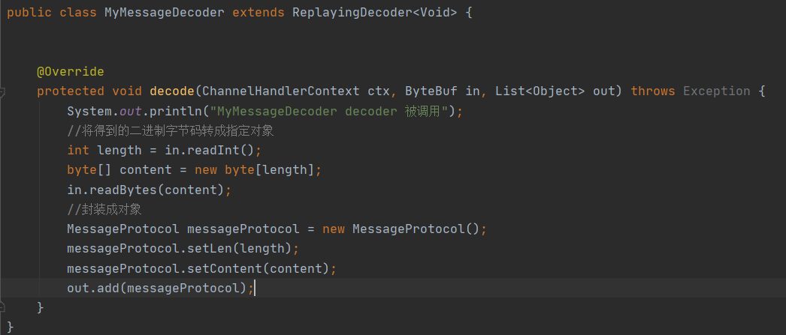
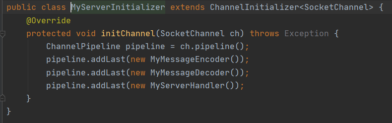

# Netty高级

## 编码与解码

### 基本介绍

1. 在编写网络应用程序时，因为数据在网络中传输的都是二进制字节码数据，在发送数据时就需要编码，接收数据时就需要解码

codec（编码器）的组成部分有两个：encoder（编码器）和decoder（编码器），在发送数据时要把数据encoder转换成字节码数据，收到数据时要把数据decoder转成业务数据

### Netty的编码器

1. Netty自身提供了一些编码器如，StringEncoder（对字符串进行编码）、ObjectEncoder（对java对象进行编码），StringDecoder（对字符串进行解码）、ObjectDecoder（对java对象进行解码）
2. Netty自身提供的ObjectEncoder和ObjectDecoder可以用来实现POJO对象或者各种业务对象的编码和解码，底层使用的是java的序列号即使，但是java的序列化技术本身效率不高，而且存在如下问题
   * 无法跨语言
   * 序列化后体积太大，是二进制编码的5倍多
   * 序列化性能太低
3. 解决方法使用Google的Protobuf

#### Netty常用解码器

| 解码器                        | 说明                                                         |
| ----------------------------- | ------------------------------------------------------------ |
| LineBasedFrameDecoder         | 该解码器会对收到的数据按照(\n或\r\n)进行分割发送给Handel处理 |
| DelimiterBasedFrameDecoder    | 使用自定义的特殊字符作为消息的分隔符                         |
| HttpObjectDecoder             | 一个HTTP数据的解码器                                         |
| LengthFileIdBasedFrameDecoder | 通过指定长度来标识整包消息，这样就可以自动处理粘包和半包消息 |

### Protobuf编码器

#### 基本介绍

1. Protobuf是Google发布的开源项目，全称Google Protocol Buffers，是一个轻便高效的结构化数据存储格式，可以用于结构化数据串行化，或者说序列号，它很适合做数据存储或RPC(远程过程调用)数据交换格式
2. 参考文档：https://developers.google.com/protocol-buffers/docs/javatutorial
3. Protobuf是以message的方式来管理数据的
4. Protobuf支持跨平台，服务器端和可以不同语言编写（C++，C#，Go，Java，Python等）

#### 如何使用

1. 使用Protobuf编码器步骤，首先我们需要编写一个xxx.proto的文件然后使用prptoc.exe对我们编写的xxx.proto进行编译，编译后就会生成一个xxx.proto对应的一个xxx.java文件，使用这个java文件就可以对这个类编码(ProtobufEncoder)和解码(ProtobufDecoder)

2. 在idea中编写.proto文件时需要下载Protocol Buffers插件这样，这样在idea中编写proto文件就会有语法高亮提醒

#### Protobuf例子

**引入Maven**

~~~xml
<!-- https://mvnrepository.com/artifact/com.google.protobuf/protobuf-java -->
<dependency>
    <groupId>com.google.protobuf</groupId>
    <artifactId>protobuf-java</artifactId>
    <version>3.6.1</version>
</dependency>
~~~
**proto类型对应Java类型表**

**编写一个Student.proto**

~~~protobuf
syntax = "proto3";//协议版本
option java_outer_classname = "StudentPOJO";//生成的外部类名，就是生成的文件名
//protobuf 使用message 管理数据
message Student{ //StudentPOJO中会生成一个Student内部类，它是真正发送的数据对象
  int32 id = 1;//Student 类有一个属性 名字为 id 类型为int32 1表示属性的序号
  string name = 2;
}
~~~

**下载protoc.exe**

路径：https://github.com/protocolbuffers/protobuf/releases

执行如下命令：**protoc.exe --java_out=. Student.proto**，就会生成一个StudentPOJO.java文件

注意：maven里面使用的3.6.1版本下载的protoc.exe最好也要3.6.1

**拷贝到idea里面**

我们可以看到在StudentPOJO里面是有一个内部类，Student这个类才是真正用于发送数据的类，我们可以看到里面有很多方法

**客户端**

pipeline加入ProtobufEncoder编码器

客户端直接通过**StudentPOJO.Student.newBuilder()**往里面set数据最后使用**build()**方法得到student对象

**服务端**

pipeline加入解码器，解码类型是StudentPOJO.Student.getDefaultInstance()

自定义Handler直接接收，使用get方法就可以获取到数据

#### Protobuf多类型

通过Protobuf例子，基本知道如何使用Protobuf但是我们从中发现了一个问题，我们的类型很单一，那如果我们需要传入不同的类型，那客户端和服务器端需要创建很多个xxx.proto，客户端和服务器端需要在pipeline配置各种类型解码器，服务端也需要使用不同的Handler来接收

**我们重新编写一个MyDataInfo**

这里面我们保存着2个message Student和Worker，这2个类型我们用一个MyMessage管理着它，MyMessage通过使用enum传入0/1来获取对应的类型

**客户端**

客户端我们随机发送不同类型的数据过去

**服务端**

服务端解码MyMessage即可

**服务端Handler**

handler使用MyMessage接收，通过判断类型执行不同的打印相应的类型

### 自定义编码器

#### 基本介绍

我们可以自定义编码器与解码器，按照我们设定的规则对数据进行解码编码，在自定义解码器编码器之前我们再次了解一下，编码和解码handler责任链是如何运行的

我们的handler是分outboundhandl和inboundhandl，inboundhandl入站事件，outboundhandl是出站事件，编码为出站事件，解码为入站事件，什么时候需解码什么时候需编码，打个比方客户端就是我们，服务端就是快递站

1. 比如我要发一个快递给快递站，那么我们要做的第一步就是把我们的快递打包装车，打好包装后装车才能方便我们送去快递站(这里进行编码，我们的快递要出站的时候需要进行编码)，打好包装后送到快递站了，快递站看到有快递进站了，就需要卸货把我们的快递全部卸下来(这里进行解码，收到有数据进站时候需要进行解码)
2. 比如快递站需要发快递给我们了，那么快递站需要先打包装车，打包好才能给我们送过去(这里进行编码，我们的快递要出站的时候需要进行编码)，快递到达我们手上后，那我们就需要对快递进行拆卸(这里进行解码，收到有数据进站时候需要进行解码)

编码和解码是相对某一方的，相对于客户端，我要发数据给服务器端需要进行编码(outboundhandl)，收到服务端的数据需要进行解码(inboundhandl)，相对于服务端，我要发数据给客户端需要进行编码(outboundhandl)，收到客户端的数据需要进行解码(inboundhandl)

经过以上的说明相信已经知道了为什么要进行解码编码以及解码编码的流程了把，那为什么我们要自定义编码器呢，就那上面的我和快递站这个例子来说，现在我要拿快递给快递站那我是不是需要装车，我(客户端)只管装车装好车会有一个司机(Scoket)拉过去，司机拉过去了那问题来了快递站(服务器)要按一个什么顺序把这些货物卸下来呢，如果不按顺序可货物就会重车上倒下了就乱七八糟了，这就需要我们制定一个规则，客户端怎么放，服务端就怎么拆，这就是自定义解码器的用处

#### 自定义编码器

编写自定义编码器需要寄出一个MessageToByteEncoder<>并且需要传入泛型，表示该类接收什么类型进行编码，如当前类可以接受一个Long类型并且对其进行编码，使用writeLong()方法写入

MessageToByteEncoder是继承与OutboundHandler可以看出出站就需要进行编码

#### 自定义解码器

编写自定义编码器需要寄出一个ByteToMessageDecoder这里的if判断收到数据是否符合(后面TCP拆包和沾包解释该做法)，所以只有大于8个字符才能会把消息readLong操作，然后add到List<Object> out这样就会加入到下一个handler处理

ByteToMessageDecoder是继承与InboundHandler可以看入站就需要进行解码

**数据的发送**

把我们的编码器和解码器加入到pipeline通道中，当数据进入出入站通道后就会有相应的通道进行处理

这样在我们调用ctx.writeAndFlush()的方法时就不需要使用ctx.writeAndFlush(Unpooled.copyLong(1123456));写法，直接写成ctx.writeAndFlush(123456L);在经过出站handler时，会经过MessageToByteEncoder就会使用writeLong()方法对它进行编码处理

## TCP粘包和拆包

### 基本介绍

1. TCP是面向连接的，面向流，提供高可靠性服务，收发两端（客户端和服务端）都要有一一成对的socket，有时客户端为了提高传输的效率会对传输的数据包进行优（Nagle算法），将多次间隔小而且数据量小的数据合并成一个大的数据包，然后发给接受端，但是这样接受端就存在一个问题，接受端无法分辨出来你发的这个包中，是需要拆分成多少个小包
2. 由于TCP无消息保护边界，需要在接受端处理消息边界问题，也就是我们所说的粘包、拆包问题

这是理想状态下的数据传输，客户端先服务端发送2个数据包，D1和D2服务端分俩次接受D1和D2独立的数据包，没有粘包和拆包问题

服务端可能会一次性受到了两个数据包，D1和D2粘合在一起，称为TCP粘包

服务端分两次读取了数据包，但是第一次读取到了一个完整的D1包和D2的一部分，第二次读取到了D2的属于部分，这称为TCP拆包

服务端分两次读取了数据包，但是第一次读取到了D2的一部分部分，第二次读取到了一个完整的D1包和D2的剩余部分，这也称为TCP拆包

**总结**：假设你是服务端你，你收到以上情况的包模拟如何判断他们是不是一个完整的包，如何把他们拆分合并，有可能包的不完整会导致你整个业务逻辑出现问题，TCP粘包和拆包是在网络编程必须解决的问题

### TCP粘包和拆包案例

**客户端**

客户端在建立连接后会调用一个for循环，循环向服务端发送一个hello，server，如果收到服务端发送消息也会打印出来

**服务端**

服务端接收到可读事件后会把数据读取并且输出控制台，输出完成后会向当前通道回送一条数据回去

**运行测速**

我们可以发现服务端收到的数据发送了粘包的问题

客户端接收服务端数据时也发送粘包的问题

### 解决方案

1. 使用自定义协议+编解码器 解决TCP粘包和拆包问题

**自定义协议包**

协议包的len是关键，服务端在解码的时候会按照你发的长度进行解码

**自定义编码器**

把通道中的MessageProtocol对象，进行编码发送

**自定义解码器**

收到的数据解码成MessageProtocol对象给下一个Handler处理

**在客户端和服务端pipeline加入自定义的编解码器**

客户端与服务端接收和发送数据统一用MessageProtocol对象

**测试结果**

客户端和服务端都能按照 封装MessageProtocol进行 解码，不会出现沾包，和拆包的问题了

