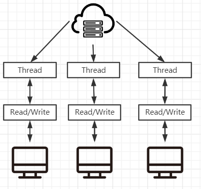
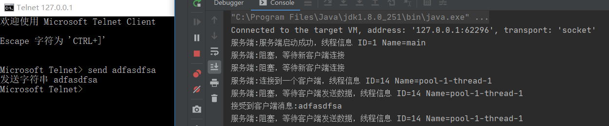
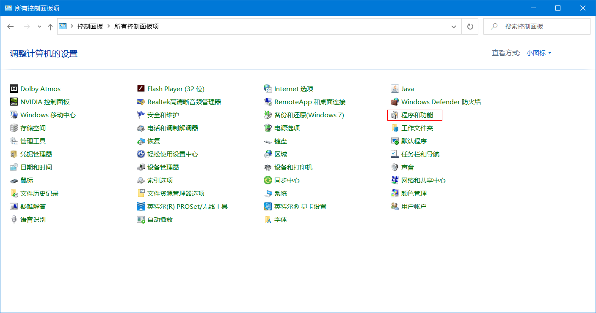
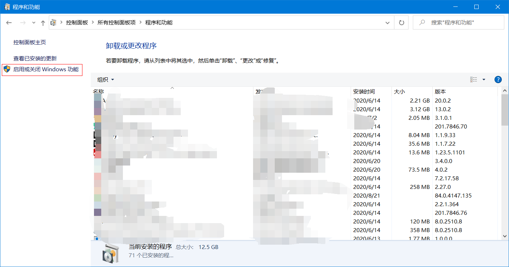
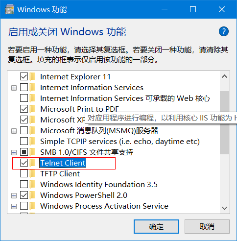

# JAVA-BIO

## BIO基本介绍

1. java BIO就是传统的javaIO编程，相关的类和接口都在java.io包下
2. BIO(blocking I/O) 同步阻塞，服务端实现模式就是一个客户端接入后就会开启一个线程，专门为这个客户端服务(读写操作)，即使这个客户端不做任何事情这个线程也会开着，这就导致很多不必要的开销。
3. BIO方式适用于连接数比较小且固定的架构，这种方式对服务器资源要求比较高，并发局限性，BIO是在JDK1.4以前唯一选择，BIO程序简单易理解

## BIO编程的基本流程

1. 服务端启动一个Serversocket
2. 客户端启动Socket对服务器进行通信，默认情况下服务器端需要对每一个连接的客户端，创建一个线程与其通讯
3. 客户端发出连接请求后，先咨询服务器是否有线程响应，如果没有则等待，或者拒绝请求
4. 如果服务端有响应，客户端线程会等待请求结束后，在继续执行

## BIO编程案例

1. 使用BIO模型编写一个服务器端，监听9999端口，当客户端连接时就启动一个线程与客户端腾讯
2. 要求使用线程池机制改善，可以连接多个客户端
3. 客户端可以接受客户端发送的数据(telnet 方式即可)

### Server端编写

~~~java
public class BIOServer {
    public static void main(String[] args) throws Exception {
        //创建线程池
        ExecutorService threadPool = Executors.newCachedThreadPool();
        //创建Socket 9999端口
        ServerSocket serverSocket = new ServerSocket(9999);
        System.out.println("服务端:服务端启动成功，线程信息 ID="+Thread.currentThread().getId()+" Name="+Thread.currentThread().getName());
        while (true){
            //死循环监听客户端连接
            System.out.println("服务端:阻塞，等待新客户端连接");
            final Socket socket = serverSocket.accept();
            //创建一个线程和客户端通信
            threadPool.execute(new Runnable() {
                public void run() {
                    System.out.println("服务端:连接到一个客户端，线程信息 ID="+Thread.currentThread().getId()+" Name="+Thread.currentThread().getName());
                    handler(socket);
                }
            });
        }
    }

    //一个Handler方法用于处理客户端消息
    public static void handler(Socket socket){
        try {
            //创建一个byte数组用于接受数据
            byte[] bytes = new byte[1024];
            //从socket获取当前客户端的流
            InputStream inputStream = socket.getInputStream();
            //循环读取客户端的流
            while (true){
                System.out.println("服务端:阻塞，等待客户端发送数据，线程信息 ID="+Thread.currentThread().getId()+" Name="+Thread.currentThread().getName());
                int read = inputStream.read(bytes);
                //如果read不是-1表示有数据 把当前读取的内容打印出来
                if (read != -1){
                    System.out.println("接受到客户端消息:"+new String(bytes,0,read));
                }else {//否则就退出循环
                    break;
                }
            }

        }catch (Exception e){
            e.printStackTrace();
        }finally {
            System.out.println("服务端:关闭和client的连接");
            try {
                socket.close();
            } catch (IOException e) {
                e.printStackTrace();
            }
        }
    }
}
~~~

### BIO问题分析

通过测试我们发现BIO存在的问题

1. 每一个客户端建立连接后都需要创建独立的线程与客户端进行数据的读写，业务处理
2. 当并发数较大时，会创建大量的流程来处理连接，系统资源会出现很大的开销
3. 连接建立后，如果服务该客户端的线程没有数据可读时，线程则会阻塞在Read操作上，等待有数据后才读取，造成线程资源的浪费

### telnet命令

首先确认cmd可有使用telnet命令，入出现以下提示表示电脑未安装telnet

打开控制面板找到“程序和功能”

勾选Telnet Client后就可以在 cmd命令行中只有telnet连接了

打开cmd命令窗口

~~~shell
telnet IP 端口 #连接server
CTRL+] #进入输入界面
send 内容 #发送字符串
~~~

