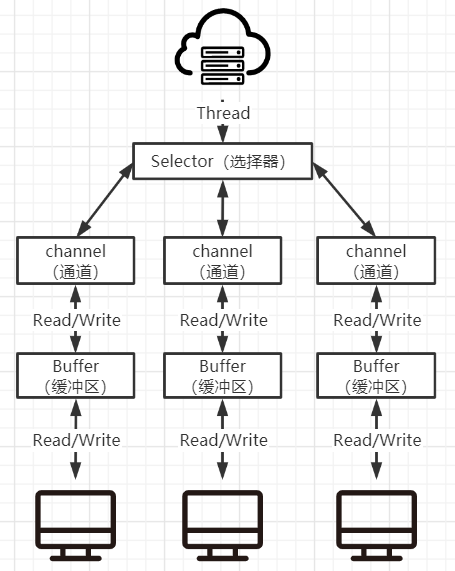
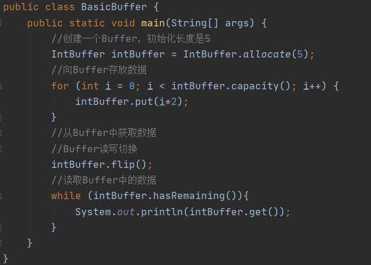

# JAVA-NIO

## NIO基本介绍

1. JAVA NIO全称java non-blocking IO，是JDK提供的新API，从JDK1.4开始，java提供了一系列改进输入/输出的新特性，被称为NIO，是同步非阻塞的
2. NIO相关类都被放在java.nio包下，并且对原来java.io包中有很多的类进行改写
3. NIO有三大核心部分：Channel（通道），Buffer（缓冲区），Selector（选择器）
4. NIO是面向缓冲区，或者面向块的编程，数据读取到一个稍后会处理的缓冲区，需要时可在缓冲区中前后移动，这就增加了处理过程中的灵活性，使用他可以提供非阻塞式的高伸缩性网络

5. java NIO的非阻塞模式，是一个线程维护着一个选择器（Selector），客户端读/写操作而不是直接对接线程，而是先进入缓冲区，通道（channel）从缓冲区获取相应事件，准备好读/写事件后通道会通知选择器（Selector）来执行，只对准备好的通道进行数据的读写操作，当前通道没有读写事件，而不是阻塞等待事件，可能去处理其它已经准备好了的通道，这样从而达到了一个线程可以维护多个客户端读写事件

**NIO关系说明**

1. 每一个Channel都会对于一个Buffer
2. Selector对应一个线程，一个线程对应多个通道（Channel）
3. 该图反应了3个Channel注册到Selector中
4. 程序切换到那个Channel是由事件决定的，Event就是一个重要的概念
5. Selector会根据不同的事件，在各通道上切换
6. Buffer就是一个内存块，底层是一个数组
7. 数据的读取写入是通过Buffer，BIO中要么是输出流，或者是输入流，不能双向的，但是NIO的BUuffer是可以双向读写的，需要flip方法切换
8. Channel是双向的，读写不冲突

## NIO和BIO比较

1. BIO以流的方式处理数据，而NIO以块的方式处理数据，块I/O的效率比流I/O的效率高很多
2. BIO是阻塞的，NIO则是非阻塞的
3. BIO基于字节流和字符流进行操作，而NIO基于Channel（通道）和Buffer（缓冲区）进行操作，数据总是从通道读取到缓冲区中，或者从缓冲区写入到通道中，Selector（选择器）用于监听多个通道的事件（比如：连接请求，数据到达等），因此使用单个线程是可以监听多个客户端通道

## 缓冲区（Buffer）

### 基本介绍

缓冲区（Buffer）其实就是一个可以读写数据的内存块，可以理解成是一个容器对象（数组），该对象提供了一组方法，可以更加轻松的使用内存块，缓冲区对象内置了一些机制，能够跟踪和记录缓冲区的状态变化情况，Channel提供从文件、网络读取数据的渠道，但是读取或写入的数据都必须经由Buffer，以下是Buffer的一个小例子

### Buffer类及子类

在NIO中，Bufffer是一个顶层父类，它是一个抽象类，除了Boolean其它数据类型都有Buffer的实现类

| 类           | 说明                   |
| ------------ | ---------------------- |
| ByteBuffer   | 存储字节数据到缓冲区   |
| ShortBuffer  | 存储字符串数据到缓冲区 |
| CharBuffer   | 存储字符数据到缓冲区   |
| IntBuffer    | 存储整数数据到缓冲区   |
| LongBuffer   | 存储长整型数据到缓冲区 |
| DoubleBuffer | 存储双精度小数到缓冲区 |
| FloatBuffer  | 存储单精度小数到缓冲区 |

Buffer类定义了所有缓冲区都具有的四个属性来提供关于其所包含的数据元素的信息

| 属性     | 描述                                                         |
| -------- | ------------------------------------------------------------ |
| Capacity | 容量，就是这个缓冲区初始化的容量，不能被修改                 |
| Limit    | 表示缓冲区终点，读写的位置不能超越这个下标，他是可变的因为进行读写切换时，Limit就会改变 |
| Position | 将读写的位置，读写一次就会移动一个位置，但是这个位置是不会超越Limit的 |
| Mark     | 标记                                                         |

### Buffer常用方法

| 方法名                                        | 说明                                                         |
| --------------------------------------------- | ------------------------------------------------------------ |
| public final int capacity()                   | 返回此缓冲区的容量                                           |
| public final int position()                   | 返回此缓冲区的位置                                           |
| public final Buffer position(int newPosition) | 设置此缓冲区的位置                                           |
| public final int limit()                      | 返回此缓冲区的限制                                           |
| public final Buffer limit(int newLimit)       | 设置此缓冲区的限制                                           |
| public final Buffer clear()                   | 清除缓冲区，这里其实只是把缓冲区所有标注位设为初始的时候，写数据覆盖旧的并不是直接清空旧缓冲区 |
| public final boolean hasRemaining()           | 获取当前位置和限制之间是否有元素                             |
| public abstract boolean isReadOnly()          | 查询这个缓冲区是否只读的                                     |

### ByteBuffer

ByteBuffer是Buffer的子类，由于我们是网络编程传输大多是二进制，所以这里只说一下ByteBuffer的主要方法即可

| 方法                                              | 说明                                  |
| ------------------------------------------------- | ------------------------------------- |
| public static ByteBuffer allocateDirect           | 创建直接缓冲区                        |
| public static ByteBuffer                          | 设置缓冲区的初始容量                  |
| public abstract byte get()                        | 获取当前位置数据，get后position会+1   |
| public abstract byte get(int index)               | 获取指定位置数据position不变          |
| public abstract ByteBuffer put(byte b)            | 从当前位置添加数据，put后position会+1 |
| public abstract ByteBuffer put(int index, byte b) | 从指定位置上put数据position不变       |

### 使用ByteBuffer

#### ByteBuffer读写操作

#### ByteBuffer获取只读

#### ByteBuffer类型化操作

ByteBuffer可以按类型put不过再读取时也要使用相同类型get否则可能会出现异常，或者获取的数据于写入数据不一致

## 通道（Channel）

### 基本介绍

1. 通道可以同时进行读写操作，而流只能读或只能写

2. 通道可以实现异步读写数据

3. 通道可以从缓冲区（Buffer）读数据，也可以把数据写入缓冲区（Buffer）

4. 常用的Channel类有：FileChannel、DatagtamChannel、ServerSocketChannel和SocketChannel

**ServerSocketChannel与SocketChannel关系**：当一个客户端连接到我们的Server时ServerSocketChannel会为这个客户端分配一个SocketChannel，SocketChannel中有一条通道（Channel），ServerSocketChannel是一个抽象类真正的实现类是ServerSocketChannelImp，SocketChannel的实现类是SocketChannelImp

**FileChannel**：用于文件的数据读写

**DatagtamChannel**：用于UDP的数据读写

**ServerSocketChannel与SocketChannel**：用于TCP的数据读写

### FileChannel

FileChannel主要用于对本地文件进行IO操作，常用如下

| 方法                                                         | 说明                                        |
| ------------------------------------------------------------ | ------------------------------------------- |
| public int read(ByteBuffer var1)                             | 从通道（Channel）读取数据到缓冲区（Buffer） |
| public int write(ByteBuffer var1)                            | 从缓冲区（Buffer）读取数据到通道（Channel） |
| public long transferFrom(ReadableByteChannel var1, long var2, long var4) | 从目标通道复制数据到当前通道                |
| public long transferTo(long var1, long var3, WritableByteChannel var5) | 把数据从当前通道复制到目标通道              |

### ServerSocketChannel

ServerSocketChannel在服务端监听新的客户端Socket连接

| 方法                                                         | 说明                                         |
| ------------------------------------------------------------ | -------------------------------------------- |
| public static ServerSocketChannel open()                     | 获取一个ServerSocketChannel通道              |
| public final ServerSocketChannel bind(SocketAddress local)   | 设置服务器端口号                             |
| public final SelectableChannel configureBlocking(boolean block) | 设置阻塞或非阻塞，false表示使用非阻塞模式    |
| public abstract SocketChannel accept()                       | 接受一个连接，返回生成这个连接对应的通道对象 |
| public final SelectionKey register(Selector sel, int ops)    | 把当前通道注册到指定选择器中，并设置监听事件 |

### SocketChannel

SocketChannel，由ServerSocketChannel为每一个连接的客户端创建的网络IO通信，具体负责进行读写操作，NIO把缓冲区的数据写入通道，或者把通道的数据读到缓冲区

| 方法                                                         | 说明                                         |
| ------------------------------------------------------------ | -------------------------------------------- |
| public static SocketChannel open()                           | 获取一个SocketChannel通道                    |
| public final SelectableChannel configureBlocking(boolean block) | 设置阻塞或非阻塞，false表示使用非阻塞模式    |
| public abstract boolean connect(SocketAddress remote)        | 尝试连接服务器，false表示连接失败            |
| public abstract boolean finishConnect()                      | 如connect连接失败，需使用该方法再次尝试连接  |
| public abstract int write(ByteBuffer src)                    | ByteBuffer写数据到通道里面                   |
| public abstract int read(ByteBuffer dst)                     | ByteBuffer从通道读数据                       |
| public final SelectionKey register(Selector sel, int ops)    | 把当前通道注册到指定选择器中，并设置监听事件 |
| public final void close()                                    | 关闭通道                                     |

### 使用Channel

Channel的使用流程图基本如下

输入操作：首先我们需要获取InputStream再获取到Channel，使用Buffer从Channel中把数据读取出来，然后可以对Buffer中的数据进行任意操作了

输出操作：首先需要获取OutputStream再获取到Channel，先把要输出的数据存入Buffer，然后使用Buffer把数据写入Channel

#### 把字符串写入到文件

#### 读取文件输出到控制台

#### 使用缓冲区拷贝文件

#### 直接通过通道拷贝文件

#### 直接在内存中对文件内容修改

使用mappedByteBuffer可以直接在内存中对文件内容进行修改，无需拷贝文件，使用的是**堆外内存**

#### 使用Buffer数组处理通道

~~~java
/**
 * @Author: LZJ
 * @Date: 2020/9/19 18:16
 * @Version 1.0
 * Scattering：将数据写入到buffer时，可以采用buffer数组，依次写入[分散]
 * Gathering：从buffer读取数据时，可以采用buffer数组，依次读取[聚合]
 */
public class ScatteringAndGatheringTest {
    public static void main(String[] args) throws Exception {
        //使用ServerSocketChannel和SocketChannel实现
        ServerSocketChannel serverSocketChannel = ServerSocketChannel.open();
        InetSocketAddress inetSocketAddress = new InetSocketAddress(6666);
        //绑定端口到socket，并启动
        serverSocketChannel.socket().bind(inetSocketAddress);
        //创建2个buffer数组
        ByteBuffer[] byteBuffers = new ByteBuffer[2];
        byteBuffers[0] = ByteBuffer.allocate(5);
        byteBuffers[1] = ByteBuffer.allocate(3);
        //等待客户端连接(telnet)
        SocketChannel socketChannel = serverSocketChannel.accept();
        int msgLength = 8; //假定从客户端只接收8个字节
        //循环读取
        while (true){
            int byteRead = 0;
            while (byteRead < msgLength){
                //byteBuffers数组从socketChannel通道中读取数据
                long read = socketChannel.read(byteBuffers);
                byteRead += read; //累计读取的字节数
                System.out.println("byteRead="+byteRead);
                //使用流打印,查看byteBuffers数组 每个当前buffer的position和limit
                Arrays.asList(byteBuffers).stream().map(buffer -> "position="+ buffer.position() + ",limit=" + buffer.limit()).forEach(System.out::println);
            }
            //将所以的buffer进行flip 读写读写切换
            Arrays.asList(byteBuffers).forEach(buffer -> buffer.flip());
            //将数据读出显示到客户端
            long byteWrite = 0;
            while (byteWrite < msgLength){
                //byteBuffers数组内容写入socketChannel通道中
                long write = socketChannel.write(byteBuffers);
                byteWrite += write;
            }
            //将所有的buffer 进行cleat操作
            Arrays.asList(byteBuffers).forEach(buffer -> buffer.clear());
            System.out.println("byteRead="+byteRead + ",byteWrite=" + byteWrite + ",msgLength" + msgLength);
        }
    }
}
~~~

## 选择器（Selector）

### 基本介绍

1. java的NIO，使用非阻塞的IO方式，可以用一个线程，处理多个客户端的连接，就会使用到选择器（Selector）
2. Selector能够检测多个注册的通道（Channel）上是否有事件发生，多个通道（Channel）可以同时注册到一个Selector，如果某一个通道有事件发生，就会获取事件然后针对每一个事件进行相应的处理，这样就可以用一个线程去维护多个通道（Channel），一个通道对应一个连接，就是一个Selector可以管理多个连接
3. 只有通道真正需要进行读写事件时，才会进行读写就会大大的减少了系统的开销，并且不用为每一个连接创建一个线程
4. Selector维护着一个SelectionKeys是一个Set容器里面存放着所有连接注册进来的客户端，每次Selector监听时其实就是查看SelectionKeys容器所有连接有没有事件，有事件发生就会将来提取出来装起来，最后返回一个装着有事件的SelectionKey容器，通过遍历容器获取对应的channel继续业务操作

### Selector

Selector常用方法

| 方法                                             | 说明                                                         |
| ------------------------------------------------ | ------------------------------------------------------------ |
| public static Selector open()                    | 获取一个选择器对象                                           |
| public abstract int select(long timeout)         | 监控所有注册的通道，当其中有通道需进行IO操作，将对应的SelectionKey加入到内部集合中并返回，参数用来设置超时时间 |
| public abstract Set<SelectionKey> selectedKeys() | 获取Selector中有事件发送的通道对应的SelectionKey             |

**Selector注意事项**

~~~java
//阻塞，等待至少有一个事件发生才会返回
selector.select(); 
//阻塞1000毫秒，在1000毫秒后不管有没有事件都返回
selector.select(1000); 
//唤醒阻塞中的selector，立马返回
selector.wakeup(); 
//不阻塞，就去监听一下，有没有都立马返回
selectoe.selectNow(); 
~~~

### SelectionKey

SelectionKey是用来存放注册在Selector中的连接的客户端通道，Selector监听到有事件发生时会把对应通道的SelectionKey存放到Set容器中，通过遍历容器调用selectionKey.channel()获取对应的通道完成业务操作，常用方法

| 方法                                              | 说明                                     |
| ------------------------------------------------- | ---------------------------------------- |
| public abstract Selector selector()               | 获取当前SelectionKey是归属的Selector对象 |
| public abstract SelectableChannel channel()       | 获取当前SelectionKey对应的通道           |
| public final Object attachment()                  | 获取关联的共享数据                       |
| public abstract SelectionKey interestOps(int ops) | 设置注册时指定的buffer                   |
| public final boolean isAcceptable(                | 是否可accetp                             |
| public final boolean isReadable()                 | 是否可读                                 |
| public final boolean isWritable()                 | 是否可写                                 |

## NIO非阻塞网络编程流程再次梳理

1. 首先把ServerSocketChannel注册到Selector中监听连接事件
2. SelSelector.select开始监听，监听到事件后会返回一个SelectionKey容器，可以通过容器获取相应的事件通道，监听到不同的事件会进行不同的处理
3. 如果是ServerSocketChannel有连接事件时，这时ServerSocketChannel为客户端创建一个SocketChannel，使用SocketChannel的register方法，将SocketChannel注册到Selector上（一个Selector可以注册多个SocketChannel）

3. 如果是普通读写操作时，通过SelectionKey.channel()可以得到SocketChannel如果对当前SocketChannel进行相应的操作
4. 完成后SelectionKey.remove()把当前有事件的Chanel容器清理，继续Selector.select监听有通道有事件时又会得到一个SelectionKey一直重复2-3-4的步骤

## NIO非阻塞网络编程例子

#### 服务端

~~~java
public class NIOServer {
    public static void main(String[] args) throws Exception {
        //创建ServerSocketChannel
        ServerSocketChannel serverSocketChannel = ServerSocketChannel.open();
        //得到一个Select对象
        Selector selector = Selector.open();
        //绑定监听端口6666
        serverSocketChannel.socket().bind(new InetSocketAddress(6666));
        //设置非阻塞模式
        serverSocketChannel.configureBlocking(false);
        //把serverSocketChannel注册到selector中关心事件为 OP_ACCEPT(连接事件)
        serverSocketChannel.register(selector, SelectionKey.OP_ACCEPT);
        //循环等待客户端连接
        while (true){
            if (selector.select(1000) == 0){//阻塞1秒 返回0 没有事件发生
                System.out.println("服务器等待1秒，无连接发生");
                continue;
            }
            //如果返回>0，表示有事件发生
            //selector.selectedKeys()返回有事件的集合
            Set<SelectionKey> selectionKeys = selector.selectedKeys();
            //使用迭代器遍历集合
            Iterator<SelectionKey> keyIterator = selectionKeys.iterator();
            while (keyIterator.hasNext()){
                //获取SelectionKey
                SelectionKey selectionKey = keyIterator.next();
                //根据SelectionKey对应的通道发生的事件做相应的处理
                if (selectionKey.isAcceptable()){ //连接事件 OP_ACCEPT
                    //给连接的客户端生成一个SocketChannel
                    SocketChannel socketChannel = serverSocketChannel.accept();
                    //将来当前的socketChannel注册到selector上
                    //关注事件读（OP_READ） 指定一个ByteBuffer给它
                    socketChannel.register(selector,SelectionKey.OP_READ, ByteBuffer.allocate(1024));
                }
                if (selectionKey.isReadable()){//读取事件 OP_READ
                    //通过key 方向获取对应的channel
                    SocketChannel channel = (SocketChannel) selectionKey.channel();
                    //获取到该channel指定的buffer
                    ByteBuffer buffer = (ByteBuffer)selectionKey.attachment();
                    channel.read(buffer);
                    System.out.println("form 客户端 " + new String(buffer.array()));
                }
                //手动从集合中移除当前的selectionKey，防止重复操作
                keyIterator.remove();
            }
        }
    }
}
~~~

#### 客户端

~~~java
public class NIOClient {
    public static void main(String[] args) throws Exception {
        //得到一个网络通道
        SocketChannel socketChannel = SocketChannel.open();
        //设置非阻塞
        socketChannel.configureBlocking(false);
        //要连接的服务端的ip和端口
        InetSocketAddress inetSocketAddress = new InetSocketAddress("127.0.0.1", 6666);
        //连接服务器
        if (!socketChannel.connect(inetSocketAddress)){ //尝试连接服务端

            while (!socketChannel.finishConnect()){ //未连接成功，一直尝试连接
                System.out.println("客户端正在尝试连接服务端");
                System.out.println("因为连接需要时间，客户端不会阻塞，可以做其它工作");
            }

        }
        //..如果连接成功，发生数据
        String str = "Hello,world";
        //使用wrap 包裹一个字节数组 字节转成buffer
        ByteBuffer buffer = ByteBuffer.wrap(str.getBytes());
        //发送数据，将来buffer数据写入channel
        socketChannel.write(buffer);
        System.in.read();
    }
}
~~~

