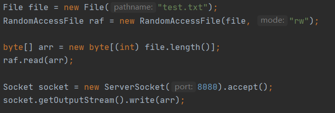
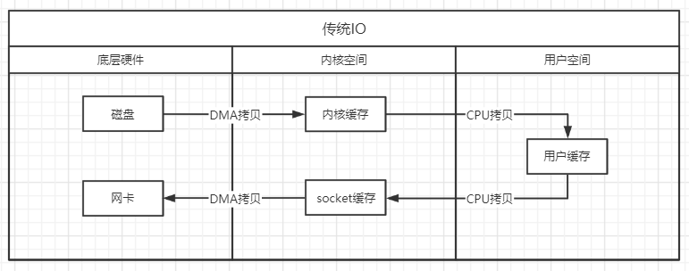
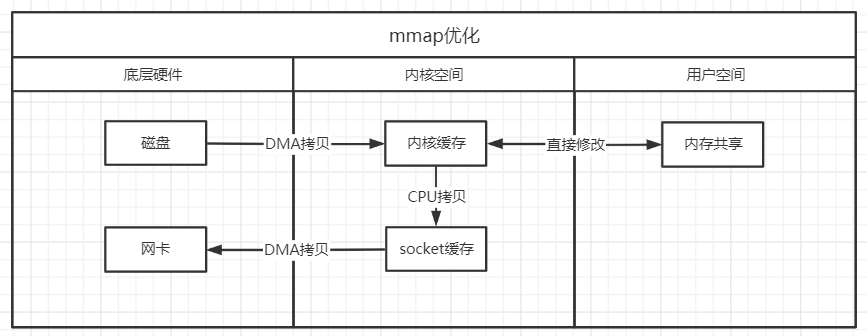
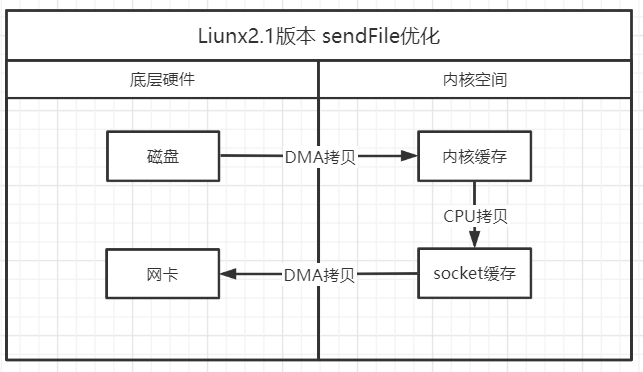
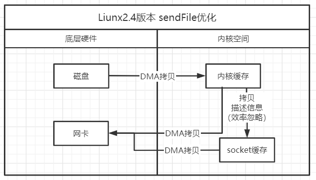

# NIO性能优化

## NIO零拷贝

### 基本介绍

1. 零拷贝是网络编程的关键，很多性能优化都离不开
2. 在java程序中，常用的零拷贝有两种mmap(内存映射)和sendFile

### 传统JAVAIO

传统的javaio的拷贝次数

传统的javaio流程如下，首先进行一次DMA拷贝(直接拷贝)把数据从硬件拷贝到计算机内核，使用CPU拷贝将系统内核数据拷贝到用户内核下，将来用户内核数据拷贝到Socket缓存中，将来Socket缓存中的数据拷贝到网卡中，这里总共经历了4次的文件拷贝，和3次切换

### mmap优化

mmap优化，通过内存映射，将来文件映射到内核缓冲区，同时用户空间可以共享内核空间的数据，这样省去了把内核数据拷贝到用户空间步骤，用户可以直接修改内核中的数据，修改完成后使用CPU拷贝直接把内核缓存拷贝到Socet缓存中，mmap并没有实现零拷贝只是相对传统的IO减少了一次拷贝，总共经历了3次拷贝，3次切换

### sendFile优化

Linux2.1版本，提供了sendFile函数，基本流程如下，数据根本不经过用户空间，直接从内核缓冲区进入到SocketBuffer，同时用于和用户空间完全无关，就减少了一次上下文切换，总共经历了3次拷贝，2次切换

Linux2.4版本，做了一些修改，内核只拷贝描述信息到SocketBuffer，由于描述信息很小效率可以忽略不计，主要数据内核可以直接通过DMA拷贝拷贝到协议栈中，从而再次减少了数据拷贝，总共经历了2次拷贝，2次切换（实现零拷贝）

**零拷贝说明**：相对系统来说DMA拷贝是无法去掉的，DMA拷贝意思就是硬件直接拷贝到内存，这个步骤是无法省略，硬件不拷贝内存我们就无法进行其它操作了，2次DMA拷贝是必要操作，所以相对操作系统来说2次拷贝已经是零拷贝了

### mmap和sendFile的区别

1. mmap适合小数据量读写，sendFile适合大文件传输
2. mmap需要4次上下文切换，3次数据拷贝；sendFile需要3次上下文切换，最少2次数据拷贝
3. sendFile可以利用DMA方式，减少CPU拷贝，mmap则不能(必须从内核拷贝到Socket缓冲区)

### 零拷贝例子

#### 服务端

~~~java
public class ZeroIOServer {
    public static void main(String[] args) throws IOException {
        InetSocketAddress address = new InetSocketAddress(7001);
        ServerSocketChannel serverSocketChannel = ServerSocketChannel.open();
        ServerSocket serverSocket = serverSocketChannel.socket();
        serverSocket.bind(address);
        //创建一个buffer
        ByteBuffer byteBuffer = ByteBuffer.allocate(4096);
        while (true){
            SocketChannel socketChannel = serverSocketChannel.accept();

            int readCount = 0;
            while (-1 != readCount){
                try {
                    readCount = socketChannel.read(byteBuffer);
                }catch (Exception e){
                    e.printStackTrace();
                    break;
                }
                byteBuffer.rewind();//倒带
            }
        }

    }
}
~~~

#### 客户端

~~~java
public class ZeroIOClient {
    public static void main(String[] args) throws Exception {
        SocketChannel socketChannel = SocketChannel.open();
        socketChannel.connect(new InetSocketAddress("localhost",7001));
        String fileName = "src/main/resources/file01.txt";
        //得到一个文件的channel
        FileChannel fileChannel = new FileInputStream(fileName).getChannel();
        //准备发送
        long startTime = System.currentTimeMillis();
        //在linux下一个transferTo 方法
        //在Windows下一次调用transferTo 只能发送8M的文件，需要分段，而且要注意传输位置
        //transferTo底层使用到零拷贝
        long transferCount = fileChannel.transferTo(0, fileChannel.size(), socketChannel);
        System.out.println("发送的总的字节数 ="+transferCount + " 耗时"+(System.currentTimeMillis() - startTime));
        fileChannel.close();
    }
}
~~~

