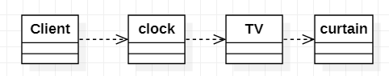
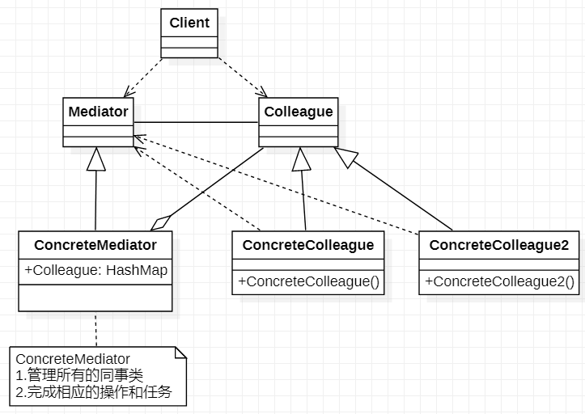
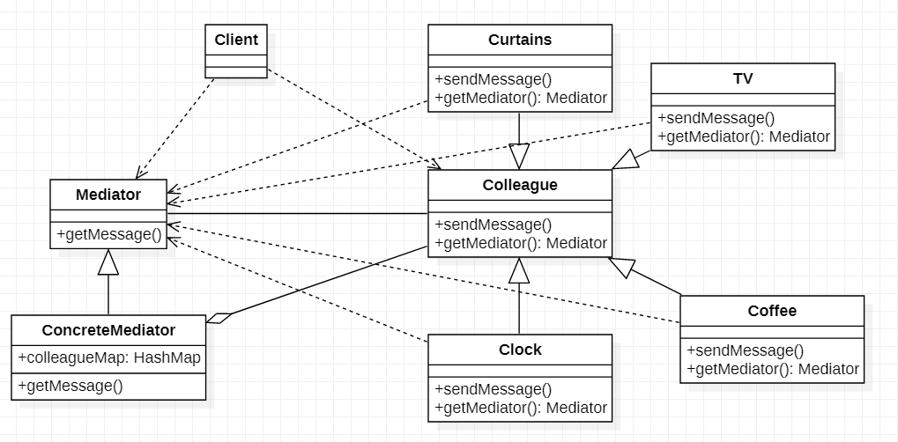
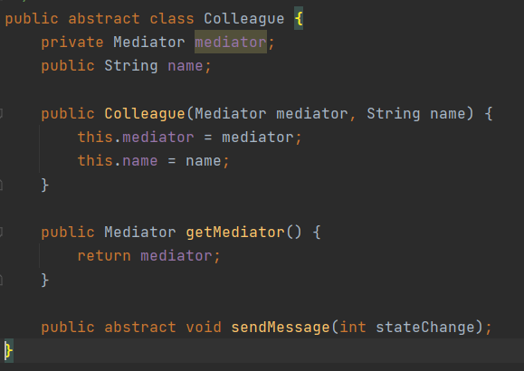
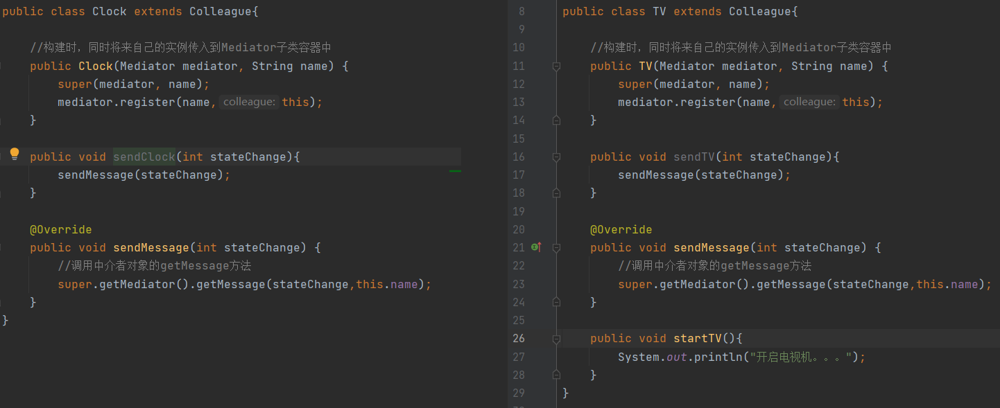
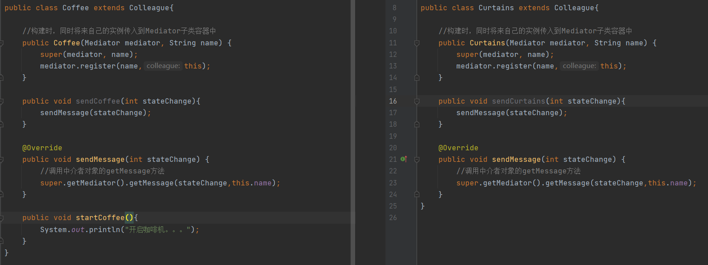
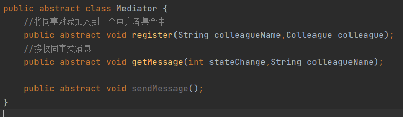
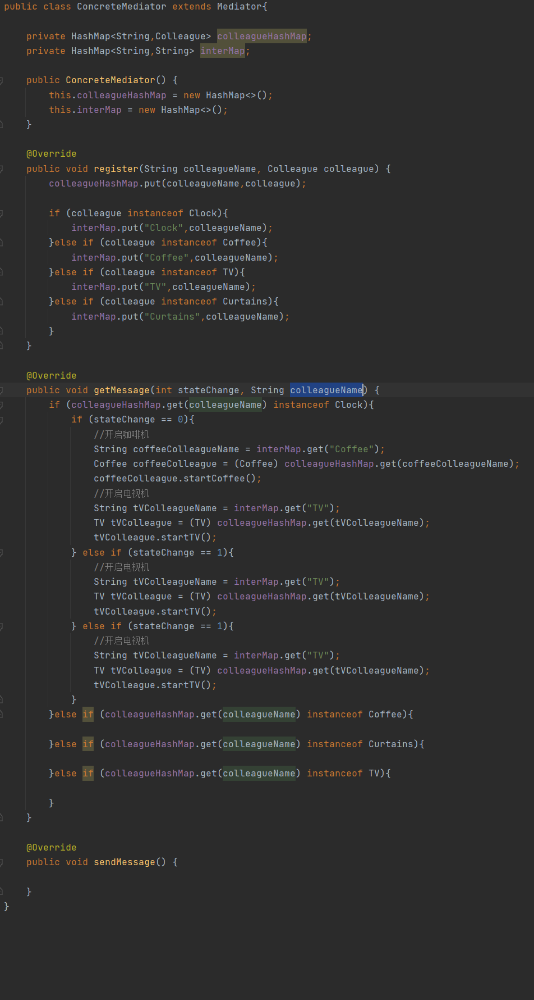
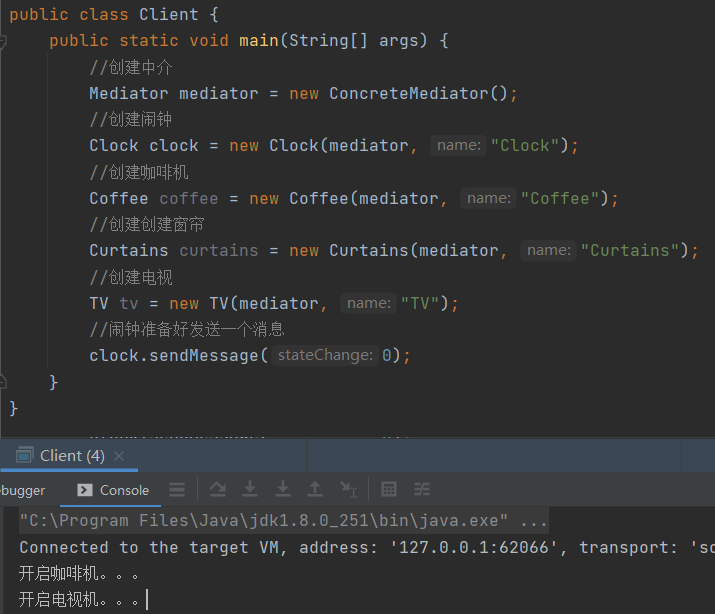

# 中介者模式

> 中介者模式将围绕着智能家居项目简介

1. 智能家庭包括各种设备，闹钟、咖啡机、电视机、窗帘等
2. 主人要看电视时，各个设备可以协同工作，自动完成看电视的准备工作，比如流程为：闹钟响起=>咖啡机开始工作=>窗帘自动落下=>电视机开始播放

## 传统解决方案

> client调用clock开启方法，clock开启完毕后，调用TV开启方法，TV开启完毕后调用curtain开启方法

### 传统解决方案总结

1. 缺点：但各电器对象有多种状态改变时，相互之间的调用关系会比较复杂
2. 缺点：各个电器对象彼此联系，相互聚合，不利于松耦合
3. 各电器之间所传递的消息（参数），容易混乱
4. 当系统增加一个新的电器对象时，或者执行流程改变时，代码的可维护性、扩展性都不理想=>使用中介者模式

## 中介者模式解决方案

### 基本介绍

>1. 中介者模式（Mediator Pattern），用一个中介对象来封装一些列的对象交互，中介者使用各对象不需要显示的相互引用，从而使其耦合松散，而且可以独立的改变它们之间的交互
>2. 如MVC模式，C（Controller）控制器是M（Model）模型和V（View）视图的中介者，在前后端交互时起到中间人作用
>
>Mediator：是一个抽象中介者，定义了同事对象到中介者对象的接口
>
>Colleague：是一个抽象的同事类
>
>ConcreteMediator：是一个具体的中介者对象，继承了Mediator实现了相应的抽象方法，并且有集合保持着所有同事类，并接收莫同事对象的消息完成相应任务
>
>ConcreteColleague：具体的同事类，会有多个，每一个同事只知道自己的方法，与其它同事类无关联，它们都共同依赖着Mediator对象

### 中介者模式解决智能家居

> Colleague：一个抽象同事类，主要负责发送消息给中介（Mediator）中介收到相应的消息后会进行处理
>
> Curtains/TV/Clock/Coffee：智能家居继承Colleague实现sendMessage方法
>
> Mediator：一个抽象的中介者，提供一个getMessage抽象方法
>
> ConcreteMediator：具体的中介者实现继承Mediator，其中维护者一个Colleague容器，当其中一个同事调用sendMessage其实是调用了Mediator的getMessage方法，ConcreteMediator会通过不同的msg然后从Colleague取出相应的智能家居做一连串的动作，注意这里做的动作全部都在ConcreteMediator完成

#### Colleague

> Colleague：一个抽象的同事类，构造方法传入一个中介类初始化，getMediator方法返回中介对象，sendMessage是一个抽象方法用于给子类实现发送消息给中介的一个方法

#### Clock/TV

> Clock/TV：闹钟与电视智能家居，构建时会将自己注册到中介者中，继承Colleague重写了父类方法，tv额外写了一个startTv的方法用于开启电视机

#### Coffee/Curtains

> Coffee/Curtains：咖啡与窗帘智能家居，构建时会将自己注册到中介者中，继承Colleague重写了父类方法，Coffee额外写了一个startCoffee的方法用于开启咖啡机

#### Mediator

> Mediator：抽象的中介者，定义了3个重要的方法

#### ConcreteMediator

> ConcreteMediator：具体的智能家居控制中心，里面维护者一个智能家居的集合，register注册智能家居时会按照不同类型的智能家居进行分类，getMessage重点方法，该方法是接收智能家居方法，并且做出相应的处理

#### Client

> 当闹钟准备好了，sendMessage消息给中介者，中介者在getMessage收到当前消息做出判断，需要开启闹钟和咖啡机

### 中介者模式总结

1. 优点：使用中介者将解决个类之间相互依赖/调用的问题，将各类之间又网状结构优化成星型结构
2. 优点：减少类之间的依赖，降低耦合，符合迪米特原则
3. 缺点：中介者承担的责任比较多，一旦中介者出问题后，整个系统会受到影响
4. 缺点：如果设计不当，中介者会变的更加复杂