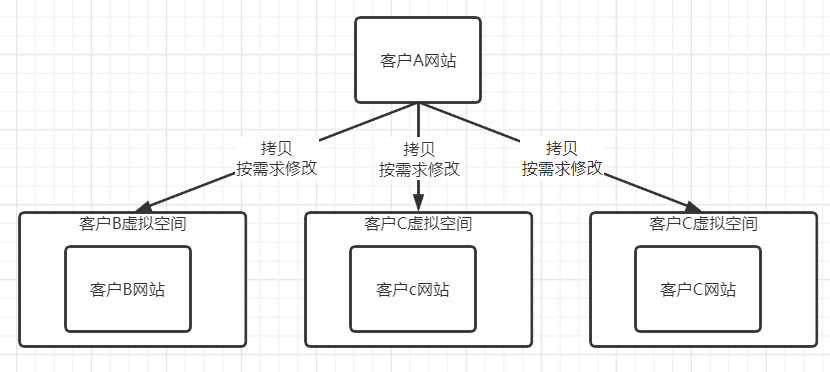
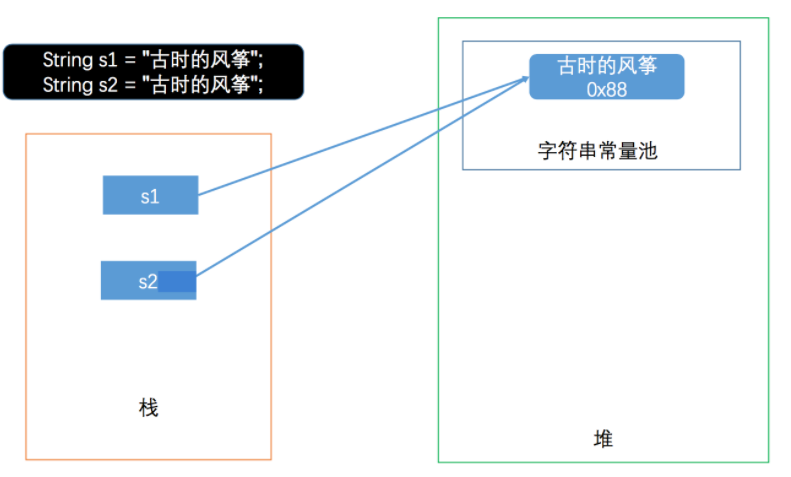
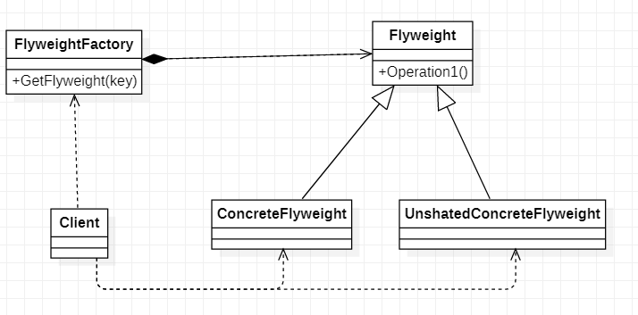
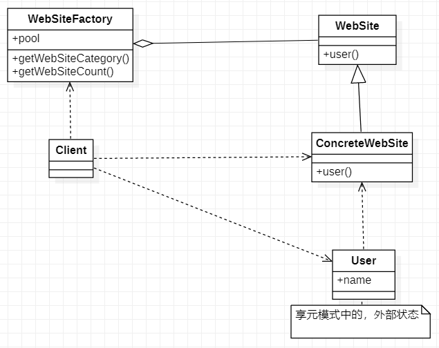
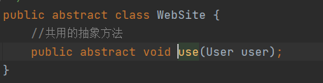
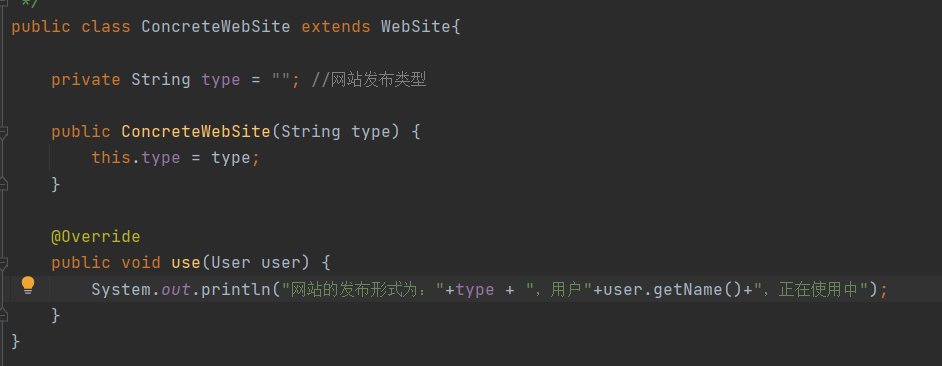
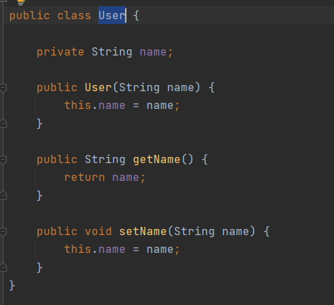
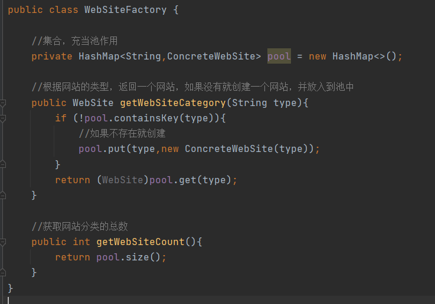
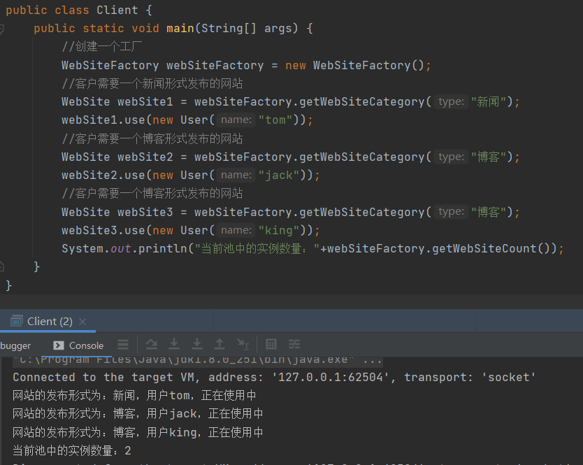

# 享元模式

> 享元模式将围绕着一个小型网站外包项目讲解

有一个小型外包项目，给客户A做一个产品展示网站，客户A的朋友感觉效果不错，也希望做这样的产品展示网站，但是要求一些不同

1. 有客户要求以新闻的形式发布
2. 有客户要求以博客发形式发布
3. 有客户要求以公众号的形式发布

## 传统解决方案

> 1. 直接复制粘贴一份，然后根据客户不同需求，进行定制修改
> 2. 给每一个网站租用一个空间

### 传统解决方案总结

1. 需要的网站结构相似度很高，而且都不是高访问量网站，如果分成多个虚拟空间来处理，相当于一个相同网站实例对象很多，造成服务器的资源浪费
2. 解决思路：整合到一个网站中，共享相关代码和数据，对硬盘、内存、CPU、数据库空间等服务器资源可以达成共享，减少服务器资源，享元模式

## 享元模式解决方案

### 基本介绍

1. 享元模式（Flyweight Pattern）也叫蝇量模式，运用共享技术有效地支持大量细粒度的对象
2. 常用于系统底层开发，解决系统的性能问题，像数据库连接池，里面都是创建好的连接对象，在这些连接对象中有我们需要的则直接使用，避免重新创建，如果没有我们需要的，则创建一个
3. 享元模式能够解决重复对象的内存浪费的问题，当系统中有大量相似对象，需要缓冲池时，不需要总是创建新对象，可以从缓冲池里拿，这样可以降低系统内存，同时提供效率
4. 享元模式经典应用场景就是池技术，String常量池、数据库连接池、缓冲池等都是享元模式的应用，享元模式是池技术的重要实现

### 类图说明

> 1. FlyWeight：是抽象的享元角色，它是产品的抽象类，同时定义出对象的外部状态和内部状态
> 2. ConcreteFlyweight：具体的享元角色，具体的产品类，实现抽象角色定义的相关业务
> 3. UnshatedConcreteFlyweight：不可共享的角色，一般不会出现在享元工厂（FlyweightFactory）中
> 4. FlyweightFactory：享元工厂，用于构建一个池的容器（集合），提供从池中获取对象的方法
>
> **外部状态和内部状态说明**
>
> 1. 内部状态：指对象共享出来的信息，存储在享元对象内部且不会随环境的改变而改变
> 2. 外部状态：指对象得以依赖的一个标记，是随环境改变而改变的，不可共享的状态
> 3. 举例子：如一个围棋比赛，其中棋子就是内部状态，因为围棋棋子只有2种，黑色和白色，而棋子的位置是外部状态，因为棋子的位置我们是随时变化的，假设我们不用享元模式设计围棋比赛，那么选手每下一个棋子就会new一个棋子对象在适当的位置，一盘围棋下来极端情况，我们需要new300多个棋子对象，假如我们通过享元模式设计，那我们的最多就2个棋子对象，因为棋子就2种黑色和白色，它们不停的在被复用

### 享元模式实现

#### WebSite

> WebSite：一个产品的抽象类，里面提供了一个抽象方法

#### ConcreteWebSite

> ConcreteWebSite：具体的享元角色，实现WebSite抽象方法，其中type是内部状态，因为网站类型只有固定的几种

#### User

> User：外部状态，因为使用网站的用户有成千上百的，user是外部状态类，在ConcreteWebSite对象中是通过参数的方式传入

#### WebSiteFactory

> WebSiteFactory：享元工厂，该工厂维护着一个ConcreteWebSite容器，需要获取一个指定类型网站需通过享元工厂获取，享元工厂管理着对象实例的初始化数量，确保实例共享性

#### Client

> 客户端，在使用时，可以看到获取任何类型的网站都需要通过工厂获取，工厂在返回实例时会判断自己管理的容器中是否存在实例对象，如没有创建，如果有直接返回，从打印的实例数量可以看出，对象实例被共享了而没有重新创建

## 享元模式总结

1. 优点：享元模式可以理解为就是对象共享模式
2. 优点：系统中有大量对象，这些对象会消耗大量的内存，并且对象的状态大部分可以外部化时，我们可以考虑使用享元模式
3. 优点：享元模式可以大大的减少对象的创建，减低内存的占用，提高对象的复用
4. 缺点：享元模式提高了系统的复杂度，需要分离出内部状态和外部状态，而外部状态具有固化特性，不应该随着内部状态改变而改变，这是我们使用享元模式需要注意的地方
5. 注意：使用享元模式是，注意划分内部状态和外部状态，并且需要一个工厂类控制
6. 使用场景：享元模式使用场景，需要缓冲池的场景，如String常量池，数据库连接池