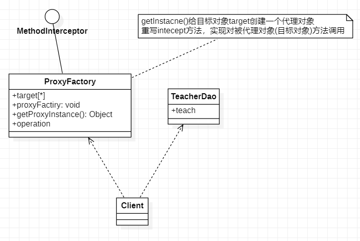

# 代理模式

## 简介

代理模式：为一个对象**提供一个替身**，以控制对这个对象的访问，即通过代理对象，这样做的好处是：可以在目标对象实现的基础上，增强额外的功能操作，即扩展目标对象的功能

被代理的对象可以是远程对象、创建开销大的对象或需安全控制的对象

代理模式有不同的形式，主要有三种**静态代理**、**动态代理(JDK代理、接口代理)**和**Cglib代理(在内存动态创建对象，不需要实现接口完成代理)**

### 静态代理实现

实例要求：如疫情期间，学校不能开学，老师不能上课，老师想到了网课，学生门通过APP来进行上课，APP就可以理解为代理对象，学生们不直接接触老师而是通过APP上课

**具体的实现**

1. 定义一个接口：ITeacherDao
2. 目标对象TeacherDao实现接口ITeacherDao
3. 使用静态代理方式，就需要在代理对象TeacherDaoProxy中也实现ITeacherDao
4. 调用的时候通过调用代理对象的方法来调用目标对象
5. **注意**：代理对象与目标对象要实现相同的接口，然后通过调用相同的方法来调用目标对象的方法

#### ITeacherDao

#### TeacherDao

#### TeacherDaoProxy

#### Client

### 动态代理

1. 动态代理的代理对象，不需要实现接口，但是目标对象要实现接口，否则不能用动态代理
2. 代理对象的生成，是利用JDK的API，动态的在内存中构建代理对象
3. 动态代理也叫JDK代理，接口代理

JDK中生成代理对象的API

1. 代理类所在包：java.lang.reflect.Proxy
2. JDK实现代理只需要使用newProxyInstance方法，但是该方法需要接收三个参数，完整的写法是：static Object newProxyInstance(ClassLoader loager,Class<?>[] interfaces,InvocationHandler h)

#### ITeacherDao

#### TeacherDao

#### ProxyFactory

#### Client

### Cglib代理

1. Cglib代理也叫子类代理，它是在内存中构建一个子类对象从而实现对目标对象功能扩展，有些书也将Cglib代理归属到动态代理
2. Cglib是一个强大的高性能的代码生成包，它可以运行期扩展java类与实现java接口，它广泛的被许多AOP的框架使用，如SpringAOP，实现方法拦截
3. 在AOP编程中如何选择代理模式
   * 目标对象需要实现接口，用JDK代理
   * 目标对象不需要实现接口，用Cglib代理
4. Cglib包的底层是通过使用字节码处理框架ASM来转换字节码生成新类

#### TeacherDao

#### ProxyFactory

#### Client

