# 单例模式

## 简介

单例设计模式，就是采取一定的方法保证整个的软件系统中，对某一个类只能存在一个对象实例，并且该类构造方法是私有的，对外提供一个获取对象的静态方法，在实际开发过程中单例模式有8种写法

## 8种写法

### 饿汉式（静态常量）

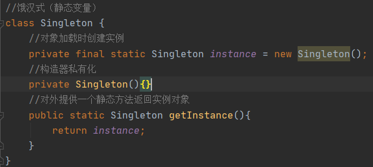

测试

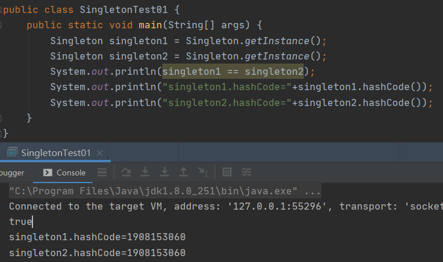

#### 优缺点

1. 优点：这种写法比较简单，就是在类装载的时候就已经完成实例化了，可以避免线程同步问题
2. 缺点：在类转载的时候完成实例化，如果从开始到程序结束都没有使用到这个类，这就会造成内存的浪费
3. 补充：因为这个方式是基于类装载机制避免了多线程同步的问题，instance在类装载时就会被实例化，但是导致类装载的原因有很多种，这样没有使用到该类但是某种原因导致该类也被转载了，造成内存浪费
4. 结论：这种单例模式可用，可能造成内存浪费

### 饿汉式（静态代码块）

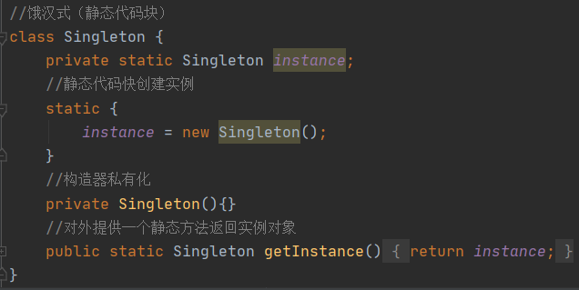

测试

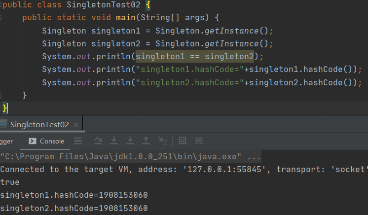

#### 优缺点

1. 这种方式和上面方式其实是差不多的，只不过将实例化过程放在静态代码块中，也是在类装载的时候，就执行静态代码块中的代码，初始化类的实例，优缺点和上面的一样
2. 结论：这种单例模式可用，可能造成内存浪费

### 懒汉式（线程不安全）

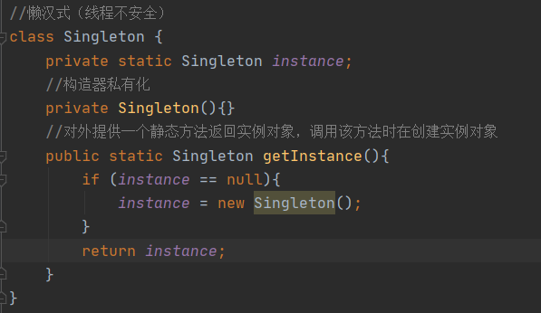

测试

单线程情况下，获取的对象都是一同一个对象

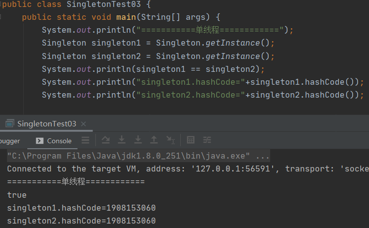

多线程情况下，发生了线程安全问题获取的不是同一对象，违背了单例模式的设计思想

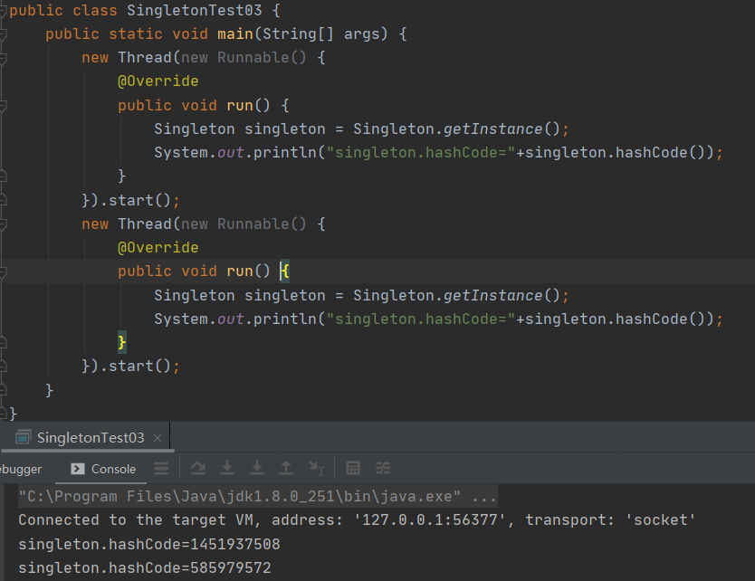

#### 优缺点

1. 起到了懒加载的效果，但是只能在单线程下使用
2. 如果在多线程下，有概率2个线程同时进入if (instance == null)判断语句，他们同时都认为当前对象是null，然后就对对象进行实例化，最后多个线程获取的不是同一个对象
3. 结论：在实际开发中，不要使用这种方式

### 懒汉式（线程安全）

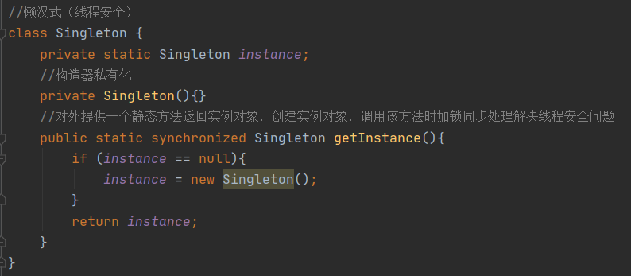

测试

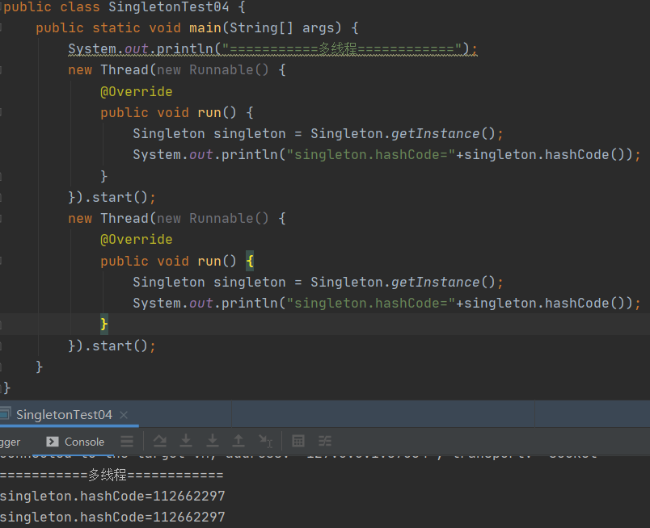

#### 优缺点

1. 优点：解决了线程不安全问题
2. 缺点：效率太低，每次调用getInstance()，因为该方法加了synchronized，所以只能用一个线程进入该方法，其它线程需要等待方法执行后才能进入，如果频繁调用时会让整个程序运行效率很低
3. 结论：在实际开发中，不推荐使用这种方法

### 懒汉式（同步代码块，线程不安全）

经过上一种方法由于synchronized修饰getInstance()会导致很慢，这时可能有人会想到那么，我们在创建对象时加锁不就行了吗，于是就出现了以下写法

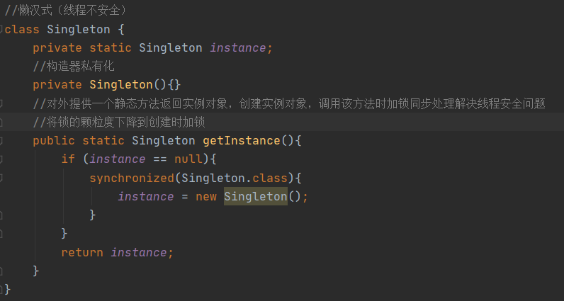

测试

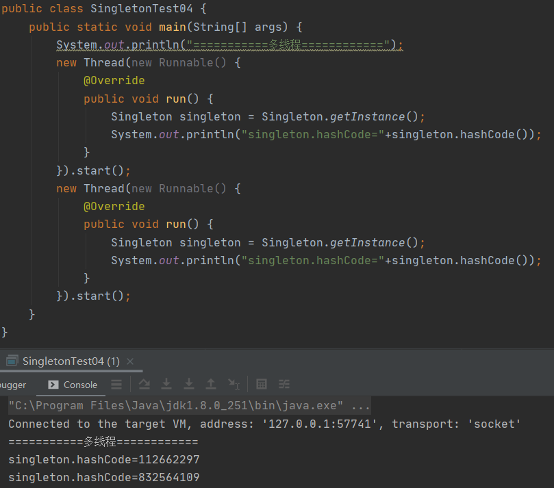

#### 优缺点

1. 这种方法，本意是想对第四种实现的方法进行改进，因为synchronized修饰方法导致方法执行效率低，改成使用同步代码块的方式
2. 但是这种同步并不起到线程安全的作用，因为是否需要实例化该对象取决于if (instance == null)语句，不是你实例化对象的语句，多个线程进入if判断为空那么就会进入创建对象语句，你在创建对象时加锁最后得到的也是多个实例
3. 结论：在实际开发中，不能使用这种方法

### 懒汉式（双重检查）

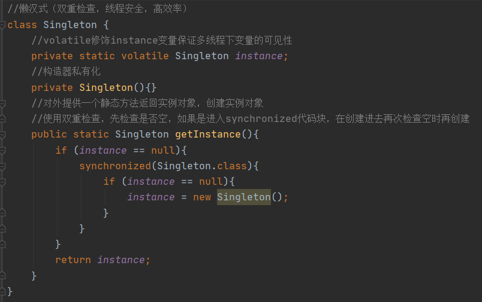

测试

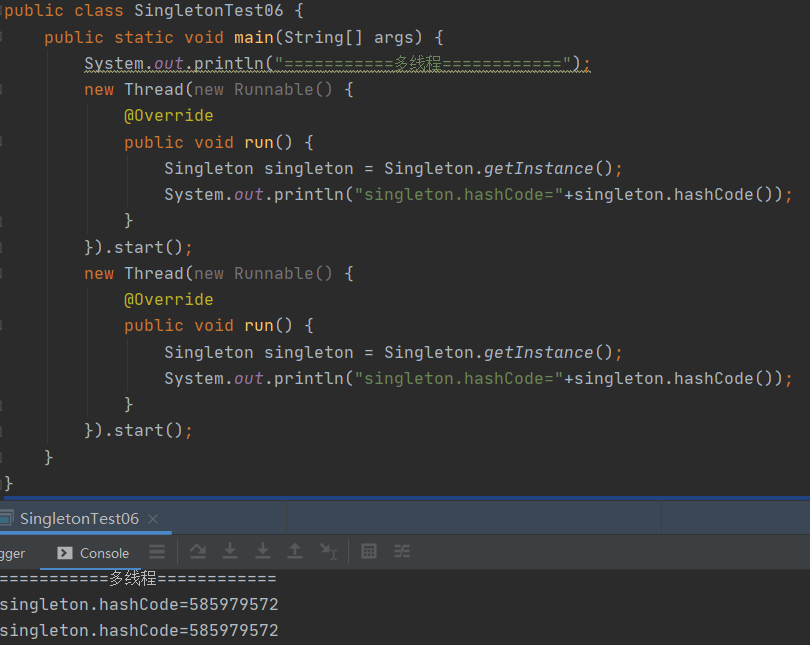

#### 优缺点

1. 双重检查（Double-Check）概念是多线程开发中常使用到的，如代码中所示，我们进行了2次if (instance == null)检查，这样就可以保证最后实例只会有一个线程进入
2. 这样，实例化代码只有执行异常，后面再次访问第一层的if (instance == null)是无锁的，多线程访问直接返回实例化对象，避免了加锁导致程序的效率低
3. 线程安全，延迟加载，效率较高
4. 结论：在实际开发中，推荐使用这种单例模式设计模式

### 懒汉式（静态内部类）

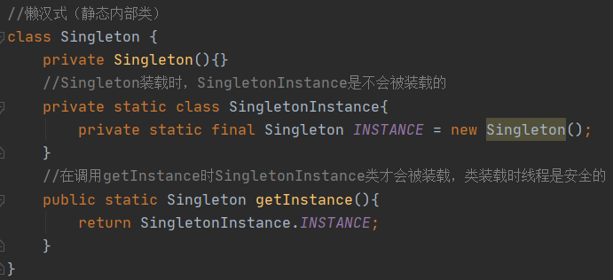

测试

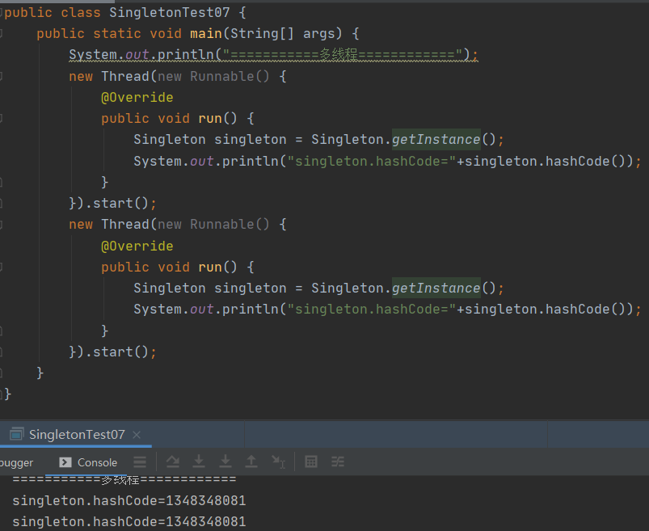

#### 优缺点

1. 使用了静态内部类的特性，静态内部类在外部类被加载时是不会立刻被加载的，当调用getInstance方法时，该静态内部类才会装载，因为jvm的类装载机制是线程安全的
2. 优点：避免了线程不安全，利用静态内部类特点实现延迟加载，效率高
3. 结论：推荐使用

### 懒汉式（枚举类）

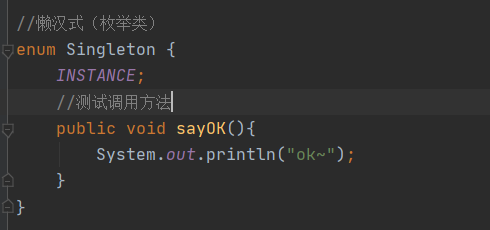

测试

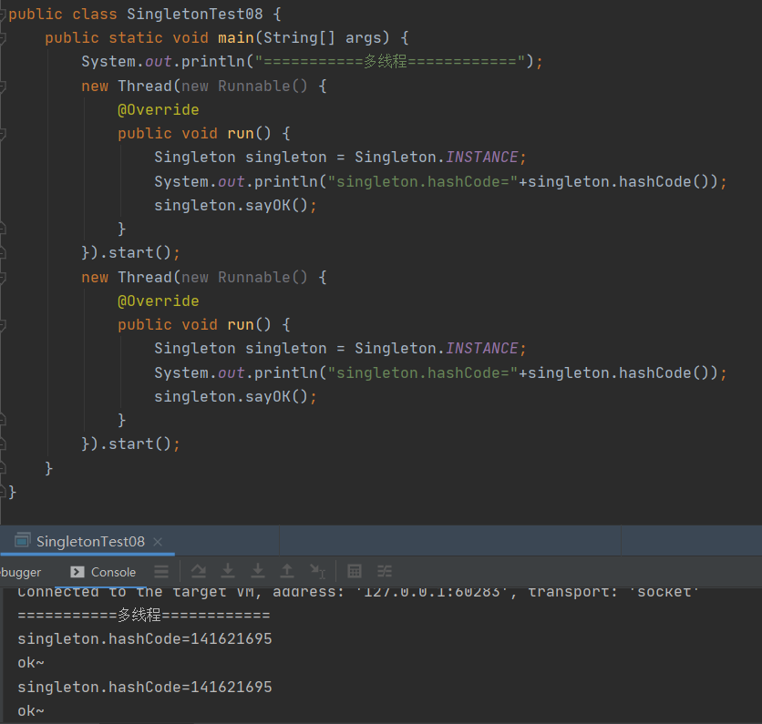

#### 优缺点

1. 借助JDK1.5中添加的枚举来实现单例模式，不仅能避免多线程同步问题，而且还能防止反序列化重新创建新的对象，singleton.sayOK();是可以正常调用枚举类中的方法的
2. 结论：推荐使用

## JDK源码中单例模式应用

java.lang.Runtime使用的就是单例模式，我们可以发现Runtime使用的是单例模式的饿汉式（静态常量）

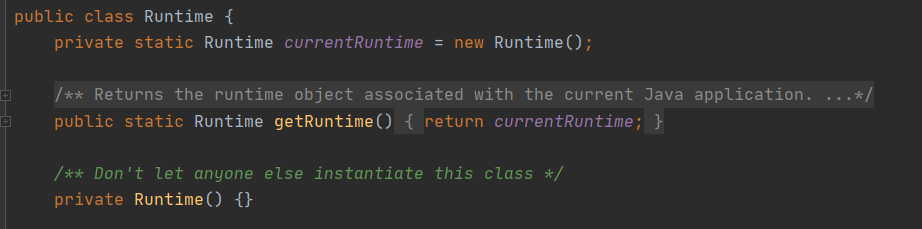

## 单例模式注意事项和细节说明

1. 单例模式保证了系统内存中该类只存在一个对象，节省了系统资源，对于一些需要频繁创建销毁的对象，使用单例模式可以提高性能
2. 当想实例化一个单例类的时候，必须要记住使用相应的获取对象的方法，而不是使用new
3. 单例模式使用场景：需要频繁的进行创建和销毁的对象，创建对象时耗时过多或耗费资源过多（即：重量级对象），经常用的对象、工具类对象、频繁访问数据库或文件的对象（如数据源、session工厂等）