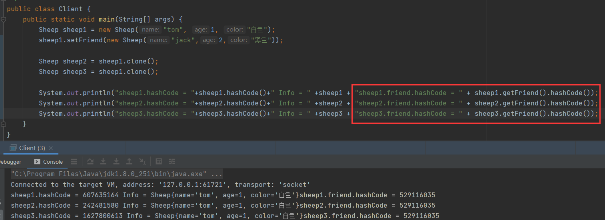

# 原型模式

## 简介

在日常开发中经常会遇到对象克隆等问题，在处理这些问题时如何优雅的编写代码，这时就需要使用到原型模式

如现在有一只羊，名字：tom，年龄：1，颜色：白色，需编写程序创建5只属性完全相同的羊

### 传统方式解决克隆问题

> 实现很简单，我们只需要创建一个Sheep传入参数，其余的4个Sheep创建时使用第一个Sheep对象的属性创建，这样就可以保证5个羊的属性都一致了

#### 传统方式优缺点

**优点**

1. 比较好理解，简单易操作

**缺点**

1. 如果我的sheep对象突然需要增加多一个属性，那我拷贝的那些对象全部都要重新修改
2. 在创建新的对象时，总是需要重新获取原始对象的属性，如创建的对象比较复杂时，效率低并且易出错
3. 总是需要重新初始化对象，而不是动态的获得对象运行时的状态，不够灵活

### 原型模式解决克隆问题

> Java中Object类是所有类的根类，Object类提供了一个clone()方法，该方法可以将一个Java对象复制一份，但是需要使用clone的java类必须实现一个接口Cloneable该接口表示该类能够复制且具有复制能力

#### 原型模式基本介绍

1. 原型模式（Prototype模式）是指：用原型实例指定创建对象的种类，并且通过拷贝这些原型，创建新的对象
2. 原型模式是一种创建型设计模式，允许一个对象在创建另外一个可定制的对象，无需知道如何创建的细节
3. 工作原理是通过将来一个原型对象传给那个要发起创建的对象，这个要发动创建的对象通过原型对象拷贝他们自己来实现创建，即使调用Objec.clone()方法

> Prtotype：原型类，是一个接口，里面有一个克隆自己的方法
>
> Dog与Sheep：实现Prtotype编写具体的Clone操作

#### 原型模式简单实现

##### Sheep

> 实现Cloneable接口重写clone方法，因为这里只是简单实现所以直接调用了super.clone()方法，后面会讲复制用法自定义拷贝

##### Client

> 使用clone方法无论我们对对象中属性继续怎么改变也不会影响到我们其余的代码

##### 

#### 对象的浅拷贝

##### 浅拷贝介绍

1. 对于数据类型是基本数据类型的成员变量，浅拷贝会直接进行值传递，也就算将该属性值复制一份新的对象
2. 对于数据类型是引用类型的成员变量，比如说成员变量是某个数组，某个类的对象等，那么浅拷贝会进行引用传递，说白了就算将该成员变量的引用值(内存地址)复制一份给新的对象，因为实际上两个对象的成员变量都指向同一个实例，这种情况下，如果修改成员变量会影响另一个对象的成员变量值
3. 前面我们克隆羊就是浅拷贝
4. 浅拷贝是使用默认的clone()方法来实现的

##### 浅拷贝例子

> 首先通过一个例子来了解什么是浅拷贝，在原有的Sheep对象中我们再增加一个对象，Sheep属性名为friend，表示每一只羊都会存在一个朋友

> 通过调用clone方法后我们发现，我们2、3号克隆的sheep的friend对象中的hashCode都是同一个，而并没有真正的每一个克隆的sheep复制一个新的friend属性，只是将每一个friend直接指向一个相同的对象而已，这就对象的浅拷贝

#### 对象的深拷贝

##### 深拷贝介绍

1. 复制对象所有基本数据类型的成员变量
2. 为所有引用数据类型的成员变量申请存储空间，并复制每一个引用数据类型成员变量所引用的对象，直到对象可达的所有对象，也就是说，对象进行深拷贝要对整个对象进行拷贝
3. 深拷贝实现方式分2种：1.重写clone方法来实现深拷贝，2.通过对象序列化实现深拷贝

##### 深拷贝例子

##### DeepCloneableTarget

> 实现创建一个DeepCloneableTarget该对象在DeepProtoType会被引用到

##### DeepProtoType

>DeepProtoType中运用了 DeepCloneableTarget对象

##### 深拷贝实现方式1

> 方法1重写clone方法实现深拷贝，该方法使用原理就是先通过DeepProtoType的clone将自己的基本类型属性拷贝一份，剩下拷贝不来的对象引用就通过调用该对象的clone方法传入

> 从输出可以看到2的成员变量的hashCode不一样了

##### 深拷贝实现方式2

>方法2使用序列化和反序列化实现深拷贝，将DeepProtoType输出为流，又将来输出的流输入到一个新的对象，这样就可以得到一个完全克隆后的新对象

> 从输出可以看到2的成员变量的hashCode不一样了

