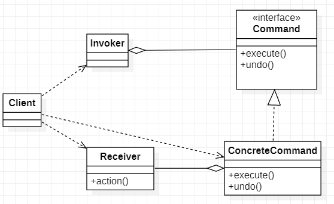
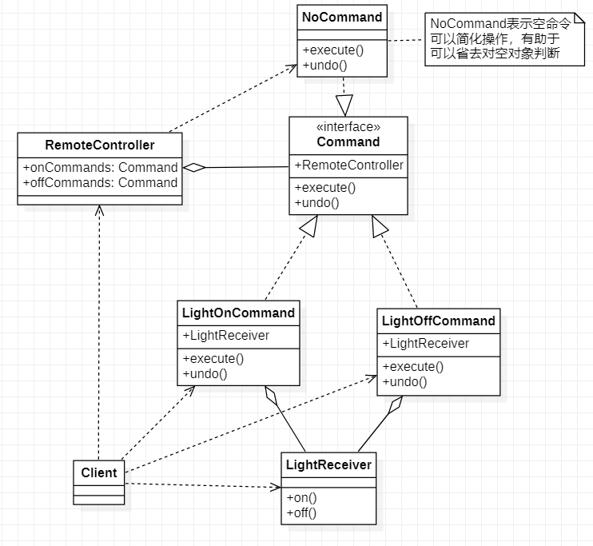
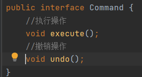
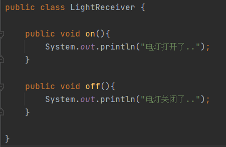
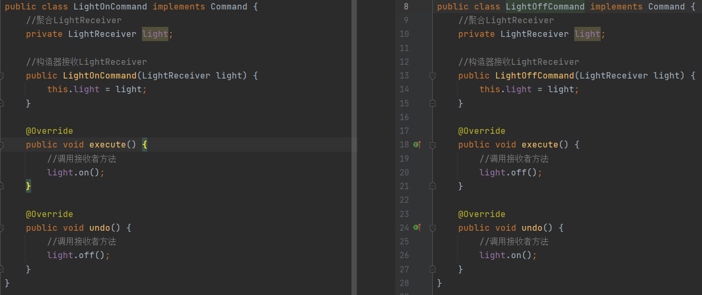
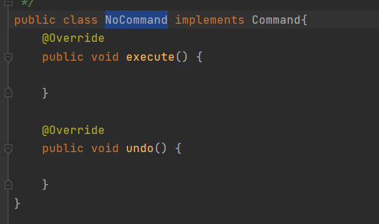
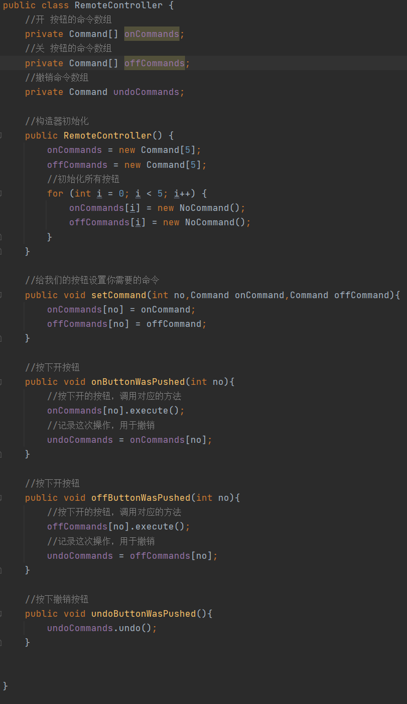
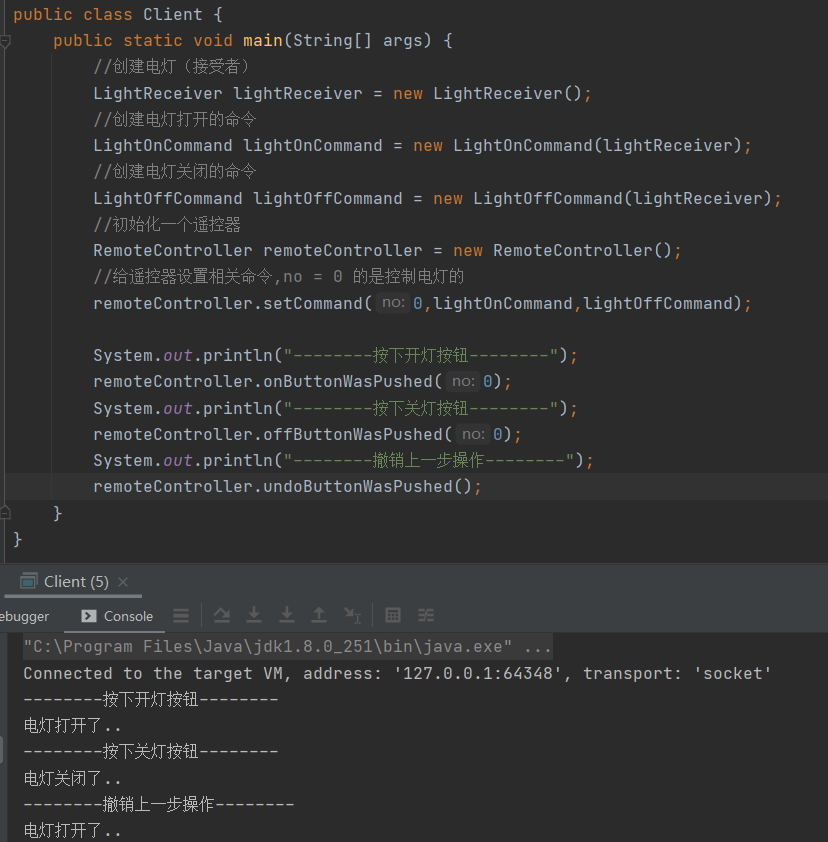

# 命令模式

> 命令模式将围绕着一个智能家居程序解说

1. 我们买了一套智能家居，有电灯、风扇、冰箱、洗衣机，我们只要在手机上安装APP就可以控制对这些家电工作
2. 这些智能家居来自不同的厂家，我们又不想针对每一种家电安装一个APP，分别控制，我们希望只要一个app就可以控制全部家电

## 命令模式解决方案

> 要实现一个app控制所有智能家居，则每一个家电厂家都要提供一个统一的接口给app调用，这时可以使用命令模式实现
>
> 命令模式可以将“动作请求者”从“动作的执行者”对象中解耦

### 基本介绍

> 1. 命令模式（Command Pattern）：在软件设计中，我们经常需要想某些对象发送请求，但是并不知道请求的接收者是谁，也不知道被请求的操作是那个，我们只需在程序运行时指定具体的请求接收者即可
> 2. 命令模式使得请求的发送者于接收者消除彼此之间的耦合，让对象之间的调用关系更加灵活，实现解耦
> 3. 在命令模式中，会将一个请求封装为一个对象，以便使用不同参数来表示不同的请求，同时命令模式也支持可撤销的操作
>
> 例子：将军发布命令，士兵去执行，其中有几个角色，将军（命令发布者）、士兵（命令具体执行者）、命令（连接将军和士兵）
>
> invoker：调用者（将军）
>
> Command：命令（连接将军和士兵），需要执行的所有命令都在这里，可以接口/抽象类
>
> Receiver：接收者（士兵），知道如何实施和执行一个请求相关操作
>
> ConcreteCommand：将接收者对象与命令绑定，让接收者执行相应的操作，实现execute

## 命令模式解决智能家居问题

> Command：连接遥控器与智能家居的一个接口，里面定义了2个方法execute与undo，给子类实现
>
> LightReceiver：智能家居对象（接收者），提供了智能家居功能实现，如打开/关闭
>
> LightOnCommand/LightOffCommand：绑定命令与接收者相关操作，接收命令后调用相应的智能家居对象的方法
>
> RemoteController：遥控器（调用者），发布命令
>
> NoCommand：初始化空命令时需要使用到的一个对象

#### Command

> Command：一般已接口的形式，其它命令对象需要继承该接口实现相应方法

#### LightReceiver

> LightReceiver：智能能电灯对象，里面提供了开灯与关打的实现

#### LightOffCommand/LightOnCommand

> LightOffCommand/LightOnCommand：实现Command接口，聚合LightReceiver（接收者）实现execute和undo方法，在方法实现时其实就是调用LightReceiver（接收者）相应的方法

#### NoCommand

> NoCommand：实现Command接口，实现空方法，由于在遥控器初始化时智能家居是无状态的，所以需要定义一个无命令的类来初始化遥控器

#### RemoteController

> RemoteController：遥控器（调用者），通过默认初始化有5组的打开命令和关闭命令，每一组命令控制一个智能家居，通过构造器的方式把这5组命令初始化无状态的情况
>
> 1. setCommand方法：将来需要控制的智能家居传入
> 2. onButtonWasPushed方法：按下打开按钮将发送相应的命令
> 3. offButtonWasPushed方法：按下关闭按钮后将发送相应的命令
> 4. undoButtonWasPushed方法：按下撤销按钮

#### Client

> Client编写比较复杂
>
> 1. 需要先初始化你需要控制的智能家居
> 2. 初始化智能家居的打开和关闭命令
> 3. 初始化一个遥控器
> 4. 将打开和关闭命令传入到遥控器的第一组按钮中

## 命令模式总结

1. 优点：将发起请求的对象与执行请求的对象解耦，发起请求的对象是调用者，调用者只要调用命令对象的execute方法就可以让接收者工作，而不必知道具体的接收者对象是谁，是如何实现的，命令对象会负责让接收者执行请求的动作，也就是说“请求发起者”和“请求执行者”之间的解耦是通过命令对象实现的，命令对象起到了桥梁作用
2. 优点：容易设计一个命令对象，只要把命令对象放到队列中，就可以多线程的执行命令
3. 优点：对请求的撤销和重做比较容易
4. 缺点：可能导致某些系统有过多的具体命令类，增加了系统的复杂度，这点在使用的时候要注意
5. 应用场景：界面的一个按钮都是一条命令，模拟CMD（DOS命令），订单的撤销/恢复，触发-反馈机制