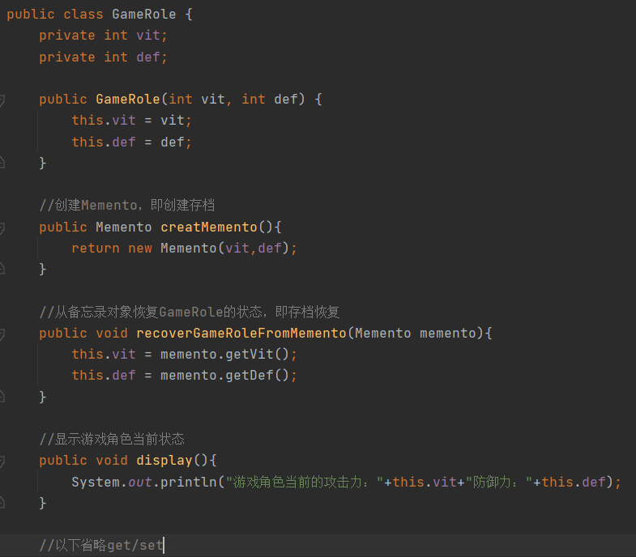
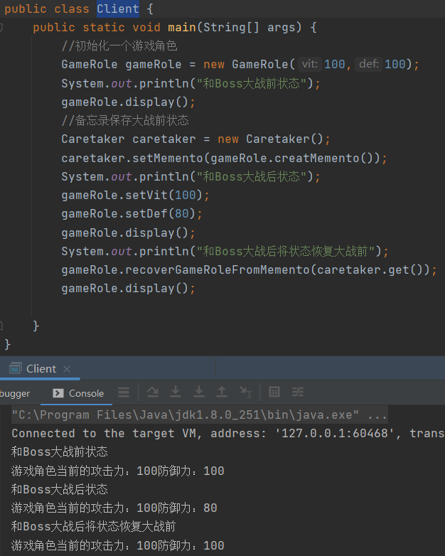

# 备忘录模式

> 备忘录模式将围绕着游戏项目

1. 每一个游戏玩家有攻击力和防御力，在大战Boss前保持自身的状态（攻击力和防御力），当大战Boss后攻击力和防御力下降，从备忘录获取大战前状态并且恢复

## 传统解决方案

> 每一个游戏玩家，我们都创建一个对象副本来保持这个人物的状态

### 传统解决方案总结

1. 缺点：每一个玩家都对应一个保持状态的对象，当游戏对象很多时，不利于管理，而且开销很大
2. 缺点：传统的方式是简单的做备份，new处另外一个对象出来，再把需要备份的数据放到这个新对象，但这暴露对象的内部结构

## 备忘录模式解决方案

### 基本介绍

> 1. 备忘录模式（Memento Pattern）在不破坏封装性的前提下，捕获一个对象的内部状态，并在该对象之外保持这个状态，这样以后就可将该对象恢复到原先保持的状态
> 2. 可以这样理解备忘录模式，日常生活中的备忘录是用来记录某一些要去做的事情，或者是记录已经达成共同意见的事情，以访忘记，而在软件层面，备忘录模式有着相同的含义，备忘录对象主要用来记录一个对象的某种状态，或者某些数据，当要做回退时，可以从备忘录对象里获取原来的数据进行恢复操作
>
> Originator：里面包含了各种需要保持的对象内容
>
> Mement：备忘录对象，负责保存记录，originator内部的需要保存的内容
>
> Caretaker：守护者对象，负责保存多个备忘录对象，使用集合管理，如果需要同时保存多个Originator不同的Mement对象，可以使用`HasMap<OriginatorId,List<Mement>>`稍加扩展即可

### 备忘录模式存档问题

#### Memento

> Memento：备忘录对象，里面保存着需要保存的一些状态信息

#### Caretaker

> Caretaker：守护者对象，负责保存多个Memento对象，也可以获取Memento对象

#### GameRole

> GameRole：一个游戏角色，里面包含着角色属性，一个存档方法和一个获取存档方法

#### Client

### 备忘录模式总结

1. 优点：给用户提供一种可以恢复状态的机制，可以使用户能够比较方便的回到某一个历史的状态
2. 优点：实现了信息的封装，使得用户不需要关心状态的保存细节
3. 注意：如果类的成员变量较多，势必会占用较大的资源，而且每一次保存都会销毁一定内存
4. 场景：游戏开发中的游戏存档，Win中的ctrl+z，浏览器中的回退按钮，数据库的事务管理