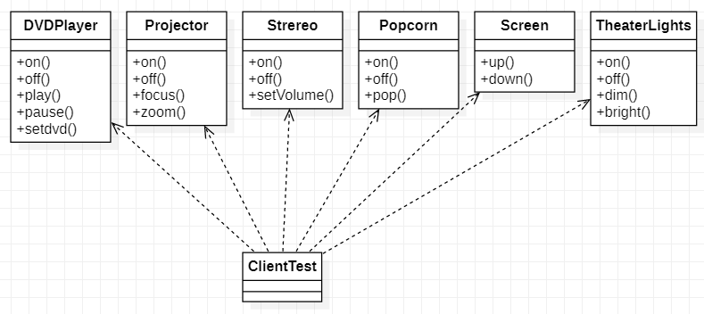
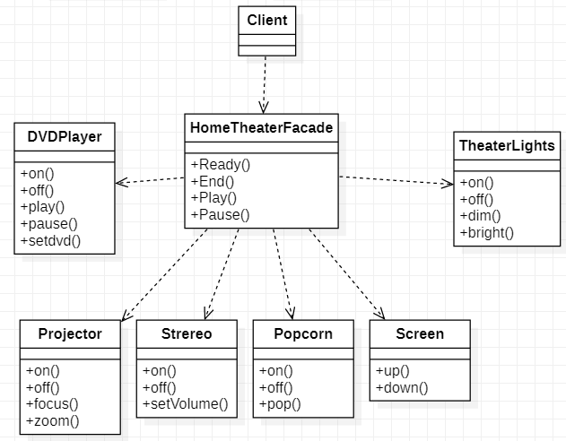
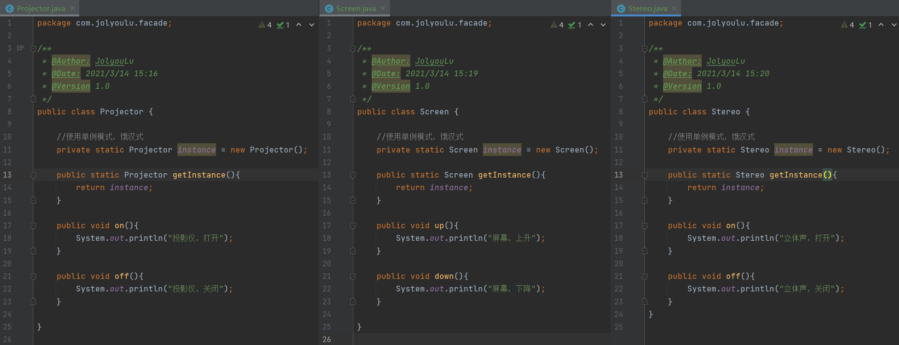
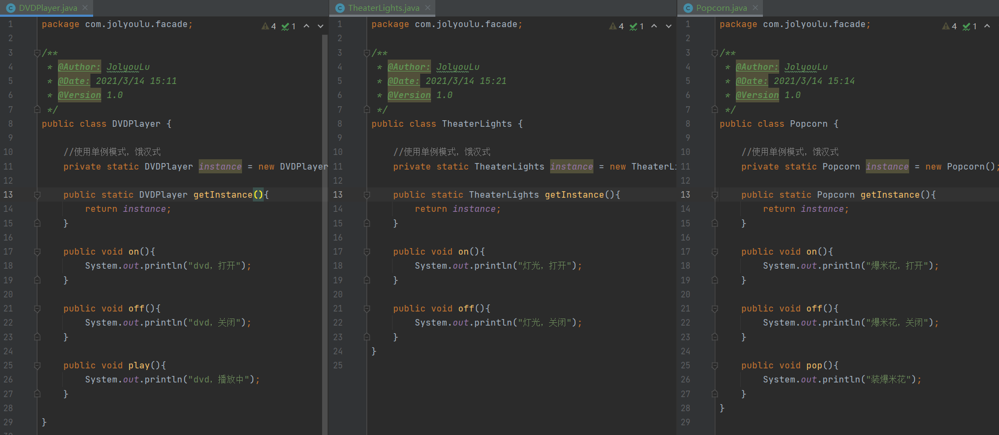
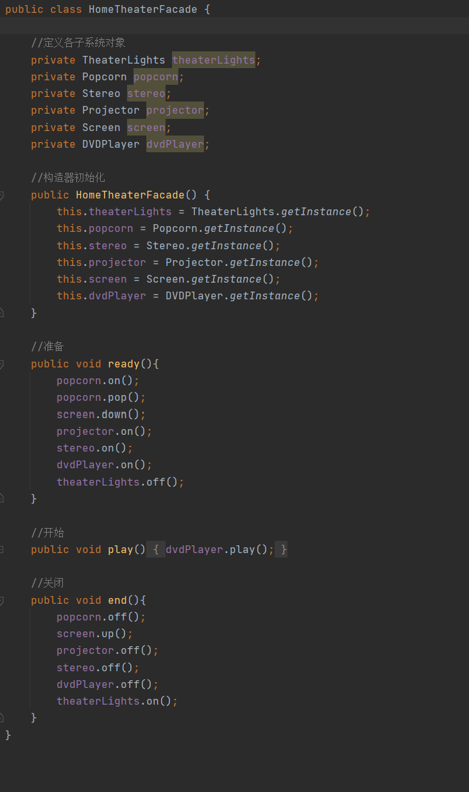
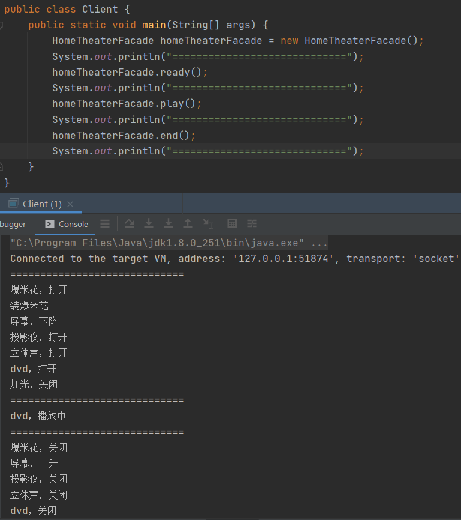

# 外观模式

> 外观模式将围绕着一个组建家庭影院项目讲解

1. 组建一个家庭影院，里面包含DVD播放器、投影仪、自动屏幕、立体环绕声、爆米花机如下功能
2. 家庭影院需要使用遥控器实现如下功能：打开爆米花机=>放下屏幕=>开投影仪=>开音响=>开DVD=>拿爆米花=>调灯光=>播放=>观影结束，关闭所有设备

## 传统解决方案

> 为每一种设备都创建一个对象，客户端跳过new来得到相应的设备对其进行操作

### 传统解决方案总结

1. 缺点：ClientTest的main方法中，创建各种设备的对象，并直接调用对象的方法会造成调用过程混乱，没有清晰的过程
2. 缺点：由于ClientTest中依赖了很多的对象，不利于代码的维护
3. 解决思路：定义一个高层接口，给子系统中的一组接口提供一个一致的界面（比如高层接口提供四个方法ready、play、pause、end），用来访问子系统中的一群接口，简单来说就是定义一个一致的接口（界面类），而无需关心这个子系统的内部细节，使用外观模式

## 外观模式解决方案

> 外观模式（Facade），也叫过程模式：外观模式为子系统中的一组接口提供一个一致的界面，此模式定义了一个高层接口，这个接口使得这一子系统更加容易使用
>
> 外观模式通过定义一个一致的接口，用以屏蔽内部子系统的细节，使得调用端只需跟这个接口发生调用，而无需关心这个子系统的内部细节
>
> 外观类（Facade）：为调用端提供统一的调用接口，外观类知道那些子系统负责处理请求，从而将调用端的请求代理给适当的子类对象
>
> 调用者（ClientTest）：外观接口的调用者
>
> 子系统（SubSystem）集合：指模块或者子系统，处理Facade对象指派的一个任务，他是功能的提供者

### 外观模式的实现

> HomeTheaterFacade（外观类）：为客户端提供play、end等方法，客户端通过外观类开启整个家庭影院具体的开启和关闭流程由HomeTheaterFacade实现，客户端只管调用无需知道具体实现
>
> DVDPlayer/Screen等设备（子系统）：提供每一个设备的操作方法

#### Projector/Screen/Steteo

> Projector/Screen/Steteo分别是家庭影院组成的设备（子系统），编写开始关闭等方法

#### DVDPlayer/TheaterLights/Popcorn

> DVDPlayer/TheaterLights/Popcorn分别是家庭影院组成的设备（子系统），编写开始关闭等方法

#### HomeTheaterFacade

> HomeTheaterFacade（外观类），里面依赖了各个子系统，封装了家庭影院的开始关闭方法

#### Client

> Client通过HomeTheaterFacade（外观类）操作整个家庭影院

### 外观模式的总结

1. 优点：外观模式对外屏蔽了系统的细节，因此外观模式降低了客户端对子系统使用的复杂性
2. 优点：外观模式对客户端与子系统的解耦关系，让子系统内部的模块更加容易维护和扩展
3. 优点：通过合理的使用外观模式，可以帮我们更号的划分访问的层次
4. 场景：当系统需要进行分层设计是，可以考虑使用Facade模式
5. 场景：再维护一个遗留的大小系统时，可能这个系统已经变得难以维护和扩展，此时可以考虑为新系统开发一个Facade类，来提供遗留系统的比较清晰的接口让新系统与Facade类交互，提高复用性
6. 注意：不能过多的或者合理的使用外观模式，使用外观模式好，还是直接调用模块号要以系统有层次，利于维护为目的