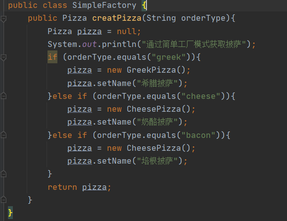

# 工厂模式

通过一个买披萨项目，接收工厂模式的多种实现，以及用法

## 简单工厂模式

如有一个披萨项目需要实现如下功能

1. 披萨种类有很多，如GreekPizz、CheesePizz等
2. 披萨制作过程有prepare，bake，cut，box
3. 披萨都需要从披萨店中订购

### 使用传统方式实现

经过分析我们发现，披萨制作过程bake，cut，box都是一致的，prepare每一种披萨的制作方式有略微不同，什么我们把prepare，bake，cut，box提取出来放入一个叫Pizza的抽象类中，GreekPizz、CheesePizz只需要实现Pizza对象并且重写prepare方法即可，披萨的订购通过OrderPizza订购不同类型的披萨

#### Pizza

定义一个Pizza抽象类，因为bake，cut，box步骤都是统一的所以在Pizza抽象类中统一实现，但是prepare材料每一种披萨制作都不一样，所以定义一个抽象方法便于子类重写

#### GreekPizz

一种希腊披萨的实现，只需要继承Pizza，实现准备材料方法prepare即可

#### CheesePizz

一种奶酪披萨的实现，只需要继承Pizza，实现准备材料方法prepare即可

#### OrderPizza

一个用于订购披萨的对象，通过不断读取控制台输入，传入不同的披萨类型，会得到不同的披萨对象，然后调用方法进行烹饪打包等操作

#### PizzaStore

测试

### 使用传统方式优缺点

**优点**：比较好理解，简单容易

**缺点**：违反了设计模式的ocp原则，即**对扩展开放，对修改关闭**，就是当我们增加新功能的时候，尽量不修改代码，或者尽可能的少修改代码

比如我现在OrderPizza订购披萨有多家店铺，有一天新出了BaconPizza那么我们需要对所有的OrderPizza对象进行修改，就会很麻烦

### 使用简单工厂模式

#### 基本介绍

1. 简单工厂模式是属于**创建型模式**，是工厂模式的一种，简单工厂模式是由一个工厂对象决定创建出那一种产品类的实例，简单工厂模式是工厂模式家族中最简单实用的模式
2. 简单工厂模式一般用法：定义一个创造对象的类，由这个类来封装实例化对象的行为（代码）
3. 在软件开发中，我们会用到大量的创建某种，某类或者某批对象，就会使用到工厂模式

#### 对披萨项目改进

OrderPizza不再自己判断new相应的Pizza，而是通过Simplefactory去获取相应的Pizza，这样即使披萨发生增加/修改，我们只需要调整Simplefactory即可

#### SimpleFactory

#### OrderPizza

OrderPizza通过构造函数接收一个simpleFactory，这样后期切换工厂不用修改OrderPizza内的方法，通过simpleFactory.creatPizza(orderType)方法来获取相应的Pizza对象，所有的OrderPizza类都通过工厂获取，如果披萨有增加我们只需修改工厂对象即可

#### PizzaStore

### 简单工厂模式-静态方法

使用简单工厂模式-静态方法对我们的披萨项目再次进行优化，在时间设计中是使用简单**工厂模式**或者**简单工厂模式-静态方法**需看业务需求而定

#### SimpleFactory

做法很简单将获取Pizza的方法用static修饰即可

#### OrderPizza

因为是静态方法的原因所以在OrderPizza调用不需要创建工厂对象了，使用起来会更加方便，直接调用

#### PizzaStore

## 工厂方法模式

甲方对我们以上的披萨项目提出了一个新需求：

1. 客户在点披萨时，可以点不同口味的披萨，如广州的奶酪pizza，广州的希腊pizza，北京的奶酪pizza，深圳的希腊pizza

**解决方案1**：按照上面的需求我们任然可以使用简单工厂模式，我们可以这样做，一个口味创建一个工厂如GZPizzaSimpleFactory、BJPizzaSimpleFactory、SZPizzaSimpleFactory等，但是考虑到项目的规模，软件的可维护性、可扩展性并不是特别好

**解决方案1**：使用工厂方法模式，将披萨项目实例化功能抽象成抽象方法，在不同的口味子类中做具体实现

**工厂方法模式**：定义了一个创建对象的抽象方法，由子类决定要实例化的类，工厂方法模式将**对象的实例化推迟到子类**

### 使用工厂方法模式

#### Pizza与子类实现

Pizza与之前写法一致这里我就不做截图了，定义多种地方披萨的子类，北京的，广州的并且实现了相应的prepare方法

#### PizzaSimpleFactory

PizzaSimpleFactory是所有子工厂的父工厂，提供一个createPizza抽象方法让子类去实现，返回相应的pizza

#### PizzaSimpleFactory子工厂

子工厂继承父工厂，实现createPizza给父工厂返回相应的Pizza对象

#### OrderPizza

接收一个参数，判断不同的地方返回不同的子工厂

#### PizzaStore

## 抽象工厂模式

1. 抽象工厂模式：定义了一个interface用于创建相关或有依赖关系的对象族，而无需指明具体的类
2. 抽象工厂模式可以将**简单工厂模式**和**工厂方法模式**进行整合
3. 从设计层面看，抽象工厂模式就是对简单工厂模式的改进(进一步的抽象)
4. 将工厂抽象成两层，AbsFactory（抽象工厂）和具体实现的工厂子类，程序员可以根据创建对象的类型使用相应的工厂子类，这样单个简单的工厂变成了一个**工厂族**更利于代码的维护和扩展

### 使用抽象工厂模式

抽象工厂模式的使用非常类似工厂方法，区别就是将工厂方法模式的PizzaSimpleFactory改成接口的方式，这样使得父工厂将更加的抽象

#### AbsFactory

定义一个接口AbsFactory，里面的createPizza由实现该接口的子类去实现

#### AbsFactory实现类

BJFactory与GZFactory分别实现了AbsFactory接口，并且需要实现createPizza方法通过不同的判断返回不同的Pizza对象实例

#### OrderPizza

OrderPizza接收一个AbsFactory后，通过createPizza得到不同的Pizza，进行制作

#### PizzaStore

使用的时候我们只需要传入不同的工厂对象即可

## JDK源码工厂模式应用

Calendar内部就使用了简单工厂模式，我们进入getInstance方法查看

Calendar在创建时，如果传入的aLocale不为空就，就会进入switch语句按照不同的类型返回相应的实例对象

## 单例模式注意事项和细节说明

1. 工厂模式的定义，将来实例化的ui下的代码取代出来，放到一个类中统一管理和维护，达到和主项目的依赖关系的解耦，从而提高项目扩展和维护性
2. 三种工厂模式
3. 设计模式的依赖抽象原则
   * 创建对象实例时，不要直接new类，而是把这个new类的动作放到一个工厂的方法种，并返回
   * 不要让类继承具体类，而是继承抽象类或者实现interface（接口）
   * 不要覆盖基类中已经实现的方法