# 建造者模式

> 建造者模式将围绕着一个修建房子的需求简介

1. 需要修建一个房子，修房子过程有打桩、砌墙、封顶
2. 房子有各种各样，比如普通民房，高楼，别墅等各种房子虽然修建一样，但是要求不一样

## 传统方式解决盖房需求

> 首先编写一个AbstractHouse抽象类类，其中包含了3个抽象方法打桩，砌墙，封顶，子类通过继承父类，实现父类方法来修建不同要求的楼房

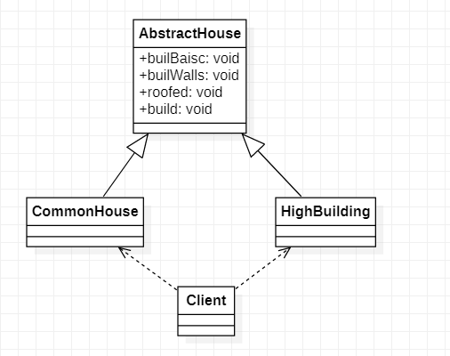

### AbstractHouse

> AbstractHouse抽象类，里面写着3个抽象方法需要子类去实现的

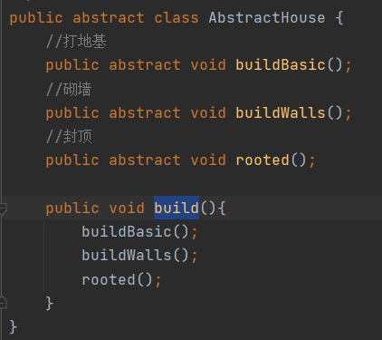

### CommonHouse

> 普通民房，继承AbstractHouse重写重写方法编写自己特点的业务

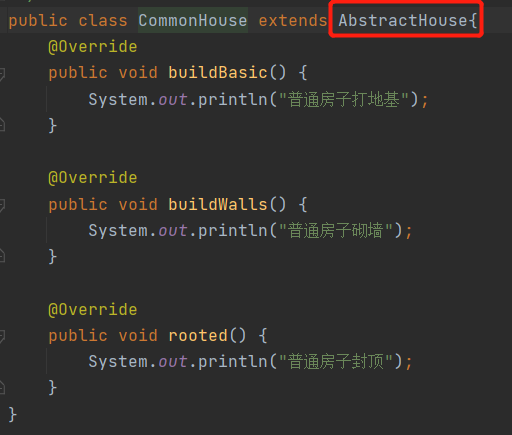

### Client

>Client只需按不同情况new自己需要修建的类型的房子调用build方法即可

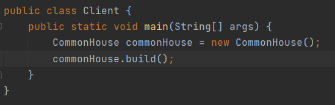

### 传统方式问题分析

1. 优点：比较好理解，简单易操作
2. 缺点：设计的程序结构，过于简单，没有设计缓存层对象，程序扩展和维护不好，这种设计方案，把产品（房子）和建造产品的过程（建房流程）封装在一起，耦合性增强
3. 解决方案：将产品和产品建造过程解耦 => 建造者模式

## 建造者模式

### 基本介绍

1. 建造者模式（Builder Pattern）又叫生成器模式，是一种对象构建模式，它可以将复杂对象的建造过程抽象出来（抽象类），使这个抽象过程的不同实现方法可以构造不同表现（属性）的对象
2. 建造者模式是一步一步创建一个复杂的对象，它允许用户只通过指定复杂对象的类型和内容就可以构建它们，用户不需要知内部的具体构建细节

### 建造者模式四个角色

1. Product（产品角色）：一个具体的产品对象
2. Builder（抽象建造者）：创建Product（产品），并且制定组合产品的流程和步骤（接口/抽象类）
3. ConcreteBuilder（具体建造者）：实现Builder中制定的流程和步骤（接口），构建和装配各个部件
4. Director（指挥者）：构建一个使用Builder接口的对象，它主要是用于创建一个复杂的对象，它主要作用是隔离客户与对象生产过程，负责控制产品对象的生产过程

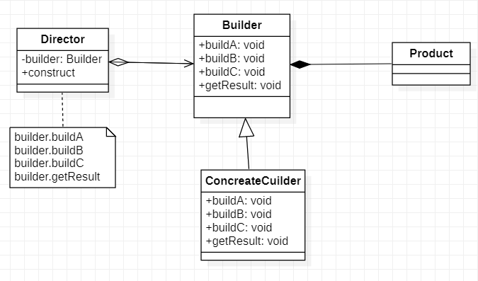

### 建造者模式解决盖房需求

> House（Product）：产品角色，里面这个房子的组成部分，包括地基，砌墙，屋顶属性
>
> HouseBuilder（Builder）：抽象的建造者，里面创建了House对象，并且定义了建造房子所需要实现的方法和获取House对象的方法
>
> CommonHouse/HighBuilding（ConcreteBuilder）：具体建造者，继承HouseBuilder实现每一个建造步骤的具体的建造内容
>
> HouseDirector（Director）：指挥者，构建一个HouseBuilder对象，constructHouse方法中制定整个House的建造流程

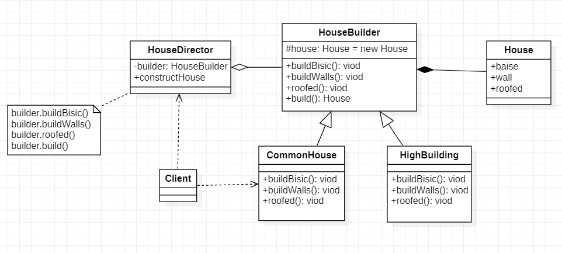

#### House

> 定义一个房子（产品）是由什么组成的

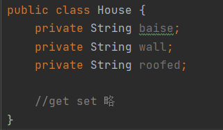

#### HouseBuilder

> 抽象建造者，编写房子（产品）被修建时需要实现的方法

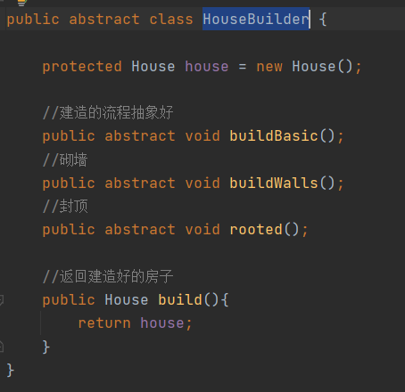

#### CommonHouse

> 继承（HouseBuilder）抽象建造者，实现抽象建造者制定的抽象方法

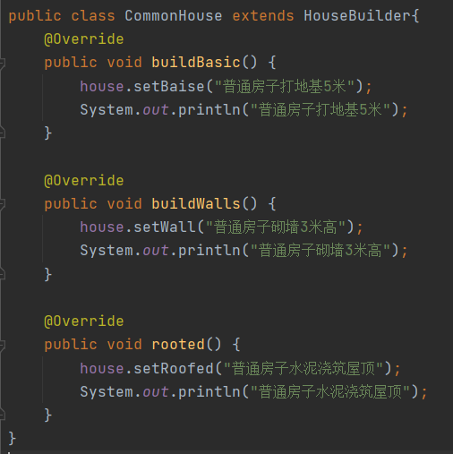

#### HouseDirector

> 定义一个HouseBuilder（抽象建造者），通过构造器/setter方式传入得到相应具体建造者，constructHouse方法指挥整个房子（产品）的建造并且最后返回建造好的产品

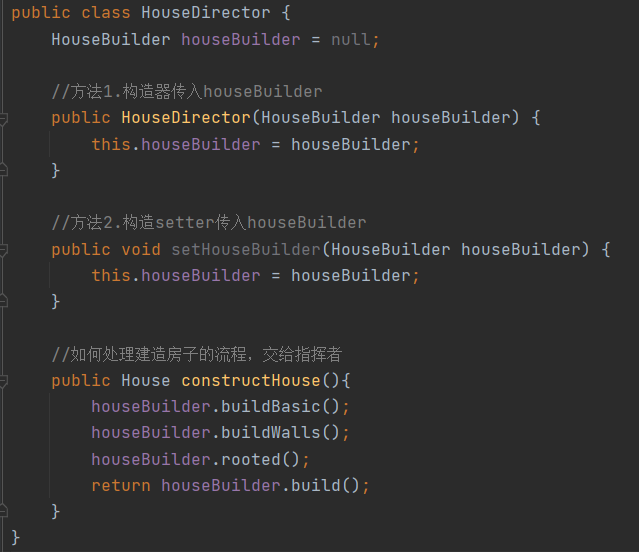

#### Client

> 创建想要修建的房子类型CommonHouse，创建指挥者HouseDirector并且传入需要修建的房子类型，调用houseDirector.constructHouse();方法得到建造好的产品

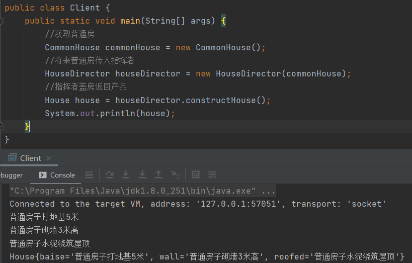

### 建造者模式的注意事项和细节

1. 客户端不必知道产品内部组成细节，将产品本身与产品的创建过程解耦，使得相同的创建过程可以创建不同的产品对象
2. 每一个具体建造者相对独立，而与其它的具体建造者无关，因此可以很方便的替换或者增加新的建造者，用户使用不同的具体建造者即可建造不同的产品对象
3. 可以更加精细的控制产品的创建过程，将复杂产品和创建步骤分解在不同的方法中，使得创建过程更加清晰，也更方便使用程序来控制创建过程
4. 增加新的具体建造者无须修改原有类库的代码，指挥者类针对抽象建造者类编程，系统扩展方便，符合“开闭原则”
5. 建造者模式所创建的产品一般具有较多的共同点，其组成部分相似，`如果产品之间的差异性很大，则不适合使用建造者模式`，因此使用范围有一定限制
6. 如果产品的内部变化复杂，可能会导致需要定义很多具体建造者类实现这些变化，导致系统变得庞大，因此在这种情况下要考虑是否选择建造者模式

### 抽象工厂模式与建造者模式比较

抽象工厂模式实现对产品家族的创建，一个产品家族是这一系列产品，具有不同分类维度的产品组成，采用抽象工厂模式不需要关心构建过程，只关心什么产品由什么工厂生产即可，而建造者模式是要求按照制定的蓝图建造产品，它的主要目的是通过组装零配件而生产一个新产品