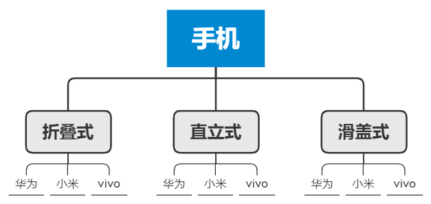
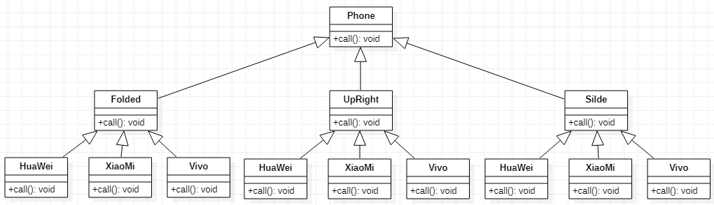
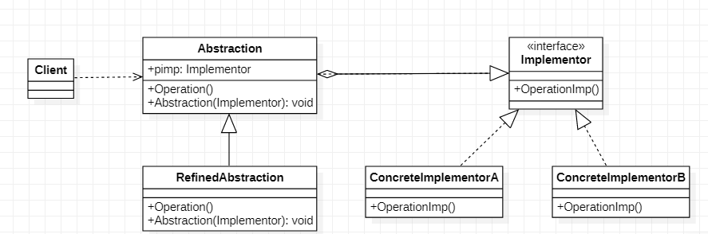
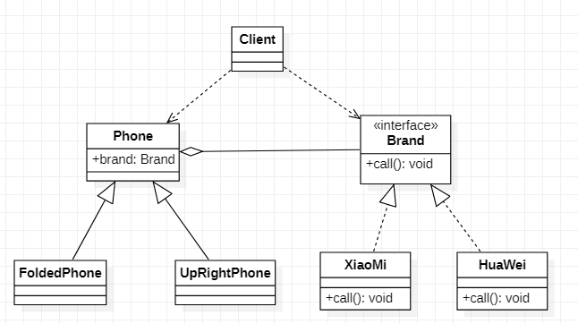
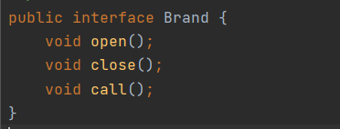
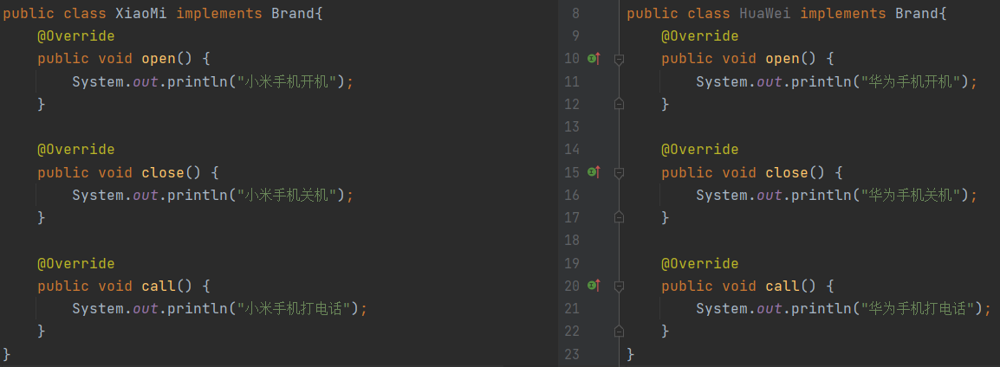
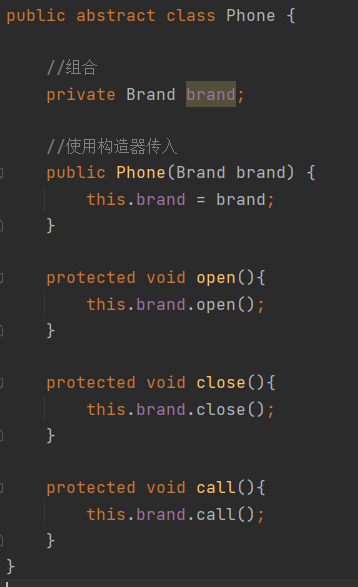
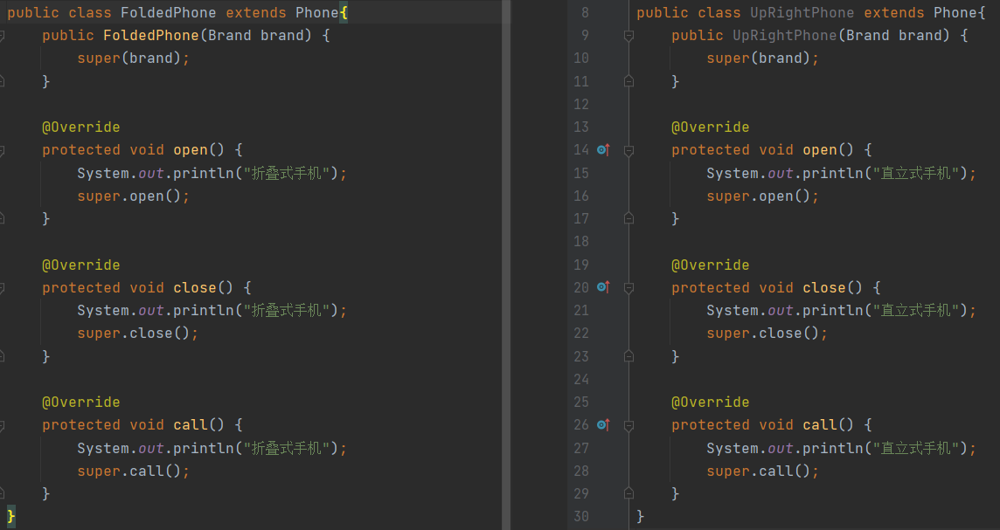
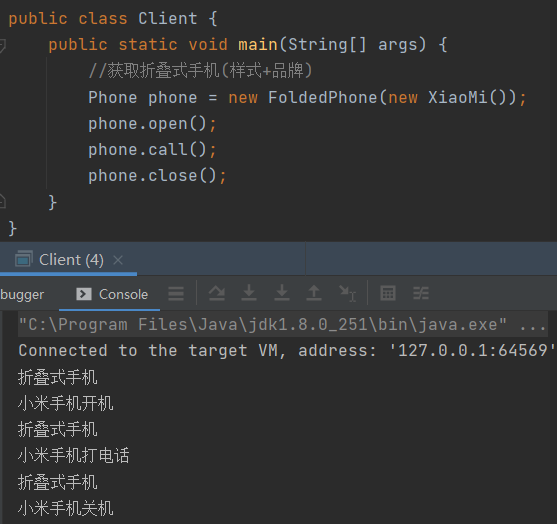

# 桥接模式

> 手机操作问题，现在对不同手机类型的不同品牌都需要实现操作编程（比如：开机、关机、上网
>
> 打电话等）

## 传统解决方案

> 传统的方式，编写一个Phone类然后编写各种不同的样式的手机类继承Phone类，最后再每一个样式下编写上华为、小米、vivo再这样式下相应的开机方法

## 传统解决方案问题分析

1. 缺点：扩展性问题，当我需要增加一个手机品牌时，那么都需要在所有的样式同时都需要增加该手机类
2. 缺点：违反单一职责原则，当我们增加手机样式时，要同时增加所有品牌的手机，这样增加了代码维护成本

## 使用桥接模式解决

### 基本介绍

1. 桥接模式（Bridge模式）是指，将实现与抽象放在两个不同的层次中，使两个层次可以独立改变
2. 是一种结构性设计模式
3. Bridge模式基于类的最小设计原则，通过使用封装、聚合及继承等行为让不同的类承担不同的职责，它的主要特点是把抽象（Abstraction）与行为实现（Implementation）分离开来，从而可以保持各部分的独立性以及应对他们的功能扩展

> Client类：桥接模式的调用者
>
> 抽象类（Abstraction）：维护了Implementor/即它的实现类ConcreteImplementorA，二者是聚合关系，Abstraction充当桥接类
>
> RefinendAbstraction：是Abstraction抽象的子类
>
> Implementor：行为实现类的接口
>
> ConcreteImplementorA：具体的行为实现类

### 桥接模式的实现

> Phone：抽象类他维护着Brand，和Brand的实现类小米手机和华为手机
>
> Brand：需要实现行为的接口，具体的实现是小米手机和华为手机
>
> FoldedPhone/UpRightPhone：具体的手机样式，继承Phone抽象类

#### Branda

> 几个手机需要实现的功能接口

#### Xiaomi/HuaWei

> 不同品牌的手机实现Branda编写具体的实现

#### Phone

> 一个抽象的手机类，里面组合了Brand，通过构造器传入不同的手机品牌，对开机、关机、打电话编写默认的实现方法

#### FoldedPhone/UpRightPhone

> 不同样式的手机只需继承Phoen并且重写父类的方法实现不同手机样式的开机、关机、打电话效果

#### Client

### 桥接模式的注意事项和细节

1. 实现了抽象和实现部分的分离，从而极大的提供了系统的灵活性，让抽象部分和实现部分独立开来，这有助于系统进行分层设计，从而产生更好的结构化系统
2. 对于系统的高层部分，只需要知道抽象部分的和实现部分的接口就可以了，其它的部分由具体业务来完成
3. 桥接模式替代多层继承方案，可以减少子类的个数，降低系统的管理和维护成本
4. 桥接模式的引入系统的理解和设计难度，由于聚合关联建立在抽象层要求开发者针对抽象进行设计和编程
5. 桥接模式要求正确识别出系统中两个独立变化的维度，因此其使用范围有一定的局限性，即需要有这样的应用场景