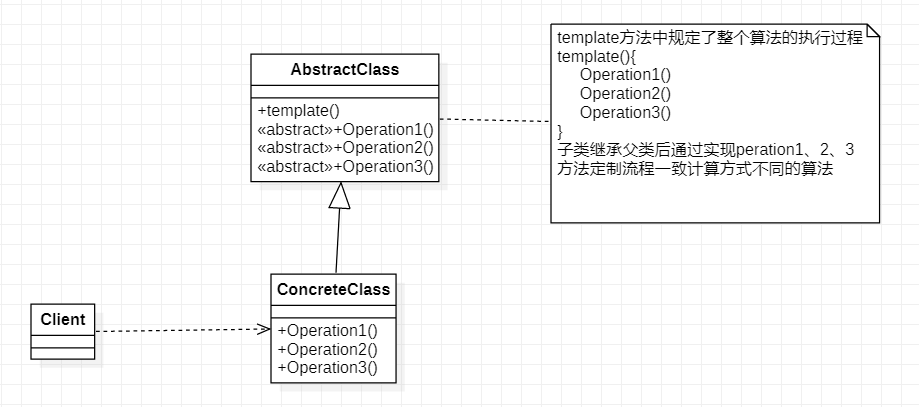
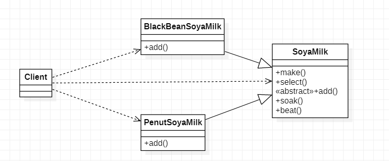
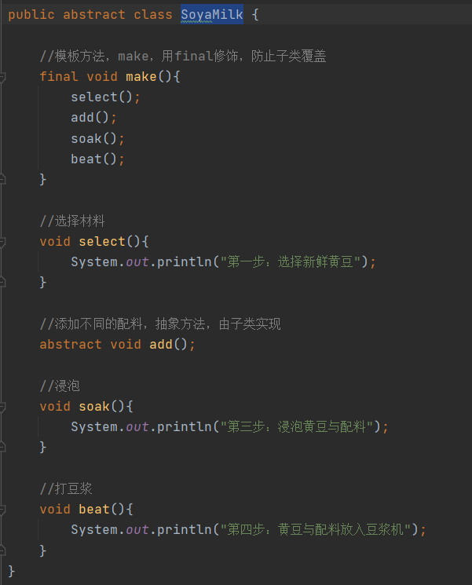
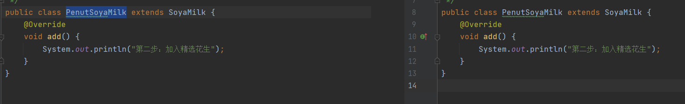
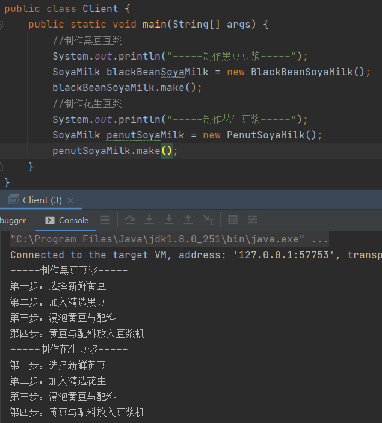
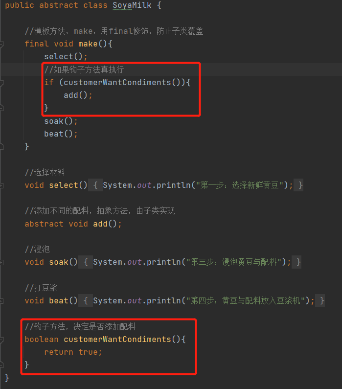
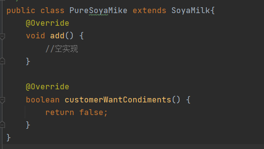
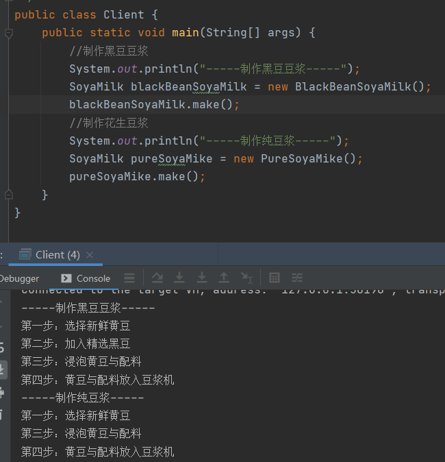

# 模板方法模式

>  模板方法模式将围绕着一个豆浆制作程序解说

1. 制作豆浆的流程，选材=>添加配料=>浸泡=>放入豆浆机
2. 通过添加不同的配料，可以制作不同口味的豆浆
3. 选材、浸泡和放豆浆机这几个步骤对于制作不同口味的豆浆都是一样的

## 模板方法解决方案

> 由于模板方法方案很容易就想到，所以这个就不通过传统的方案例子逐步改进成模板方法模式了

### 基本介绍

> 1. 模板方法（Template Method Pattern），又叫模板模式（Template Pattern），在一个抽象类公开定义了执行它的方法的模板，它的子类可以按需要重写方法实现，但调用将以抽象类中定义的方式执行
> 2. 模板方法模式其实就是定义一个操作中的算法的骨架，而将一些步骤延迟到子类中，使得子类可以不改变一个算法的结构，就可以重定义算法的某些特定步骤

### 模板方法解决豆浆制作问题

#### SoyaMilk

> SoyaMilk：模板方法抽象父类，其中make是父类私有的，定义了整个模板方法的执行流程，子类无法改变执行流程，子类只能通过实现父类暴露的特定方法，改变一部分执行的内容

#### BlackBeanSoyaMilk/PenutSoyaMilk

> BlackBeanSoyaMilk/PenutSoyaMilk：抽象父类的add方法，编写自定义的执行内容

#### Client

### 模板方法模式的钩子方法

1. 在模板方法的父类中，我们可以定义一个方法，它默认不做任何事情，子类可以视情况要不要覆盖它，该方法称为”钩子“
2. 还是用上面做豆浆的例子来讲解，比如我们在制作纯豆浆时，是不用添加任何配料的，这里就可以使用钩子方法对前面模板方法进行改造

#### SoyaMilk

> 在SoyaMilk增加一个钩子方法，返回值boolean，若子类无需调用到add方法那么只需重写父类的钩子方法返回false

#### PureSoyaMike

> PureSoyaMike：纯豆浆的制作无需执行add方法，所以重写父类的钩子方法，返回false

#### Client

> 运行测试，纯豆浆制作成功，原有其它子类不会受到任何影响

## 模板方法模式总结

1. 优点：算法只存在于一个地方，也就是父类中，容易修改需要修改算法是，只需要修改父类的模板方法或者已经实现的某些步骤，子类就会继承这些修改
2. 优点：实现了最大代码复用，父类的模板方法和已实现的某些步骤被子类继承而直接使用
3. 优点：即统一了算法，也提供了很大的灵活性，父类的模板方法确保了算法的结构保持不变，同时由子类提供部分分步骤的实现
4. 缺点：该模式不足之处，每一个不同的实现都需要一个子类实现，导致类的个数增加，使得系统更加庞大
5. 注意：一般模板方法都会假设final关键字，防止子类重写
6. 应用场景：当要完成某一个过程，该过程需要执行一系列步骤，系列步骤基本相同但是个别步骤实现时有所不同