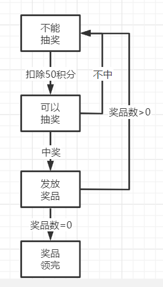
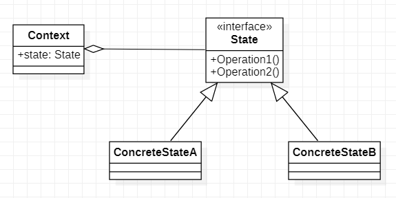
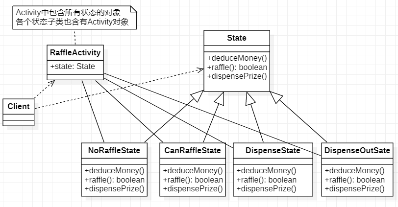
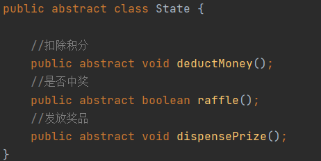
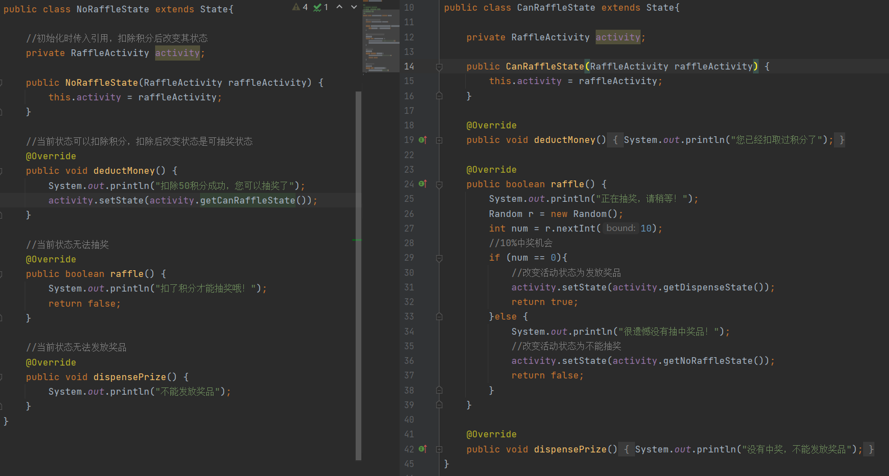
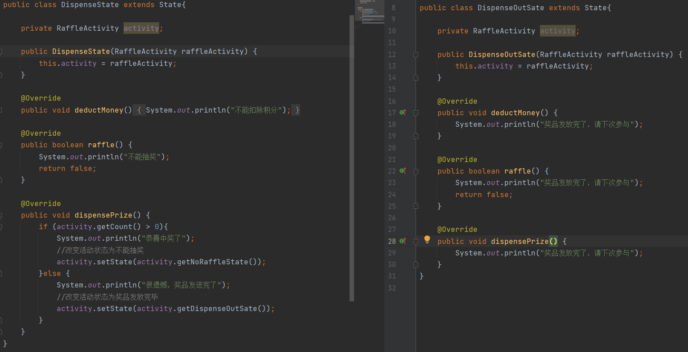
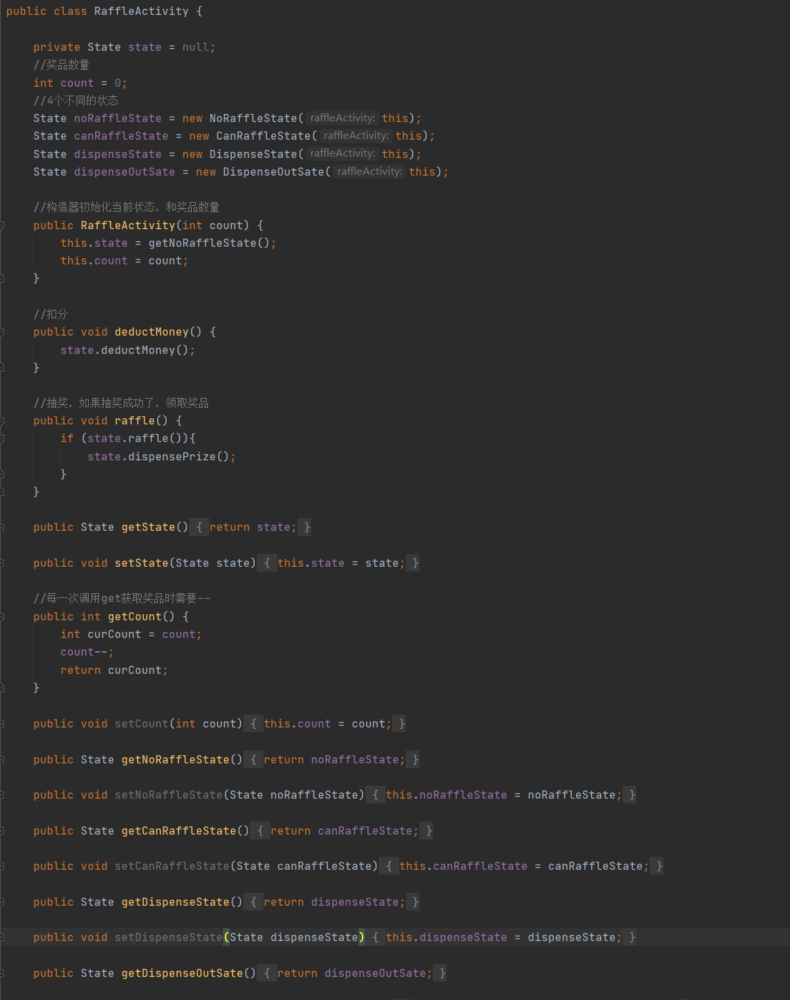
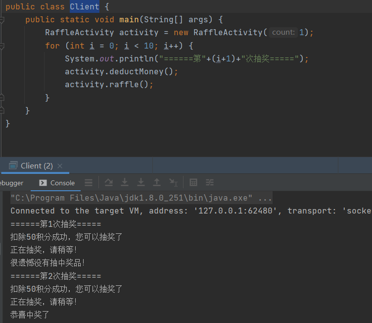

# 状态模式

> 状态模式将围绕着抽奖获得问题讲解

1. 假如每参加一次这个活动要扣除用户50积分，中奖概率是10%
2. 奖品数量固定，抽完就不能抽奖
3. 活动有四个状态：可以抽奖，不能抽奖，发放奖品，奖品领完

## 状态模式解决方案

### 基本介绍

>1. 状态模式（State Pattern）它主要用来解决对象在多种状态转换时，需要对外输出不同的行为的问题，状态和行为是一一对应的，状态之间可以相互转换
>2. 当一个对象的内在状态改变时，允许改变其行为，这个对象看起来像是改变了其类
>
>Context：上下文角色，用于维护State实例
>
>State：抽象的状态角色，定义一个接口封装与Context的特定结果相关行为
>
>ConcreteStateA：具体的状态类

### 状态模式解决抽奖问题

> State：抽奖状态的抽象父类，里面定义了3个抽象方法
>
> NoRaffleState/CanRaffleState/DispenseState/DispenseOutSate：定义了各种不同的状态，分别继承State实现相应的抽象方法
>
> RaffleActivity：一个活动，里面包含关联着所有的状态

#### State

> State：一个抽象的状态父类提供了3个抽象方法

#### NoRaffleState/CanRaffleState

> NoRaffleState：不能抽奖时状态的对象，继承State实现相应方法，在NoRaffleState状态下只能扣除积分，扣除积分后会进入到下一个状态
>
> CanRaffleState：可以抽奖状态的对象，继承State实现相应方法，在CanRaffleState状态下只能抽奖，中奖后会进入到领奖状态，不中奖会退回到不能抽奖状态

#### DispenseState/DispenseOutSate

> DispenseState：可领奖的状态的对象，继承State实现相应方法，在DispenseState状态下只能尝试去领取奖品，如果领取奖品时还有奖品就发放，并且回到NoRaffleState状态，如果没有奖品进入DispenseOutSate状态
>
> DispenseOutSate：奖品发完的对象，继承State实现相应方法，在DispenseOutSate状态下由于已经没有奖品了所有所有发放都是不会改变状态的

#### RaffleActivity

> RaffleActivity：一个活动，里面维护state对象，state对象用于保存当前抽奖的状态是在那一步了，RaffleActivity通过构造函数初始化奖品数和当前状态是不能抽奖状态，提供2个方法掉用该方法就可以改变当前活动中的状态

#### Client

### 状态模式总结

1. 优点：代码很强的可读性，状态模式将每个状态的行为封装到对应的一个类中
2. 优点：方便维护，将容易产生问题的if-else语言去除了，如果把每一个状态的行为都放一个类中，那么在每次改变状态时需要通过if-else判断容易出错
3. 优点：符合“开闭原则”，容易增删状态
4. 缺点：会产生很多类，每一个状态都需要一个对应的类，当状态过多时会有很多类加大维护难度
5. 场景：工作流，审批流程，等