# 策略模式

> 策略模式将围绕着一个关于鸭子的问题讲解

1. 有各种鸭子（如野鸭、水鸭、北京鸭，鸭子有各种行为，如飞行、叫等）
2. 显示鸭子信息

## 传统解决方案

> 编写一个抽象的父类Douck，编写各种鸭子并且继承Douck

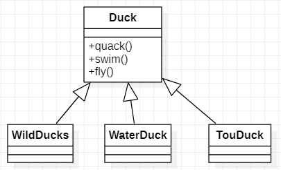

### Duck

> Duck：一个抽象的父类里面提供了鸭子的模式实现

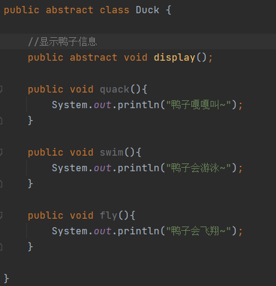

### WildDucks/WaterDuck/TouDuck

> WildDucks/WaterDuck/TouDuck：继承Duck父类根据鸭子实际情况，实现或重写相应的方法

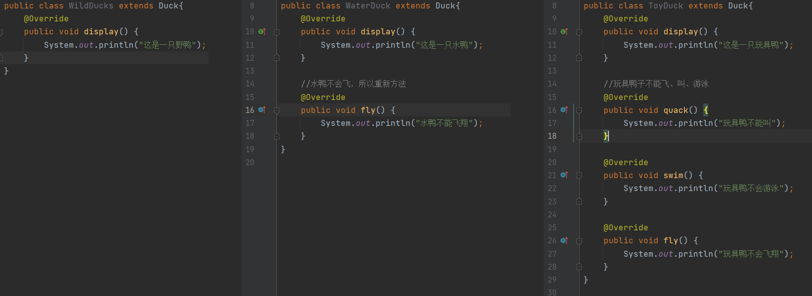

### 传统解决方案总结

1. 缺点：其它鸭子，都继承了Duck类，所以所有鸭子都会飞，这里存在问题，对父类进行改动通过继承会产生问题就是，子类方法会有溢出效应，有的子类本来就不需要这个方法，这种问题可以通过方法覆盖来解决，如看WaterDuck/TouDuck通过覆盖父类的方法解决问题，但是如果使用`策略模式`我们可以更加好的解决这个问题

## 策略模式解决方案

1. 策略模式（Strategy Pattern）中，定义算法族，分别封装起来，让它们之间可以相互替换，让算法的变化独立于使用算法的客户
2. 这算法体现了几个设计原则
   1. 把变化的代码从不变的代码中分离出来
   2. 针对接口编程而不是具体类（定义了策略接口）
   3. 多用组合/聚合，少用继承（客户端通过组合方式使用策略）

Context：有多个成员变量Strategy，这些都是策略接口，使用这些策略是可以通过构造器指定

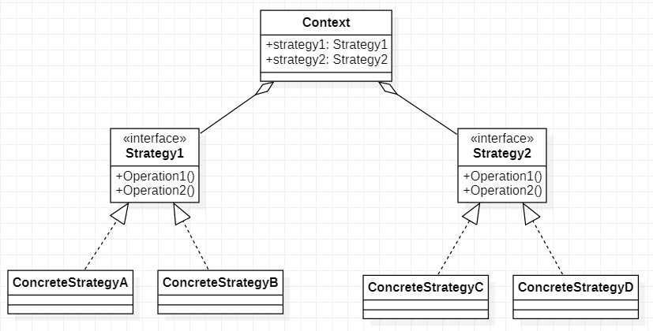

### 策略模式解决鸭子问题

> 假如Duck默认都是会游泳的，但是不同的鸭子有着不同的叫声，不同的飞行高度，所以飞翔于叫声通过测率模式的方式，聚合到Duck父类中，子类通过传入不同的策略来改变改鸭子的叫声和飞翔高度

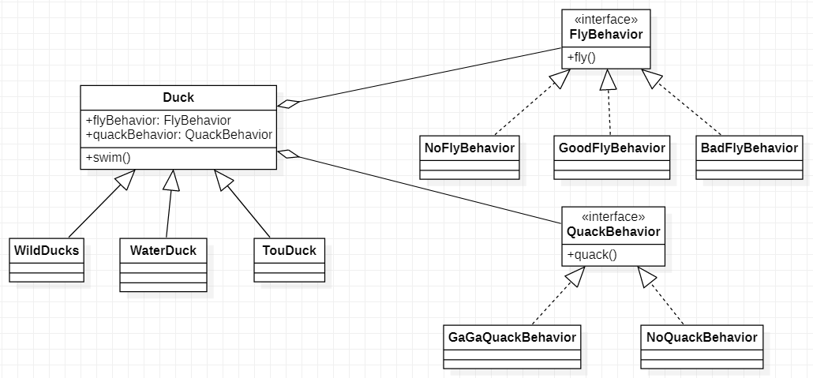

#### FlyBehavior

> FlyBehavior：定义一个飞行行为接口

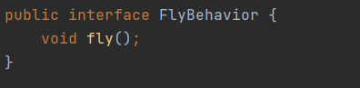

#### GoodFlyBehavior/BadFlyBehavior/NoFlyBehavior

> GoodFlyBehavior/BadFlyBehavior/NoFlyBehavior：不同的飞行行为都需实现FlyBehavior接口，并且实现fly方法

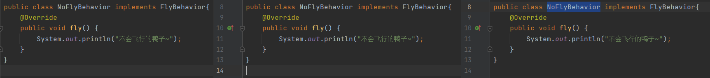

#### QuackBehavior

> QuackBehavior：定义一个叫声行为接口

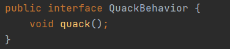

#### GaGaQuackBehavior/NoQuackBehavior

> GaGaQuackBehavior/NoQuackBehavior：不同的叫声行为都需实现QuackBehavior接口，并且实现quack方法

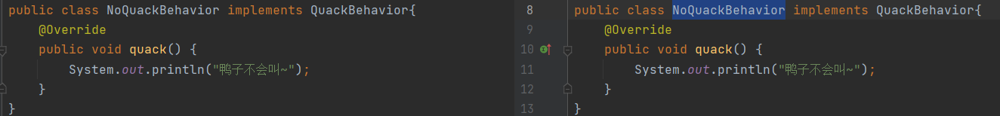

#### Duck

> Duck：抽象的鸭子父类，聚合了QuackBehavior和FlyBehavior，不再给quack于fly提供默认的实现，而是需要通过调用QuackBehavior和FlyBehavior的子类来实现，发出什么叫声以及怎么飞行取绝于子类传入的是那个实现类实现

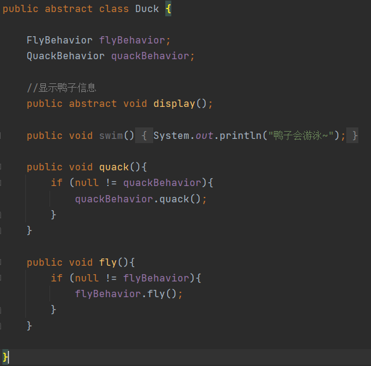

#### WildDucks/WaterDuck/ToyDuck

> WildDucks/WaterDuck/ToyDuck：子类鸭子继承抽象的抽象Duck鸭子父类，再初始化时传入不同的策略子类实现，从而可以动态的改变鸭子的叫声和飞行

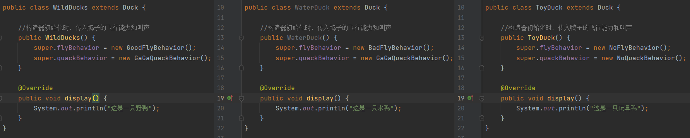

#### Client

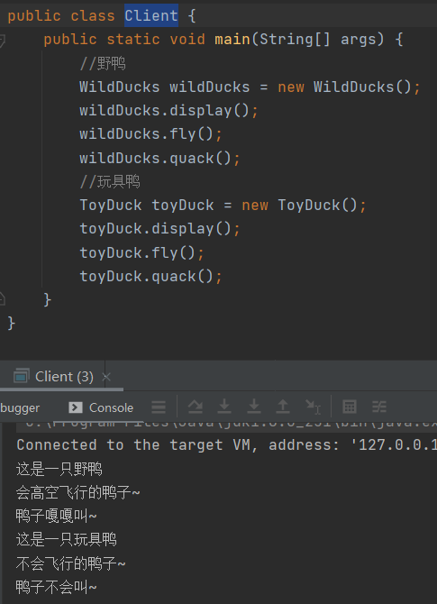

### 策略模式解决总结

1. 优点：体现了”对修改关闭，对扩展开放“原则，客户端增加行为不用修改原代码，只需要添加一种策略即可
2. 优点：提供了可替换继承的并发，策略模式将算法独立的Strategy类中，使得可以独立于Context改变他，使它更加容易切换、理解、扩展
3. 注意：策略模式的使用需要分析项目中变化的部分和不变化的部分，多用组合/聚合，用行为类组合，而不是行为继承更加有弹性
4. 缺点：每增加一种策略要增加一个类，当策略过多是否导致类数目庞大