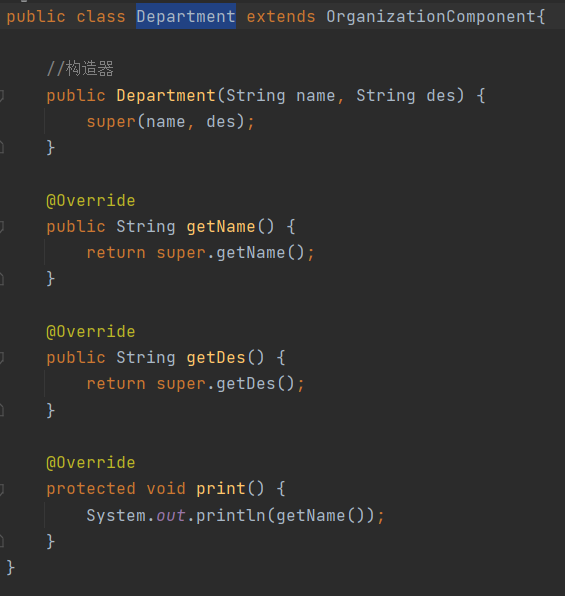

# 组合模式

> 组合模式将围绕着展示院校专业展示项目

学校系展示项目：

1. 编写一个程序，展示学校院系结构
2. 要在一个页面中展示出学院的院系组成，一个学校有多个学院，一个学院有多个系

## 传统解决方案

> 将学院看做学校的子类，系是学院的子类

### 传统解决方案总结

1. 缺点：将学院看做学校的子类，系是学院的子类，这样实际上是站在组织大小来进行分层
2. 缺点：我们需要在一个页面中展示出学校的组成，一个学校多个学院，一个学院多个专业，因此这种方案，不能很好的实现管理的操作，比如对学院、系进行增删改查操作
3. 解决方案：把学校、院、系都看做是组织结构，它们之间没有基础关系，而是一个树结构，可以更加好的实现管理，使用组合模式

## 组合模式解决方案

1. 组合模式（commposite Pattern），又叫部分整体模式，它创建了对象组的树形结构，将对象组合成树结构以表示“整体-部分”的层次关系

2. 组合模式依据树形结构来组合对象，用来表示部分以及整体层次

3. 这种类型的设计模式属于结构性模式

4. 组合模式使得用户对单个对象和组合对象的访问具有一致性，即组合能让客户以一致的方式处理个别对象以及组合对象

> Component：这是组合中对象声明接口，在适当情况下，实现所有类共有的接口默认行为，用于访问和管理Component子部件，Component可以是抽象类或接口
>
> Leaf：在组合中表示叶子节点，叶子节点下面是不会再有节点
>
> Composite：非叶子节点，用于存储子部件，在Component接口中实现相关操作，增删改查

### 组合模式的实现

#### OrganizationComponent

> OrganizationComponent为抽象对象，定义了name属性与des属性，提供add与remove方法的默认实现，以及一个抽象方法，用于给其它子类继承并实现

#### University

> University继承OrganizationComponent，是整个组织结构中的一个节点，维护着一个OrganizationComponent集合里面存放的是University节点下的子节点（学院），重写了add与remove方法，添加与删除节点，print方法着遍历子节点容器调用子节点的print方法

#### College

> College其实写法与University一致因为都是节点，并且有子节点所以写法基本一致，这里就不做过多的解释了，如果非要说出不同的话，根据某一些特定需求可能会在add/remove方法中有每一个节点的不同的实现，但是它们的共同点就是add/remove都必须维护者一个OrganizationComponent容器

#### Department

> Department是一个Leaf节点，即叶子节点整个组织架构最末端所以他无需实现add与remove方法而是只需实现print方法即可

#### Client

> 编写main方法测试，可以从中看出添加和删除节点是很方便的，如果增加组织也很方便只需写一个新的OrganizationComponent的子类继承即可

### 组合模式总结

1. 优点：简化客户端操作，客户端只需要面对一致的对象而不用考虑整体部分或节点的问题
2. 优点：有较强的扩展性，当我们更改组合对象时，我们只需要调整内部的层次关系，客户端不用做出任何改动
3. 优点：方便创建出复杂的层次结构，客户端不用理会组合里的组成细节，容易添加节点或者叶子从而创建出复杂的树结构
4. 场景：需要遍历组织机构，或处理对象具有树形结构时非常适合使用组合模式
5. 缺点：要求较高的抽象性，如果节点和叶子有很多差异性的话，比如很多方法和属性都不一样，不适合使用组合模式

