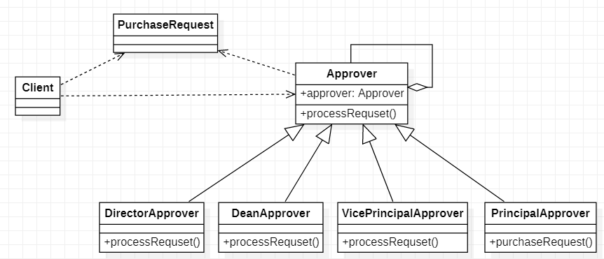

# 责任链模式

> 责任链模式将围绕OA系统审批需求讲解

1. 采购员采购教学器材
2. 如果金额小于等于5000，由教学主任审批（0<=x<=5000）
3. 如果金额小于等于10000，由院长审批（5000<=x<=10000）
4. 如果金额小于等于30000，由副校长审批（10000<=x<=30000）
5. 如果金额大于30000以上，由校长审批（x>=30000）

## 传统解决方案

> PurchaseRequest采购申请，接收到一个采购申请后，通过多个if-else判断金额来调用对应的Approver（审批人）审批方法

### 传统解决总结

1. 缺点：客户端需要使用分支判断来对不同的采购申请处理，这样如果审批金额有改变那么客户端的代码也要随之改变，客户端也必须明确知道有多少个审批角色，审批条件等
2. 缺点：这样会对一个审批请求进行处理和审批人存在一个强耦合的关系，不利于代码的维护

## 责任链模式解决方案

### 基本介绍

>1. 责任链模式（Chain of Responsiblity Pattern）又叫职责链模式，为请求创建一个接收者对象，这种模式对请求发送者和接收者进行解耦
>2. 责任链模式通常每个接收者都包含对另外一个接收者的引用，如果一个对象不能处理该请求，那么它会把相同的请求传达给下一个接收者，以此类推
>
>Handler：抽象的处理者，定义了一个处理请求的接口、同时包含了另外一个Handler对象
>
>ConcreteHandlerA/ConcreteHandlerB：具体的处理者，处理它所负责的请求，可以访问它的下一个处理者，如果这个请求可以处理就自己处理，否则就将请求交给下一个处理，形成一条责任链
>
>Request：包含着很多的属性，表示一个请求

### 责任链模式解决审批需求

> PurchaseRequest：审批表内容来，里面可以包含审批申请Id，类型，名字等需要保存的信息
>
> Approver：审批操作抽象类，里面聚合着下一个处理者，以及一个需要实现的抽象方法
>
> DirectorApprover/DeanApprover/VicePrincipalApprover/PrincipalApprover：具体审批的子类，需要继承父类Approver并且重启审批方法

#### PurchaseRequest

> PurchaseRequest：审批表对象，里面主要保存着审批的内容等信息

#### Approver

> Approver：审批动作的一个抽象类，里面聚合了下一个处理者，以及提供一个审批的抽象方法

#### DirectorApprover/DeanApprover

> DirectorApprover/DeanApprover：具体的审批实现，继承Approver对获取到的审批对象进行业务操作，如果不符合要求着调用父类的Approver的审批方法传递给下一个处理者

#### VicePrincipalApprover/PrincipalApprover

> VicePrincipalApprover/PrincipalApprover：具体的审批实现，继承Approver对获取到的审批对象进行业务操作，如果不符合要求着调用父类的Approver的审批方法传递给下一个处理者

#### Client

### 责任链模式总结

1. 优点：将请求和处理分开，实现解耦，提高系统灵活性
2. 优点：简化了对象，使对象不需要知道链的结构
3. 缺点：性能会有随着链条节点越多受到的影响会越大，一般通过Handler设置最大节点数，在setNext时判断是否超过阈值超过无法建立链
4. 缺点：调试不方便，采用类似递归的方式，调试较复杂
5. 场景：多级请求，审批流程，拦截器，网络编程时的编码/解码操作

