# 装饰者模式

> 装饰者模式将围绕着一个奶茶店Coco订单项目讲解

Coco奶茶店订单项目：

1. 奶茶种类/奶茶单品：PearlMilkTea（珍珠奶茶）BerryTea（莓莓果茶）
2. 配料：Pearl（珍珠）、NataDeCoco（椰果）、Pudding（布丁）
3. 要求在扩展新的奶茶种类时，具有良好的扩展性、改动方便、维护方便
4. 使用OO来计算不同种类奶茶的费用：客户可以单品奶茶，也可以单品奶茶+配料组合

## 传统解决方案1

> 这是一个最简单粗暴的方案，做一个抽象类Drink（饮料），里面包含description（说明），2个方法getDescription（获取说明）和cost（费用），接下来我们只需要使用穷举的方式把所有奶茶与配料搭配方案全部写成类继承Drink类即可

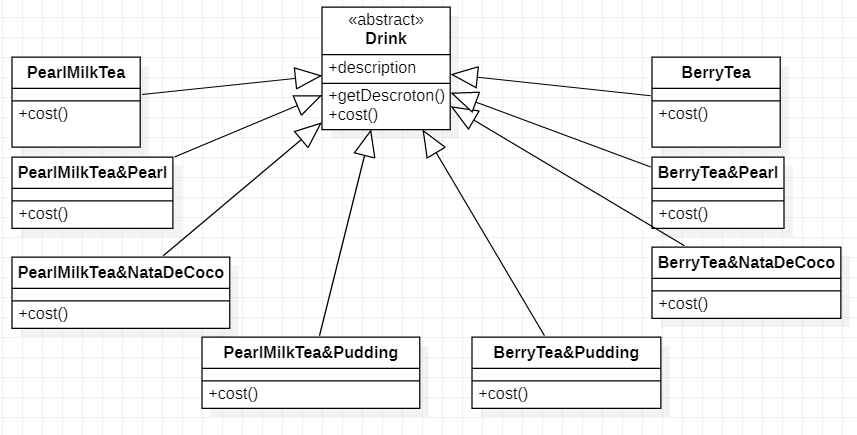

### 传统解决方案1总结

1. 缺点：从类图可以看到，如果这样设计那需要编写很多很多的类因为每一个单品与配料可以形成好多组合
2. 缺点：增加单品奶茶或配料时类的数量会倍增
3. 基本可以排查该方案，谁用谁倒霉

## 传统解决方案2

> 分析前面的方案1因为奶茶单品+配料组成会造成类的倍增，因此可以做改进，将配料内置到Deink类中，通过调用setMilk/setSoy方法来进行配料的增加，这样就不会造成类数量过多，提高方案的维护性

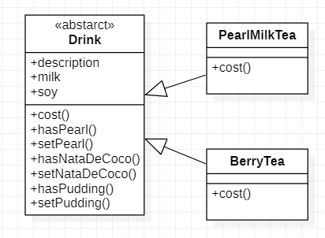

### 传统解决方案2总结

1. 优点：方案2将配料内置到Drink里了，对方案1类倍增问题有所缓解
2. 缺点：在增加或者删除配料种类时，代码维护比较麻烦
3. 考虑使用装饰者模式解决

## 装饰者模式解决方案

> 装饰者模式，即动态的将新功能附件到对象上，在对象功能扩展方面，它比继承更有弹性，装饰者模式也体现了开闭原则（ocp）
>
> 装饰者模式就像打包一个快递
>
> 主体：衣服、陶瓷
>
> 包装：报纸填充物、塑料泡沫、纸板、木板
>
> 将主体和保证分开，将来主体放入到包装中，对其进行修饰

### 装饰者模式的实现

> 被装饰者：MilkTea（奶茶类）下的子类都是奶茶单品，它们都是被装饰者
>
> 装饰者：Decorator（配料）下的子类都是奶茶的配料，它们是装饰者，装饰者类中都组合了Drink（饮料）类，其中cost方法是通过递归的方式去即使整个饮料的费用

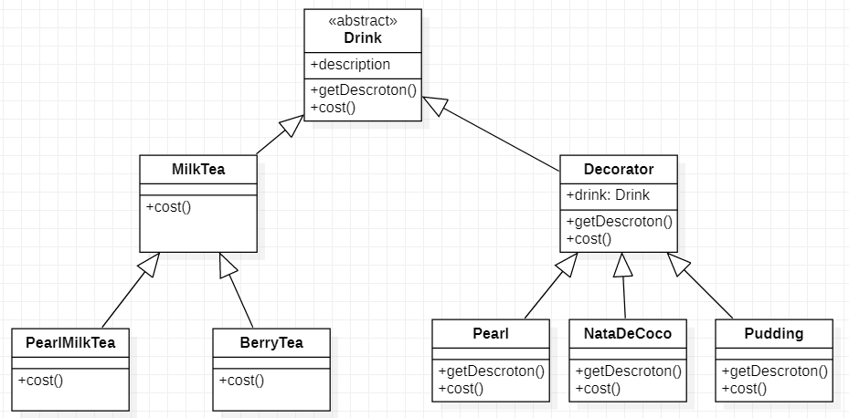

> 装饰者模式下的订单：2份椰果+1份布丁+珍珠奶茶
>
> 1. 1份Pudding包含了PearlMilkTea
> 2. 1份NataDeCoco包含了（Pudding+PearlMilkTea）
> 3. 1份NataDeCoco包含了（NataDeCoco+Pudding+PearlMilkTea）

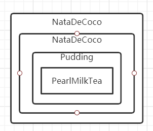

#### Drink

> 抽象的Drink对象，里面包含了2个属性，描述和价格，和需要子类实现的抽象方法

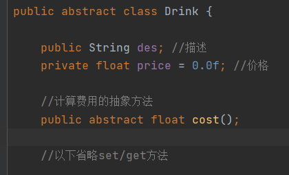

#### MilkTea

> MilkTea，所有新奶茶都需要继承该类，存放所有奶茶单品的一个共同方法cost方法，cost方法计算价格，由于奶茶只会有一份所以在计算价格方法只需要获取传入价格即可

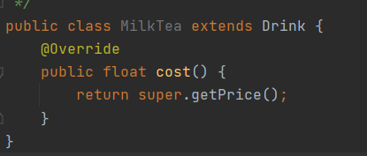

#### PearlMilkTea/BerryTea

>PearlMilkTea和BerryTea，是奶茶单品，通过构造器的方式传入时设置说明和单价

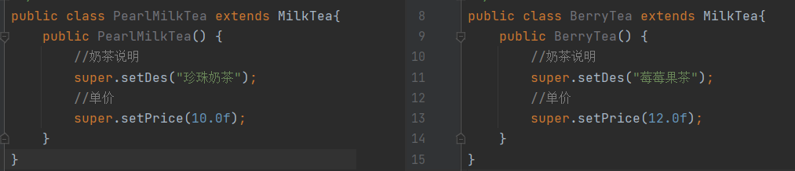

#### Decorator

> Decorator，所有新配料都需要继承该类
>
> 每一次增加配料时，都需要将上一个增加好配料的对象通过构造方法传入，这样就会得到一个递归的对象
>
> cost方法的实现重点：这里就是配料叠加实现的主要方法，获取当前配料价格+这个配料里面drink.cost()方法的值，`这个配料里面的drink对象有可能是MilkTea的子类有可能是Decorator的子类，如果是Decorator子类那么调用cost()，就会再次进行计算当前配料价格+这个配料里面drink.cost()这样形成一个迭代计算，当最后得到一个MilkTea的子类时调用cost()方法后就直接返回奶茶单品单价`

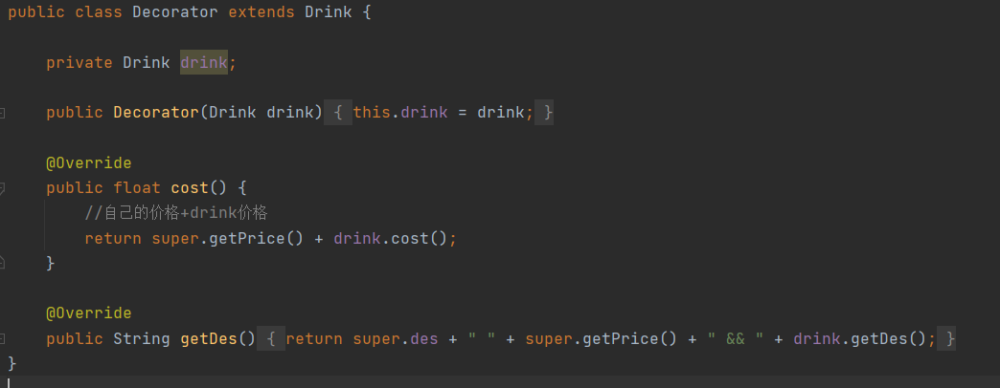

> Decorator的cost方法说的比较抽象，如果对cost方法不太理解可以细品以下这个图这里，这个充分图说明整个计算流程

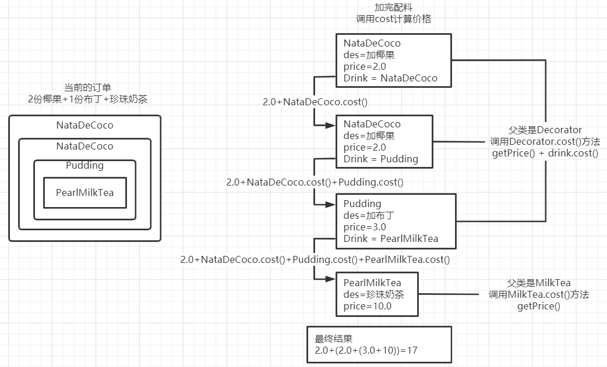

#### Pearl/NataDeCoco/Pudding

> Pearl/NataDeCoco/Pudding，是配料类都继承Decorator类，通过构造器的方式传入时设置说明和单价，super(drink)保持传入drink对象，这样可以实现当前配料包含着之前的配料，之前配料包含之前之前的配料

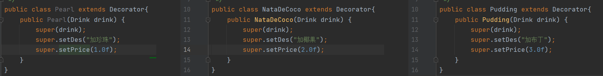

#### Coco

> Coco，店铺生产奶茶，并且计算当前订单价格和配料

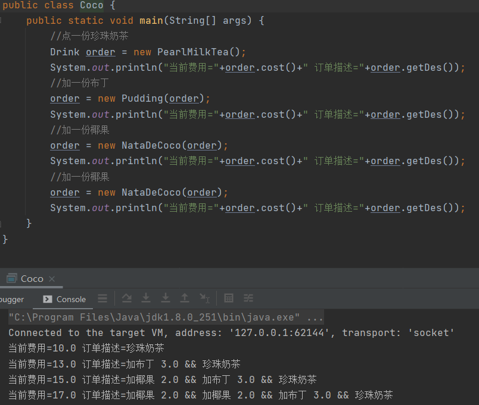

## JDK源码中的装饰者模式

> 在JDK的IO体系中充分的使用了装饰者模式

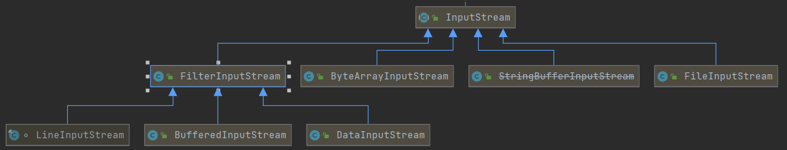

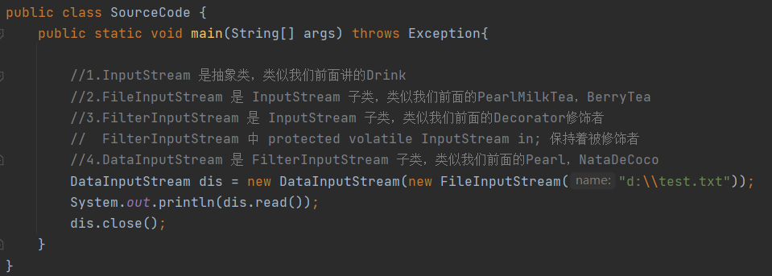

