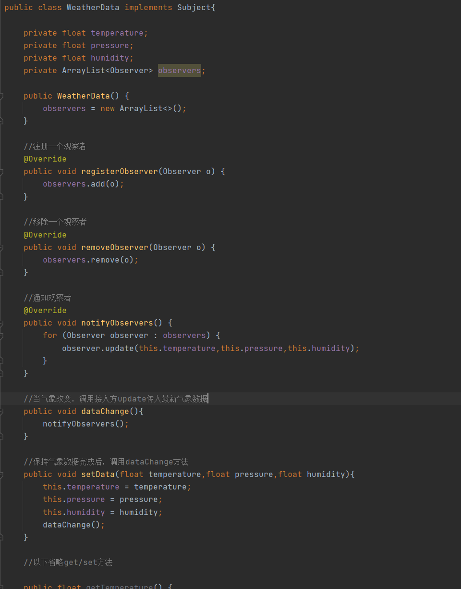

# 观察者模式

> 观察者模式将围绕着天气预报项目简介

天气预报项目需求如下

1. 气象站可以将每天测量到的温度，湿度，气压等以公告的形式发布出去
2. 需求设计开放型API，便于其它等三方也能接入气象站获取数据
3. 提供温度，气压和湿度的接口
4. 测量数据更新是，要能实时的通知给第三方

## 传统解决方案

> WeatherData：一个气象分析类，该类会提供，温度、湿度等get方法给第三方接入
>
> CurrentConditions：气象局网站，通过dispaly方法获取相关信息（其实是调用了WeatherData的get方法），update方法来实际调用dataChange去更新数据，并且把最新数据推行到第三方

### WeatherData

> WeatherData：一个气象数据观察，更新的一个类，该类聚合了一个CurrentConditions一个第三方，如果获取到最新的气象数据时会调用setData方法，并且把最新气象数据传递给第三方

### CurrentConditions

> CurrentConditions：第三方接入，只需要编写update方法，和display方法当WeatherData有数据更新时，会调用该类的update方法传入最新的数据，这时第三方就可以获取最新的气象数据了

### Client

### 传统解决方案总结

1. 缺点：如果需要增加新的第三方接入，那么就需要修改WeatherData中的多个方法，不符合开闭原则

## 观察者模式解决方案

### 基本介绍

> 观察者模式类似订牛奶/订报纸等业务
>
> 1. 奶站/气象局：Subject
> 2. 用户/第三方网站：Observer
>
> Subject：负责登记、移除、通知，其中对应的3个方法如下
>
> registerObserver()：将需要订阅的用户注册将来
>
> removeObserver()：将需要删除订阅的用户移除
>
> notifyObservers()：通过该方法发送消息给所有注册的用户
>
> Observer：负责接收消息
>
> 观察者模式：是对象的一对多的一种设计方案，气象局（Subject）被依赖的对象只有1个，第三方网站（Observer）依赖的对象有多个，气象局数据发生变化时会通知第三方网站

### 观察者模式解决气象问题

#### Observer

> Observer：该类是一个接口定义了1个方法，负责接收消息的一个接口

#### Subject

> Subject：该类是一个接口，定义3个方法负责注册，删除，通知观察者

#### WeatherData

> WeatherData：气象局类，实现了Subject接口，该类中维护着一个Observer集合，可以通过registerObserver/removeObserver方法将来观察者添加或移除Observer集合中，notifyObservers会比例整个Observer集合并且调用update方法来实现为所有注册的观察者发送消息

#### CurrentConditions/BaiDu

> CurrentConditions/BaiDu：第三方接入，实现了Observer接口，实现update方法，当Subject推送消息时会调用到该类的update方法，再当前方法进行业务操作/更新数据

#### Client

### 观察者模式总结

1. 优点：观察者模式会以集合的方式来管理用户（Observer），包括注册，移除和通知，这样我们添加观察者时，不需要修改核心类WeatherData，遵循的ocp原则
2. 场景：消息订阅/发布

