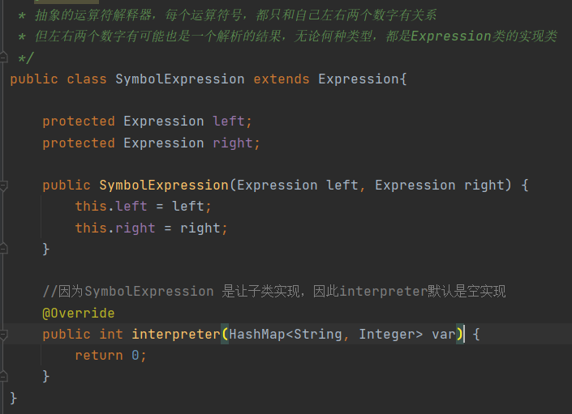

# 解释器模式

> 解释器模式将围绕着实现四则运算

1. 先输入表达式的形式，比如a+b+c-d+e，要求表达式字母不能重复
2. 在分别输入a，b，c，d，e的值，最后计算结果

## 解释器模式解决方案

### 基本介绍

>1. 在编译原理中，一个算术表达式通过词法分析器形成词法单元，而后这些词法单元通过语法分析器构建语法分析树，最终形成一颗抽象的语法分析树，这里的词法分析器和语法分析器都可以看做是解析器
>2. 解析器模式（Interpret Pattern）：是将给定一个语言（表达式），定义它的文法的一种表示，并定义一个解析器，使用该解析器来解释语言中的句子（表达式）
>3. 应用场景：
>     1. 将来一个需要解释执行的语言中的句子表示为一个抽象语法树
>     2. 一些重复出现的问题可以用一种简单的语言来表达
>     3. 一个简单语法需要解释的场景
>
>Context：环境角色，含有解释器之外的全局信息
>
>AbstractExpression：抽象表达式，声明一个抽象的解释操作，这个方法为抽象语法树中所有的节点所共享
>
>TerminalExpression：为终结符表达式，实现与文法中的终结符相关的解释操作
>
>NonTerminalExpression：为非终结表达式，为文法中的非终结符实现解释操作

### 解释器模式解决四则运算

#### Expression

> Expression：一个表达式的抽象类

#### VarExpression

> VarExpression：变量解释器获取变量用的，interpreter会返回相应的值，如a的值10，b的值20

#### SymbolExpression

> SymbolExpression：抽象运算的解释器，用于关联左边右边2个数的关系用的

#### AddExpression/SubExpression

> AddExpression/SubExpression：加法运算的解释器与加法运算解释器，对左右值进行实际运算

#### Calculator

> Calculator：一个计算器

#### Client

### 解释器模式总结

1. 优点：当有一个语言需要解释执行，可将该语言中的句子表示为一个抽象语法树，就可以考虑使用解释器模式，让程序具有良好的扩展性
2. 场景：编译器，运算表达式计算，正则表达式，机器人等
3. 缺点：解析器模式可能会引起类膨胀，计算器模式采用递归调用方法，将会导致调试非常复杂、效率可能降低