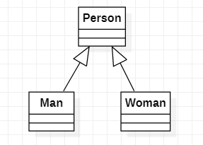
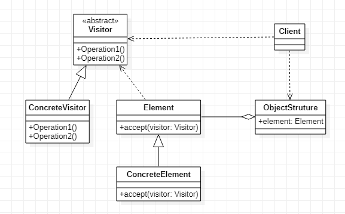
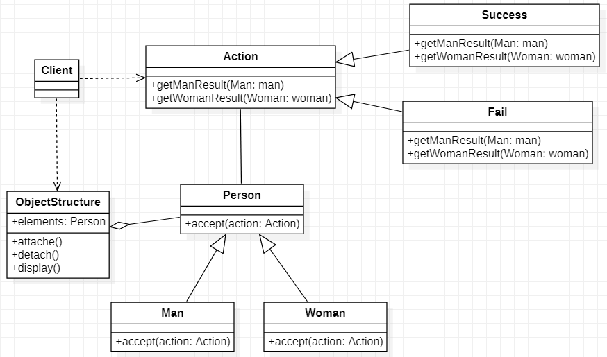
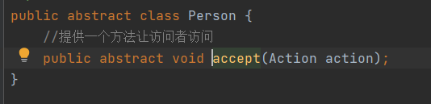
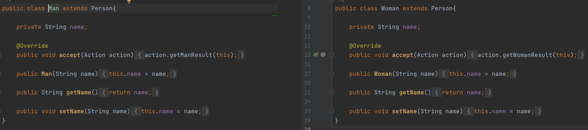
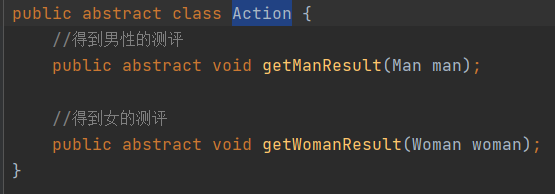
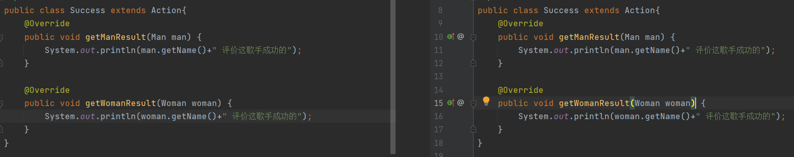
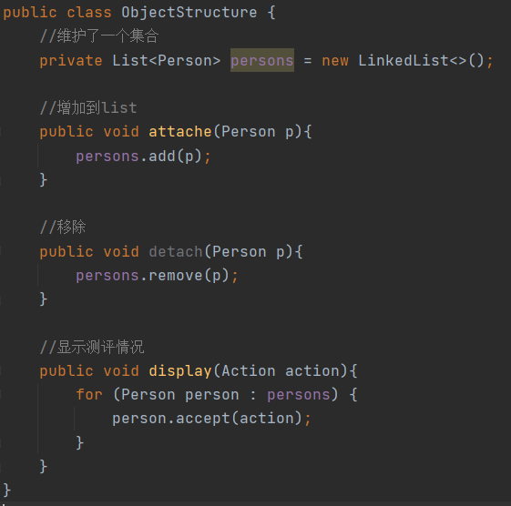
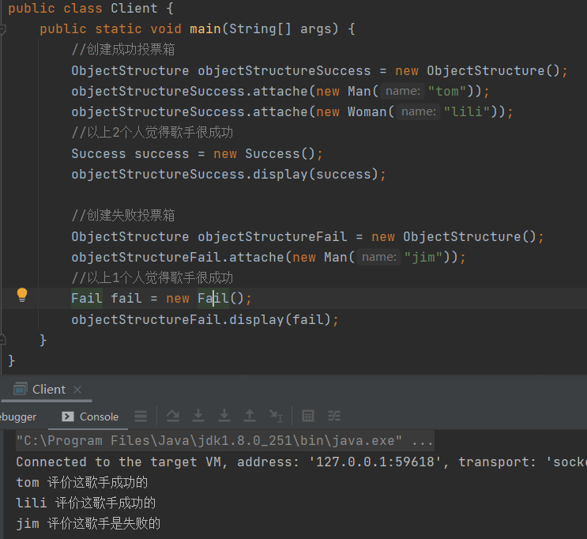

# 访问者模式

> 访问者模式将围绕着一个评分系统简介

1. 将来评分分为男生和女生，对歌手进行评测，当看完某一个歌手表演后，得到它们对该歌手不同的评价，评价类型有（成功、失败、等）

## 传统解决方案

### 传统解决方案总结

1. 如果系统较小，还是可以使用该方案，但是考虑到系统后期会增加不同的评分类型，或者需要对男生细分成男孩、青年等，整个代码改动就会较大，违法OCP原则

## 访问者模式解决方案

### 基本介绍

1. 访问者模式（Visitor Pattern），封装一些作用于某种数据结构的各元素的操作，它可以在不改变数据结构的前提下定义作用于这些元素的新操作
2. 主要将数据结构和数据操作分析，解决数据结构和操作耦合性问题
3. 访问者模式的基本工作原来是，在被访问的类里面加一个对外提供接待访问者的接口

> Visitor：是抽象访问者，为该对象结构种的ConcreteElement的每一个类声明一个visit操作
>
> ConcreteVisitor：是一个具体的访问值，实现每个有Visitor声明的操作，是每个操作实现的部分
>
> ObjectStruture：枚举它的元素，可以提供一个高层的接口，用来允许访问者访问元素
>
> Element：定义一个accept方法，接收一个访问对象
>
> ConcreteElement：为具体元素，实现了accept方法

### 访问者模式解决评分问题

> Action：评分的抽象类，定义了2个抽象方法getManResult()与getWomanResult()
>
> Success/Fail：继承Action实现了相应的抽象方法
>
> Person：人的抽象类，定义一个accept方法用于接收一个Action的子类
>
> Man/Woman：实现Person重写中的accept方法
>
> ObjectStructure：维护一个Person集合用于计分，attache()方法添加Person的子类，detach()移除Person的子类，display()设置当前添加的票数是成功还是失败并且打印Person集合

#### Person

> Person：提供一个方法让访问者访问，接收的是一个

#### Man/Woman 

> Man/Woman：继承Person实现accept方法

#### 

#### Action

> Action：评测的抽象类，其中定义了2个方法getManResult/getWomanResult分别获取男生和女生的评测

#### Success/Fail

> Success/Fail：继承Action编写评分的业务逻辑

#### ObjectStructure

> ObjectStructure：维护着一个Person集合，编写3个方法，可以往集合里面添加/删除不同的Person子类，通过display方法遍历集合调用Person子类的accpet方法打印集合内容

#### Client

### 访问者模式总结

1. 优点：访问者模式符号单一职责原则、让程序具有优秀的扩展性，灵活性
2. 优点：访问者模式可以对功能进行统一，可以做报表、UI、拦截器、过滤器，适用于数据结构相对稳定的系统
3. 缺点：具体元素对访问者公布细节，也就是说访问者关注了其它类的内部细节，这是迪米特法则所不建议的，这样造成了具体元素变更比较困难
4. 缺点：违背了依赖倒转原则，访问者依赖的是具体元素，而不是抽象元素
5. 场景：如果一个系统有比较稳定的数据结构，又有经常变化的功能需求，那么访问者模式就是比较合适

