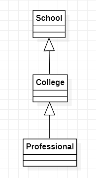

# 迭代器模式

> 组合模式将围绕着展示院校专业展示项目（之前再组合模式也用过这个例子）

学校系展示项目：

1. 编写一个程序，展示学校院系结构
2. 要在一个页面中展示出学院的院系组成，一个学校有多个学院，一个学院有多个系

## 传统解决方案

> 将学院看做学校的子类，系是学院的子类

### 传统解决方案总结

1. 缺点：将学院看做学校的子类，系是学院的子类，这样实际上是站在组织大小来进行分层
2. 缺点：我们需要在一个页面中展示出学校的组成，一个学校多个学院，一个学院多个专业，因此这种方案，不能很好遍历结构

## 迭代器模式解决方案

### 基本介绍

> 1. 迭代器（Iterator Pattern）是常用的设计模式，属于行为型模式
> 2. 如果我们的集合元素是用不同的方式实现的，有数组，还有java的集合类或者还有其他方式，当客户端要遍历这些集合元素的时候，就适用多种遍历方式，而且还会暴露元素的内部结构，可以考虑使用迭代器模式解决
> 3. 迭代器模式，提供一种遍历集合元素的统一接口，用一致的方法遍历集合元素，不需要知道集合对象的底层表示
>
> Iterator：迭代器接口，是jdk的一个接口，里面有3个方法
>
> ConcreteIteratior：具体的实现迭代器的类，管理着迭代器
>
> Aggregation：是一个聚合接口，将来客户端和具体的聚合解耦
>
> ConcreteAggregation：具体的聚合，里面会有对象的集合，提供一个方法返回一个遍历这个集合的迭代器

### 迭代器模式解决学院问题

> Department：部门的类，是学院/系的一个基类
>
> Iterator：迭代器，使用JDK默认无需创建
>
> ComputerCollegeIterator/InfoCollegeIterator：实现迭代器中的方法，并且定义当前迭代器的存储数据结构
>
> College：实际存储数据的实际类的接口
>
> ComputerCollege/InfoCollege：实现College实现createIterator返回相应的Iterato子类
>
> OutputImpl：统一一个打印类，里面定义了打印院系名字方法

#### Department

> Department：一个部门类，里面包含名称和说明

#### ComputerCollegeIterator/InfoCollegeIterator

> ComputerCollegeIterator/InfoCollegeIterator：它们同事实现Iterator接口和实现hasNet和next方法，但是存放方式的数据结构是不一样的，所以hasNet和next方法有所不同，通过构造方法可以获取到需要迭代的容器对象

#### College

> College：College接口定义了3个方法，获取名称，添加部门，获取迭代器

#### ComputerCollege/InfoCollege

> ComputerCollege/InfoCollege：具体存放各个系专业信息的类，实现了College接口，重写了获取名称，添加专业，获取相应的迭代器方法

#### OutputImpl

> OutputImpl：通过构造方法存入学校的学院和专业学校的一个collegeList，printCollege打印学院名称，并且遍历学院调用creatIterator获取迭代器后，再次调用各个学院的迭代器打印专业信息

#### Client

### 迭代器模式总结

1. 优点：提供统一的方法遍历对象，客户不用考虑聚合的类型，使用一个方法就可以遍历对象
2. 优点：隐藏了聚合的内部结构，客户要遍历聚合的时候只能取到迭代器，调用迭代器方法遍历获取数据
3. 优点：提供一种设计思想，就是一个类应该只有一个改变的原因（单一职责原则），将管理对象集合和遍历对象集合职责分开，这样改变集合只会影响聚合对象，如果遍历改变只会影响到迭代器
4. 缺点：每个聚合对象都要一个迭代器，会生成好多迭代器类不好管理